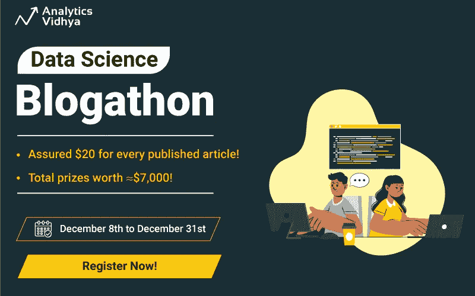
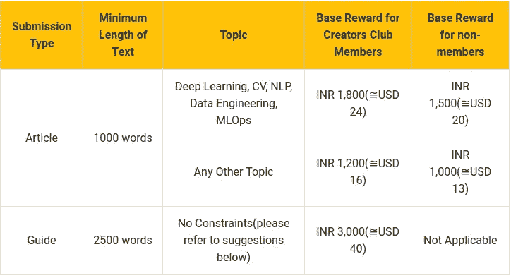
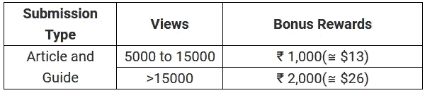
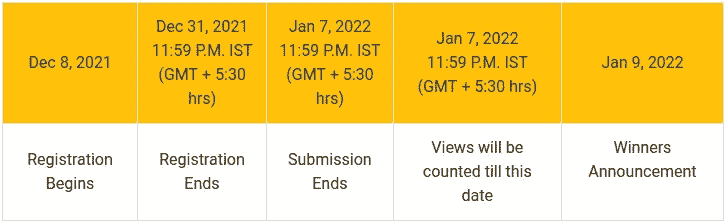

# 发起世界上最大的数据科学博客！

> 原文：<https://medium.com/analytics-vidhya/launching-the-worlds-largest-data-science-blogathon-2e72a895750b?source=collection_archive---------1----------------------->

## 有机会为每篇发表的文章赢得有保证的奖励！！

500 多位作者，1700 多篇文章，还在继续！

在数据科学博客上发表您的文章，提升您的个人资料，赢取激动人心的大奖！

作为 Blogathons 的一部分，到目前为止已经有超过 1700 篇文章获得了成千上万的浏览量，我们继续收到来自社区的巨大反响！

我们很高兴地宣布 **Analytics Vidhya 的** [**第 15 届数据科学博客**](https://datahack.analyticsvidhya.com/contest/data-science-blogathon-15/?utm_source=newsletter&utm_medium=medium&utm_campaign=blogathon15) 现已上线！

以下是你在博客上发表的每一篇文章能赢得的东西:

1.  无论你获得多少次浏览，都有基本奖励！

发表 3 篇以上文章成为创作者俱乐部会员:[https://www.analyticsvidhya.com/creators-club/](https://www.analyticsvidhya.com/creators-club/)

**所有国际支付将通过 Paypal 进行*

2.利润丰厚的获奖者奖品除了以上！

禁止发表文章和与职业相关的文章

3.随着您在排行榜上的攀升，您将获得额外的奖励！

你可以在博客上发表任意数量的文章，越多越好！

这是一个不容错过的机会，可以把你的作品展示给超过 100 万的机器学习爱好者，并在这个过程中赢得令人敬畏的奖项。

**立即报名:** [**数据科学 Blogathon-15**](https://datahack.analyticsvidhya.com/contest/data-science-blogathon-15/?utm_source=newsletter_reg&utm_medium=medium&utm_campaign=blogathon15)

# 什么是重要的日期和截止日期？

# 条款和条件

*   你的文章内容应该是独一无二的，不能在其他地方发表。每篇文章都会严查抄袭。
*   这篇文章至少要 1000 字。
*   您可以随意提交任意多的内容。但是，不要多次提交同一篇文章。
*   提交将于 2022 年 1 月 7 日 IST 时间 23:59(GMT+5:30)结束
*   如果文章在截止日期前提交，我们将提供额外的一周时间来处理我们提供的任何反馈。
*   除非与 Analytics Vidhya 讨论，否则不允许在其他地方重新发布您的任何文章。
*   我们定期监控每篇文章的流量。分析 Vidhya 有权删除任何和所有可疑的流量。
*   Analytics Vidhya 有权取消/拒绝任何提交的作品，无需任何解释。
*   所有奖项的决定，如分析 Vidhya 所宣布的，将是最终决定。