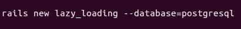
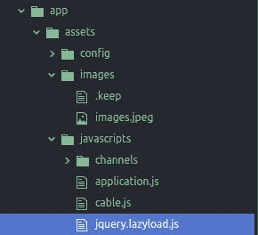
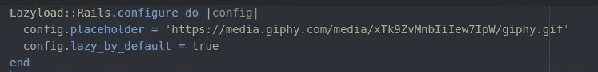
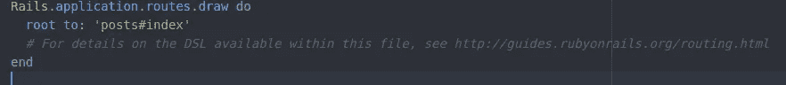
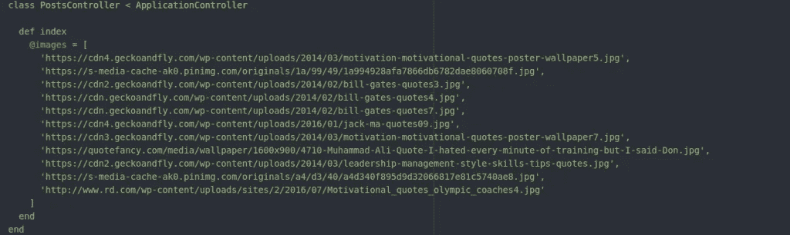
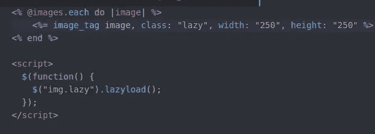

# rails 应用程序的延迟加载映像

> 原文：<https://medium.com/analytics-vidhya/lazy-load-images-for-rails-application-a87cb9b77b35?source=collection_archive---------10----------------------->

添加延迟加载来提高你的网站性能，让它看起来更酷

# 什么是懒装？

*   [懒加载](https://developers.google.com/web/fundamentals/performance/lazy-loading-guidance/images-and-video)是针对网站在线内容的一种优化机制。
*   延迟加载是一个经常使用的术语，指的是仅在需要时才加载部件的概念。

# 为什么我们需要惰性装载？

*   加载网站的整个页面并将其交付给用户可能需要更多的时间来加载，并且不能满足用户更快的内容呈现。
*   相反，我们可以进行延迟加载，这有助于首先改善所需内容的呈现，然后在一段时间后使用延迟加载。

# 它是如何工作的？

照片由[普里西拉·杜·普里兹](https://unsplash.com/@priscilladupreez?utm_source=medium&utm_medium=referral)在 [Unsplash](https://unsplash.com?utm_source=medium&utm_medium=referral) 上拍摄

让我们从头开始，实现整个流程，简要介绍 rails 应用程序中的延迟加载映像

步骤 1:创建新的

第二步:[将它添加到你的 gem 文件中](https://github.com/jassa/lazyload-rails)

步骤 3:使用 bundler 安装 gem

> $捆绑安装

第四步:在 app/assets/JavaScript s/jquery . lazy load . js 中新建一个文件，抓取 [lazyload.js](https://github.com/tuupola/lazyload) 插件。

步骤 5:在你的 application.js 中需要这个插件

//=需要 jquery.lazyload

***重要提示:记住懒惰加载插件依赖于 jQuery。***

步骤 6:在 config/initializer/lazy load . Rb 中创建一个新文件，并添加以下代码片段:

步骤 7:在 routes.rb 文件中创建一个 post 控制器，并添加以下内容。

步骤 8:在你的后控制器中添加图像链接:

步骤 9:在您的视图文件 index.html.erb 中执行以下操作:

太好了！！你们都完了。您可以在您的应用程序中测试惰性加载是如何工作的。

您可以在 Heroku 上测试这个示例应用程序:

> 注意:按 ctrl + shift + r 查看更好的图像延迟加载

[https://lazy-loading.herokuapp.com/](https://lazy-loading.herokuapp.com/)

就是这样！

布鲁斯·马尔斯在 [Unsplash](https://unsplash.com?utm_source=medium&utm_medium=referral) 上拍摄的照片

快乐编码…