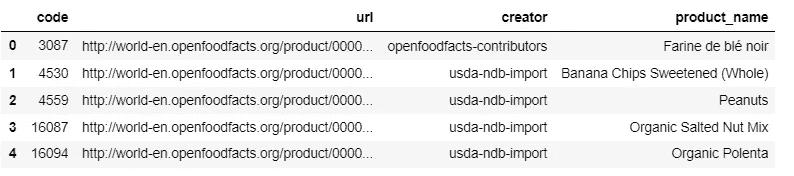

# 使用 ElasticSearch 进入语义/神经搜索，使用 Haystack 失败

> 原文：<https://medium.com/analytics-vidhya/leaping-into-semantic-neural-search-with-elasticsearch-faiss-using-haystack-a198c31ea07b?source=collection_archive---------2----------------------->

在本教程中，我们将使用 [Haystack](https://haystack.deepset.ai/) 实现一个基本的语义搜索引擎。我们将使用[elastic Search](https://www.elastic.co/)和 [Faiss](https://ai.facebook.com/tools/faiss/) (脸书人工智能相似搜索)作为[文档库](https://haystack.deepset.ai/docs/latest/documentstoremd)。


[Gozha 网](https://unsplash.com/@gozhanet?utm_source=medium&utm_medium=referral)在 [Unsplash](https://unsplash.com?utm_source=medium&utm_medium=referral) 上拍摄的照片

下面是我将要谈论的几个部分:

1.  语义搜索和术语介绍
2.  实施单元和粒度

*   *环境设置*
*   *数据集准备*
*   *索引&搜索*

## 语义搜索和术语介绍

近来，随着 NLP(自然语言处理)的进步和巨大计算能力(GPU、TPU 单元等)的可用性。)，语义搜索正在搜索行业占据一席之地。与词汇或句法搜索相反，语义/神经搜索更关注查询的意图和语义。使用神经网络(根据您的自定义数据进行训练或预训练)将您的查询/文档表示为 n 维向量(嵌入)是这种语义搜索的关键。

*   [**Haystack**](https://haystack.deepset.ai/):Haystack 是一个开源框架，用于构建大型文档集的端到端问答系统。你可以在这里阅读更多关于它的信息。
*   [**FAISS**](https://github.com/facebookresearch/faiss) : FAISS 是一个库，允许开发者快速搜索彼此相似的多媒体文档的嵌入。如果你想深入了解它，我建议你阅读这篇[令人惊叹的博客](https://towardsdatascience.com/understanding-faiss-619bb6db2d1a)。

## 实施单元和粒度

现在我们将进入技术实现细节，因此如果您对编码部分更感兴趣，您可以进一步跳过这一部分，直接进入 collab 笔记本。

*   **环境设置**:我用过 Google collab notebook (GPU 运行时)，因为创建嵌入在计算上很昂贵。首先，安装所需的库:

```
!pip install git+https://github.com/deepset-ai/haystack.git **OR** !pip install farm-haystack!pip install sentence-transformers
```

第一个包将安装 Haystack python 库，第二个包，*语句-变形金刚*，我们将用它来创建嵌入。句子转换器非常方便地提供了各种预训练的基于转换器的模型来嵌入句子或文档。要查看这些模型(根据用例)，请点击这里的。

*   **数据集准备**:对于这个设置，我已经下载了 [Foodb](https://foodb.ca/) 数据集。FooDB 是世界上最大、最全面的食品成分、化学和生物学资源。FooDB 是作为一种免费资源提供给公众的。我只用过 *Content.json* ，下面是我处理后得到的数据帧:



dataframe.head()

在索引中，我们将只使用三列，即*代码、url、产品名称*。Haystack 提供了一种便捷的方法来索引*List【Dict】*。所以我把上面的数据帧转换成下面的格式(如[草堆文档](https://haystack.deepset.ai/docs/latest/get_startedmd)中提到的):


Haystack 索引的示例格式

*   **索引&搜索** : Haystack 为索引和搜索提供了三个构件:

a.***DocumentStore***:您想要存储数据的数据库。它们支持不同类型的数据库，如 Elasticsearch、FAISS、InMemory、SQL 等。现在，我们将在 Elasticsesaarch 和 FAISS 中加载数据，并在稍后进行比较。

```
**#FAISS Indexing**
from haystack.document_store.faiss import FAISSDocumentStoredocument_store_faiss = FAISSDocumentStore(faiss_index_factory_str="Flat",return_embedding=True)**#ES Indexing**
from haystack.document_store.elasticsearch import ElasticsearchDocumentStoredocument_store_es = ElasticsearchDocumentStore(host="localhost", index="food_haystack_embedding", similarity='cosine')
```

此外，对于 FAISS 索引，相似性度量现在是“*点积*”，但是对于 ES，“余弦”相似性是可用的。FAISS index 中有各种用于优化的*参数*，您可以随意使用。在我的例子中，我坚持使用“平面”索引，因为我的数据集不属于那个卷。

b. ***检索器*** :用于提取查询的潜在候选项的过滤器。目前，他们支持 BM25，TF-IDF，嵌入，DPR(密集通道检索)。我们使用嵌入检索器。此外，为了创建嵌入，我们使用了*distilloberta-base-ms Marco-v2*模型(在[微软宏](http://Microsoft Machine Reading Comprehension)上进行了预训练)。数据集)。

```
**#FAISS Retriever initialization**
retriever_faiss = EmbeddingRetriever(document_store_faiss,
embedding_model='distilroberta-base-msmarco-v2',model_format='sentence_transformers')**#ES Retriever initialization**
retriever_es = EmbeddingRetriever(document_store_es, embedding_model='distilroberta-base-msmarco-v2', model_format='sentence_transformers')**#Running the process for indexing** # Delete existing documents in documents store
document_store_faiss.delete_all_documents()# Write documents to document store
document_store_faiss.write_documents(food_data_to_upload)# Add documents embeddings to index
document_store_faiss.update_embeddings(retriever=retriever)
```

所以首先它会用 *write_documents()* 方法索引所有数据。然后，它将创建每个文档的嵌入( *doc['text']* )，并使用 *update_embeddings()* 方法将其存储在每个相应的索引中，为了创建嵌入，它将使用您在检索器初始化中提到的模型，即*distilloberta-base-ms Marco-v2*。此外，Haystack 有助于批量索引中的批处理。

> **%索引花费的时间**
> 
> 文件数量: **338，487**
> 
> 失败: **386.73 秒**
> 
> 弹性搜索: **2329.32 秒**

注意:如你所见，FAISS 索引比 ES 快大约 **x6** 。

c. ***读者*** :虽然我们在任务中没有使用这个组件，但是据说它是 Haystack 提供的 QA 系统中的一个核心组件。它获取检索器(潜在候选项)的输出，并尝试为您的查询提供最佳匹配。它利用基于 transformer 的语言模型的能力来挑选最佳候选。

d.**结果:**让我们深入了解一下我们的神经搜索是如何执行的😋

```
**q = 'pipneapple banana cake'**print('-'*100)
print('FAISS')
print(**get_search_result(q, retriever_faiss**))
print('-'*100)
print('ElasticSearch Dense')
print(**get_search_result(q, retriever_es)**)
print('-'*100)#return the (text, url) tuple.
```


输出

## 结论

原来如此。你已经利用了一个大的变压器深度神经网络，用几行代码做了一个神经搜索引擎。这是可能的，因为 Haystack lib 提供了抽象( [Deepset.ai](https://medium.com/u/1cb8bc239339?source=post_page-----a198c31ea07b--------------------------------) )。我发现它易于使用，在数据科学工作流集成中非常方便。他们还提供了一种管道方法，在这种方法中，您可以顺利地插入和链接这些组件(存储、更新、检索)。

虽然我还没有在这篇博客中谈论推理时间和准确性，但是我会在这篇博客的下一部分中讨论这些事情。敬请关注。

谢谢你的阅读。不管是谁，如果你有任何反馈，我洗耳恭听。以下是社交媒体链接:

[insta gram](http://instagram.com/mysticberserk_)| |[LinkedIn](http://linkedin.com/in/impyadav)| |[Twitter](https://twitter.com/impyadav_)

参考资料:

[](https://foodb.ca/) [## 食品 b

### 欢迎来到 FooDB 1.0 版 FooDB 是世界上最大最全面的食品成分资源…

foodb.ca](https://foodb.ca/) [](https://haystack.deepset.ai/) [## 干草堆

### 大规模神经问题解答财务治理深入了解多家公司的财务数据…

haystack.deepset.ai](https://haystack.deepset.ai/) [](https://github.com/facebookresearch/faiss) [## facebookresearch/faiss

### Faiss 是一个用于高效相似性搜索和密集向量聚类的库。它包含算法搜索…

github.com](https://github.com/facebookresearch/faiss) [](https://www.elastic.co/) [## 免费开放搜索:Elasticsearch、ELK & Kibana | Elastic 的创造者

### 将日志、指标、跟踪等统一到一个可扩展的堆栈中，该堆栈是免费的、开放的，旨在提高速度。监控每个元素…

www.elastic.co](https://www.elastic.co/)