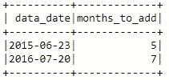
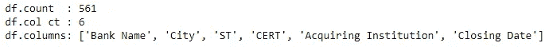

# Apache Spark 数据分析初学者指南—第 1 部分

> 原文：<https://medium.com/analytics-vidhya/learn-basics-in-spark-for-data-analytics-11cee514ac30?source=collection_archive---------8----------------------->

## 学习数据分析中常用的基本 spark 语法

数据正成为我们生活中不可或缺的一部分。随着获取和存储数据的方式越来越简单、方便和便宜，数据在未来也将扮演重要角色，这已经变得非常必要。数据本身意义不大，除非它可以用来产生一些见解。这就是数据分析发挥作用的地方。

作为一名分析人员，我使用过 SQL、SAS 和 python 等分析工具。我看到一种转变正在发生，企业正在从付费工具转向免费的软件包。Python 提供了一个完美的替代方案，凭借其庞大的库和包，它可以满足多种需求——无论是**探索性数据分析** (sweetviz 和 pandas profiling)**交互式图表和仪表盘** (seaborn 和 matplotlib)还是**数据科学** (scikit-learn)。

下面是一篇我试图介绍基本 spark 语法的文章。这是这个系列的第一部分，我打算在后面的部分增加更多的功能，这是我多年来学到的。开始需要时间，出于同样的原因，我开始在一个笔记本上记下这些功能，以帮助加快我的项目。大多数情况下，堆栈溢出是我的救命稻草，我会建议读者也这样做。如果您也从事分析工作，您可能使用过上面提到的库，但是您肯定会使用 SQL。

> 最近，随着大数据的出现，出现了许多更好的工具。其中一个就是阿帕奇 Spark。


[Apache Spark](http://spark.apache.org/) 是一款强大的开源大数据分析工具。这是加州大学伯克利分校的 AMP 实验室在 2009 年开发的。Spark 在数据管道和机器学习模型开发方面也很受欢迎。

让 Spark 广受欢迎的一些特性包括:

*   它有助于在更快的 Hadoop 集群中运行应用程序
*   支持复杂的分析
*   能够与 Hadoop 和现有 Hadoop 数据集成
*   社区与贡献者一起帮助改进软件包

在这一部分，我将介绍创建 spark 数据帧的不同方法。数据帧是组织成命名列的数据的分布式集合，相当于关系数据库中的表。数据帧可以从各种来源构建，例如:结构化数据文件、Hive 中的表、外部数据库或现有的 rdd。首先，我们需要初始化 spark。我正在使用 [colab](https://colab.research.google.com/) 作为练习笔记本，并将在下面分享完整的笔记本。

下面一行代码初始化 spark。这将安装 Apache Spark 3.0.0、Java 8 和 Findspark，后者是一个使 Python 很容易找到 Spark 的库。安装时，您可能还需要参考正确的版本。这里我用的是 3.0.3。库位置的任何更新都可能导致错误，请参考[链接找到稳定的](https://downloads.apache.org/spark/)版本。

## 正在初始化 Spark-3.0.3

在 colab 中初始化 Spark

要检查初始化是否有效，请运行以下代码。输出应该只是一个在 hello 列下带有“spark”值的表。

```
spark.sql('''select 'spark' as hello''').show()
```

## 库导入

如果你能运行上面的代码，你就可以继续了。让我们从在 spark 中创建数据帧的方法开始。在此之前，我们会先导入有用的库。其中之一是`pyspark.sql.function`，这将有助于数据分析和描述性分析。

要查看创建的数据帧，我们可以显示或收集方法。

```
df.show()
OR 
df.collect()
```

## 创建火花数据帧

1.  **从列表中创建数据帧**

使用数组创建列表，并使用所需的列名创建数据框架。

从列表创建数据框架

一旦成功创建了 dataframe，我们应该能够看到使用`show()`方法的输出。对于下面的部分，输出是相同的。



**2。从 RDD 创建数据帧**

**3。从 RDD 和模式创建数据帧**

以下语法中的`nullable`允许数据帧中有空值。如果设置为`False`，dataframe 将为空值抛出错误

**4。从列表中创建数据框**

**5。从熊猫数据框创建数据框**

**6。从配置单元表**创建数据帧

当表被存储为 hive 表时，下面的代码非常有用，hive 表为 HDFS 的数据提供了类似 SQL 的访问。

```
input_table = <db_name>.<table_name>df = spark.sql('''select data_date, months_to_add from {0}'''.format(input_table)
```

**7。从 CSV 或其他文本文件创建数据帧**

我使用的数据是从 data.gov 免费获得的 FDIC 失败银行名单。你可以从给定的链接下载相同的内容，或者使用你有的任何文本文件。数据链接:[https://catalog.data.gov/dataset/fdic-failed-bank-list](https://catalog.data.gov/dataset/fdic-failed-bank-list)。

请注意 read 函数中的参数。`header`适用于以第一行为表头提供数据。`inferschema`只是一种使用最佳数据类型的懒惰方式。`delimiter`可根据输入文件更改为制表符(\t)或空格(\s)。

我也上传了同样的文件到 github。请随意直接使用该链接。



查询输出

在 github 上从上传的 CSV 创建数据帧。下面将创建相同的数据帧并输出相同的信息。

这部分就这些了。我将很快上传另一个，在那里我们会看到数据操作和其他功能/方法。请随意留下您的评论。

请使用此链接[在 colab 或 github 上下载完整的笔记本](https://github.com/akash865/spark_101.git)。

[](https://colab.research.google.com/drive/1mI_q5LFtTvJaMNCQw6NwUazea9EK8IyB?usp=sharing) [## 谷歌联合实验室

### 编辑描述

colab.research.google.com](https://colab.research.google.com/drive/1mI_q5LFtTvJaMNCQw6NwUazea9EK8IyB?usp=sharing) [](https://github.com/akash865/spark_101/blob/master/Spark101_CreateDataframe.ipynb) [## akash865/spark_101

### 火花基本代码。在 GitHub 上创建一个帐户，为 akash865/spark_101 开发做出贡献。

github.com](https://github.com/akash865/spark_101/blob/master/Spark101_CreateDataframe.ipynb) 

# **参考文献**

1.  火花[【http://spark.apache.org/】T4
2.  data frame[[https://data bricks . com/blog/2015/02/17/introducing-data frames-in-spark-for-large-scale-data-science . html](https://databricks.com/blog/2015/02/17/introducing-dataframes-in-spark-for-large-scale-data-science.html)
3.  科拉布笔记本[[https://www.youtube.com/watch?v=inN8seMm7UI](https://www.youtube.com/watch?v=inN8seMm7UI)]