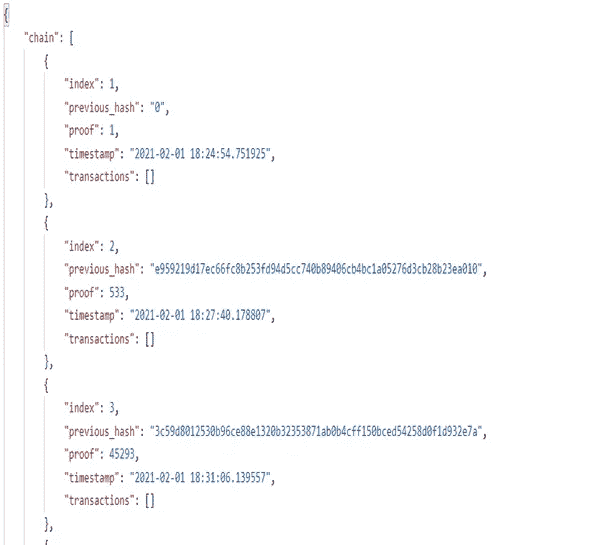
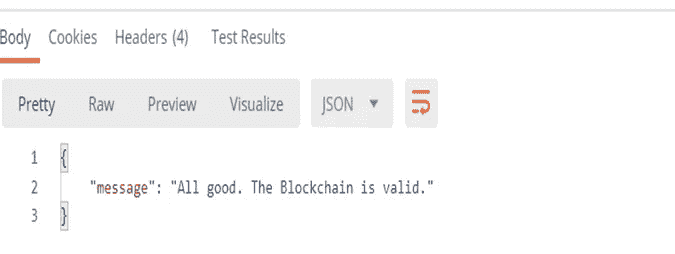

# 通过使用 Python 构建区块链来学习区块链

> 原文：<https://medium.com/analytics-vidhya/learn-blockchain-by-building-one-using-python-780d41ccb112?source=collection_archive---------13----------------------->

[比特币](https://www.information-age.com/bitcoin-cryptocurrencies-perfect-hedge-covid-19-crisis-123490086/)

在开始构建区块链之前，您需要了解区块链的一些基础知识。

顾名思义，区块链就是“区块链”。每个块包含一个“**块号**”、“**现时值**”、“**信息(数据)”、特定事务**发生的位置、“先前散列和“**散列**”。

区块链中的所有区块都通过“哈希”变量相互链接。“哈希”包含链中前一个块的信息，这是保持整个链链接和连接的原因。这个散列只不过是一些密钥，这些密钥是由密码算法(例如:SHA256、SHA512、SHA6 等)产生的一些混洗字符。)

以 SH256 算法为例:包含 64 个字符(1，2…9，0 &A，B，C，…。e，F)和 256 位(4X64)每个字符。

# **我们开始吧**

逐步解释

[**(如果你愿意，这是代码)**](https://github.com/Prachi-Gopalani13/Blockchain-Demo)

## **安装库**

确保你已经安装了 Python (Spider)的最新版本。为了处理请求，我使用了 [Postman](https://www.postman.com/) 。此外，您需要安装两个 Python 库，分别名为 Flask 和 Requests，库需要:

# **第一部分:构建区块链**

**初始化块的变量:**

创建一个名为 blockchain.py 的 Python 文件，这里首先要创建一个 *Blockchain* 类，并初始化以下变量:

用 self 创建一个 constructor _init_(self)是 Blockchain 类的实例

***链:*** 一个空列表，在其中添加块。

***create_block*** :在这个方法中，我们用 0 初始化了之前的 hash，从这里开始制作块。

***创建区块链***

现在我们有一个空的链，让我们添加块到它！我们将添加一个*块*变量，用这些属性描述一个 JSON 对象:

***索引*** :取我们区块链的长度，并加 1。我们将使用它来引用一个单独的块，例如，genesis 块的 index = 1

***时间戳*** :使用我们的 time()导入，时间戳的意思是时间，这个时间就是他们当时在电脑上的时间。

***证明*** :这来自我们的矿工，他认为自己找到了一个有效的“现时”，或者说“证明”。我们稍后会详细讨论这个问题。

***previous_hash*** :最近*批准的*块的散列版本。

现在，我们将把所有关于 block 的信息添加到 block 列表(self.chain)中，并返回新的 block。

**加工前一个程序块**

到目前为止，一切顺利！让我们首先定义一个 get_previous_block()方法，这样我们就可以调用我们的链并接收最近添加的块(我们将在我们的新索引中使用它)。

**工作证明**

现在我们简单的区块链被创造出来了，是时候保护我们的创世积木了。我们不希望任何人通过提供新的哈希信息来改变我们的区块链。为此，我们需要实现一个工作证明算法。工作证明算法只是确保没有人能够改变散列。该算法将对区块链上生成的哈希添加一些约束，使得任何人都无法进行任何更改。

为此，我们向块字段添加一个 nonce。这将确保我们的哈希保持约束。

“工作证明”使用 SHA-256 算法，但是设置了一个条件，而不是接受一个输入并给出一个输出，例如**输出散列需要将前四个字符作为零。**

这里使用了一个名为 Hasib 的函数，在它的中。encode()和。hexdigest()用于获得正确格式的十六进制输出。中间的数学部分是一些生成散列的简单数学。

因此，基本上,“证明”将增加 1，直到我们设置的条件(前四个零)得到满足。一旦满足条件，将证明变量添加到块中，然后将块添加到块链中。

下面是“工作证明”功能的代码

**检查模块**的有效性

下面的代码片段用于验证代码块的完整性。我们一次获取一个数据块，并使用之前的哈希值检查它是否为真，否则有人在某个时候弄乱了区块链数据，因此我们回滚。或者在任何散列不能匹配前四位数为零的条件的情况下。我们返回 false。

完成了区块链的制作，现在是开采区块和在 Flask API 中实现的时候了，因为我已经在这里使用了 Postman 来观察开采的区块。

# 第 2 部分:在 Postman 中执行代码

**创建烧瓶 API**

在 python 中调用内置函数 Flask 并存储在 app 中，同时调用前面步骤中构建的主函数 Blockchain()并赋给区块链变量。现在，下一步将是使用 app.route 方法开采区块。

**开采一个区块**

@app.route ('/'，methods=[])这是一个 flask beauty，可以在其中命名 URL 和方法。将执行下面的功能。@app.route()在 flask 中被称为 decorators。我们实例化了一个烧瓶对象和一个名为区块链的区块链对象。步骤 1 创建区块，或者用专业术语来说，开采新区块。其中包含以下响应:

**消息:**矿块消息

**索引:**块号

**时间戳:**区块开采的时间

**证明:**哪个是加密的哈希密钥

**上一个哈希:**最后一个加密的哈希密钥

所有这些都将被定向到 JSON Flask API(因为这里我们将使用 postman 进行演示)。

现在的问题是我们如何看到这个链条？

**获得全区块链**

这就是 get_chain 装饰器的用途。它返回整个区块链。你可能已经看到了 jsonify 函数，它将 python 字典转换成可以跨 API 发送的 json 对象。这里，在已经定义的响应链和长度中=200 意味着直到可以开采 200 个块。

下一个函数 is_valid()用于在 Flask API 中显示消息

**运行代码**

运行代码后，打开 postman 并登录，你会看到一个看起来像地址栏的屏幕。到那里选择方法 GET(这实际上是默认的)并输入[http://0 . 0 . 0 . 0:5000/GET _ chain](http://0.0.0.0:5000/get_chain)，你应该看到你的区块链的 genesis 块。让我们挖掘更多的节点[http://0 . 0 . 0 . 0:5000/mine _ block](http://0.0.0.0:5000/mine_block)你将能够看到更多的节点。再做几个节点，一旦完成，你可以查看[http://0 . 0 . 0:5000/get _ chain](http://0.0.0.0:5000/get_chain)，看看你的区块链是如何成长的！

你可以在块中添加更多的字段，也许更多的数据段等等。我希望你能使用 Postman 来测试我们的 API。

# **第 3 部分:输出快照**

**通过 get_chain 函数挖掘的 3 个块**

**开采了 3 个区块**

**显示消息(证明 od 块有效性)**

**结论:**
在本文中我们学习了区块链的基础和一些工作方式，我们还成功地创建了一个区块链应用程序。编写区块链代码和挖掘区块链。从这里你可以做很多事情，尽你所能改进应用程序。

此处提供代码 [Github 链接](https://github.com/Prachi-Gopalani13/Blockchain-Demo)！

学习愉快！

关注更多更新！