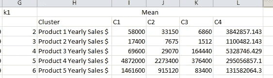

# 通过在 Excel 上应用数据挖掘来学习数据挖掘(第 2 部分)

> 原文：<https://medium.com/analytics-vidhya/learn-data-mining-by-applying-it-on-excel-part-2-6c3e380fde06?source=collection_archive---------10----------------------->

欢迎来到本系列的第 2 部分，在我们应用了上一篇文章([这里](/analytics-vidhya/learn-data-mining-by-applying-it-on-excel-6f046c8d1ff7))中的线性回归方法之后，现在是时候介绍一种叫做 K-Means 聚类的新方法了。

# **K-均值聚类:**

K-Means 是一种分类或分组方法，假设您拥有一家拥有许多产品的零售或批发公司，该公司有许多客户(超过 1000 个)，您决定根据客户购买该公司 4 或 5 种主要产品的情况将他们分成 4 组，可能会给每组不同的折扣金额。这就是使用 K-means 聚类方法的地方，K 是您想要对数据进行聚类的数字组，在我们的示例中是 4。

每一行包含客户的名字和每个产品的值，这一行被称为记录，因为它是由几个数值组成的，它也可以被称为数据点。

在 k 均值聚类中，每个聚类(组)由该聚类的数据点的质心(或均值)来描述。例如，假设一个聚类有三个数据点，分别表示为三个向量(6，7，8，9，10)，(7，8，9，10，11)和(10，9，8，7，6)，这个聚类的质心是((6+7+10)/3)，(7+8+9+8)/3)，(9+10+7)/3)，(10+11+6)/3)，也就是(7.7，8，8.3 请注意，该方法中的所有值都必须是数字。

让我们从下载 excel 表格([这里](https://github.com/AlbertAssaad/DataMiningApplyingitonExcel/blob/master/K-Mean%20Start.xlsx))开始我们的例子，它包含一个 39 个客户的列表，我们想把它们分成 4 个集群。我们可能需要尝试几个不同的 k 值，看看哪一个更适合我们的功能。

来源:[https://ai hub . cloud . Google . com/u/0/p/products % 2f 0 E0 D2 ed 0-5563-4639-b348-53 a83 C4 ff 4 e](https://aihub.cloud.google.com/u/0/p/products%2F0e0d2ed0-5563-4639-b348-53a83ac4ff4e)

打开 Excel 表格后，您将看到:

1-列 A2 将包含客户名称

2 列 B2:F2 5 种不同产品的年销售额

3 列 H 我们 5 个产品的名称

4 列 I2:L2 我们在 capital 中插入了 C1、C2、C3 和 C4，因为我们需要 4 个分类(k 的值)。在每列下，我们在每种产品的销售范围内插入了一个随机数。

5 列 R2 将具有最接近的集群的名称，这将决定它属于哪个组。

6-从 I3 到 L7，我们插入了 k 个数据点作为初始质心。我们可以随机插入它们，或者根据我们在 B3 的数据选择它们:F41

7 列 N2:Q2 我们将 C1、C2、C3、C4 的聚类名称插入首都，在每一列下，我们将计算数据点和质心之间的距离。为此，我们使用欧几里德函数，因此，如果我们有 2 个数据点(x1，x2，x3，x4)和(y1，y2，y3，y4)，它们的欧几里德距离计算如下:

为了应用上述内容，我们插入了以下函数，该函数将存储点 Customer1(100000，30000，90000，8100000，4050000)和列 I3 中的质心之间的距离:I7 C1(5000，30000，8000，6000000，190000)，在 N1 编写以下函数:=SQRT(($B3-I$3) +($C3-I$4)

现在继续拖动并自动填充从 N3 到 Q3，然后选择单元格 N3:Q3 并自动填充到 N41:Q41。现在我们有了客户数据集和所有质心之间的所有距离。

8-在 R 列中，我们需要插入数据集接近的聚类，我们可以通过在单元格 R3 中输入此函数来实现这一点:=INDEX($N$2:$Q$2，1，MATCH(MIN(N3:Q3)，N3:Q3，0))此函数将从行 N2 中获取文本:Q2 取决于 N3 到 Q3 的最小值。

9-从单元格 R3 到 R41 拖动并自动填充，现在我们将得到每个数据集最接近哪个点，因此它属于哪个聚类。

10-现在我们需要重新开始，为了继续聚类过程，我们需要复制当前工作表，并将其重命名为 k2。我们这样做，我们右键单击底部的工作表名称“k1”“移动或复制”,然后勾选“创建副本”,将新复制的工作表重命名为“k2”

11-在 k2 中，我们需要在单元格 I3 中使用一个公式来重新计算分类 1 中所有数据点的属性 Product 1 Yearly sales 的平均值，我们可以通过下面的公式=AVERAGEIFS('k1 '！$B$3:$B$41，' k1 '！$R$3:$R$41，I$2)，如果数据点属于(k1！R3:R41)但是因为我们将通过创建更多的工作表来重复这个过程几次，所以最好使用 Indirect、ADDRESS 函数和 operator &。因此，我们只需更改一个单元格的值，比编写函数并在每次创建工作表时选择值更好，我们可以通过以下方式实现:

*   在 k2 工作表单元格 G1 中插入小写的“k1”
*   在 G3 至 G7 中，分别填写 2、3、4、5、6，这些数字将作为表 k1 中数值的列参考，因为 B 列是第 2 列，C 列是第 3 列…这些数字将用作 B、C、D、E、F 列的参考
*   在 I3 中，用下面的公式替换它:= average ifs(INDIRECT $ G $ 1 & "！"&ADDRESS(3，$G3，1)):INDIRECT($G$1 & "！"&ADDRESS(41 美元，G3，1))、INDIRECT($G$1 & "！$R$3 "):间接($G$1& "！$R$41”)，I$2)，因为我们可以认识到，间接函数将获得它旁边的字符串，在我们的情况下，我们获取 g1 的值，即“k1”，并将其与！以及将返回 K1 的地址(3，g3，1 )!B3，现在当我们在 k3 表上工作时，我们只需要把 G1 的值改成 k2，就这么简单。

12-自动填充从 I3 到 L7 的单元格。定义新的质心

13-从单元格 N3 到 Q41 自动计算数据点和新计算的质心之间的差，并且最短的聚类被自动插入单元格 R3:R41 中

14-在单元格 S1 中输入数字 1 并自动填充到单元格 S41，在 T2 中输入文本“旧聚类”，在 U2 中输入文本“差异”

15-在单元格 T3 中输入以下公式:=INDIRECT($G$1& "！R"&S3)将从表 k1 中获取值！R3 单元格和自动填充直到单元格 S41

16-在单元格 U3 中输入此公式:=IF(T3=R3，0，1)这将检查数据点是否仍属于与之前相同的聚类(组),或者直到单元格 U41 才自动填充。

17-我们需要重复第 10 点至第 16 点，直到单元格 U3:U41 中的所有值都为 0，不要忘记在新复制的工作表中用前一个工作表的名称替换 G1 中的值。

在本例中，我按照得出结果的顺序创建了 8 个工作表，您可以找到最终的 excel 表([这里是](https://github.com/AlbertAssaad/DataMiningApplyingitonExcel/blob/master/K-Mean%20End.xlsx))，正如您在下面看到的，所有数据点的差值都是 0，这意味着它没有更改其组，也没有移动到另一个组。现在，您可以筛选 R 列中的值，并查看哪些客户属于 C1、C2、C3 和 C4。

下面的链接是 K-means 迭代的一个例子，我们可以看到数据点改变它们的聚类，直到它们粘在一起并达到最后一个。

 [## Spot Cluster GIF -在 GIPHY 上查找和共享

### 发现并与你认识的每个人分享这个 Spot GIF。GIPHY 是你搜索、分享、发现和创建 gif 的方式。

media4.giphy.com](https://media4.giphy.com/media/12vVAGkaqHUqCQ/giphy.gif?cid=ecf05e47qijo3wu04i7khee77fhxi8hf00dkn4xd56cdopo7&rid=giphy.gif) 

这就是 K-Mean 函数的全部内容，我尽量简化它，如果你有任何问题，请在评论中提出。

[<= =在 Excel 上学习数据挖掘(上)](/analytics-vidhya/learn-data-mining-by-applying-it-on-excel-6f046c8d1ff7)