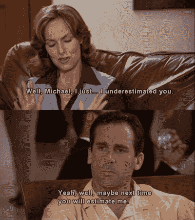
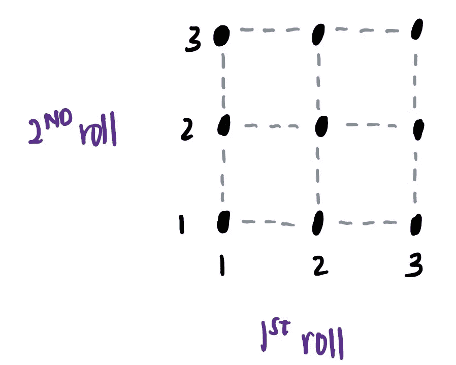
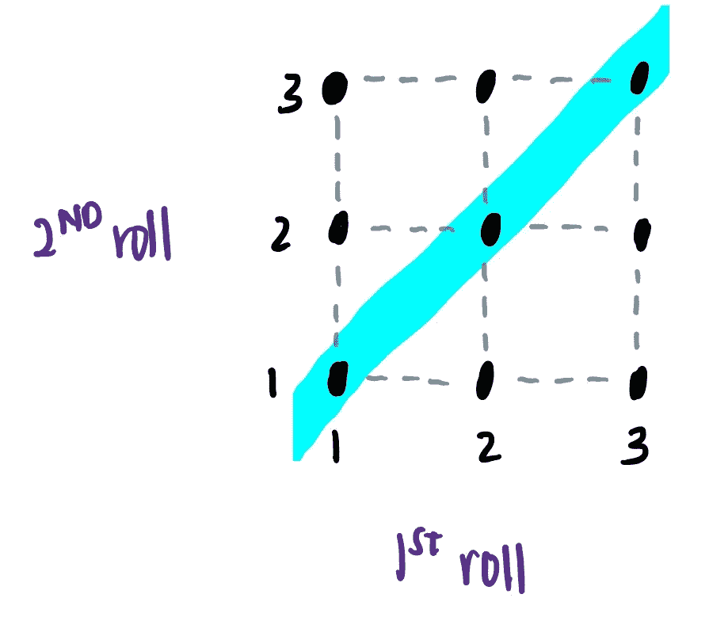
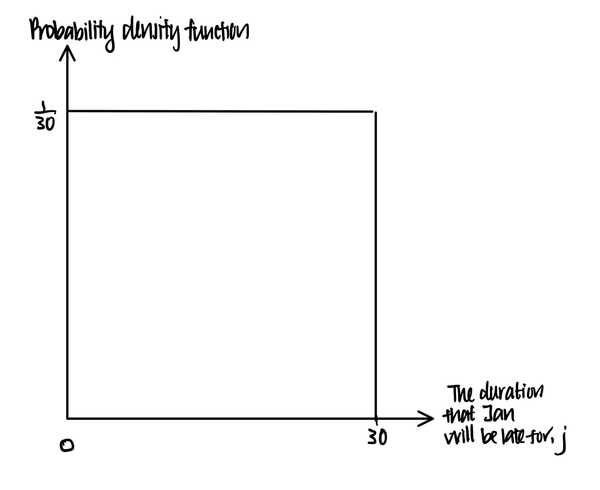
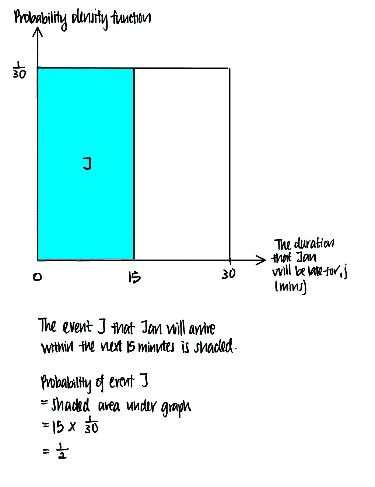
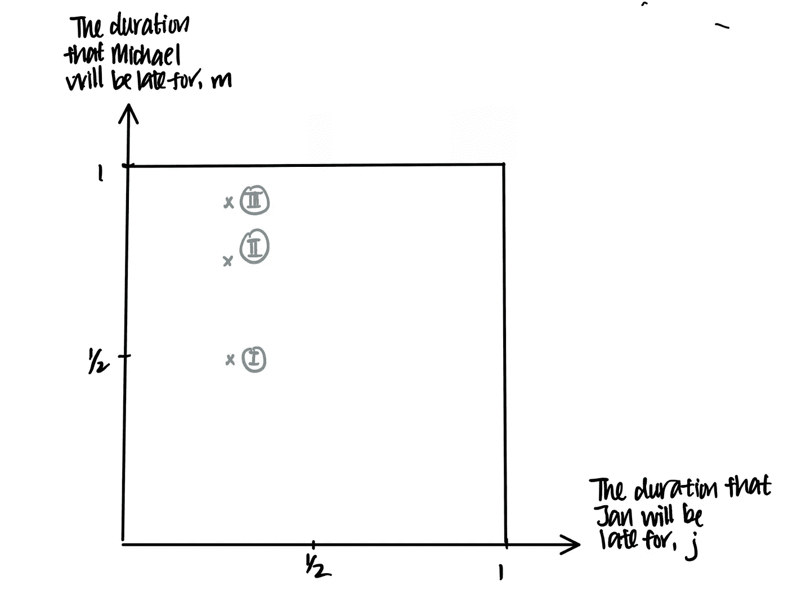
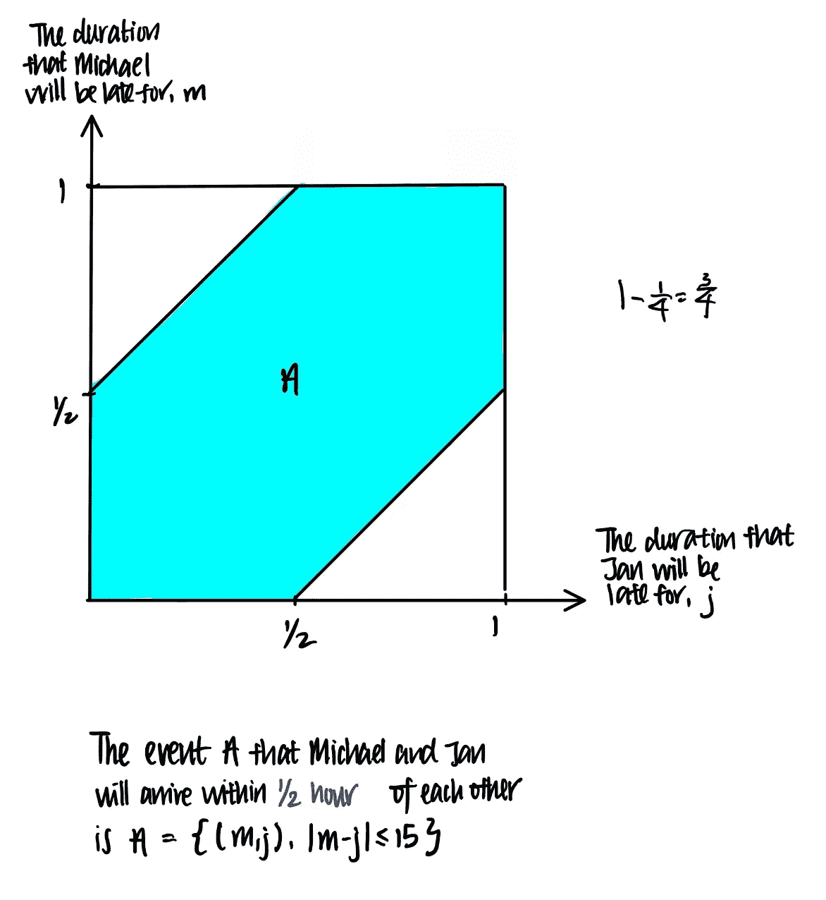

# 立即学习数据科学:概率模型

> 原文：<https://medium.com/analytics-vidhya/learn-data-science-now-probability-models-3c5fd7863a33?source=collection_archive---------13----------------------->

## 在 5 分钟内解释统一概率模型

概率不是最容易掌握的话题，因为其理论上的细微差别可能是深奥的，甚至可以说是晦涩的。我发现网上的许多资源难以理解或缺乏严谨性——但事实并非如此。

这也是我开始这个系列用简单的例子直观解释概率的原因。你现在可以在 5 分钟内学会的是非常简单的数据科学。

在这篇文章中，我将使用我最喜欢的电视夫妇，迈克尔和简，作为例子。敬请关注。

简爱迈克尔的概率有多大？

这个系列将会是封面—

1.  概率模型和公理(你来了！)
2.  概率与统计
3.  条件概率
4.  贝叶斯统计
5.  离散概率分布
6.  连续概率分布
7.  平均数和大数定律
8.  中心极限定理
9.  联合分布
10.  马尔可夫链

我们开始吧！

# **概率模型**

欢迎学习第 1 课。在我们深入任何概率概念之前，我们需要知道什么是概率模型。

概率模型仅仅是一种将机会归因于可能发生或可能不发生的事件的方法。

更具体地说，概率模型是对不确定情况的数学描述，就像当父母肤色不同时，一匹小马出生时是白色的概率。

照片由[塔玛斯·图兹-卡泰](https://unsplash.com/@tamas_tuzeskatai?utm_source=medium&utm_medium=referral)在 [Unsplash](https://unsplash.com?utm_source=medium&utm_medium=referral) 拍摄

在概率上，我们把每一个不确定的情况看作是一个“实验”,它会有几种可能的结果中的一种。所有可能结果的集合就是实验的*样本空间*，而样本空间的子集称为事件。

概率定律简单而优雅。它简单地陈述了一个事件的概率必须遵循以下概率规则，或者我们称之为'*公理*'

1.  事件 A 的概率不得为负，P(A) ≥ 0
2.  如果事件 A 和 B 是不相交的事件，那么它们并的概率满足。数学上， **P(A ∪ B) = P(A) + P(B)**
3.  整个样本量的概率等于 1，即**P(ω)= 1**

从这三个概率公理中，我们可以推导出概率定律的许多性质。

比如我们可以从这三个公理推导出不可能事件的概率为零。试试吧！

# **离散一致概率定律**

我们还可以推导出离散一致概率定律，该定律指出，如果 *n* 个可能结果的概率相等，那么任何事件 A 的概率为 **P(A) =(事件 A 在 n 个可能结果中发生的次数)/ n.**

例如，考虑将一枚 3 面硬币滚动 2 次。有 9 种可能的结果，如左图所示。

现在，让我们考虑事件 A，即两个卷是相等的。完成此事件有三种结果，即当两次掷骰都是 1、2 或 3 时。

为了计算事件 A 的概率，我们计算事件 A 发生的次数，并除以可能结果的数量。

这样，P(A) = 3/9 = 1/3。

简单吧？

# 连续一致概率定律

当实验的结果是离散的，就像在骰子上掷出一个 5，离散一致概率定律就适用了。然而，当实验的结果是连续的时，它就不适用了，比如时间或投掷的飞镖在棋盘上的位置。

时间是一个通常被视为连续变量的变量。在 [Unsplash](https://unsplash.com?utm_source=medium&utm_medium=referral) 上 [Fabrizio Verrecchia](https://unsplash.com/@fabrizioverrecchia?utm_source=medium&utm_medium=referral) 拍摄的照片

我们同样可以为连续的结果定义一个统一的概率定律。根据这个定律，我们将 b-a 的概率分配给[0，1]内的任何子区间[a，b]。

这可以用下面简和迈克尔之间的例子来说明。

谁约会会迟到？Jonathan J. Castellon 在 [Unsplash](https://unsplash.com?utm_source=medium&utm_medium=referral) 上的照片

## 简迟到了…

例如，迈克尔和简有个约会，但是简迟到了。让我们假设 Jan 将以相等的概率在接下来的 30 分钟内的任何时间到达。这可以用下面称为概率密度函数的图表形象地表示出来。

如果我们把连续的结果看作一条有长度的线，那么概率密度函数可以通俗地看做“单位长度的概率”。换句话说，概率密度函数和事件“长度”的乘积给出了事件的概率。

> 因此，如果我们绘制一个概率密度函数相对于事件“长度”的图表，那么该图表下的面积就是事件的概率。

例如，继续前面的例子，假设 Jan 在接下来的 30 分钟内以相等的概率到达，那么她在接下来的 15 分钟内到达的概率是多少？这可以形象地表示如下。

## 简和迈克尔迟到了…

现在，让我们更进一步。迈克尔和简下午 5 点在辣椒餐厅有个约会。每个人到达 Chilli's 的时间会有 0 到 1 个小时的延迟。所有成对的延迟都是同样可能的。第一个到达的人会等上 0.5 个小时，然后愤怒地离开。

他们相遇的概率有多大？

我们当然知道每个人会在 1 小时内到达辣椒餐厅。因此，我们知道该图包含所有事件，这就是所谓的“样本空间”。

现在，我们想知道他们会在哪里相遇。让我们考虑不同的可能情况。

图表说明了情景一、情景二和情景三。时间单位是小时。作者图片

在所有场景中，Jan 都迟到了 15 分钟。此外，迈克尔也迟到了…

情景一. 30 分钟(半小时)。

场景二。45 分钟(3/4 小时)

情景三。分别是 55 分钟。

在场景一和场景二中，迈克尔在简到达后 30 分钟内到达。他们在辣椒餐厅相遇并度过了一段美好的时光。

然而，在场景 III 中，迈克尔在简到达 40 分钟后到达。简气冲冲地走了，去和亨特约会了。

现在，我们可以想想简和迈克尔相遇的所有可能的场景。我们最终会意识到，它们相遇的可能场景都落入下图的阴影区域 A。

作者图片

现在，非常直观地，迈克尔和简相遇的概率就是图表下的面积。用一些三角学，这算出来是 3/4。

在我的下一篇文章中，我将关注调节和独立。敬请关注更多内容！

# 要了解更多数据科学中的概率…

我建议[考 HarvardX Stat 110:概率入门](https://tidd.ly/3qe9LLz)。这个班是迄今为止我参加过的最有收获的一个班。布利茨坦教授是我最喜欢的概率教授之一，他严谨而直观地讲述了这些话题。

你可以免费旁听课程。如果你喜欢这门课，你可以追求一个经过验证的证书来突出你在概率方面的知识。

# 我们连线吧！

我喜欢与数据科学学习者交流，这样我们可以一起学习。我定期发布所有关于数据科学的东西。

 [## Travis Tang -数据分析师

www.linkedin.com](https://www.linkedin.com/in/travistang) 

# 你可能也会喜欢…

 [## 2021 年如何学习数据科学与概率

### 学习概率的最佳资源

towardsdatascience.com](https://towardsdatascience.com/how-to-learn-data-science-and-probability-in-2021-ee7b5d5e0a49)  [## 2020 年如何自学数据科学

### 第 1 部分— SQL、Python、R 和数据可视化

towardsdatascience.com](https://towardsdatascience.com/how-to-teach-yourself-data-science-in-2020-f674ec036965)