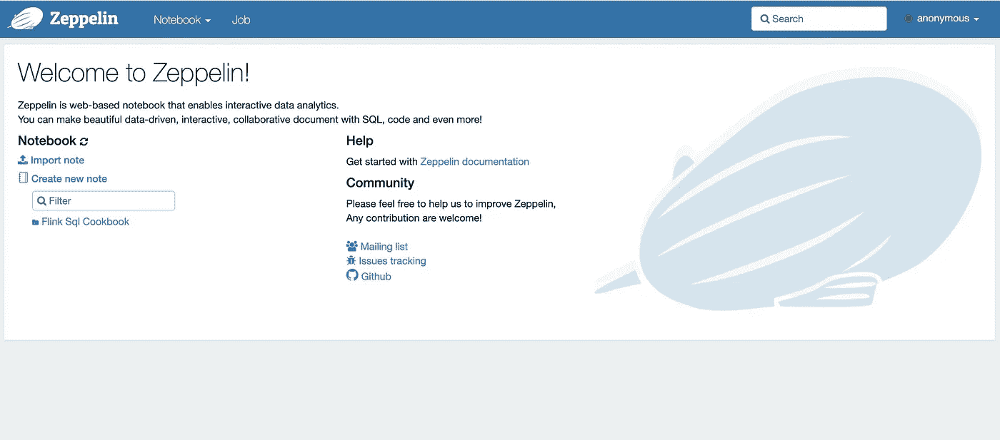

# 学习 Flink SQL —简单的方法(基于 Zeppelin 0.10)

> 原文：<https://medium.com/analytics-vidhya/learn-flink-sql-the-easy-way-d9d48a95ae57?source=collection_archive---------15----------------------->

Flink 几乎是当今事实上的标准流媒体引擎。Flink SQL 是使用 Flink 的推荐方法。但是流式 sql 不同于传统的批处理 sql，你必须学习许多新概念，如水印、事件时间、不同类型的流式连接等等。老实说，所有这些都不容易学。

今天我要给大家介绍一个新的(简单的)学习 flink sql 的方法:**Zeppelin 上的 Flink Sql Cookbook。**在 Zeppelin 中，您可以以如下交互方式运行 Flink SQL:


## **本帖中的所有例子都可以在这里找到。**

[http://zeppelin-notebook.com/](http://zeppelin-notebook.com/)([http://23.254.161.240/#/](http://23.254.161.240/#/))

# 准备环境

## 第一步

```
git clone [https://github.com/zjffdu/flink-sql-cookbook-on-zeppelin.git](https://github.com/zjffdu/flink-sql-cookbook-on-zeppelin.git)
```

这个 repo 拥有所有的 zeppelin 笔记本，其中包括了 [flink-sql-cookbook](https://github.com/ververica/flink-sql-cookbook/) 中的例子。感谢 ververica 提供的优秀示例，我只是将它们移植到了 Zeppelin。

## 第二步

下载 [flink 1.13.1](https://flink.apache.org/downloads.html) 并解压。(没试过其他版本的 flink)

## 第三步

构建 [flink faker](https://github.com/knaufk/flink-faker/) 并将 flink-faker-0.3.0.jar 复制到 flink 的 lib 文件夹中。这是一个自定义的 flink 表源，用于生成样本数据。

## 第四步

运行以下命令启动 Zeppelin

```
docker run -u $(id -u) -p 8081:8081 -p 8080:8080 --rm -v $PWD/logs:/logs -v /mnt/disk1/jzhang/flink-sql-cookbook-on-zeppelin:/notebook -v /mnt/disk1/jzhang/flink-1.13.1:/opt/flink -e FLINK_HOME=/opt/flink -e ZEPPELIN_LOG_DIR='/logs' -e ZEPPELIN_NOTEBOOK_DIR='/notebook' --name zeppelin apache/zeppelin:0.10.0
```

您需要用您的文件夹替换 2 个文件夹:

*   /mnt/disk 1/jzhang/flink-SQL-cookbook-on-zeppelin(这是步骤 1 的 repo 文件夹)
*   /mnt/disk1/jzhang/flink-1.13.1(这是步骤 2 的 flink 文件夹)

# 试试 Flink Sql Cookbook 的例子

现在，环境已经准备好了，您可以通过打开 [http://localhost:8080](http://localhost:8080) 开始您的 Flink sql 之旅



这是 Zeppelin 的主页，已经有一个名为`Flink Sql Cookbook`的文件夹包含了所有的例子。

# 示例 1:过滤数据

现在我们来看第一个例子: ***基础/04 过滤数据***


这里有两段:

*   第 1 段是通过`faker`连接器创建表 server_logs。
*   第 2 段是通过 where 语句过滤数据，然后通过`log_time`选择最近的 10 条记录

以下是结果截图。可以看到结果每 3 秒刷新一次。这是 Flink 流 sql 相比传统批处理 sql 的最大区别。因为在流式世界中，新数据不断到来，所以你会看到结果不断更新。

除此之外，你可以点击右上角的`FLINK_JOB`链接，它会带你到这个工作的链接界面。


# 示例 2:横向表连接

现在我们来看第二个例子: ***侧桌加入*** 。这是 Flink sql 支持的一种连接类型。通常新的初学者会对此感到有点害怕，即使他是通过一些教程文章学会的。如果有一个真实的例子可以告诉他这个横向表连接到底在做什么，我相信这对他理解它会很有帮助。幸运的是，我们在这本 flink-sql-cookbook 中有一个例子，您可以直接在 Zeppelin 中运行它。打开`Joins/06 Lateral Table`，然后运行它你可以看到下面的截图。


这里我只给你看上面的两个例子，在这本食谱中还有很多其他的例子。你可以自己试试。希望你会喜欢这本关于齐柏林飞艇的 flink-sql-cookbook。


Zeppelin 社区仍然试图改进和发展 Zeppelin 上 Flink 的整个用户体验，您可以加入 Zeppelin slack 与社区讨论。[http://zeppelin.apache.org/community.html#slack-channel](http://zeppelin.apache.org/community.html#slack-channel)

关于《齐柏林飞船上的弗林克》的更多细节，请参考以下链接。

*   [http://zeppelin-notebook.com/#/](http://zeppelin-notebook.com/#/)
*   [http://zeppelin . Apache . org/docs/0 . 10 . 0/interpreter/flink . html](https://zeppelin.apache.org/docs/0.10.0/interpreter/flink.html)
*   [https://www.youtube.com/watch?v=YxPo0Fosjjg&list = pl 4 oy 12 nns 7 fftg 3kv 1 is 5 vdb 0 ptz 12 vcx](https://www.youtube.com/watch?v=YxPo0Fosjjg&list=PL4oy12nnS7FFtg3KV1iS5vDb0pTz12VcX)