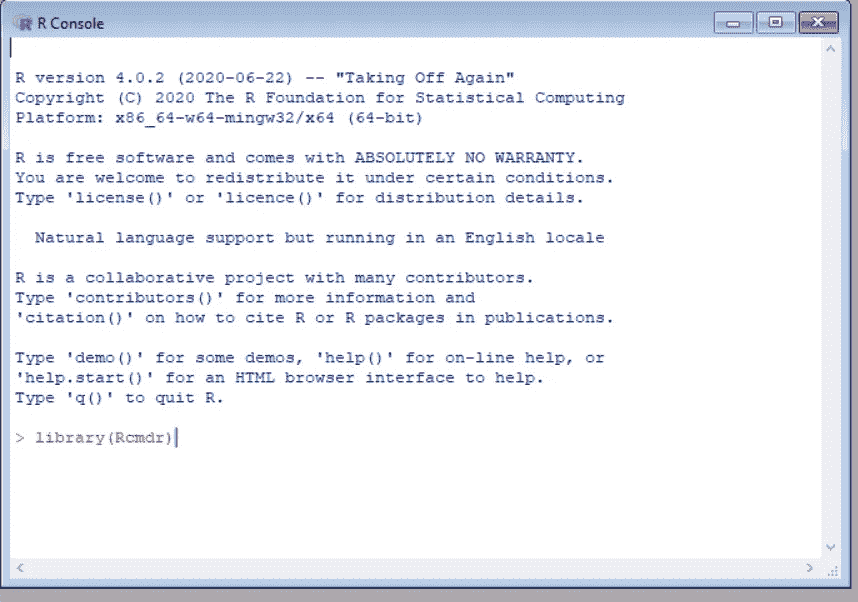
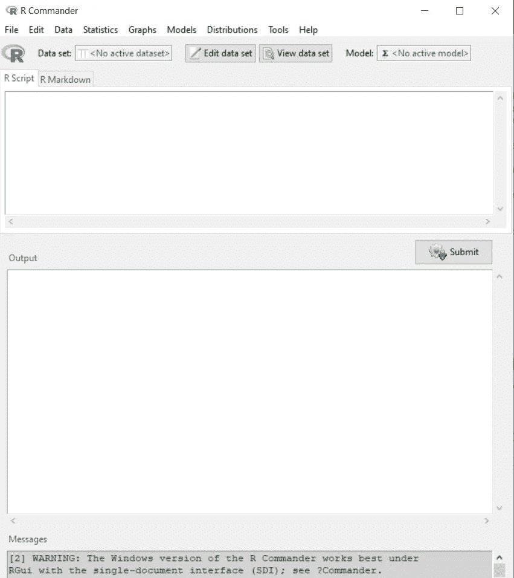
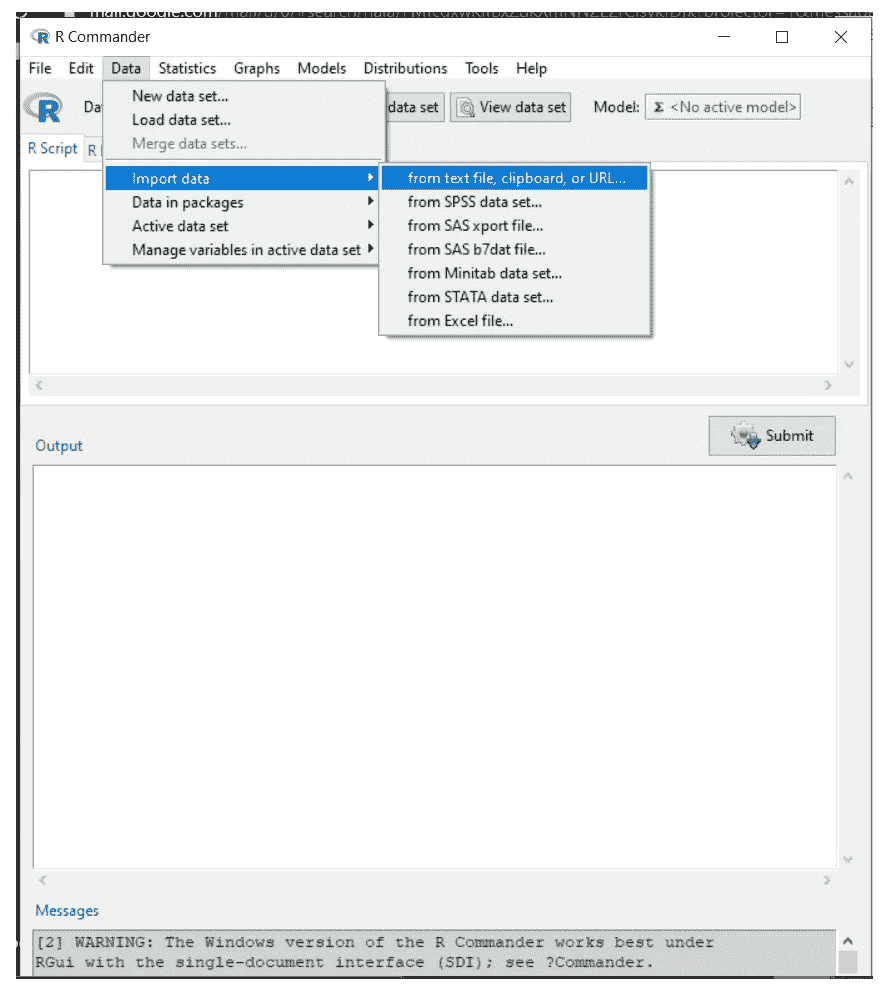
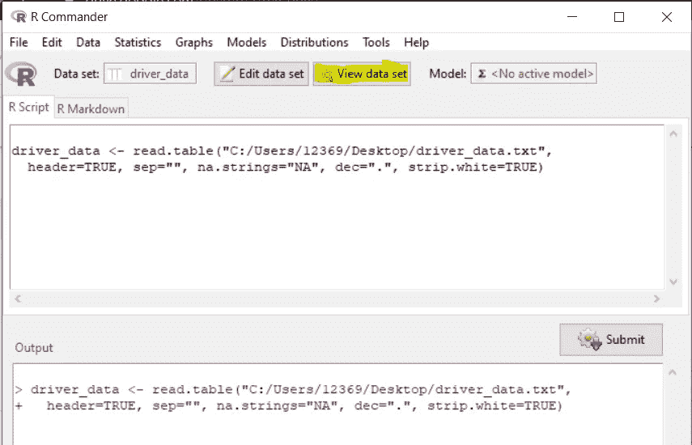
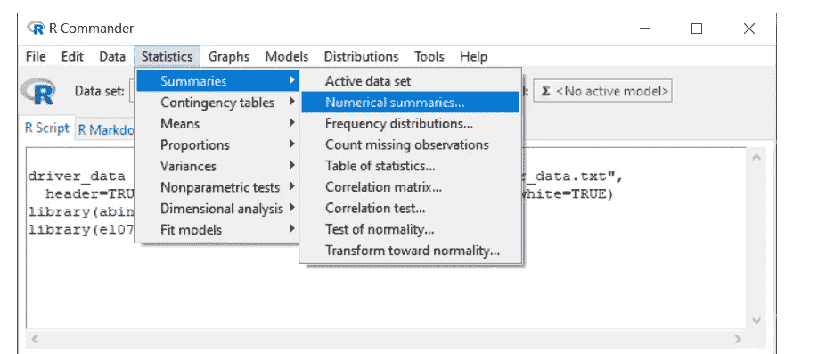
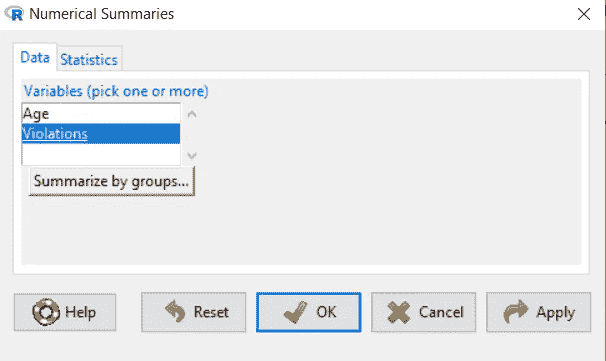
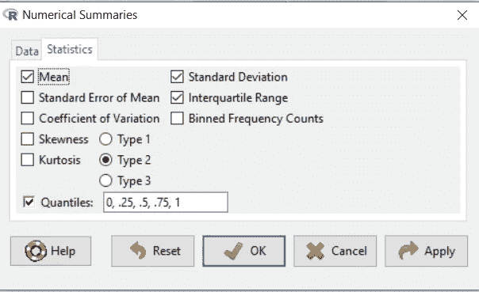
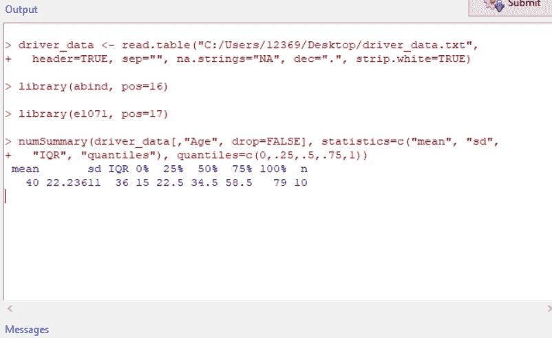

# 学习和使用 R:无需编程

> 原文：<https://medium.com/analytics-vidhya/learn-r-without-the-programming-3ce702c57d05?source=collection_archive---------24----------------------->

r 已经成为数据科学领域中一个有影响力的编程工具。开发 r 是为了执行复杂的统计计算，因此，它使数百万程序员能够执行任务，如:
-数据可视化
-机器学习/预测建模
-仪表板报告等。

然而，对于一些初学者来说，阻止他们进入这个领域的最大障碍之一是令人生畏的代码。幸运的是，R Studio 是一个集成开发环境，旨在为用户提供一个 GUI(又名 R Commander)来学习 R 的**基础，而不用太担心编码。**

本教程结束时，您将能够:
-理解 R 在数据处理中的作用
-安装 R and R 工作室
-将数据集导入 R 工作室
-查看 R 工作室(Commander)中的数据形状
-最后，生成数值摘要，如平均值、模式和 iqr。

## 开始

要开始下载 [R Studio](https://rstudio.com/products/rstudio/download/) 。因为我们将通过 R Commander 只覆盖基础，所以下载基本的免费版本是完全没问题的。

**下载安装 www.r-project.org** ——打开浏览器进入。
-点击“入门”下第一段中的“下载 R”链接
-选择一个位置(镜像站点)并点击相应的链接
-点击页面顶部的“下载 R for (Mac) OS X/ Windows 链接
-点击“文件”下包含最新版本 R 的文件。
——救了。pkg 文件，双击它打开，并按照安装说明进行操作。
——现在已经安装了 R，您需要下载并安装 RStudio。
-转到[www.rstudio.com](http://www.rstudio.com/)并点击“下载 RStudio”按钮。
-点击“下载 RStudio 桌面”。"
-点击为您的系统推荐的版本，或最新的 Mac 版本，保存。dmg 文件，双击打开它，然后将其拖放到您的应用程序文件夹中。

一旦你安装了 R and R 工作室，进入 R 工作室控制台，输入以下命令:

一旦 R 加载了库内类型(Rcmdr)

以下命令调用 R Commander。R Commander 将使我们能够对导入的数据集执行基本任务。

R Cmdr

在对我们的数据执行任何形式的任务之前，我们首先需要*导入*美国境内[驾驶员数据](https://drive.google.com/file/d/1m3-AimeF_rf9U-2i-5MfDA3IXivXLfaV/view?usp=sharing)的数据集(假设数据集)。

> 注意:这是一个样本数据，我们将使用它来介绍基础知识。

要导入数据，点击数据->导入->从文本文件

按照上面的说明导入 **driver_data.txt** 下载的文件。

> 注意:要在学习本教程的同时找到自己的数据集，您可以访问:【https://old.datahub.io/】T2 或其他提供的可靠网站。txt 数据集。如果您希望使用其他格式，如(。xlss)然后从“数据”菜单中相应地更改您的导入选项(见上图)。

根据您的选择重命名数据集

按下“确定”后，浏览您的文件并选择要导入的 driver-data.txt 文件。你现在可以点击“查看数据集”来检查我们数据的形状。

查看数据集—以黄色突出显示

点击查看数据集后

我们可以看到 3 个变量的存在:
姓名、年龄和驾驶违规

现在我们对变量形式有了更多的了解，我们可以继续使用下面的数据来获得这些数据的平均值、众数、中位数和四分位数。为此:点击统计>摘要>数字摘要

为了从数据中产生数字摘要

在执行完上述命令后，您会得到以下提示:

选择要进行数值汇总的变量

我们选择违规变量来计算 IQRs、平均值和更多。然后，在提示窗口中将选项卡从 Data 切换到 Statistics，并选择您希望生成数据摘要的所有选项。

R 能够通过我们的数据集生成不同数据汇总的选项

选择完所需的输出摘要后，按确定。这将在输出窗口中创建一个显示:

蓝色文本代表违规变量的数据摘要

恭喜你！您刚刚从一个数据样本中获得了您的第一个数据摘要。

从上面的输出中重复:

**表示:**40；**SD:**22.23611；iqr 显示在 0、25、50、75 和 100。

**n** 这里代表样本数据集中的被试人数。

接下来:
-直方图绘制
-箱线图
-扩散和中心的测量
-以及更多！