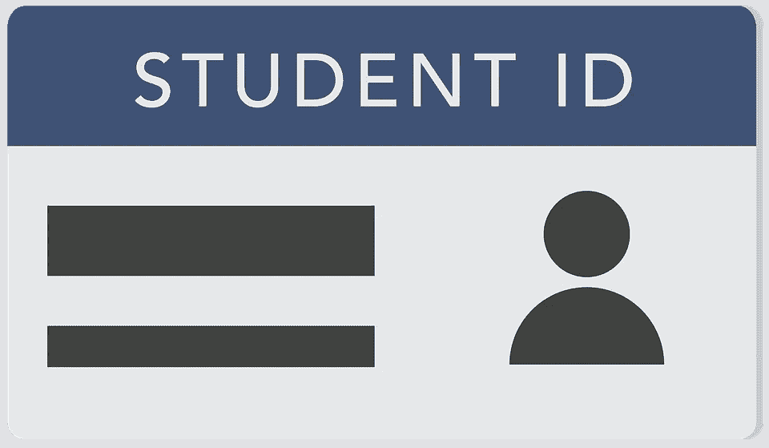

# 学习数据科学的统计学

> 原文：<https://medium.com/analytics-vidhya/learn-statistics-for-data-science-72fec5372abe?source=collection_archive---------17----------------------->

## 开始数据科学职业生涯需要了解的统计学基础知识

## 什么是统计学？🤔

通常，统计学用于收集、组织和分析数据(一条信息)。换句话说，分析数字信息并从数据中提取信息。

统计数据是一种只告诉总体样本的度量。进行一项测验，询问随机的(自愿的)人。

## 描述统计和推断统计:

**描述性统计:**描述性统计是将从样本和人群中观察到的信息描绘出来的方法

**推断统计学:**利用样本信息推断总体的方法。

*   统计学处理人口和样本。

## 参数:

一个参数(P)描述了进入人群**例如**:进行一个测验来询问随机的(自愿的)人

## 人口与样本:

**人口**:

*   **群体**是一组人或物体，因此组中的每个成员都被视为一个群体。总体是可以用 **N.** 表示的所有项目的集合
*   获取人口并进行计算极其困难，因为消耗的时间越多，需要的成本就越高，而且很难观察到。

**样本:**

样本是从总体中提取的一条信息。为了执行"**推断统计**"我们从总体中抽取一个样本。换句话说，样本是总体的一个子集。

## 统计错误:

在执行统计时，我们可能会面临两种不同类型的错误

*   **采样误差**
*   **非抽样误差**

当总体平均值与样本平均值不同时，就会出现抽样误差。这个错误是统计学家(分析师)犯的

**非抽样误差:**非抽样误差的发生是由于样本设计不良和测量不准确造成的。这个错误是我们想要避免的目标。

## 取样框架:

这表明样本中的个人列表被选中。我们可以说在大学注册的学生名单就是一个例子。有时列表可能是物理的或理论的。

## 取样类型

> **简单随机抽样**
> 
> **分层抽样**
> 
> **系统采样**
> 
> **方便取样**

## 一.简单随机抽样

一般来说，SRS 是随机选择的总体子集，即*“每个样本都有同等的机会被选中”。*简单随机抽样的主要优点是我们也可以随机分配数字给人口，但是数字必须是唯一的而不是完全相同的。

“**学生证**”是一个简单随机抽样的好例子，因为每个学生都有不同的身份证号码。

## 二。分层抽样:

将总体(N)分成“不重叠的或分离良好的组(层)”，然后对每个组进行简单的随机抽样以形成样本(N)。

## 三。系统取样:

*   将总体( **N** )中的每第 N 个(特定)个体放入样本(N)中。
*   **示例:**让我们考虑专门从数据集中取第 7 个值，并将它们相加。就像在超市里，工作人员只奖励第 7 个顾客、第 14 个顾客、第 21 个顾客..以此类推，这意味着你在进行系统抽样。

## 四。方便取样:

方便取样是所有取样中最简单的一种，选择最简单的方法来获取样品。换句话说，“从群体中容易获得的个体被放入样本(n)”中。

*   便利抽样又称**自愿响应抽样。**

`Thank you..`

[***在这里阅读更多文章:***](https://saran-23.medium.com/day-7-concept-of-combinatorics-you-need-to-know-for-data-science-23e517d44053)

 [## 面向所有人的 Python

### 如何成为 python 编程专家

medium.com](/analytics-vidhya/python-for-everyone-febb359158ee)  [## 回归在数据科学中的应用

### 只需 3 分钟即可免费阅读逻辑回归

saran-23.medium.com](https://saran-23.medium.com/day-4-different-stages-in-data-science-c9af6e2414ae)