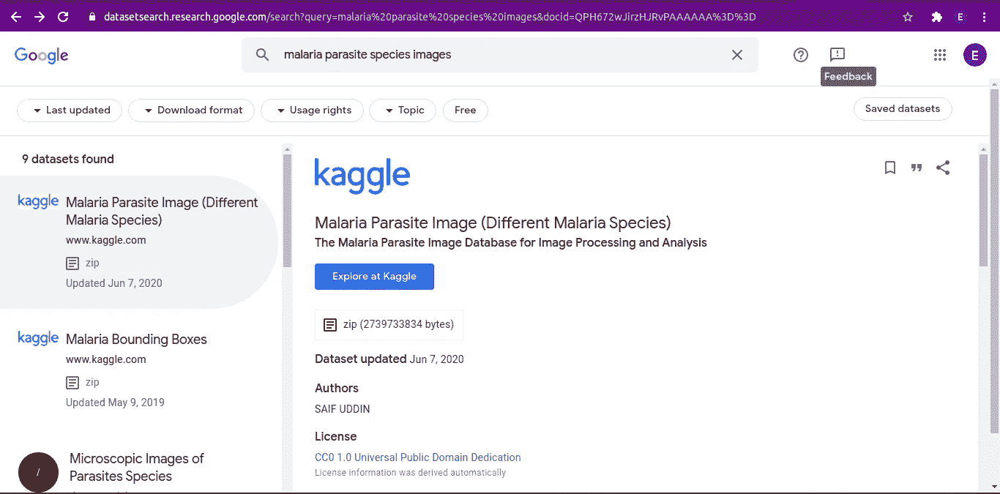
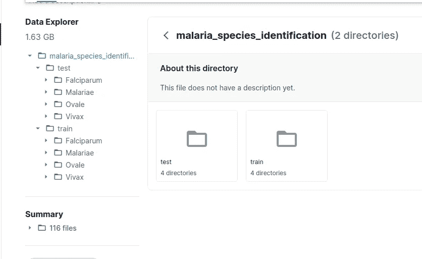

# 了解数据来源和模型部署准备的流程

> 原文：<https://medium.com/analytics-vidhya/learn-the-process-of-data-sourcing-and-preparation-to-model-deployment-4936c3b1f7b8?source=collection_archive---------37----------------------->

## 通过使用 Fast.ai 构建疟原虫物种分类模型，掌握为深度学习算法获取和准备数据的过程，直至部署经过训练的深度学习模型

马克西姆·伊利亚霍夫在 [Unsplash](https://unsplash.com?utm_source=medium&utm_medium=referral) 上拍摄的照片

在这一系列的博客文章中，我将通过使用 Fast.ai 构建一个**疟疾寄生虫物种分类模型**来解释获取和准备数据的过程，直至构建和部署深度学习模型

这是三部分系列的第一部分。

在这篇文章中，我将重点关注为深度学习模型获取和准备或格式化数据的任务。

由于我们的任务是建立一个疟原虫物种分类模型，我们必须获取疟原虫物种的图像。

获取数据集的一种方式是使用谷歌自己的数据集搜索引擎[https://datasetsearch.research.google.com/](https://datasetsearch.research.google.com/)，你可以从这个门户网站搜索你的项目所需的数据集，在我们的例子中，我们需要“带有疟原虫所属物种标签的图像”。

因此，我们将转到门户网站，键入“疟原虫种类图像”。我们有这样的结果:

我们将检查第一个结果，因为它更多地说明了我们打算做什么。当我们点击“探索 Kaggle”时，它会将我们带到“任务”页面，您可以点击“数据”页面来检查数据。你会注意到这些数据包含了除“诺氏疟原虫”之外的不同疟原虫种类的图像，因为它很少被发现。我们仍然可以用这些数据来凑合。

我们可以直接建立我们的深度学习模型，但我们将下载数据进行检查，并将其格式化到 train 和 test 文件夹中，每个文件夹都有该物种类的其他文件夹。像这样:

你可以探索这些数据，并直接在这里建立你的深度学习模型:[https://www.kaggle.com/emmamichael101/malaria-species](https://www.kaggle.com/emmamichael101/malaria-species)点击“新笔记本”。

在该系列的下一部分，我们将重点关注构建深度学习模型。

第二部分:[利用 Fast.ai 进行疟原虫种类分类](https://emmamichaelo.medium.com/malaria-parasite-species-classification-using-fast-ai-4255b7ac1bff)

第 3 部分:[使用 Binder 部署一个 Fast.ai 训练模型](https://emmamichaelo.medium.com/deploy-a-fast-ai-trained-model-using-binder-ce717a2ca66c)

**在推特上关注我:** [@emmakodes](https://twitter.com/emmakodes)

【领英:[https://www.linkedin.com/in/emmanuelonwuegbusi/](https://www.linkedin.com/in/emmanuelonwuegbusi/)

# 结论

希望你已经发现了谷歌的数据集搜索引擎。通过这个系列来使用 Fastai 构建和部署您的深度学习模型

## 参考

[1][https://www . ka ggle . com/saife 245/malaria-parasite-image-malaria-species](https://www.kaggle.com/saife245/malaria-parasite-image-malaria-species)

[2]@ InProceedings { 10.1007/978–3–030–13835–6 _ 7，author="Loddo，Andrea 和 Di Ruberto，Cecilia 和 Kocher，Michel 和 Prod'Hom，Guy "，editor="Lepore，Natasha 和布列瓦，Jorge 和 Romero，Eduardo 和 Racoceanu，Daniel 和 Joskowicz，Leo "，title="MP-IDB:用于图像处理和分析的疟原虫图像数据库"，booktitle= "生物医学信息的处理和分析"