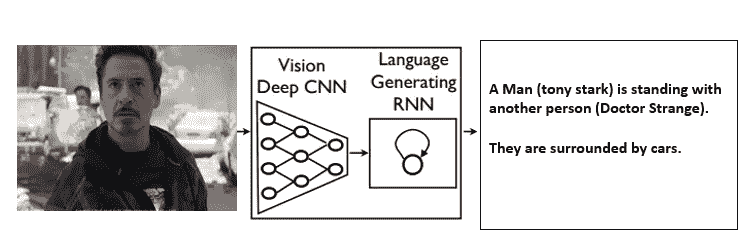
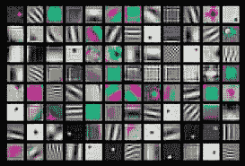
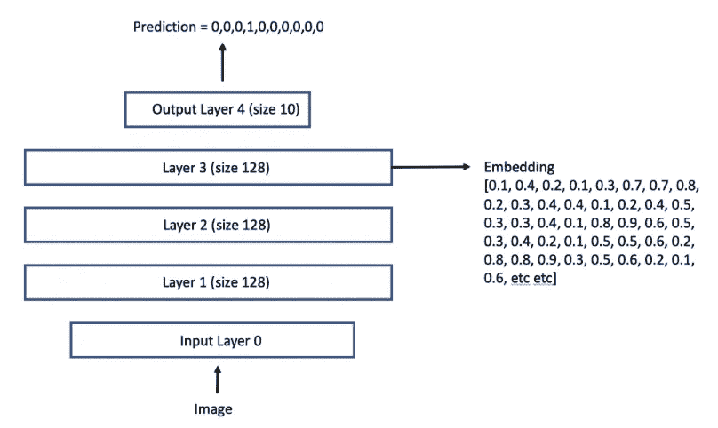
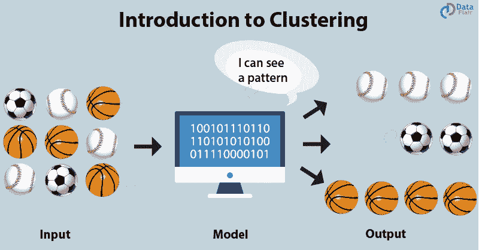
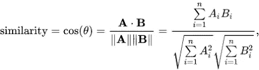
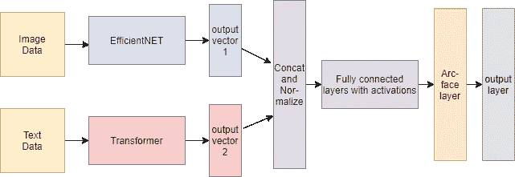

# 从不同类型的数据中学习，无需监督

> 原文：<https://medium.com/analytics-vidhya/learning-from-different-types-of-data-without-supervision-da27bfd9f6a6?source=collection_archive---------13----------------------->

英国数学家克莱夫·亨比早在 2006 年就说过“数据是新的石油”。我们现在都知道这句话有多准确。那么，仅限于单一类型的数据难道不会限制我们完成更复杂的任务吗？我们已经创建了深度学习领域，如计算机视觉、自然语言处理，我们主要关注一种类型的数据。但是有一些任务，质疑让机器变得智能的整个概念。他们是真的学到了什么，还是只是在模仿他们得到的数据？一些例子是**图像字幕**(给定一幅图像，计算机必须产生一些与之相关的字幕)**视觉问题回答**(计算机必须回答一个与给定图像相关的问题)，等等。处理这种类型的复杂任务让我们思考，如何**融合所有这些领域的知识，并使用组合的海量数据**。整合各种数据和模态并使用 AI 作为媒介来解决这一问题的领域称为**多模态机器学习/多模态学习。**

因此，为了解决这个问题，我想用一个例子告诉你我是如何尝试解决这个问题的，这个例子就是电子商务网站中的**产品匹配**。我将使用最近在 Kaggle 进行的名为“Shopee —价格匹配保证”的竞赛作为数据参考。所以首先让我们讨论一下我们手中的问题。官方的问题陈述是

相似商品的两个不同图像可能代表相同的产品或两个完全不同的项目。零售商希望避免混淆两种不同产品可能带来的虚假陈述和其他问题。目前，深度学习和传统机器学习的结合分析图像和文本信息，以比较相似性。但是图像、标题和产品描述的主要差异使得这些方法无法完全有效。在这场比赛中，你将应用你的机器学习技能来建立一个模型，预测哪些商品是相同的产品。”

给我们的数据有 3 个特征和一个标签组，分别是产品的图像、相应的标题或描述、永久图像散列和标签组。我们将讨论除 image_hashing 之外的特性，这超出了本文的范围(假设我正在为下一篇文章保存一些东西；) ).

乍一看，有人会认为这是一个分类任务。由于图像和相应的描述是与标签组一起给出的，我们只需对产品属于哪个组进行分类。但是这里有一个小小的转折。首先，大约有 30，000 种产品有将近 11，000 个类别(在训练数据中)。这使得每类产品非常少，并且难以对任何型号进行分类。但更大的问题是，对于**测试数据，标签组与列车不同！**所以我们不能简单地做一个分类模型。因为如果我们建立一个模型来对产品进行分类(这可能会给我们一个好的训练分数),但在测试集上进行推理时，它可能会预测出乱码标签，因为这些标签与训练集不匹配。

因此，文章的第二部分标题为“无监管”。在这里，我们将尝试制作一个模型，它将表现得足够好，即使是它以前没有见过的标签！

模型学习的一些特征/模式

图片摘自[https://www . ka ggle . com/c/shopee-product-matching/discussion/226279](https://www.kaggle.com/c/shopee-product-matching/discussion/226279)

为了完成这项任务，我们将查看分类模型的内部，并了解该模型实际上试图学习什么。我们将深入我们神经网络的隐藏层。**训练时模型中的权重，学习数据中的模式。**如果我们将数据输入到我们的**训练好的**模型中，并从**隐藏层**中取出输出，这些输出也被称为**嵌入**，我们将观察到同一类输入的嵌入非常相似。它使用学习到的模式来区分不同标签的对象。由于这个原因，如果我们试图在二维空间中可视化这些嵌入(我们可以通过使隐藏层由 2 个神经元组成来实现)，我们将观察到相同类别的输入将聚集在一起。

在我们的例子中，我们将让模型输出两件事。在训练期间，它将使用最后一层的输出进行分类，但是为了比较嵌入，我们将使用最后一个隐藏层的输出(最后一个隐藏层是最终分类层之前的层)。我们也可以比较其他隐藏层的嵌入，这是一个选择，在我的例子中，我选择了最后一个，它通常给出了更好的嵌入表示。因此，即使在测试集中没有相关联的标签，我们仍然可以根据它们的嵌入性找出哪些产品可能是相似的。但是我们用什么来衡量相似性呢？有许多方法，如寻找嵌入之间的**欧几里德距离或余弦相似度**。这里我使用了余弦相似度。余弦的值越接近 1，表示相似，如果越接近-1，表示不同。

现在让我们专注于合并我们已经讨论过的不同元素，并制作一个完整的管道。

为了从图像和文本中获得嵌入，我使用了**预先训练的模型**。对于图像，我使用 PyTorch Image Models(timm)包中基于 ImageNet 数据训练的模型，对于文本，我使用 hugginface 的多语言 Transformer 模型。现在，为了将两个模型的这两个向量(模型的输出是一个一维向量)结合起来，我将它们连接起来，然后对它们进行归一化。这只是融合向量的一种方式。许多研究论文都说，在模型早期融合这种嵌入可能会提高我们的预测，但我们必须从头开始训练它。因为我没有太多的资源，所以我使用了预先训练好的模型。完整的模型架构定义如下。

全型号；我使用 Efficientnet 架构作为图像的主干

最后一个隐藏层是一个**“弧面层”**。正如我们之前所讨论的，隐藏图层试图使用所学的功能将不同的事物彼此分开，Arcface 图层正在做同样的事情，但做得更好。这是一种首先用于人脸验证的方法(您可以在下面找到论文链接)。**它使相似对象的嵌入更紧密，并推开不相似的对象**(我说的更紧密是指具有几乎相同的值)。因此，即使我们仅用训练集的标签进行训练，我们也可以使用嵌入的这一属性来对看不见的标签进行分类。使用交叉熵作为损失函数和 AdamW 优化器对整个模型进行 15 个时期的训练。

现在到了推理部分。模型训练完成后，我们计算测试集中每个产品之间的相似性得分(使用余弦相似性)。因此，如果我们有“n”个产品，我们必须计算每个产品的(n-1)个相似性得分。所以在计算完所有测试产品的分数后，我们将得到一个(n×n)矩阵。我再次重申，这些分数让我们感觉到一个产品与其他产品有多相似，在**分数被重新调整**后，从 1 到 0 不等。然后我们能做的是我们能决定一个**阈值**。高于该阈值的分数将让我们知道哪些产品是匹配的。例如，考虑一个 product_x，我们已经计算了关于它的所有其他产品的所有相似性分数。这将是一个形状为(1 x n)的向量，包括 product_x 本身。**因此，如果阈值为 0.7，则相应得分大于该值的所有产品都将被视为匹配。**(是的，它也会选择自己，因为它自己的相似性得分为 1)同样，对其他产品也是如此。

因此，我们的管道已经完成，现在我们可以提交匹配的产品并获得测试集的 AUC 分数。在不知道测试标签的情况下，我们制作了一个完整的工作流程，是不是很棒？(当我第一次提交时，我太他妈兴奋了)

我的最终模型是 3 个模型的集合，每个模型都使用不同的预先训练好的主干模型。我的私人测试的最终分数是 0.73，我的最好成绩是 0.732。AUC 被用作评价指标。获胜者和大师们使用了各种技巧来获得更高的结果，如使用**图形神经网络、后处理技巧、提升树、**等，但每个人都使用上面讨论的想法作为他们的基础模型。我强烈推荐阅读赢家使用的不同策略。这场比赛对我来说很特别，因为它给了我迄今为止最好的单人排行榜位置。除此之外，由于 NVIDIA 的 RAPIDS，我还学会了如何使用 GPU 来完成数据科学任务(如计算分数、寻找匹配)。借助 GPU 的强大功能，我的总工作流程时间减少了近 30%。

希望我能给你一些这种模式背后的直觉。这是一个活跃的研究领域，我希望读完这篇文章后，你已经有了某种程度的好奇心去进一步探索。

感谢阅读！

链接:

1.  竞赛[https://www.kaggle.com/c/shopee-product-matching/overview](https://www.kaggle.com/c/shopee-product-matching/overview)(参见讨论小组，了解获胜方案)
2.  我的模型[https://github.com/mrinath123/Shopee_notebooks](https://github.com/mrinath123/Shopee_notebooks)的代码(仍然需要上传一些更多的脚本)
3.  通过这些可以直观地理解嵌入、余弦距离和弧面[https://www . ka ggle . com/c/shopee-product-matching/discussion/226279](https://www.kaggle.com/c/shopee-product-matching/discussion/226279)
4.  Arcface 纸业【https://arxiv.org/abs/1801.07698 
5.  多模态学习资源【https://github.com/pliang279/awesome-multimodal-ml 