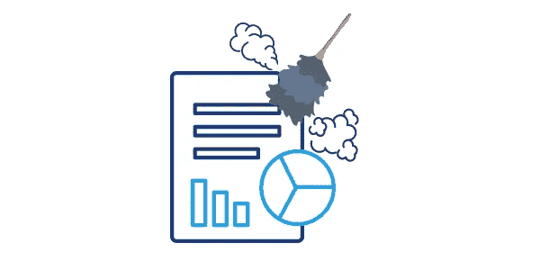
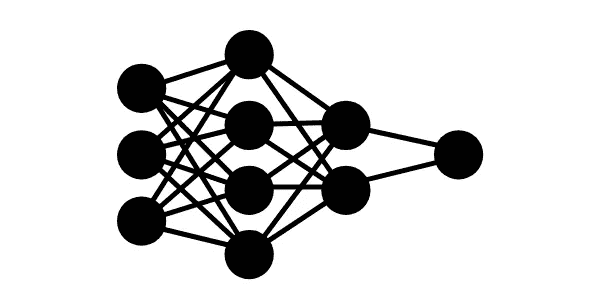
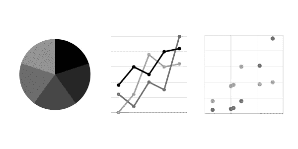

# 用 Kaggle 学习机器学习

> 原文：<https://medium.com/analytics-vidhya/learning-machine-learning-with-kaggle-4a55feeacda1?source=collection_archive---------27----------------------->

## 初学者的视角。

所以我使用 Kaggle 课程来学习一些关于数据科学的基础知识，作为一个初学者，使用这种方法来开始我的项目是最好的方式。到目前为止，我学了 3 门课程，数据清理、机器学习入门和中级机器学习，它们是非常快的课程，所以如果你有一些隔离要做，这是你周末的一个好项目。

所以这将是我对我所学的和我在学习时的感受的回顾，所以正如我说的我是一个初学者，所以你为什么要继续阅读呢？因为如果你想学这些课程，这可能是你知道自己是否应该继续下去的方式，预示着，我发现它非常有用。

## **数据清理**

所以我在网上搜索一些关于数据争论的内容，发现了这个课程，我很好奇，因为我第一次听说它是在看 Kaggle 频道的一些讲座时，所以我看到它们是快速课程，并找出为什么不，应该是一个好的开始。

我现在正在进入 python 的中级阶段，所以，工具本身并不是什么大新闻，但是概念和如何在实际层面上做这件事使它的内容非常有趣。

我认为唯一有点肤浅并需要更多实际解释的是第二课中的规格化，如果我对规格化一无所知，我会这样结束这一部分:“这是什么意思，我如何使用它？”但幸运的是，我在大学里学过，所以我很好，但如果你从未听说过它，你应该更深入地了解它。

在整个课程中，对我来说最大的亮点被留到了最后，修复错别字，你不仅可以学习如何使它们看起来更统一，课程还为你提供了一个功能，让你可以替换数据中意思相同的不同条目，我发现这真的很棒，非常有用。

## **机器学习简介**

所以，我在这里上的下一门课是机器学习入门，这里有一些背景知识，我很清楚它涵盖的内容，我读过福斯特·普罗沃斯特和汤姆·福塞特的《商业数据科学》一书，这是一本关于数据科学的精彩书籍，我已经读到第 6 章了，它已经让我惊叹了无数次，前几章从理论上涵盖了这些内容，但这是一个更实际地了解它的好机会。

好的，但是课程怎么样？实际上，它从头到尾都很棒，我发现它在理论部分有点模糊，但嘿，这是一门实用的课程，所以这真的不重要，现在，我告诉你的书，以一种非常有趣的方式覆盖它，读一读。

对我来说，重点实际上是谈论验证、拟合不足和拟合过度，如果你想成为一名数据科学家，这是一个严肃的话题，我在 YouTube 上与巴西的一名长期数据科学家的采访中听到了这一点。

我从本课程中得到的另一个亮点，比第一个更大的亮点是在最后一部分，所以他们制作了一个路径，让你可以将你的模型放在竞争中，并检查你的分数，所以如果你像我一样独自学习，将你的结果与他人进行比较是一个非常好的主意，他们还鼓励你一遍又一遍地查看代码，以便你可以增强它并获得更多的分数。

## **中级机器学习**

我所做的最后一部分比上一部分更有趣，这一部分实际上更侧重于让你成为模型的思考者，而不是让你通过一系列数据集重复模型。

通常，作为初学者，我们容易想到通过与许多可以完美预测一切的算法相处来获得最佳模型，但是，与其使用自动化机器学习库来找到最佳模型，为什么不学习如何调整一种更简单的算法来给出最佳结果？

对我来说，这门课的底线是什么？接下来会有很多练习，让你重复之前在课上看到的代码。我真的不太愿意这么做，因为我可能会有完全不同的变量，这会让我的注意力保持更长时间。

亮点？嗯，有很多，但我将把它分成两点。首先，更深入地了解如何使用 scikit-learn 提供的更可靠、更复杂的工具来验证您的模型，这让我更放心去那里找到关于我喜欢的主题的数据集，并尝试制作自己的模型。

其次，这是第一个问题的结果，与上一个问题相比，这些练习让我更多地思考答案，并在这个过程中加强了这一点:如果你想沿着这条道路走下去，你必须更好地学习如何操作数据集，以不同的方式调整你的模型，并防止你的数据对给定的结果产生任何问题。

## **最后的想法**

因此，如果你想继续下去，实际上这是这个“经典”机器学习分支的第三个课程，即特征工程，我可能会在未来的某个地方做它，但现在，我真的想在我发现有必要开始这个新的冒险之前，先接触一些数据。

总的来说，在本课程结束后，我感到很受鼓舞，想自己尝试这些概念，看看我能得到什么。我还想做的另一件事是阅读我在课程中使用的 scikit-learn 功能的所有文档，有些参数在我脑海中有点模糊，我真的想了解更多。

如果我建议你在开始任何机器学习之前检查一下这个，**最肯定的是**，如果我的一些朋友今天来问我在这个问题上从哪里开始，我会说在花钱买一些 Udemy、Coursera 或 edX 证书之前从这里开始。

注意安全伙计们。:)