# 通过示例学习优化(SGD)

> 原文：<https://medium.com/analytics-vidhya/learning-optimization-sgd-through-examples-2459f1a0715?source=collection_archive---------22----------------------->

# 介绍

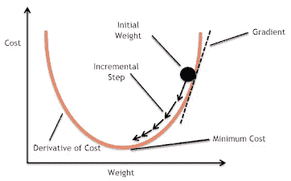

优化的整个目的是最小化[成本函数](https://srinivask-bits.medium.com/loss-functions-part-1-17b2601031c1)。我们将在本文的后面部分了解更多关于优化的内容。

# 批量梯度下降

这里，我们在执行权重或参数的更新时，对每次迭代的所有示例进行总结。因此，对于权重的每次更新，我们需要对所有示例求和。基于梯度和学习速率(n)更新权重和偏差。

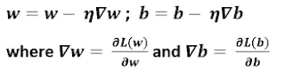

主要优势在于有一条朝向最小值的直线轨迹，并且在训练期间具有对梯度的无偏估计和固定的学习速率。当我们使用向量实现时是不利的，因为我们必须一次又一次地检查所有的训练集。当我们浏览所有数据时，学习就发生了，即使一些例子是还原剂，对更新没有贡献。

# 随机梯度下降

这里不同于分支梯度下降，我们更新每个例子上的参数，因此学习发生在每个例子上。所以它比分批梯度下降收敛得更快，因为权重更新得更频繁。这里，发生了大量的振荡，导致更新具有更高的方差。这些嘈杂的更新有助于找到新的和更好的局部最小值。由于频繁的波动，它将会在期望的精确最小值附近保持超调。

让我们用例子来理解梯度下降。

# 示例 1

> **将了解:我们将如何达到最小成本点。**

让我们取一个成本函数 f(x)和梯度 df(x)给出如下

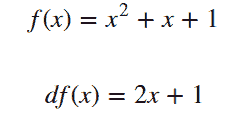

我们的目标是找到最低成本。所以我们来微分，等于 0。导数是 2x+1。所以最小值出现在 x = -0.5。让我们使用下图来理解这一点。x 范围从-3 到 3。

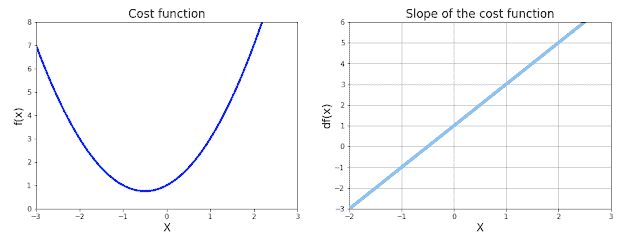

我们可以画出曲线和导数。这里我们已经知道二重导数是正的。现在使用梯度下降，我们可以运行 500 次，如果在 50 次之前达到最小值，它将停止。

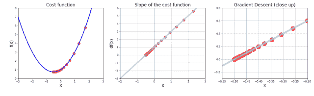

我们可以看到下图中的点是如何向最小成本移动的，因为我们从 x=-1/2 开始，我们得到了最小成本。当我们从 x=3 开始，学习率为 0，我们要求精度为 0.0001。在最后一张图中，我们可以看到渐变下降的特写镜头。

# 示例 2

> **将了解:如果超过一个极小值会发生什么。**
> 
> **将了解:起点重要吗？。**
> 
> **会了解:学习率有作用吗？。**
> 
> **会了解:梯度下降的限制。**

让我们取一个成本函数 f(x)和梯度 df(x)如下给出。

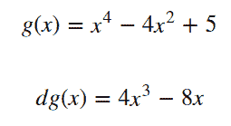

我们的目标是找到最低成本。让我们使用下图来理解这一点。x 范围是从-2 到 2。

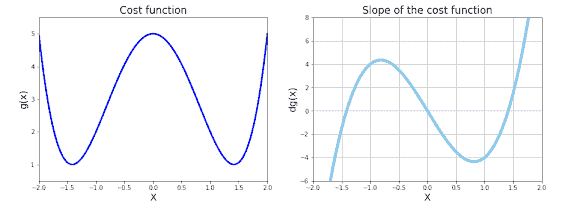

从上图中我们可以看到，成本函数有两个最小值。成本函数的斜率在 3 点处为零。

起点对渐变后代重要吗？

是的。下图显示了我们根据起始位置收敛到不同的最小值。现在让我们从 x = 1 开始。我们可以看到我们收敛到了正确的最小值。

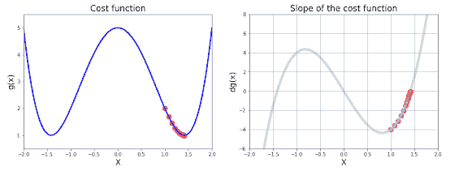

现在让我们从 x = -1 开始。我们可以看到我们收敛到左极小值。

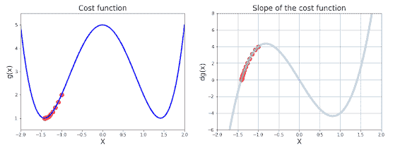

通过上面的图，我们可以清楚地说明，我们开始的初始位置决定了我们收敛的最小值。当我们仔细观察上述内容时，我们会发现斜率在 3 点处为零。当我们从 X=0 开始时，我们看到我们在第一次迭代时停止，因为 X=0 处的斜率为 0，但实际上，它不是最小值。

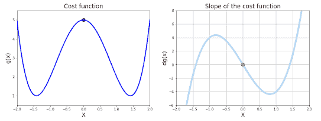

另一个限制可以是，如果存在两个最小值，并且当初始点在局部最大值的右侧并且没有发现全局最小值时。

学习率对梯度后代重要吗？

我做了一张图来解释学习率对梯度下降法的影响。这张图片解释了不同的学习速度会发生什么。

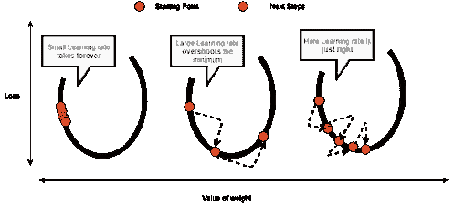

粉色线代表最高的学习率，绿色线代表最低的学习率，蓝色线代表介于粉色和绿色之间的学习率。从下图可以看出，高学习率收敛得很快，而低学习率收敛得很慢。

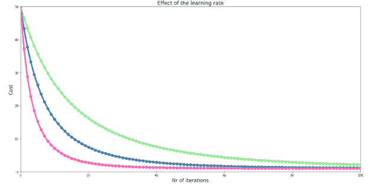

## 神经网络梯度下降

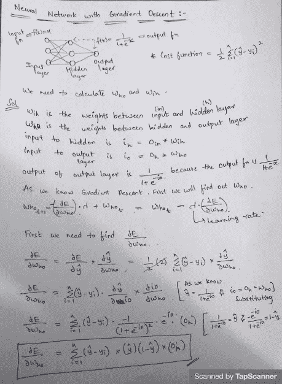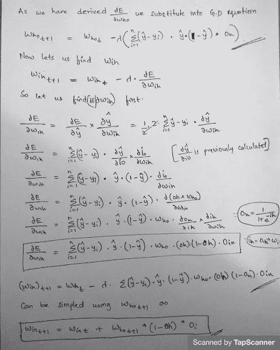