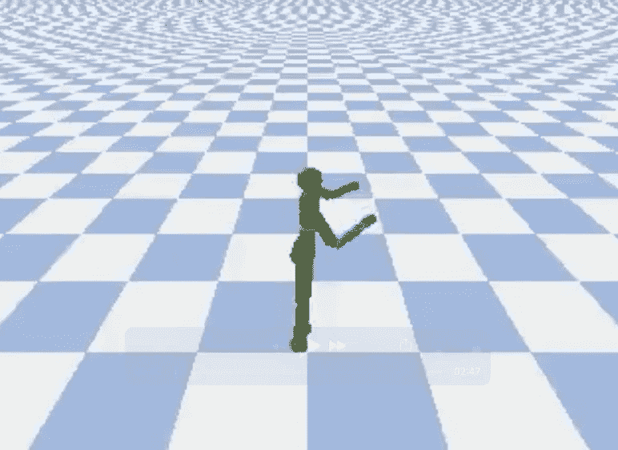
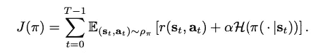
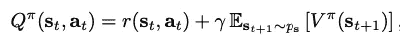
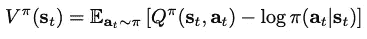
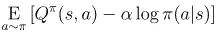
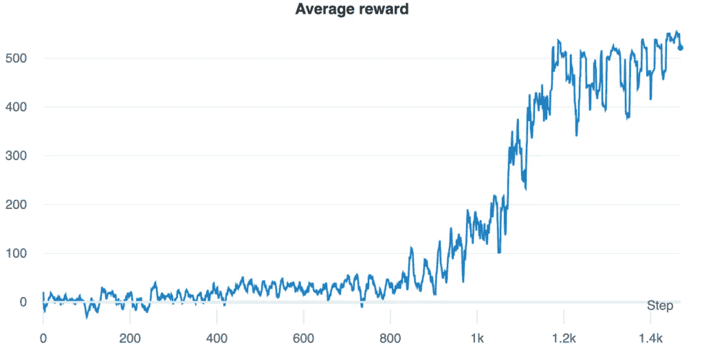

# 使用强化学习学习走路

> 原文：<https://medium.com/analytics-vidhya/learning-to-walk-using-reinforcement-learning-4e237aaf64a0?source=collection_archive---------0----------------------->

教机器人走路



*作者 Antonio Lisi
致奶奶，我会想你的*

# 介绍

大家好，在这篇文章中，我们将使用一种最新的最先进的算法，称为 SAC，来教机器人走路。

像往常一样，我们使用 Tensorflow 2 从头开始实现一切。我们将使用帖子中关于 [DDPG](/analytics-vidhya/reinforcement-learning-in-continuous-action-spaces-ddpg-bbd64aa5434) 的大量代码。所以如果你没有读过，我建议你先读一读。

# 环境

在 [DDPG 邮报](/analytics-vidhya/reinforcement-learning-in-continuous-action-spaces-ddpg-bbd64aa5434)中，我们解决了 OpenAI 提供的两个环境。但是它们太简单了，我想尝试更具挑战性的连续动作空间环境。

最受欢迎的套装之一是 MuJoCo。MuJoCo 代表多关节动力学与接触，引用自该网站“是一个物理引擎，旨在促进机器人，生物力学，图形和动画以及其他需要快速准确模拟的领域的研究和开发。它提供了速度、准确性和建模能力的独特组合，但它不仅仅是一个更好的模拟器”。不幸的是，MuJoCo 不是免费的，它需要一个许可证。

在谷歌搜索了一下之后，我发现了一个叫做 PyBullet 的开源替代品，它与 MuJoco 非常相似。您可以通过运行 pip install pybullet 来安装它，您可以在这里找到可用环境的列表[。](https://docs.google.com/document/d/10sXEhzFRSnvFcl3XxNGhnD4N2SedqwdAvK3dsihxVUA/edit#heading=h.wz5to0x8kqmr)

从 pybullet 上所有可用的环境中，我决定解决“人形”，目标是让人形学会走路。人形和其他环境是移植的机器人学校环境到 pybullet。机器人学校的环境比体操馆的环境更艰苦。特别是，从文件“人形受益于更现实的能源成本(=扭矩×角速度)减去奖励。”

让我们看看随机代理在这种情况下如何表现:

他只是继续下降…

好吧，我们还有很多需要改进的地方。让我们开始讨论我们将要用来教这个机器人如何行走的算法。

# 软演员评论家(SAC)

在*托马斯·塔诺贾等人*的论文 [*软行动者-批评家:非策略最大熵深度强化学习*](http://proceedings.mlr.press/v80/haarnoja18b/haarnoja18b.pdf) 中介绍，被认为是解决连续行动空间环境的最佳算法之一。

SAC 将非政策更新与稳定的随机行动者-批评家公式相结合。它在随机政策优化和 DDPG 式方法之间架起了一座桥梁。

SAC 同时试图使用我们在 PPO 中看到的同样的直觉来最大化政策的预期收益和熵(你可以在这里找到文章)。主要区别在于，在 SAC 中，我们试图最大化熵，而在 PPO 中，我们使用熵作为正则项。但目标是一样的，我们要用低熵鼓励探索，惩罚政策。

从原始论文中，我们可以看到 SAC 将最大化什么:



第一部分是预期收益，第二部分是保单的熵。α参数是温度，它决定了熵项相对于预期收益的相对重要性。如论文所述，通过将温度乘以α1，可以将其归入奖励中。

同样，从论文中可以看出，最大熵强化学习可以利用 Q 函数和值函数的
:



SAC 利用三种类型的网络来近似:

*   状态值函数 V
*   软 Q 函数
*   策略函数π

正如您在上面的公式中看到的，V 和 Q 函数通过策略相关联。所以原则上，我们可以从一个导出另一个，我们不需要两个独立的近似。但是作者说，在实践中，拥有独立的函数逼近器有助于收敛。

SAC 算法还使用削波双 Q 技巧，该技巧在 Fujimoto 等人的 [*寻址演员-评论家方法*](https://arxiv.org/pdf/1802.09477v3.pdf) 中的函数近似误差中介绍。铝..因此将有两个网络来预测 Q 值，我们将取两个预测值中的最小值。这有助于在训练期间处理 Q 值高估。

因此，我们总共有 5 个网络:

*   定义策略的参与者
*   两个批评家 Q 值
*   批评家价值
*   目标批评值

正如我们在《DDPG 邮报》中看到的那样，使用了目标评论家值。它是原网络的延时拷贝，缓慢更新权值，提高学习稳定性。

通过使用目标值网络进行贝尔曼近似，使用 MSE 目标来训练 Q 网络:


使用 MSE 目标训练 V-网络，目标如下:


参与者被训练成最大化预期未来回报加上预期未来熵:



我们将在这里使用重新参数化技巧，使随机性成为网络的输入。这在代码中会更清楚。

# 重放缓冲器

像往常一样，我们从重放缓冲区开始:

```
class ReplayBuffer():
    def __init__(self, env, buffer_capacity=BUFFER_CAPACITY, batch_size=BATCH_SIZE, min_size_buffer=MIN_SIZE_BUFFER):
        self.buffer_capacity = buffer_capacity
        self.batch_size = batch_size
        self.min_size_buffer = min_size_buffer
        self.buffer_counter = 0
        self.n_games = 0

        self.states = np.zeros((self.buffer_capacity, env.observation_space.shape[0]))
        self.actions = np.zeros((self.buffer_capacity, env.action_space.shape[0]))
        self.rewards = np.zeros((self.buffer_capacity))
        self.next_states = np.zeros((self.buffer_capacity, env.observation_space.shape[0]))
        self.dones = np.zeros((self.buffer_capacity), dtype=bool)

    def __len__(self):
        return self.buffer_counter
    def add_record(self, state, action, reward, next_state, done):
        # Set index to zero if counter = buffer_capacity and start again (1 % 100 = 1 and 101 % 100 = 1) so we substitute the older entries
        index = self.buffer_counter % self.buffer_capacity
        self.states[index] = state
        self.actions[index] = action
        self.rewards[index] = reward
        self.next_states[index] = next_state
        self.dones[index] = done

        # Update the counter when record something
        self.buffer_counter += 1

    def check_buffer_size(self):
        return self.buffer_counter >= self.batch_size and self.buffer_counter >= self.min_size_buffer

    def update_n_games(self):
        self.n_games += 1

    def get_minibatch(self):
        # If the counter is less than the capacity we don't want to take zeros records, 
        # if the cunter is higher we don't access the record using the counter 
        # because older records are deleted to make space for new one
        buffer_range = min(self.buffer_counter, self.buffer_capacity)

        batch_index = np.random.choice(buffer_range, self.batch_size, replace=False)
        # Convert to tensors
        state = self.states[batch_index]
        action = self.actions[batch_index]
        reward = self.rewards[batch_index]
        next_state = self.next_states[batch_index]
        done = self.dones[batch_index]

        return state, action, reward, next_state, done

    def save(self, folder_name):
        """
        Save the replay buffer
        """
        if not os.path.isdir(folder_name):
            os.mkdir(folder_name)
        np.save(folder_name + '/states.npy', self.states)
        np.save(folder_name + '/actions.npy', self.actions)
        np.save(folder_name + '/rewards.npy', self.rewards)
        np.save(folder_name + '/next_states.npy', self.next_states)
        np.save(folder_name + '/dones.npy', self.dones)

        dict_info = {"buffer_counter": self.buffer_counter, "n_games": self.n_games}

        with open(folder_name + '/dict_info.json', 'w') as f:
            json.dump(dict_info, f)
    def load(self, folder_name):
        """
        Load the replay buffer
        """
        self.states = np.load(folder_name + '/states.npy')
        self.actions = np.load(folder_name + '/actions.npy')
        self.rewards = np.load(folder_name + '/rewards.npy')
        self.next_states = np.load(folder_name + '/next_states.npy')
        self.dones = np.load(folder_name + '/dones.npy')

        with open(folder_name + '/dict_info.json', 'r') as f:
            dict_info = json.load(f)
        self.buffer_counter = dict_info["buffer_counter"]
        self.n_games = dict_info["n_games"]
```

这与 DDPG 文章中的代码基本相同。我们存储所有的状态、动作、奖励、next_states 以及从调用函数 add_record 的环境的交互中导出的终端标志。我们使用 get_minibatch 方法获得一个随机的 minibatch，并且我们可以使用 save 和 load 方法保存和加载整个重放缓冲区。

# 网络

如前所述，我们需要定义三种近似状态值函数 V、软 Q 函数和策略函数π的网络。所以我们需要两种类型的评论家和一个演员。

# 评论家 Q 值

```
class Critic(tf.keras.Model):
    def __init__(self, name, hidden_0=CRITIC_HIDDEN_0, hidden_1=CRITIC_HIDDEN_1):
        super(Critic, self).__init__()
        self.hidden_0 = hidden_0
        self.hidden_1 = hidden_1
        self.net_name = name
        self.dense_0 = Dense(self.hidden_0, activation='relu')
        self.dense_1 = Dense(self.hidden_1, activation='relu')
        self.q_value = Dense(1, activation=None)
    def call(self, state, action):
        state_action_value = self.dense_0(tf.concat([state, action], axis=1))
        state_action_value = self.dense_1(state_action_value)
        q_value = self.q_value(state_action_value)
        return q_value
```

这里没有什么新东西，它基本上与 DDPG 文章中使用的一样。

# 批评价值

```
class CriticValue(tf.keras.Model):
    def __init__(self, name, hidden_0=CRITIC_HIDDEN_0, hidden_1=CRITIC_HIDDEN_1):
        super(CriticValue, self).__init__()
        self.hidden_0 = hidden_0
        self.hidden_1 = hidden_1
        self.net_name = name

        self.dense_0 = Dense(self.hidden_0, activation='relu')
        self.dense_1 = Dense(self.hidden_1, activation='relu')
        self.value = Dense(1, activation=None)
    def call(self, state):
        value = self.dense_0(state)
        value = self.dense_1(value)
        value = self.value(value)
        return value
```

我们可以看到，我们不需要动作作为输入来近似状态值，而只需要状态(状态值函数将状态映射到它的预期回报)。

# 行动者

```
class Actor(tf.keras.Model):
    def __init__(self, name, upper_bound, actions_dim, hidden_0=CRITIC_HIDDEN_0, hidden_1=CRITIC_HIDDEN_1, epsilon=EPSILON, log_std_min=LOG_STD_MIN, log_std_max=LOG_STD_MAX):
        super(Actor, self).__init__()
        self.hidden_0 = hidden_0
        self.hidden_1 = hidden_1
        self.actions_dim = actions_dim
        self.net_name = name
        self.upper_bound = upper_bound
        self.epsilon = epsilon
        self.log_std_min = log_std_min
        self.log_std_max = log_std_max
        self.dense_0 = Dense(self.hidden_0, activation='relu')
        self.dense_1 = Dense(self.hidden_1, activation='relu')
        self.mean = Dense(self.actions_dim, activation=None)
        self.log_std = Dense(self.actions_dim, activation=None)
    def call(self, state):
        policy = self.dense_0(state)
        policy = self.dense_1(policy)
        mean = self.mean(policy)
        log_std = self.log_std(policy)
        log_std = tf.clip_by_value(log_std, self.log_std_min, self.log_std_max)
        return mean, log_std
    def get_action_log_probs(self, state, reparameterization_trick=True):
        mean, log_std = self.call(state)
        std = tf.exp(log_std)
        normal_distr = tfp.distributions.Normal(mean, std)
        # Reparameterization trick
        z = tf.random.normal(shape=mean.shape, mean=0., stddev=1.)
        if reparameterization_trick:
            actions = mean + std * z
        else:
            actions = normal_distr.sample()
        action = tf.math.tanh(actions) * self.upper_bound
        log_probs = normal_distr.log_prob(actions) - tf.math.log(1 - tf.math.pow(action,2) + self.epsilon)
        log_probs = tf.math.reduce_sum(log_probs, axis=1, keepdims=True)
        return action, log_probs
```

Actor 网络返回两个输出，平均值和对数标准偏差。我们使用对数标准偏差，因为指数总是给出正数。对数标准偏差也被限制在一个区间内，以避免在训练开始时产生问题的极值。

注意，在 get_action_log_probs 方法中，我们使用一个标志来激活重新参数化技巧。如果为真，我们从标准正态分布中抽取一些噪声，乘以标准偏差(参与者返回的对数的指数值)，然后将结果加到平均值上。如果为假，我们只使用平均值和标准差等于网络返回值的正态分布。

金玛等人在[自动编码变分贝叶斯](https://arxiv.org/pdf/1312.6114v10.pdf)中引入了重新参数化技巧的概念，我们需要它通过随机节点进行反向传播。如果你想更深入地了解这个概念，我在这里[找到了一个很好的解释](https://gregorygundersen.com/blog/2018/04/29/reparameterization/)，它为我澄清了这个概念。但是我们为什么在这里使用它呢？因为它具有更低的方差，并且有助于算法更快的收敛。

# 代理人

我们现在可以看一下*【大脑】*的代理人:

```
class Agent:
    def __init__(self, env, path_save=PATH_SAVE, path_load=PATH_LOAD, actor_lr=ACTOR_LR, critic_lr=CRITIC_LR, gamma=GAMMA, tau=TAU, reward_scale=REWARD_SCALE):
        self.gamma = gamma
        self.tau = tau
        self.replay_buffer = ReplayBuffer(env)
        self.actions_dim = env.action_space.shape[0]
        self.upper_bound = env.action_space.high[0]
        self.lower_bound = env.action_space.low[0]
        self.actor_lr = actor_lr
        self.critic_lr = critic_lr
        self.path_save = path_save
        self.path_load = path_load self.actor = Actor(actions_dim=self.actions_dim, name='actor', upper_bound=env.action_space.high)
        self.critic_0 = Critic(name='critic_0')
        self.critic_1 = Critic(name='critic_1')
        self.critic_value = CriticValue(name='value')
        self.critic_target_value = CriticValue(name='target_value') self.actor.compile(optimizer=opt.Adam(learning_rate=self.actor_lr))
        self.critic_0.compile(optimizer=opt.Adam(learning_rate=self.critic_lr))
        self.critic_1.compile(optimizer=opt.Adam(learning_rate=self.critic_lr))
        self.critic_value.compile(optimizer=opt.Adam(learning_rate=self.critic_lr))
        self.critic_target_value.compile(optimizer=opt.Adam(learning_rate=self.critic_lr)) self.reward_scale = reward_scale self.critic_target_value.set_weights(self.critic_value.weights)
```

在 __init__ 方法中，我们定义了代理将使用的配置文件中的所有参数。我们定义了重播缓冲器和我们谈到的 5 个网络。与往常一样，我们将目标网络权重设置为等于相应的训练网络。

然后，我们有一系列的实用方法，我们也在 DDPG 代码中使用:

```
def add_to_replay_buffer(self, state, action, reward, new_state, done):
        self.replay_buffer.add_record(state, action, reward, new_state, done)

    def save(self):
        date_now = time.strftime("%Y%m%d%H%M")
        if not os.path.isdir(f"{self.path_save}/save_agent_{ENV_NAME.lower()}_{date_now}"):
            os.makedirs(f"{self.path_save}/save_agent_{ENV_NAME.lower()}_{date_now}")
        self.actor.save_weights(f"{self.path_save}/save_agent_{ENV_NAME.lower()}_{date_now}/{self.actor.net_name}.h5")
        self.critic_0.save_weights(f"{self.path_save}/save_agent_{ENV_NAME.lower()}_{date_now}/{self.critic_0.net_name}.h5")
        self.critic_1.save_weights(f"{self.path_save}/save_agent_{ENV_NAME.lower()}_{date_now}/{self.critic_1.net_name}.h5")
        self.critic_value.save_weights(f"{self.path_save}/save_agent_{ENV_NAME.lower()}_{date_now}/{self.critic_value.net_name}.h5")
        self.critic_target_value.save_weights(f"{self.path_save}/save_agent_{ENV_NAME.lower()}_{date_now}/{self.critic_target_value.net_name}.h5")

        self.replay_buffer.save(f"{self.path_save}/save_agent_{ENV_NAME.lower()}_{date_now}") def load(self):
        self.actor.load_weights(f"{self.path_load}/{self.actor.net_name}.h5")
        self.critic_0.load_weights(f"{self.path_load}/{self.critic_0.net_name}.h5")
        self.critic_1.load_weights(f"{self.path_load}/{self.critic_1.net_name}.h5")
        self.critic_value.load_weights(f"{self.path_load}/{self.critic_value.net_name}.h5")
        self.critic_target_value.load_weights(f"{self.path_load}/{self.critic_target_value.net_name}.h5")

        self.replay_buffer.load(f"{self.path_load}") def get_action(self, observation):
        state = tf.convert_to_tensor([observation])
        actions, _ = self.actor.get_action_log_probs(state, reparameterization_trick=False) return actions[0]
```

这里没有什么新东西，让我们看看学习方法，事情变得有趣了:

```
def learn(self):
        if self.replay_buffer.check_buffer_size() == False:
            return state, action, reward, new_state, done = self.replay_buffer.get_minibatch() states = tf.convert_to_tensor(state, dtype=tf.float32)
        new_states = tf.convert_to_tensor(new_state, dtype=tf.float32)
        rewards = tf.convert_to_tensor(reward, dtype=tf.float32)
        actions = tf.convert_to_tensor(action, dtype=tf.float32) with tf.GradientTape() as tape:
            value = tf.squeeze(self.critic_value(states), 1)
            target_value = tf.squeeze(self.critic_target_value(new_states), 1) policy_actions, log_probs = self.actor.get_action_log_probs(states, reparameterization_trick=False)
            log_probs = tf.squeeze(log_probs,1)
            q_value_0 = self.critic_0(states, policy_actions)
            q_value_1 = self.critic_1(states, policy_actions)
            q_value = tf.squeeze(tf.math.minimum(q_value_0, q_value_1), 1) value_target = q_value - log_probs
            value_critic_loss = 0.5 * tf.keras.losses.MSE(value, value_target) value_critic_gradient = tape.gradient(value_critic_loss, self.critic_value.trainable_variables)
        self.critic_value.optimizer.apply_gradients(zip(value_critic_gradient, self.critic_value.trainable_variables)) with tf.GradientTape() as tape:
            new_policy_actions, log_probs = self.actor.get_action_log_probs(states, reparameterization_trick=True)
            log_probs = tf.squeeze(log_probs, 1)
            new_q_value_0 = self.critic_0(states, new_policy_actions)
            new_q_value_1 = self.critic_1(states, new_policy_actions)
            new_q_value = tf.squeeze(tf.math.minimum(new_q_value_0, new_q_value_1), 1)

            actor_loss = log_probs - new_q_value
            actor_loss = tf.math.reduce_mean(actor_loss) actor_gradient = tape.gradient(actor_loss, self.actor.trainable_variables)
        self.actor.optimizer.apply_gradients(zip(actor_gradient, self.actor.trainable_variables))        with tf.GradientTape(persistent=True) as tape:
            q_pred = self.reward_scale * reward + self.gamma * target_value * (1-done)
            old_q_value_0 = tf.squeeze(self.critic_0(state, action), 1)
            old_q_value_1 = tf.squeeze(self.critic_1(state, action), 1)
            critic_0_loss = 0.5 * tf.keras.losses.MSE(old_q_value_0, q_pred)
            critic_1_loss = 0.5 * tf.keras.losses.MSE(old_q_value_1, q_pred)

        critic_0_network_gradient = tape.gradient(critic_0_loss, self.critic_0.trainable_variables)
        critic_1_network_gradient = tape.gradient(critic_1_loss, self.critic_1.trainable_variables) self.critic_0.optimizer.apply_gradients(zip(critic_0_network_gradient, self.critic_0.trainable_variables))
        self.critic_1.optimizer.apply_gradients(zip(critic_1_network_gradient, self.critic_1.trainable_variables)) self.update_target_networks(tau=self.tau)

        self.replay_buffer.update_n_games()
```

我们有四个网络需要训练:

*   批评价值
*   行动者
*   评论家 Q 值为 0
*   评论家 Q 值 1

# 批评价值

```
with tf.GradientTape() as tape:
            value = tf.squeeze(self.critic_value(states), 1)
            target_value = tf.squeeze(self.critic_target_value(new_states), 1) policy_actions, log_probs = self.actor.get_action_log_probs(states, reparameterization_trick=False)
            log_probs = tf.squeeze(log_probs,1)
            q_value_0 = self.critic_0(states, policy_actions)
            q_value_1 = self.critic_1(states, policy_actions)
            q_value = tf.squeeze(tf.math.minimum(q_value_0, q_value_1), 1) value_target = q_value - log_probs
            value_critic_loss = tf.keras.losses.MSE(value, value_target)
        value_critic_gradient = tape.gradient(value_critic_loss, self.critic_value.trainable_variables)
        self.critic_value.optimizer.apply_gradients(zip(value_critic_gradient, self.critic_value.trainable_variables))
```

我们把价值网络和它对应的目标网络的预测。然后，我们使用参与者的策略，通过我们讨论过的限幅双 Q 技巧，从 Q 值网络中获得 Q 值。我们将预测值/目标值定义为 Q 值和对数概率之间的差值。最后，损失是估计值和价值网络预测值之间的均方误差。

# 行动者

```
with tf.GradientTape() as tape:
            new_policy_actions, log_probs = self.actor.get_action_log_probs(states, reparameterization_trick=True)
            log_probs = tf.squeeze(log_probs, 1)
            new_q_value_0 = self.critic_0(states, new_policy_actions)
            new_q_value_1 = self.critic_1(states, new_policy_actions)
            new_q_value = tf.squeeze(tf.math.minimum(new_q_value_0, new_q_value_1), 1)

            actor_loss = log_probs - new_q_value
            actor_loss = tf.math.reduce_mean(actor_loss) actor_gradient = tape.gradient(actor_loss, self.actor.trainable_variables)
        self.actor.optimizer.apply_gradients(zip(actor_gradient, self.actor.trainable_variables))
```

和以前一样，我们从行动者那里得到行动和对数概率，从两个批评家那里得到 Q 值，我们将损失定义为对数分布和 Q 值之间的差值。请注意，我们希望最大化 Q 值——log(π),因此我们将损耗定义为目标函数乘以-1。

# 评论家 Q 值

```
with tf.GradientTape(persistent=True) as tape:
            q_pred = self.reward_scale * reward + self.gamma * target_value * (1-done)
            old_q_value_0 = tf.squeeze(self.critic_0(state, action), 1)
            old_q_value_1 = tf.squeeze(self.critic_1(state, action), 1)
            critic_0_loss = tf.keras.losses.MSE(old_q_value_0, q_pred)
            critic_1_loss = tf.keras.losses.MSE(old_q_value_1, q_pred)

        critic_0_network_gradient = tape.gradient(critic_0_loss, self.critic_0.trainable_variables)
        critic_1_network_gradient = tape.gradient(critic_1_loss, self.critic_1.trainable_variables) self.critic_0.optimizer.apply_gradients(zip(critic_0_network_gradient, self.critic_0.trainable_variables))
        self.critic_1.optimizer.apply_gradients(zip(critic_1_network_gradient, self.critic_1.trainable_variables))
```

对于 Critic Q 值网络，我们需要通过相同的计算来计算多个梯度，因此我们使用一个持久的梯度带。我们将预测 Q 值定义为单集的奖励加上目标评论家价值网络预测的价值的现值。我们可以在这里看到奖励尺度，如前所述，是熵温度的倒数。两个网络的损失是该值和它们的预测值之间的均方误差。

# 训练循环和结果

我们现在可以看到训练循环和结果。

```
config = dict(
  learning_rate_actor = ACTOR_LR,
  learning_rate_critic = ACTOR_LR,
  batch_size = BATCH_SIZE,
  architecture = "SAC",
  infra = "Colab",
  env = ENV_NAME
)wandb.init(
  project=f"tensorflow2_sac_{ENV_NAME.lower()}",
  tags=["SAC", "FCL", "RL"],
  config=config,
)env = gym.make(ENV_NAME)
agent = Agent(env)scores = []
evaluation = Trueif PATH_LOAD is not None:
    print("loading weights")
    observation = env.reset()
    action, log_probs = agent.actor.get_action_log_probs(observation[None, :], False)
    agent.actor(observation[None, :])
    agent.critic_0(observation[None, :], action)
    agent.critic_1(observation[None, :], action)
    agent.critic_value(observation[None, :])
    agent.critic_target_value(observation[None, :])
    agent.load()
    print(agent.replay_buffer.buffer_counter)
    print(agent.replay_buffer.n_games)
```

我们配置 [wandb](https://wandb.ai/) 进行日志记录，并加载任何预先训练的代理。

最后，我们有一个训练循环:

```
for _ in tqdm(range(MAX_GAMES)):
    start_time = time.time()
    states = env.reset()
    done = False
    score = 0
    while not done:
        action = agent.get_action(states)
        new_states, reward, done, info = env.step(action)
        score += reward
        agent.add_to_replay_buffer(states, action, reward, new_states, done)
        agent.learn()
        states = new_states

    scores.append(score)
    agent.replay_buffer.update_n_games() wandb.log({'Game number': agent.replay_buffer.n_games, '# Episodes': agent.replay_buffer.buffer_counter, 
               "Average reward": round(np.mean(scores[-10:]), 2), \
                      "Time taken": round(time.time() - start_time, 2)})

    if (_ + 1) % SAVE_FREQUENCY == 0:
        print("saving...")
        agent.save()
        print("saved")
```

训练循环总是相同的，我们与环境交互，将状态、动作、奖励和终端标志保存在重放缓冲区中，我们使用之前看到的 learn()方法训练代理。当这一集结束时，我们评估记录最后十场比赛的平均值的结果，并且我们每 SAVE_FREQUENCY(在配置文件中定义为 200)次保存网络和重放缓冲区。

查看结果:



正如我们所见，平均奖励在 1k 互动后开始增加。这花了一段时间，但我们可以看到代理如何开始学习走路:

我们从不给风格打分…

好了，这家伙可以站起来走几步了，但是正如你所看到的，还有很多东西要学。但此时只是训练时间。

你可以在我的[博客](https://antonai.blog/learning-to-walk-using-reinforcement-learning/)上找到原文，在我的 [Github](https://github.com/antonai91/reinforcement_learning/tree/master/sac) 上找到所有代码。有任何问题，可以通过 [Linkedin](https://www.linkedin.com/in/lisiantonio/) 联系我。

如果你喜欢这篇文章，分享给你的朋友和同事吧！我会在下一篇文章中看到你。与此同时，要小心，保持安全，记住*不要成为另一块墙砖*。

Anton.ai