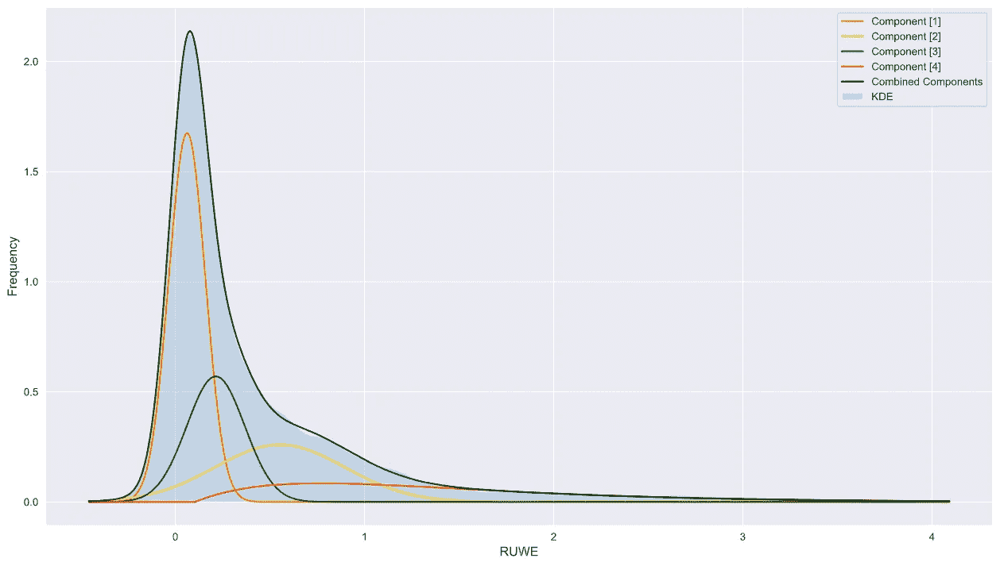

# 使用 Python 进行最小二乘优化拟合——基本指南

> 原文：<https://medium.com/analytics-vidhya/least-squares-optimised-fit-using-python-a-basic-guide-a30eef177a68?source=collection_archive---------9----------------------->

模型与数据

我们在对一些数据建模时，如何选择一个合理的起点？在统计推断的上下文中，这个问题占据了一个突出的维度，因为我们通常从一个相当简单的模型开始我们的分析，该模型以合理的准确度表示系统或过程。然后，该模型可用于执行嵌套采样操作或等效操作，以便我们获得后验…