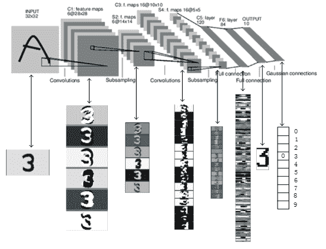
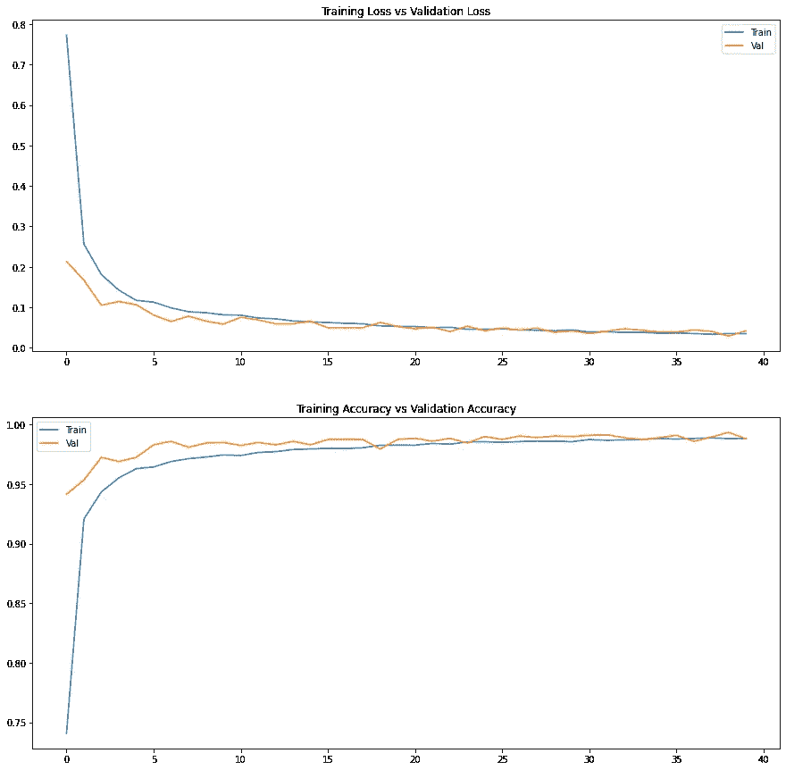

# 带张量流的 LeNet

> 原文：<https://medium.com/analytics-vidhya/lenet-with-tensorflow-a35da0d503df?source=collection_archive---------2----------------------->

LeNet 被认为是卷积神经网络的祖先，并且是计算机视觉社区中的一个众所周知的模型。



数字识别网络

## 介绍

LeNet 是最基本的深度学习模型之一，主要用于对手写数字进行分类。LeNet 由 Yann LeCun[1]于 1989 年提出，是最早采用卷积运算的神经网络之一。LeCun 等人将新开发的反向传播算法与卷积神经网络相结合，成为了使用深度学习进行图像分类的先驱。LeNet 这个名称通常与 LeNet-5 互换使用，LeNet-5 表示卷积掩码的内核大小。

本教程旨在让初学者在 MNIST 数据集上演示 LeNet 的基本 TensorFlow 实现。相关论文的参考资料分享在博客文章的末尾。为了更好地理解基本概念，您可以浏览这些视频:

反向传播:

卷积神经网络；

## 带张量流的 LeNet

Tensorflow 是最受欢迎的深度学习框架之一，它使机器学习爱好者能够与通用原型模型一起工作。虽然在没有检查某些设计选择的结果的情况下，通过 TensorFlow 的默认设置来建立模型不是一个好习惯，但 Keras(一个在 TensorFlow 后端执行的深度学习库)在正确使用时可以非常容易地测试灵活的模型。

无需进一步介绍，我们可以直接使用 TensorFlow 实现 LeNet。代码被写成一个 Jupyter 笔记本[5]由 Google Colab[6]托管。整个笔记本的链接在 References 部分之前共享。为了利用谷歌的免费 GPU 进行计算，请遵循:*运行时间>更改运行时间>硬件加速器:您的 Colab 笔记本中的 GPU* 。

首先，导入所需的库。TensorFlow 和 Matplotlib 分别用于设计网络和可视化结果。此外，Keras 提供了某些架构和训练模板以及通用数据集，使用起来非常方便。

```
**import** **tensorflow** **as** **tf**
**import** **matplotlib.pyplot** **as** **plt**
**from** **tensorflow.keras** **import** datasets, layers, models, losses
```

***数据***

在导入库之后，通过一行代码下载数据集。注意以如下的正确格式获取输出:

```
x_train,y_train),(x_test,y_test) = datasets.mnist.load_data()
x_train.shape(60000, 28, 28)
```

原始 LeNet 模型接收 32×32 的图像，因此 28×28 的 MNIST 图像用零填充，并且 8 位(0-255 范围)像素值在 0 和 1 之间缩放:

```
x_train = tf.pad(x_train, [[0, 0], [2,2], [2,2]])/255
x_test = tf.pad(x_test, [[0, 0], [2,2], [2,2]])/255
x_train.shapeTensorShape([60000, 32, 32])
```

然而，大多数 CNN 接受 4 维张量作为输入，具有批量大小、高度、宽度和通道的维度。因为 MNIST 图像是灰度的，所以最后一个维度不一定存在。我们需要展开张量，在 3 号轴上创建一个虚拟维度。(回想一下，张量最初有轴 0、1 和 2。)

```
x_train = tf.expand_dims(x_train, axis=3, name=**None**)
x_test = tf.expand_dims(x_test, axis=3, name=**None**)
x_train.shapeTensorShape([60000, 32, 32, 1])
```

训练集的最后 2000 个样本保留给验证集。验证集主要用于调整模型的超参数。测试集在最终评估之前从未使用过。

```
x_val = x_train[-2000:,:,:,:] 
y_val = y_train[-2000:] 
x_train = x_train[:-2000,:,:,:] 
y_train = y_train[:-2000]
```

***型号***

LeNet 的架构非常简单。有 3 个*卷积层*，每个卷积层具有 5 乘 5 的核，分别具有 6、16 和 120 个特征图。在这两者之间，有 2 个*子采样层*作为*平均池*。所有这 5 层都使用*步距* 1，平均池层使用 2 乘 2 *内核*作为默认设置。在卷积层之后，使用*双曲正切非线性激活*，而子采样层之后是 *sigmoid 非线性*。在最后一个卷积层之后，激活*变平*并馈入*具有 84 和 10 个神经元的全连接层*。最后一层的输出(在 *softmax* 操作之后)代表输入图像的类别概率(从 0 到 9)。

如今， *tanh* 和 *sigmoid* 激活由于饱和问题很少使用。反而 *ReLU* 和*漏 ReLU* 更受欢迎。此外，使用两个连续的 3×3 层代替单一的 5×5 层是更优选的，因为相同的感受野大小是通过相当少数量的可训练参数获得的。

```
model = models.Sequential()
model.add(layers.Conv2D(6, 5, activation='tanh', input_shape=x_train.shape[1:]))
model.add(layers.AveragePooling2D(2))
model.add(layers.Activation('sigmoid'))
model.add(layers.Conv2D(16, 5, activation='tanh'))
model.add(layers.AveragePooling2D(2))
model.add(layers.Activation('sigmoid'))
model.add(layers.Conv2D(120, 5, activation='tanh'))
model.add(layers.Flatten())
model.add(layers.Dense(84, activation='tanh'))
model.add(layers.Dense(10, activation='softmax'))
model.summary()Model: "sequential"
_________________________________________________________________
Layer (type)                 Output Shape              Param #   
=================================================================
conv2d (Conv2D)              (None, 28, 28, 6)         156       
_________________________________________________________________
average_pooling2d (AveragePo (None, 14, 14, 6)         0         
_________________________________________________________________
activation (Activation)      (None, 14, 14, 6)         0         
_________________________________________________________________
conv2d_1 (Conv2D)            (None, 10, 10, 16)        2416      
_________________________________________________________________
average_pooling2d_1 (Average (None, 5, 5, 16)          0         
_________________________________________________________________
activation_1 (Activation)    (None, 5, 5, 16)          0         
_________________________________________________________________
conv2d_2 (Conv2D)            (None, 1, 1, 120)         48120     
_________________________________________________________________
flatten (Flatten)            (None, 120)               0         
_________________________________________________________________
dense (Dense)                (None, 84)                10164     
_________________________________________________________________
dense_1 (Dense)              (None, 10)                850       
=================================================================
Total params: 61,706
Trainable params: 61,706
Non-trainable params: 0
```

模型被设置为由*Adam*optimizer【7】进行优化。*稀疏分类交叉熵*测量真实分类概率的自然对数的负值。例如，如果模型的最终输出是诸如[0.03，0.78，…，0.05]的向量，并且输入图像的真实类别是 1；这种情况下的损失将是-ln(0.78) = 0.248。*精度*度量是针对每个历元报告的。模型被训练 40 个*周期*，批量*为 64 *的*。history* 对象有一个名为 *history* 的属性，用于跟踪训练阶段。

```
model.compile(optimizer='adam', loss=losses.sparse_categorical_crossentropy, metrics=['accuracy'])
history = model.fit(x_train, y_train, batch_size=64, epochs=40, validation_data=(x_val, y_val)) Epoch 1/40 907/907 [==============================] - 11s 6ms/step - loss: 1.8860 - accuracy: 0.2950 - val_loss: 0.2266 - val_accuracy: 0.9450 
Epoch 2/40 907/907 [==============================] - 4s 5ms/step - loss: 0.3354 - accuracy: 0.8943 - val_loss: 0.1769 - val_accuracy: 0.9490
...
Epoch 40/40 907/907 [==============================] - 5s 5ms/step - loss: 0.0375 - accuracy: 0.9875 - val_loss: 0.0428 - val_accuracy: 0.9915
```

## 结果

训练集和验证集的损失和准确度存储在*历史*对象中，并使用 Matplotlib 库绘制。

```
fig, axs = plt.subplots(2, 1, figsize=(15,15))  axs[0].plot(history.history['loss']) axs[0].plot(history.history['val_loss']) axs[0].title.set_text('Training Loss vs Validation Loss') axs[0].legend(['Train', 'Val'])  axs[1].plot(history.history['accuracy']) axs[1].plot(history.history['val_accuracy']) axs[1].title.set_text('Training Accuracy vs Validation Accuracy') axs[1].legend(['Train', 'Val'])
```



训练集和验证集的损失和准确度

该模型的测试准确率为 98.51%，对于这个简单的任务来说，这是非常令人满意的，但略低于训练准确率。上图和测试精度表明，该模型能够学习数字绘图的模式，并具有足够的泛化能力，不会过拟合。

```
model.evaluate(x_test, y_test)313/313 [==============================] - 1s 2ms/step - loss: 0.0468 - accuracy: 0.9851
```

## lenet_tensorflow.ipynb

你可以在 Github 和 Google Colab 上不间断地查看整个笔记本。

## 结论

当代 CNN 的目标远远超出了像 MNIST 分类这样的简单任务，然而，在像 MNIST 这样的公共数据集上分析像 LeNet 这样的基本模型以获得更复杂模型的潜在思想是不可或缺的。尝试复制简单的模型并获得相似的结果是深入新任务的良好开端。此外，检查这些模型的缺点同样重要和有用。在这篇文章中，LeNet 架构是用 TensorFlow 解释和实现的。

希望你喜欢。以下 CNN 模特再见。

最美好的祝愿…

mrgrhn

后续帖子，请访问:

[](https://mrgrhn.medium.com/alexnet-with-tensorflow-46f366559ce8) [## 带 TensorFlow 的 AlexNet

### 上一篇文章，请访问:

mrgrhn.medium.com](https://mrgrhn.medium.com/alexnet-with-tensorflow-46f366559ce8) 

## 参考

1.  纽约州勒村；博瑟湾；登克，J. S。亨德森博士；霍华德；哈伯德，w。杰克尔法学博士(1989 年 12 月)。“应用于手写邮政编码识别的反向传播”。*神经计算*。1(4): 541–551.
2.  Yann le Cun(1989 年 6 月)。“一般化和网络设计策略”。技术报告 CRG-TR-89–4。多伦多大学计算机科学系。
3.  纽约州勒村；博瑟湾；登克，J. S。亨德森博士；霍华德；哈伯德，w。张天龙法学博士(1990 年 6 月)。“用反向传播网络进行手写数字识别”。神经信息处理系统进展 2:396–404。
4.  纽约州勒村；博图湖；纽约州本吉奥；哈夫纳，P. (1998 年)。“基于梯度的学习应用于文档识别”。IEEE 会议录。86 (11): 2278–2324.
5.  [https://jupyter-notebook . readthedocs . io/en/stable/notebook . html](https://jupyter-notebook.readthedocs.io/en/stable/notebook.html)
6.  【https://colab.research.google.com/notebooks/intro.ipynb 
7.  金玛，迪德里克&巴，吉米。(2014).“亚当:随机优化的方法”。学习表征国际会议。