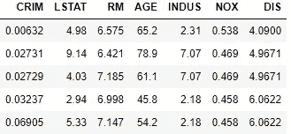
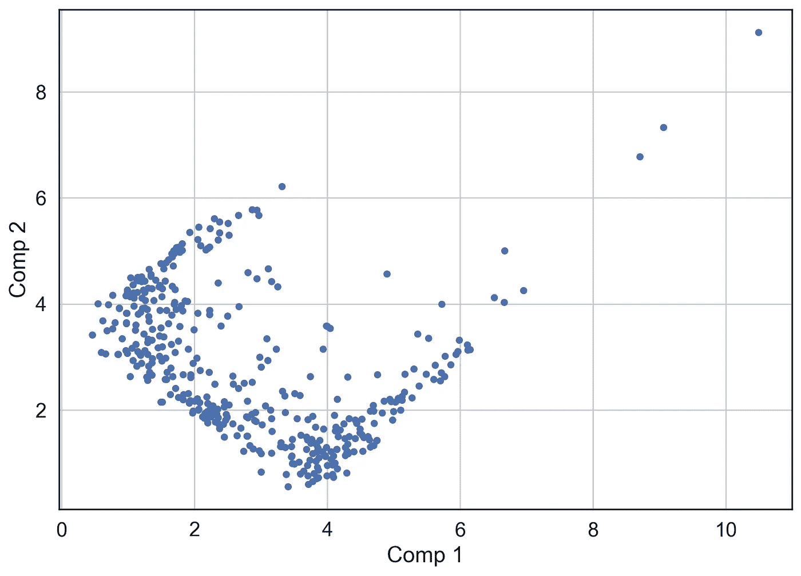
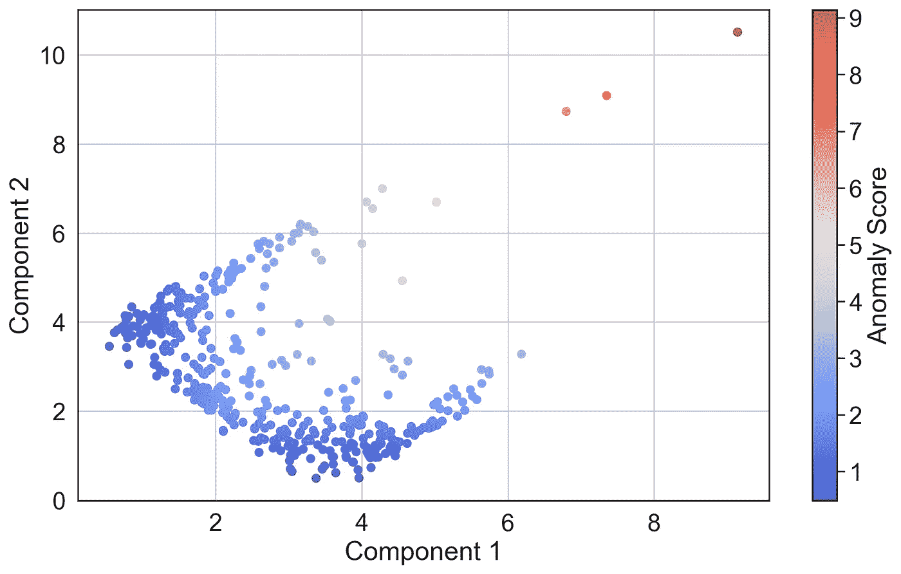

# k-均值聚类的鲜为人知的应用——降维、异常检测和数据表示

> 原文：<https://medium.com/analytics-vidhya/less-known-applications-of-k-means-clustering-dimensionality-reduction-anomaly-detection-and-908f4bee155f?source=collection_archive---------2----------------------->

k-Means 是一种广泛用于聚类的数据划分技术。它有一些变种(比如小批量 k-Means ),对于大量数据来说速度非常快。它的聚类结果也很容易解释。然而，k-Means 还有很多应用没有被提及。它们是:

1.  **非线性降维** —可用于仅使用几个“转换”特征来表示数千个特征，这些特征可用作 ML 管道中的工程特征或用于数据可视化。
2.  **多元异常值/异常检测**
3.  **数据表示(用于其他算法的输入)**—通常，k-means 只能检测球形簇。然而，可以将 k-means 的输出提供给分层聚类算法，以检测复杂形状的非凸聚类。

我们将通过示例和 Python 代码详细讨论上述应用。我们将使用 ***scikit-learn。*** 让我们先加载数据。

```
import numpy as np
import pandas as pd
import matplotlib.pyplot as plt
import seaborn as sns
from sklearn import linear_model, preprocessing, model_selection, pipeline, ensemble, tree, datasets, cluster
sns.set(style = 'white', font_scale = 1.4)######## Load the Data
data  =  pd.DataFrame(datasets.load_boston().data, columns = datasets.load_boston().feature_names)
y = datasets.load_boston().targetfeatures = ['CRIM', 'LSTAT', 'RM', 'AGE', 'INDUS', 'NOX', 'DIS']
data = data[features]
data.head()
```

# 基于 K-均值的非线性降维

这个想法是使用 k-Means 来计算聚类中心，将聚类的数量设置为我们在转换后的数据中需要的维数。在我们的例子中，由于我们想将数据减少到 2 维，我们将聚类数设置为 2。**变换空间中的新特征是每个点到每个聚类中心的距离。**

下面是我们如何使用 K-Means 进行非线性维数计算:

1.  将 k-Means 拟合到数据。将分类数设置为我们想要将数据转换到的维数，在本例中为 2。
2.  计算每个数据点到每个聚类中心的距离。这样，我们为每个数据点获得 2 个特征，即-(点与聚类 1 的距离，点与聚类 2 的距离)。如果我们有 **k** 个聚类中心，我们将获得每个数据点的 **k** 个特征。这些代表了我们转变后的特征。幸运的是，拟合 K-means 对象的 ***transform()*** 方法为我们做到了这一点。

让我们考虑波士顿住房数据集中的 7 个特征。我们将尝试使用 K-Means 将它们减少到 2 维以便可视化。

数据如下所示:



波士顿住房数据的 7 个特征

我们将使用 Scikit-Learn 管道来执行缩放和拟合 k 均值。

```
#### Scale and Fit KMeans to data as part of the pipeline ####
kmeans = pipeline.make_pipeline(preprocessing.StandardScaler(), cluster.KMeans(n_clusters = 2)).fit(X_train)# Store transformed dimensions
lower_dim = pd.DataFrame(kmeans.transform(X_train), columns = ['Comp 1', 'Comp 2'])lower_dim.plot.scatter( x='Comp 1',y= 'Comp 2', grid = True, figsize = (10, 7))
```



2 个降维——使用波士顿住房数据的 K 均值

在上图中，组件 1 测量每个点到聚类中心#1 的距离。组件 2 测量每个点到聚类中心#2 的距离。正如我们所见，右上角有一些孤立的点。正如我们将在后面讨论的，像这样的点可能被认为是异常值。

以下是使用变换要素的一些方法:

1.  **数据可视化:**对于具有数百个特征的数据，这允许我们在 2D 屏幕上对数据进行可视化和编码。可以根据各种感兴趣的量对数据进行颜色编码。
2.  **对于预测建模:**这里，我们使用转换后的特征作为模型的输入。这对于线性模型特别有用，因为 K-Means 创建的要素是非线性变换，有助于说明数据中的非线性关系。
3.  **异常检测:**一个点离聚类中心的距离越大，它成为异常的几率就越大。

让我们看看如何使用它进行预测建模。我们使用 sklearn 管道。让我们首先对原始数据使用线性回归，而不执行转换:

```
### Train Test Split
X_train, X_test, y_train, y_test = model_selection.train_test_split(data, y, test_size = .2, random_state = 10)### Fit a Linear Model
model = linear_model.LinearRegression()score = model_selection.cross_val_score(model, X_train, y_train, cv = 10, scoring = 'r2')
print(f'Average r2: {np.mean(score)}')Average r2: 0.6534847470004668
```

现在让我们使用 K-Means 执行变换，并在变换后的特征上训练线性模型。我们使用 sklearn 管道和转换数据来实现 5 个功能:

```
km = pipeline.make_pipeline(preprocessing.StandardScaler(), cluster.KMeans(n_clusters = 5),
                           linear_model.LinearRegression())score = model_selection.cross_val_score(km, X_train, y_train, cv = 10, scoring = 'r2')
print(f'Average r2: {np.mean(score)}')Average r2: 0.6751640572278654
```

在这种情况下，模型性能通过使用 5 个变换的特征得到了提高。然而，**在一般情况下，必须通过交叉验证找到或根据领域/业务专业知识决定转换特征的数量。**

# **使用 K 均值的异常检测**

由 k-Means 识别的聚类中心可以被认为是数据的“代表”。聚类中心和聚类内方差汇总数据。**使用 k-Means 的异常检测基于离所有聚类中心非常远的点更加异常的想法。**这是有意义的，因为远离聚类中心的点平均来说远离整个数据。**这是一种异常检测的多变量方法**，不同于 tukey 的方法或 z-score 方法，它们是单变量方法。

下面是我们计算异常分数的方法:

1.  使用 k-Means 计算聚类中心。
2.  使用**聚类的变换方法计算每个点到每个聚类中心的距离。KMeans()** 对象。
3.  对每个点取这些距离的最小值，即我们计算每个点到其最近的聚类中心的距离。这个距离就是点的异常得分。**异常值越大，表示该点越异常。**也可以将每个聚类的每个点的平均距离视为异常得分。

```
## Fit KMeans after standardizing data
km = pipeline.make_pipeline(preprocessing.StandardScaler(), cluster.KMeans(n_clusters = 5)).fit(X_train)### Calculate distance of each point from each cluster center
transformed = pd.DataFrame(km.transform(X_train))# Calculate the Anomaly score - as the minimum distance of a point to any cluster center
anomaly_score = lower_dim.min(axis = 1)plt.figure( figsize = (12, 7))
plt.scatter(x=lower_dim['Comp 1'],y= lower_dim['Comp 2'], c = anomaly_score, cmap = 'coolwarm')
plt.colorbar(label = 'Anomaly Score')
plt.xlabel('Component 1')
plt.ylabel('Component 2')
plt.grid()
```



正如我们所见，红点是最不规则的——这种方法可以正确识别。

上面的红点被检测为异常，因为它们具有更高的异常分数。与许多其他方法一样，这种方法将数据转换到新的空间，并使用这种表示将点标记为异常。**关于这类异常检测方法的更多分析，请查看我的文章:** [**https://medium . com/analytics-vid hya/anomaly-detection-in-python-part-1-basics-code-and-standard-algorithms-37d 022 CDB CFF**](/analytics-vidhya/anomaly-detection-in-python-part-1-basics-code-and-standard-algorithms-37d022cdbcff)

使用 k-Means 执行异常检测的另一种方法是选择大量的聚类——足够大以至于一些聚类只有很少的数据点。数据点非常少的聚类可能被怀疑是异常的，必须进一步分析。

# 其他算法的输入

K-means 可用于通过聚类中心表示数据来构建数据的“汇总”版本。聚类中心又可以用作其他算法的输入。以下是 k-means 聚类中心如何用作其他算法的输入的一些示例:

1.K-Means 检测“球形”聚类。然而，有时我们需要检测非凸形状的聚类，这是不可能通过 k-means 单独正确检测的。在这种情况下，我们通常使用单链层次聚类或其他能够检测此类聚类的方法。然而，像分层聚类这样的方法需要很长时间才能完成——这使得它们对于大量数据来说不切实际。在这些情况下，可以使用第一个**使用 k-means 来使用大量聚类对数据进行聚类，并使用聚类中心作为分层聚类算法(或任何其他可以检测非凸形聚类的聚类算法)的输入。**这显著减少了聚类数据所需的时间，并且还能够检测非凸聚类。

2.K-Means 聚类中心可以用作 GMM(高斯混合模型)的初始化。GMM 可用于聚类，并可用于构建数据的生成模型。

# 摘要

综上所述，k 均值可以用于多种用途。我们可以使用它来执行维数缩减，其中每个变换的特征是该点与聚类中心的距离**。**在使用它执行异常检测时，我们测量每个点到其最近的聚类中心的距离。如果这个距离足够大，我们就称之为异常。**最后，我们看到了如何将聚类中心用作分层聚类和 GMM 等算法的输入。在描述性分析和半监督学习的领域中，k-means 有更多的用途。**

希望你喜欢我的文章——如果你有任何反馈，请随时告诉我，并查看我写的关于 DS 和 ML 的其他文章[这里](https://nitishkthakur.medium.com/)