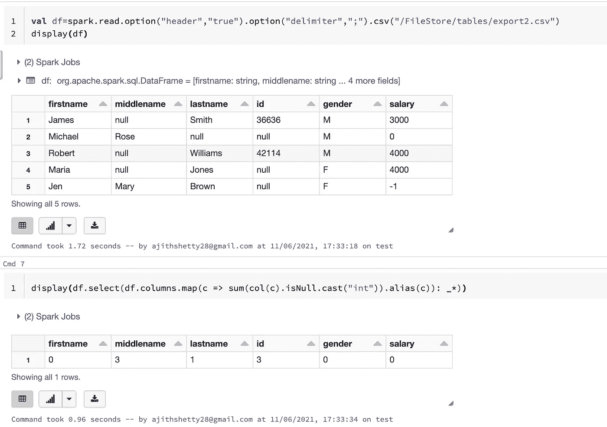

# 鲜为人知的事实/火花的捷径(第一部分)

> 原文：<https://medium.com/analytics-vidhya/lesser-known-facts-short-cuts-in-spark-part1-77596e367676?source=collection_archive---------0----------------------->


马克·弗莱彻·布朗在 [Unsplash](https://unsplash.com?utm_source=medium&utm_medium=referral) 上的照片

作为一名数据工程师，我们每天都面临挑战，需要解决一些不常见的案例。

我们不能把同样的思维过程应用到所有的地方。我们需要考虑需要付出的努力以及如何减少时间。

但与此同时，我们应该在下结论之前了解内部情况。

在这篇博客中，我将讨论 Spark 中的一些技巧和窍门以及一些鲜为人知的事实，这些对我们大多数数据工程师来说都很有用。

# 1.count()总是触发对每一行的求值？

我们知道。缓存或持久化是一种转换。除非我们对缓存的数据帧调用任何操作，否则它不会被具体化。

我跑了又怎么样。指望数据帧？它应该缓存/物化数据，对吗？

不尽然，与 rdd 相比，数据帧和数据集上的计数是不同的。

在 RDD，我们没有 rdd 上的 catalyst optimiser，因此它将始终评估一切。

但是另一方面，通过使用 catalyst，DataFrame/Dataset 变得更加智能，它变成了 SQL 中的“select count(*) from …”的等价物，这可以在不扫描某些数据格式的数据的情况下完成(例如，Parquet)。

但是请注意，另一方面，缓存数据帧/数据集确实需要缓存所有内容。

需要了解更多？

[https://databricks . com/blog/2017/02/16/processing-万亿行每秒-单机-can-nested-loop-joins-fast . html](https://databricks.com/blog/2017/02/16/processing-trillion-rows-per-second-single-machine-can-nested-loop-joins-fast.html)

# 2.在数据框中查找空列的快捷方式？

在包含 100 列的数据帧的情况下，我们需要获得每一列中的空记录的计数，我们可以应用。对每一列使用空函数，或者只使用一个简单的命令，如:

**df . select(df . columns . map(c =>sum(col(c). is null . cast(" int "))。别名(c)): _*)。show()**



# 3.什么是 metastore 超时？我为什么要在乎？

***无法获取到 jdbc 的连接:MySQL://<>/central _ metastore？use SSL = true&requires sl = false。休眠 7000 毫秒。剩余尝试次数:2 次***

举一个例子，我们使用 spark 将数据输入 ADLSGen2/S3，使用 API 或 HTTPS 调用，例如使用 sprimgml 库调用 SFDC。

[https://github.com/springml/spark-salesforce](https://github.com/springml/spark-salesforce)

Springml spark-salesforce 库将帮助您连接到 SFDC 并获取数据。

这使得 HTTPS 民调不同于其他 JDBC 民调。

吞吐量根据我们在每个 https 调用中尝试访问的列数而变化。

当我们试图访问一个拥有数百万条记录的巨大对象时，Spark 将花费大量时间查询 SFDC。

当 spark 完成 GET 请求时，hive metastores 超时。

无法获取到 jdbc 的连接:mysql:// <> /central_metastore？useSSL=true&requireSSL=false。休眠 7000 毫秒。剩余尝试次数:2

在这种情况下，我们需要调整以下参数。

```
**spark.hadoop.hive.server2.session.check.interval(default 60000ms)****spark.hadoop.hive.server2.idle.operation.timeout(default 7200000ms)****spark.hadoop.hive.server2.idle.session.timeout(default 900000ms)*****spark.hadoop.hive.server2.idle.operation.interval***
```

会话/操作超时的检查间隔，以毫秒为单位，可通过设置为零或负值来禁用。
例如，值“60000”表示 1 分钟，表示每 1 分钟检查一次会话。

**T4 b . spark . Hadoop . hive . server 2 . idle . operation . time out**

在这段时间内未被访问时，操作将被关闭，单位为毫秒。通过设置为零来禁用。

对于正值，仅检查终端状态下的操作(已完成、已取消、已关闭、出错)。对于负值，检查所有操作，而不管状态如何。
例如，值“7200000ms”表示如果查询/操作仍在运行，将在 2 小时后超时。

***c . spark . Hadoop . hive . server 2 . idle . session . time out***

如果会话在给定的持续时间(毫秒)内未被访问，会话将被关闭。

我们可以禁用设置为零或负值。
值“900000”表示会话将在 15 分钟不活动后超时。

# **4。我该用什么，Savemode。覆盖还是模式(“覆盖”)？？**

当我们在 SparkSQL 上工作时，一些开发人员使用“overwrite”模式，一些使用“Savemode.overwrite”模式。

两者有区别吗？

不，“覆盖”是 Savemode.overwrite 的简写命令

看看下面的源代码。

```
**/**
 * Specifies the behavior when data or table already exists. Options include:
 * — `overwrite`: overwrite the existing data.
 * — `append`: append the data.
 * — `ignore`: ignore the operation (i.e. no-op).
 * — `error` or `errorifexists`: default option, throw an exception at runtime.
 *
 * @since 1.4.0
 */****def mode(saveMode: String): DataFrameWriter[T] = {
 this.*mode* = saveMode.toLowerCase(Locale.*ROOT*) match {
 case “overwrite” => SaveMode.*Overwrite* case “append” => SaveMode.*Append* case “ignore” => SaveMode.*Ignore* case “error” | “errorifexists” | “default” => SaveMode.*ErrorIfExists* case _ => throw new IllegalArgumentException(s”Unknown save mode: $saveMode. ” +
 “Accepted save modes are ‘overwrite’, ‘append’, ‘ignore’, ‘error’, ‘errorifexists’.”)
 }
 this
}**
```

# 5.火花不同 VS 丢弃重复

distinct 和 DropDuplicates 之间的主要区别仅在于列的子集。

在 Distinct 函数中，我们需要在调用函数之前传递 select 子句中的列。

其中，`dropDuplicates(colNames)`将在删除给定列的重复项后返回数据帧中的所有列。

从 [javadoc](https://spark.apache.org/docs/1.5.1/api/java/org/apache/spark/sql/DataFrame.html#dropDuplicates()) 来看，distinc()和 dropDuplicates()没有区别。

```
**dropDuplicates****public DataFrame dropDuplicates()****Returns a new DataFrame that contains only the unique rows from this DataFrame. This is an alias for distinct.**
```

dropDuplicates()是在 1.4 中作为 distinct()的替代而引入的，因为您可以使用它的重载方法来获得基于列子集的唯一行。

未完待续..

第 2 部分已经在这里发表了。

[](https://link.medium.com/lExxlOuM9hb) [## 鲜为人知的事实/火花的捷径(第二部分)

### 这是鲜为人知的事实/火花捷径的第二部分，我将在这里谈论一些未知的和…

link.medium.com](https://link.medium.com/lExxlOuM9hb) 

你可以在评论中发表你的反馈。

阿吉特·库玛尔·谢蒂

大数据工程师—热爱大数据、分析、云和基础设施。

[订阅](https://ajithshetty28.medium.com/subscribe) ✉️ || [更多博客](https://ajithshetty28.medium.com/)📝|| [链接于](https://www.linkedin.com/in/ajshetty28)📊|| [个人资料页面](https://ajithshetty.github.io/)📚|| [Git 回购](https://github.com/ajithshetty/)👓

**订阅我的:** [**每周简讯刚好够数据**](https://justenoughdata.substack.com/)