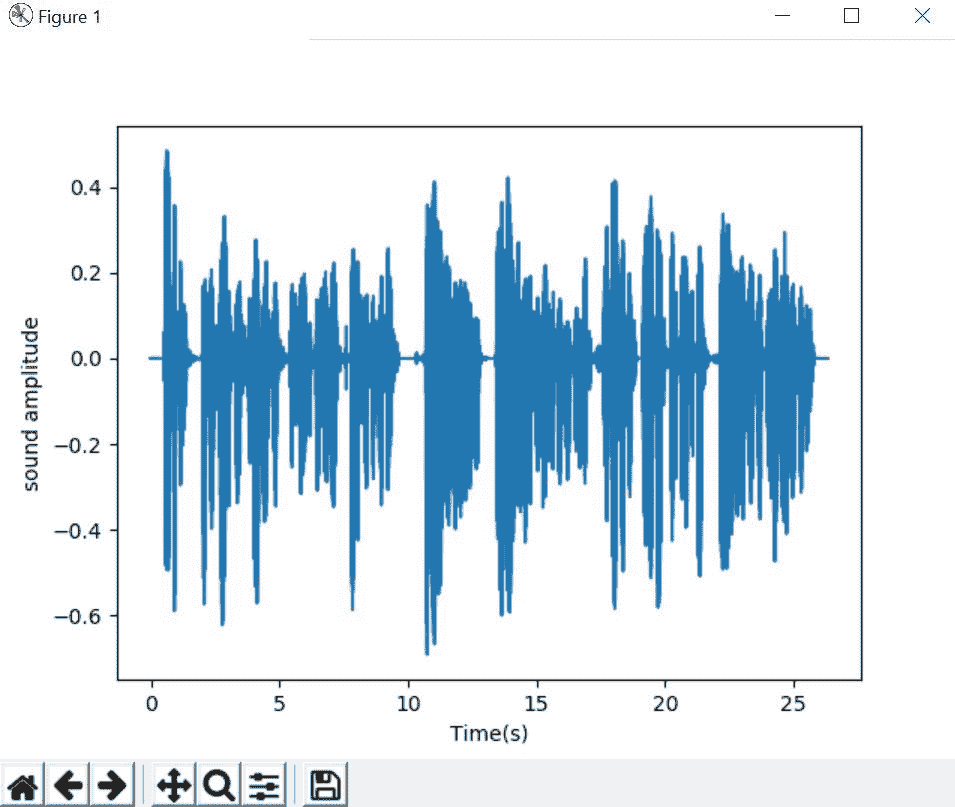
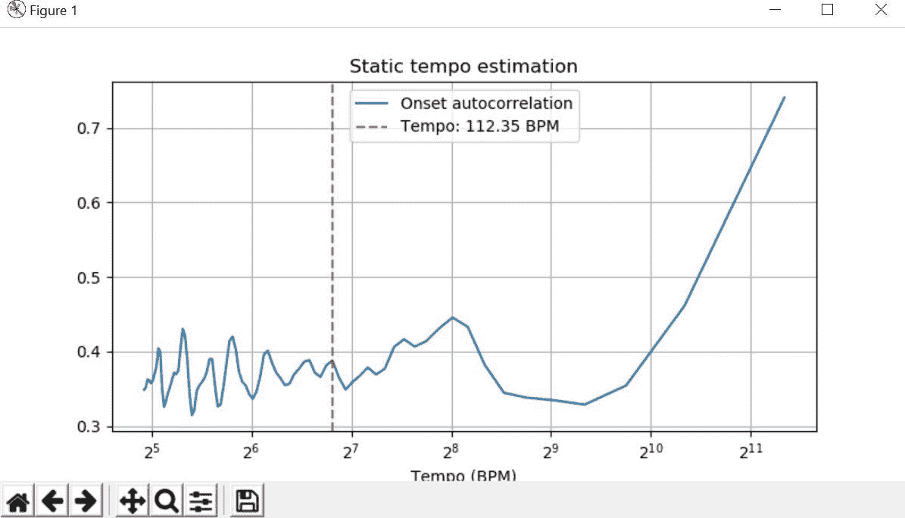
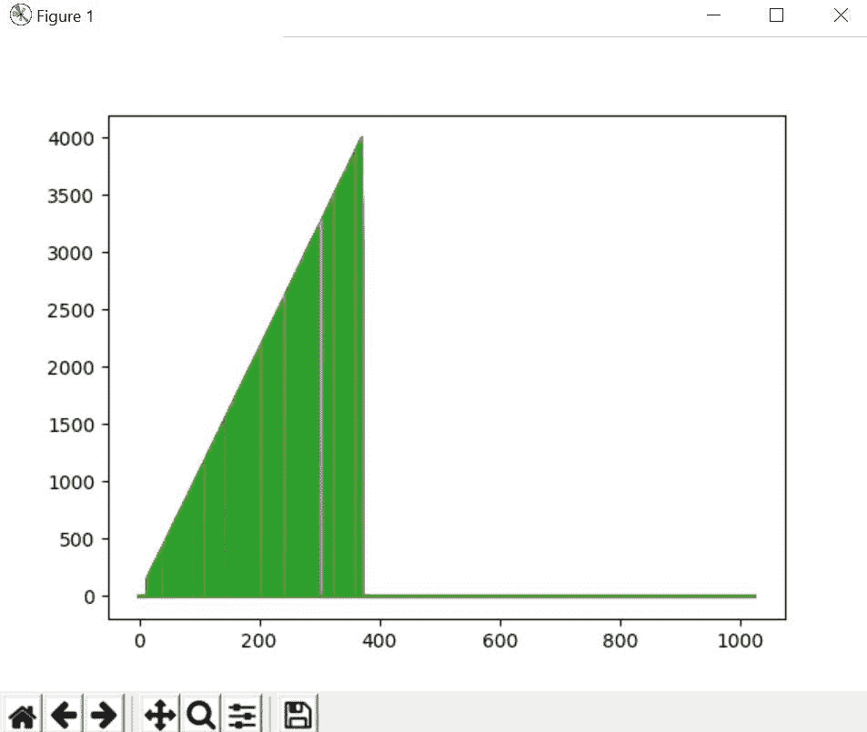

# 让我们增加一个音频数据🔊第一部分

> 原文：<https://medium.com/analytics-vidhya/lets-augment-a-audio-data-part-1-5ab5f6a87bae?source=collection_archive---------11----------------------->

自动语音识别的最大挑战之一是音频数据的准备和扩充。音频数据分析可以在时域或频域中进行，与图像和文本等其他数据源相比，这增加了额外的复杂性。


**什么是增强？**

深度神经网络在许多人工智能领域实现了最先进的性能，如图像分类、对象检测和音频分类。然而，他们通常需要非常大量的标记数据来获得良好的结果，并且这些数据可能由于高标记成本或由于样品的稀缺而不可用。数据扩充是改善神经网络性能的有力工具。它包括修改原始样本以创建新的样本，而不改变它们的标签。这将导致更大的训练集，从而获得更好的结果。

> (清理和标记的数据("更好的数据" == "更好的结果"))！=(未清理和未标记("垃圾入" == "垃圾出"))

在互联网上，有大量关于图像和文本增强技术的故事、教程和代码。此外，我们有一个更强大的库来做图像增强，如白蛋白，图像等..与图像增强技术不同，没有足够的关于音频数据增强技术的信息。

让我们深入探讨音频信号处理和增强**池🔊**

在开始之前，我们将把博客分成两部分，第一部分我们将讨论 libROSA 的基础知识和处理音频数据，第二部分我们将讨论音频增强。

> **第一节**

# 使用音频的 libROSA 简介:

1.  正在加载音频文件
2.  音频时间轴
3.  音频绘图
4.  节奏估计
5.  寻找音调水平
6.  计算梅尔标度谱图

**先决条件:**

*   **NumPy** ( [指令](https://docs.scipy.org/doc/numpy-1.13.0/user/install.html))
*   **音频信号处理** ( [指令](https://www.cs.tut.fi/sgn/arg/intro/basics.html))
*   **Matplotlib** ( [指令](https://matplotlib.org/users/installing.html))
*   **天秤座** ( [指令](https://librosa.github.io/librosa/install.html))

要安装 libROSA，您只需在命令行中运行以下命令:

```
pip install libROSA 
```

在 Python 代码中，可以将其导入为:

```
import librosa as lr
```

我们将使用 **Matplotlib** 库来绘制结果，使用 **Numpy** 库来处理数组形式的数据。

# 正在加载您的音频文件:

我们分析的第一步是在代码中加载一个音频库。这是使用 **librosa.core.load()** 函数完成的。音频将自动以给定的速率重新采样(默认值= 22050)。要保持文件的原生采样速率，请使用 sr=None。

**librosa.core.load()**

*   **path:** 是音频文件的路径，是一个字符串参数
*   **sr:** 是采样率
*   **mono:** 是将其转换为 mono 文件的选项(对/错)。
*   **offset:** 是一个浮点数，表示读取文件的开始时间 duration 是一个浮点数，表示要加载多少文件。
*   **dtype:** 是数据的数值表示，可以是 float32、float16、int8 等。
*   **res_type:** 是重采样的类型(一个选项是 kaiser_best)

## 音频的时间线

在这段代码中，我们将打印音频文件的时间轴。我们将简单地加载音频，将其转换为 numpy 数组，并打印一个样本的输出(通过除以采样率)。

音频时间轴

输出:

```
[0.00000000e+00 4.53514739e-05 9.07029478e-05 ... 2.63027211e+01
 2.63027664e+01 2.63028118e+01]
```

# 绘制音频:

**将音频绘制为时间 v/s 声音幅度**

输出:



# 绘制和寻找估计速度

Tempo 最初用于描述音乐的定时，或者一段音乐播放的速度，或者可以定义为每秒钟的节拍数。

它将以数组的形式返回速度

*   **y:** 音频时间序列
*   **sr:** 时间序列的采样率
*   **发作 _ 包络:**预先计算的发作强度包络
*   **跳数长度:**时间序列的跳数长度
*   **start _ BPM:**BPM 的初始猜测
*   **std_bpm:** 节奏分布的标准差
*   **ac_size:** 自相关窗口的长度(秒)
*   **最大速度:**估计低于此阈值的速度
*   **聚合:**用于估计全局节奏。如果没有，则为每一帧独立估计速度。

```
[112.34714674]
```



# 寻找并绘制音高

频率的感觉通常被称为声音的音高。高音对应于高频声波，低音对应于低频声波。

*   **y:** 音频信号
*   **sr:** 音频采样率为 y
*   **S:** 震级或功率谱图
*   **n_fft:** 如果提供了 y，要使用的 fft 仓的数量。
*   **hop_length:** 要跳跃的样本数
*   **阈值:**当频谱 S 中的频段大于阈值* ref(S)时，该频段被认为是音调
*   **fmin:** 下限频率截止。
*   **fmax:** 上截止频率。
*   **win_length:** 音频的每一帧都通过 window()加窗。
*   **ref:** 标量或可调用的音调

它返回:

*   **音高:** np.ndarray [shape=(d，t)]
*   **幅度:** np.ndarray [shape=(d，t)]
    其中 d 是 fmin 和 fmax 内 FFT 仓的子集。

1.  pitches[f，t]包含 bin f 处的瞬时频率，时间 t。
2.  量值[f，t]包含相应的量值。
3.  音调和幅度在非最大幅度的仓处取值 0

输出:

```
[[0\. 0\. 0\. ... 0\. 0\. 0.]
 [0\. 0\. 0\. ... 0\. 0\. 0.]
 [0\. 0\. 0\. ... 0\. 0\. 0.]
 ...
 [0\. 0\. 0\. ... 0\. 0\. 0.]
 [0\. 0\. 0\. ... 0\. 0\. 0.]
 [0\. 0\. 0\. ... 0\. 0\. 0.]]
///
[[0\. 0\. 0\. ... 0\. 0\. 0.]
 [0\. 0\. 0\. ... 0\. 0\. 0.]
 [0\. 0\. 0\. ... 0\. 0\. 0.]
 ...
 [0\. 0\. 0\. ... 0\. 0\. 0.]
 [0\. 0\. 0\. ... 0\. 0\. 0.]
 [0\. 0\. 0\. ... 0\. 0\. 0.]]
```



# 计算梅尔标度频谱图

MelSpectrogram 类型的对象表示声音的声学时间-频率表示

*   **y:** 音频时间序列
*   **Sr:**y 的采样率
*   **S:** 光谱图
*   **n _ FFT:**FFT 窗口的长度
*   **hop_length:** 连续帧之间的样本数。参见 librosa.core.stft
*   **win_length:** 音频的每一帧都通过 window()加窗。
*   **幂:**梅尔谱图震级的指数。例如 1 表示能量，2 表示功率，等等。
*   **kwargs:** 附加关键字参数
    Mel 滤波器组参数。详见 librosa.filters.mel。

它返回:

1.  S:np.ndarray [shape=(n_mels，t)]
    Mel 谱图

> **第二节**

# 基本音频数据增强

现在，我们编写了三种方法来对给定的音频文件应用新的效果。这些方法是“添加噪声”、“移位”和“拉伸”。在“添加噪声”方法中，我们将由 NumPy 库生成的随机噪声添加到给定的音频中。在“移位”方法中，我们通过再次使用 NumPy 库来移位给定的音频数据。最后，“拉伸”方法应用属于 librosa 效果的 time_stretch。使用以下功能进行基本的音频增强。

在下一部分，我将解释关于[音频库](https://github.com/iver56/audiomentations)做广泛的音频数据增强。

[](https://www.linkedin.com/in/vijay-anadan/) [## 维贾伊·阿南丹-助理工程师 1 -认知| LinkedIn

### 好奇心驱动的数据科学家，渴望利用机器学习和数据分析来提取有意义的…

www.linkedin.com](https://www.linkedin.com/in/vijay-anadan/)