# 让我们破解加密

> 原文：<https://medium.com/analytics-vidhya/lets-break-the-encryption-6c385ded0a4b?source=collection_archive---------3----------------------->

## Shor 的算法通过快速概述得以展示/简化/阐明。

一旦你读了这篇文章，你就会对 Shor 算法的工作原理有一个清晰的了解。我试图解释它，但没有深入到更深的部分，因为它肯定会在初学者阶段混淆。

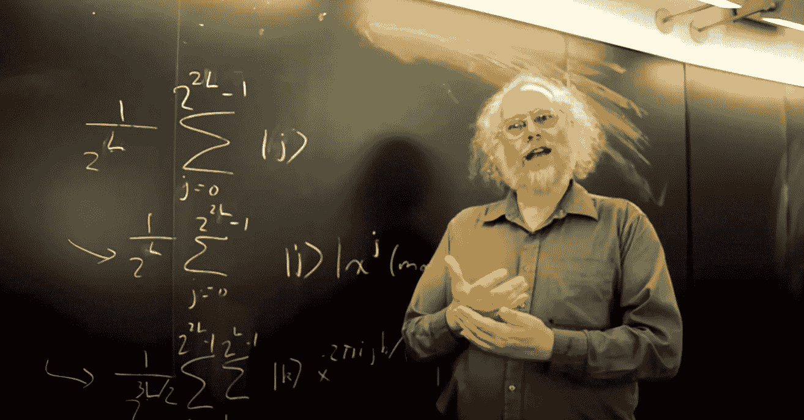

Peter Williston Shor 教授

SA 破解不仅仅是 Shor 算法的应用，还有几个用例，如量子模拟、衍生技术、量子密码等。

## 介绍

肖尔算法是由[彼得·肖尔](https://en.wikipedia.org/wiki/Peter_Shor)(美国数学家)在 1994 年提出的。它在多项式时间内执行整数因式分解。算法的要求是量子计算机。算法说量子计算机能够在多项式时间内对一个非常大的数进行因式分解。有许多算法是针对整数乘法的，但是没有一个算法是针对整数分解的。让我们来深入了解一下这个有用的东西。

> 根据 Quantitative Church 的论文，任何物理计算设备都可以通过图灵机在计算设备所使用的资源中进行多步多项式模拟。

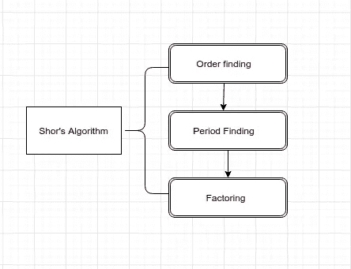

Shor 算法内容

## 鹰眼视图

该算法由以下两部分组成:

1.  将因式分解问题转化为求函数周期的问题
2.  用量子傅立叶变换求周期。

**在经典计算机上运行时间为 O[exp (L1/3(log L)2/3)]，在量子计算机上运行时间为 O(L3)。**

该算法既需要经典计算，也需要量子计算。第一部分以经典方式执行，第二部分利用量子功率并负责量子加速。Shor 算法本质上是概率性的，它处理高概率的结果，而失败的结果可以通过循环算法来减少，直到我们得到期望的输出。

## 显著术语

1.  **质数**:只能被自己整除的数，如 3、7、11 等。
2.  **多项式时间:**如果对于给定的输入，完成算法所需的步骤数为 *O* ( *n^k* )，其中 n 为求解算法的步骤数，k 为常数，即非负数，则称该算法可在多项式时间内求解。与指数时间算法相比，多项式时间算法要快得多。可以用多项式时间算法解决的问题称为*易处理的*问题。
3.  **欧几里德算法**:[欧几里德](https://www.britannica.com/science/Euclidean-geometry#:~:text=Euclidean%20geometry%2C%20the%20study%20of,commonly%20taught%20in%20secondary%20schools.)算法用于求两个数的最大公约数。其中 a 和 b 是两个数，GCD (a，b) = GCD(b，a%b)，如果 a=0 则 GCD(a，b)=b，如果 b=0 则 GCD(a，b) = b，该算法在多项式时间内找到最大公约数。
4.  **量子傅立叶变换:**量子傅立叶变换是酉变换。在量子傅立叶变换中,( DFT) [离散傅立叶变换](https://en.wikipedia.org/wiki/Discrete_Fourier_transform#:~:text=In%20mathematics%2C%20the%20discrete%20Fourier,complex%2Dvalued%20function%20of%20frequency.)应用于量子态的振幅。离散傅立叶变换可以定义为:

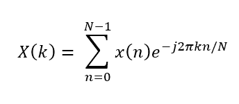

草图（draft 的简写）

傅立叶变换主要用于将信号或函数映射到以正弦和余弦为特征的替代表示中。这只是一个用来改变表现形式的花哨术语。离散傅里叶变换有多种应用，它用于将信号数字化，例如在傅里叶分析中，我们描述函数的内部频率。然而，量子傅立叶变换比 DFT 及其更快版本的 FFT 快得多。量子傅里叶变换电路由[哈达玛门](https://en.wikipedia.org/wiki/Quantum_logic_gate#:~:text=The%20Hadamard%20gate%20(French%3A%20%5B,axis%20at%20the%20Bloch%20sphere.)和条件相移门组成。量子傅立叶变换可以定义如下图所示，其中 x 是基态。

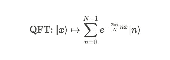

量子傅立叶变换

量子傅立叶变换是哈达玛门对哈达玛变换的推广。

6.**周期寻找**:周期寻找是肖尔算法的基本构建模块，类似于[西蒙斯算法](https://qiskit.org/textbook/ch-algorithms/simon.html)。如果有效地找到一个函数的周期，我们就能快速地分解整数。首先，将状态初始化为 state∣0⟩，并应用哈达玛门将它们叠加，另一种方法是使用量子傅立叶变换。找到周期很大程度上取决于量子计算机实现叠加的能力。量子傅立叶变换帮助我们找到最优结果，并返回它们的概率。使用经典方法也可以找到周期，但是使用[量子计算机](https://www.ibm.com/quantum-computing/what-is-quantum-computing/)可以以更好的方式完成。

您可能会听到类似“分解简化为[订单查找](https://qudev.phys.ethz.ch/static/content/courses/QSIT11/presentations/QSIT-ShorTheory.pdf)”(可以经典地完成)的话，这意味着如果有一种算法可以有效地解决订单查找，我们也可以通过从分解到订单查找的多项式时间简化来有效地解决分解问题。订单查找类似于周期查找。

## 算法

Shor 算法由以下步骤组成:

1.  选择一个随机正整数 m .使用欧几里德方法 *(m，N)* 计算最大公约数 GCD 其中 *N* 是自然数的集合 *N={1，2，3，4，5……)。}* 。如果最大公约数 *gcd(m，N)！= 1* ，那么得到的值就是 *N* 的非平凡因子。但是如果 *gcd(m，N) = 1* ，那么我们需要确定周期。
2.  这一步包括找到函数*f*(*x*)=*a^x*模 *N* 的周期 r。使得 *f(x)=* *f(x+r)* ，我们需要找到 r 的最小值(这一步只能在量子计算机上使用)
3.  如果 r 是奇数，那么我们需要从头开始，否则我们将进行下一步。
4.  如果 *m^r/2 + 1 = 0 mod N* ，那么我们再次需要转到步骤 1。否则我们需要使用欧几里德算法计算 *(m^r/2- 1，N)* 的最大公约数，最后我们得到 n 的非平凡因子

## 计算 GCD

假设我们想将因子*设为 91，即 N=91* 。并且我们知道 64 的*平方= 4096 即 45*91+1* ，所以 *x=64* 是 x = 1 的*平方的一个解(mod 91)* 。

上面的解释意味着 45 * 91 = 64 的平方–1 = 63 * 65

## 经典计算概述

1.  选择一个随机整数。
2.  计算 GCD。如果 GCD 等于 1，继续下一步，即寻找周期。否则，如果 GCD 不是一个，它就完成了。
3.  如果周期是奇数，从步骤 1 开始。否则进行下一步。
4.  如果 *m^r/2 + 1 = 0 mod N* ，那么我们再次需要转到步骤 1，否则只计算 GCD 就完成了。

## 量子周期寻找子程序

1.  首先，我们需要初始化寄存器的状态，比如

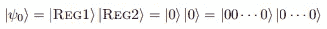

2.接下来，我们需要将哈达玛门应用于[寄存器](https://en.wikipedia.org/wiki/Quantum_register)1，用于[叠加](https://en.wikipedia.org/wiki/Quantum_superposition)它们。其中⊗表示张量积。

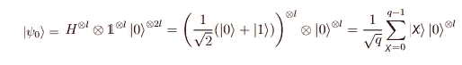

其中|0⟩代表空的第二寄存器

3.此外，我们需要将 *f(x)* 构造为量子函数，并将[线性变换](https://en.wikipedia.org/wiki/Linear_map#:~:text=In%20mathematics%2C%20a%20linear%20map,vector%20addition%20and%20scalar%20multiplication.) Uf 应用于两个寄存器，以获得

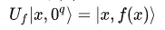

这里，我们将两个寄存器纠缠在一起，其中 *Uf* 是将 *|x⟩ |0⟩* 映射到 *|x⟩ |f(x)⟩* 的酉变换。

4.这一步，我们将量子傅立叶变换应用于第一个寄存器，最后得出

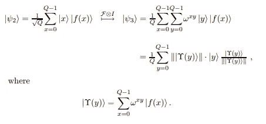

5.在快结束时，我们测量寄存器 1，得到 y。我们还通过 y/2^L.的连分数展开法找到了周期

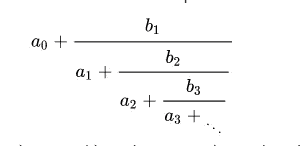

连分式展开式

6.连分数方法帮助我们获得了周期 r。现在我们只需执行一些经典的后处理。在这里，如果得到的周期值是一个奇整数，该过程必须重新开始，如果它是偶数，我们可以进行进一步的经典计算步骤。

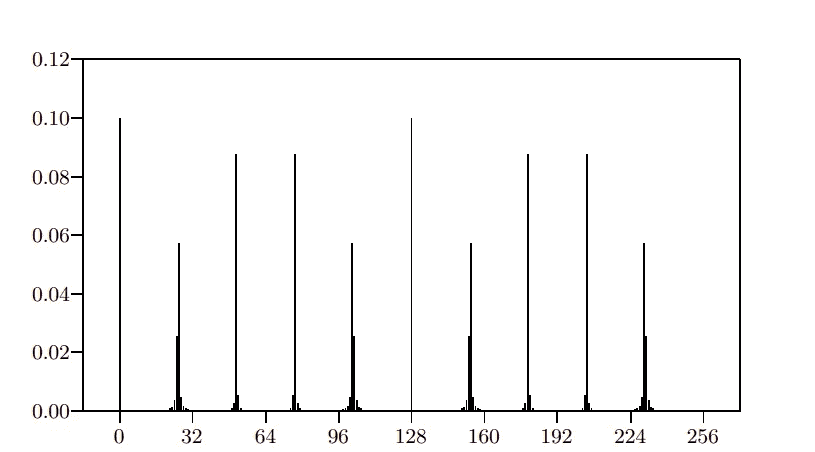

[来源](https://arxiv.org/pdf/quant-ph/9508027.pdf)

概率可以由如上所示的频谱给出

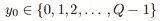

y 的概率，类似于这个

## 周期发现算法综述

1.  步骤 1:用寄存器的状态初始化寄存器
2.  步骤 2:将哈达玛门应用于寄存器 1 中的量子位。
3.  步骤 3:对寄存器应用酉变换
4.  步骤 4:对寄存器 1 应用量子傅立叶变换。
5.  步骤 5:执行寄存器 1 的测量。

## 实施准则

我们将尝试用 python 创建 Shor 算法的代码。让我们看看它是如何工作的。我们需要先安装 Qiskit。下面是安装步骤。

Qiskit 在以下 64 位系统上得到测试和支持:

*   Ubuntu 16.04 或更高版本
*   macOS 10.12.6 或更高版本
*   Windows 7 或更高版本

Qiskit 支持 Python 3.6 或更高版本。

营造康达环境。

```
conda create -n qenv python**=**3
```

激活你的新环境。

```
conda activate qenv
```

接下来，安装 Qiskit 包。

```
pip install qiskit
```

你完了。

接下来，您必须设置 IBM Quantum 体验，只需在上面创建一个帐户，并获得您的 API 令牌。现在您已经为使用 Qiskit 编码做好了充分的准备。


现在让我们深入研究代码

```
from qiskit import IBMQ
from qiskit.aqua import QuantumInstance
from qiskit.aqua.algorithms import Shor
IBMQ.enable_account('ENTER API TOKEN HERE') # Enter your API token here
provider = IBMQ.get_provider(hub='ibm-q')
backend = provider.get_backend('ibmq_qasm_simulator') # Specifies the quantum device
factors = Shor(21) # Enter Integer to obtain its factors
result_dict = factors.run(QuantumInstance(backend, shots=1, skip_qobj_validation=False))
Factors = result_dict['factors'] # Get factors from results
print(Factors) 
```

输出

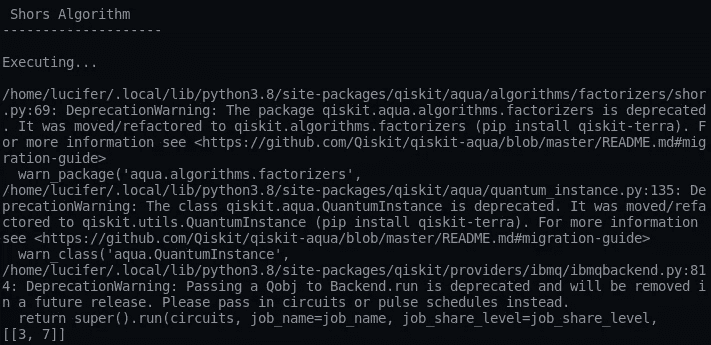

产生的因子是 3 和 7。

## 结论

量子计算是一项旗舰技术，可以带来超乎想象的进步。Shor 算法是量子计算领域的一项巨大成就，但我们仍然无法实际实现它，因为量子计算机尚未达到可以对非常大的数字进行因式分解的显著水平。希望我们很快能见到他们。

原载于[**【amitnikhade.com】**](https://amitnikhade.com/)

## 参考

[https://arxiv.org/pdf/quant-ph/0010034.pdf](https://arxiv.org/pdf/quant-ph/0010034.pdf)

 [## 肖尔算法-维基百科

### Shor 算法是用于整数因式分解的多项式时间量子计算机算法。[1]非正式地说，它解决了…

en.wikipedia.org](https://en.wikipedia.org/wiki/Shor%27s_algorithm#Quantum_part:_period-finding_subroutine) [](https://qiskit.org/) [## Qiskit

### Qiskit 是一个开源软件开发包(SDK ),用于 OpenQASM 和 IBM Q quantum 处理器…

qiskit.org](https://qiskit.org/) 

## 关于我

[](https://www.linkedin.com/in/theamitnikhade/) [## Amit Nikhade -人工智能工程师-自由职业者| LinkedIn

### 在我的杯子里装了很多咖啡，为普通智力革命而工作。我是一个 AI 爱好者，一个博主，还有…

www.linkedin.com](https://www.linkedin.com/in/theamitnikhade/) [](https://github.com/AmitNikhade) [## AmitNikhade -概述

### 🂮 |人工智能和机器人爱好者|机器学习、深度学习、NLP、物联网、机器人| LinkedIn…

github.com](https://github.com/AmitNikhade)  [## 阿米特·尼哈德|脸书

### 你好，世界 2.o |欢迎来到人工智能和量子人工智能的世界|让我们深入研究量子位并…

amitnikhade.com](https://amitnikhade.com/) 

我希望你觉得它很有见地。一定要打这些掌声，并跟随我获得更多这样的惊人的东西。