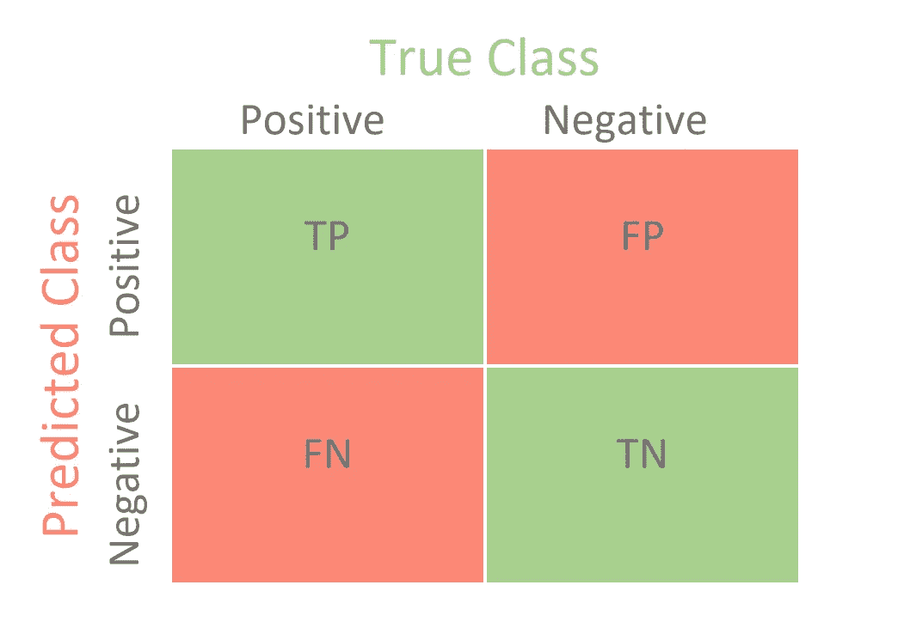

# 让我们消除困惑

> 原文：<https://medium.com/analytics-vidhya/lets-clear-the-confusion-9b049e2562df?source=collection_archive---------13----------------------->

评估模型的性能在最终确定模型或决定它是否适合在生产环境中部署时起着至关重要的作用。我们有很多方法来评估绩效，但其中混淆矩阵和 ROC 曲线是广泛选择的指标。

这可能是因为它的名字或者初学者对它的理解方式，不知何故混淆矩阵看起来很混乱，不容易记在心里。在本文中，让我们通过一个简单的例子来理解混淆矩阵。

让我们考虑一下，我们手头有一个分类任务，在这个任务中，我们必须从既有圆又有正方形的组中找出正方形。

在下面的例子中，我们总共有十五个物体，其中九个是正方形，六个是圆形。如果我们必须手动识别方块，或多或少我们会达到百分之百的准确率。但是如果我们想让机器来完成这项任务，除非训练有素，否则很难达到百分之百的准确率。我们可以假设机器是一个刚刚开始识别物体的稚嫩婴儿，我们对这个婴儿训练得越多，它识别得就越好。

现在，当我们让机器挑选所有的方块并把它们放入一个新的容器中时，假设它给出了下面的结果。

在这里，我们可以看到，在九个方块中，机器只选择了六个方块，其他三个是圆。如果有人问，我们的机器做得怎么样，这将很难决定是在挑选出的商品中集中精力挑选不想要的商品，还是在被排除的商品集中精力挑选想要的商品。混乱矩阵的作用来了。

混淆矩阵只是一个帮助我们描述模型性能的表格。

一般来说，我们在基于 X_test 数据预测目标标签后绘制混淆矩阵。因为我们知道实际的 Y_Test，所以我们可以比较实际的 Y_test 和预测的 Y _ Test。

让我们试着用上面的正方形和圆形数据集来理解这个术语。

真阳性(TP):挑选的方块中有多少是真正的方块？

误报(FP):被拾取的方块中有多少不是方块？

假阴性(FN):有多少实际的方块没有被选取？

真底片(TN):有多少非正方形(圆形)没有被挑中？

如果我们回答以上问题，我们的混淆矩阵看起来如下。

现在，让我们看看什么是灵敏度和精度。

敏感度也称为回忆，它表示正确分类的阳性结果在所有阳性结果中所占的比例。在我们的例子中，它将是从可用方块总数中挑选的方块总数。

因此，如果我们将我们的值代入这个公式，我们会看到灵敏度为 6/9，也就是 2/3。

精确度是关于所有预测中真正肯定的比例。在我们的例子中，它是在所有被选择的物品中被选择的方块总数。

因此，如果我们插入这些值，我们会看到值 6/9 也是 2/3。

我们总是希望敏感度和召回值更高，并且这些值在 0 和 1 之间。如果我们观察上面的等式，两者的分子都是真正值。唯一不同的是分母的第二部分，第一种情况下是假阴性，第二种情况下是假阳性。这些值越小，我们模型的性能越好。一旦我们绘制了混淆矩阵，我们的下一个工作将是看看是否有一种方法来减少假阳性和假阴性值，也称为类型 1 和类型 2 错误。

如果我们考虑癌症患者的分类任务。

类型 1 错误:将癌症患者预测为非癌症患者。

第二类错误:将非癌症患者预测为癌症患者。

在这种情况下，直觉上感觉与癌症患者一样危险的 1 型错误被宣布为非癌症，这是一种生命风险。另一方面，2 型错误没有那么有害，因为非癌症患者可以接受进一步的诊断，并有机会通过人工检查被宣布为非癌症。因此，我们的议程将是在处理与诊断相关的病例时减少 1 型错误。

到目前为止，我们已经讨论了混淆矩阵，现在让我们跳到 ROC 曲线上。**受试者操作者特征(ROC)** 曲线是二元分类问题的评价尺度。让我们知道分类问题中的理想阈值是它的核心优势。

让我们考虑逻辑回归，我们知道在逻辑回归中，我们基于选择的阈值进行预测。阈值可以是 0 到 1 之间的任何值。因此，对于选择的每个阈值，我们必须绘制出许多混淆矩阵，并选择更好的阈值。这个过程看起来很繁琐。

因此，ROC 图提供了一种简单的方法来可视化多个阈值的所有信息，而不是被混乱矩阵淹没。

在 ROC 图中，我们选择灵敏度(TPR)作为 Y 轴，假阳性率(FPR)作为 X 轴。在每个阈值，我们需要通过插入 TP、FP、TN、FN 的值来计算 TPR 和 FPR 的值

假阳性率

由于我们知道 FPR 和 TPR 值介于 0 和 1 之间，在 ROC 图中，我们将有 1 个 X 轴单位和 1 个 Y 轴单位。这条绿线上的任何一点都表明，错误分类的比例与正确分类的比例相同，这意味着我们的模型只有 50%的机会做出正确的预测。

如上所述，我们的目标应该是减少 1 型和 2 型误差，这意味着我们必须选择比 TPR 值更小的 FPR 值。一旦我们绘制了多个阈值(如 T1、T2、T3、T4、T5、T6)下的 ROC 图，该图如下所示。

这里我们可以看到，对于阈值 T1，与 FPR 相比，我们有更大的 TPR 值[接近 1]。但对 T2 来说，TPR 与 T1 相当，而 T2 的 FPR 比 T1 的 FPR 小。因此，如果我们必须在 T1 和 T2 之间选择一个阈值，我们会选择 T2。

类似地，对于阈值 T3，我们看到，与 T2 的 FPR 相比，FPR 显著降低，但是对于阈值 T3，TPR 值也降低了。同样，在 T4，我们有 FPR 为零，这意味着假阳性值绝对为零，但是假阴性可能已经存在，因为它的 TPR 值小于 1。

因此，基于问题陈述，我们必须决定一个解决方案可以接受多少误报，基于此我们需要选择阈值。

既然知道了 ROC，那就让我们来了解一下 AUC(曲线下面积)。AUC 帮助我们比较 ROC 曲线。

比方说，我们使用两种不同的算法训练我们的模型，比如逻辑回归，用红色 ROC 表示，另一种算法是支持向量机(SVM ),用蓝色 ROC 表示。

如果我们必须决定哪种算法执行得好，我们必须选择 AUC 更大的 ROC。在上面的例子中，红色 ROC 下面的面积大于蓝色 ROC。因此，我们可以说逻辑回归非常适合这个特殊的案例研究。

到此结束，希望这篇文章对你有所帮助。

来源:[https://statquest.org/roc-and-auc-in-r/](https://statquest.org/roc-and-auc-in-r/)