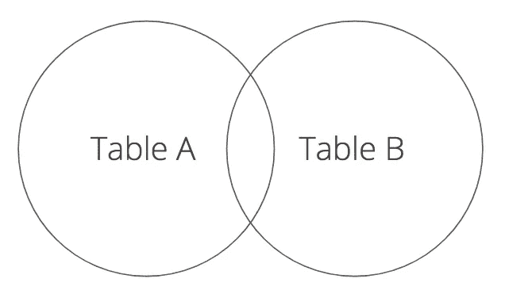
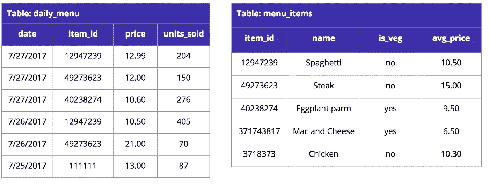
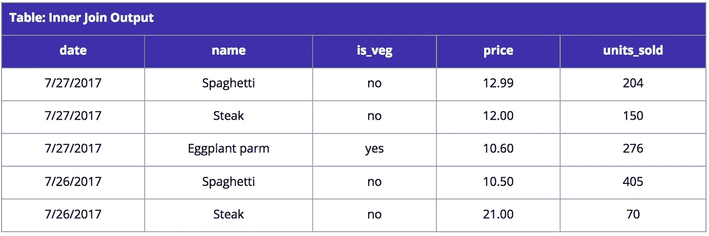
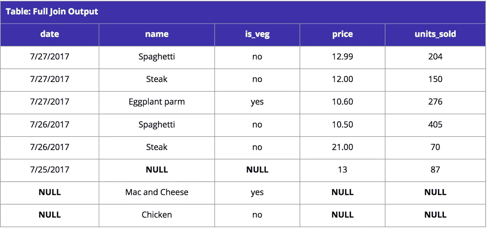
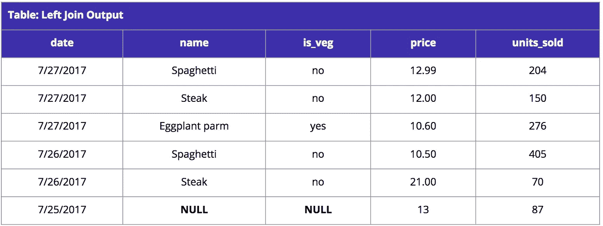
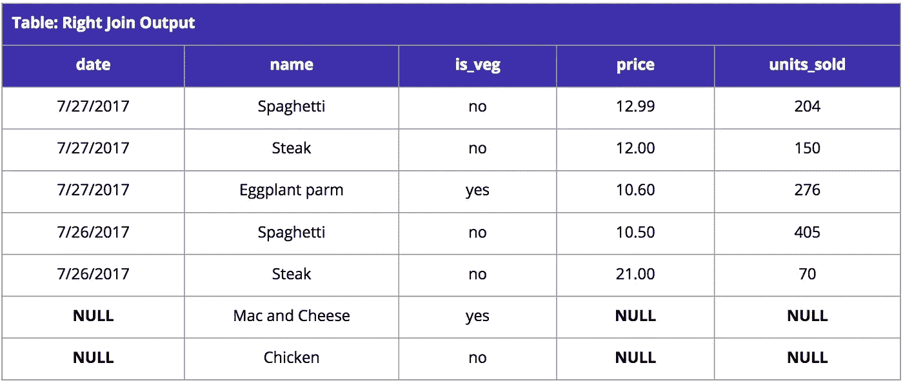

# 让我们构造一些 SQL 连接

> 原文：<https://medium.com/analytics-vidhya/lets-constructs-some-sql-joins-4209de3245df?source=collection_archive---------24----------------------->

# SQL 连接

当您查询大多数数据集时，您很可能需要使用一个 JOIN 子句。本文将带您了解何时需要使用联接、使用联接的要求以及联接的类型。

## 什么是 SQL 连接？

SQL 连接是在 SQL(结构化查询语言)中使用的指令，用于将两个表中的数据组合到一个键上。

我们知道我们有 2 组数据 daily_menu 和 menu_items，我们可以假设 daily_menu 是表 A，menu_items 是表 b。在维恩图中，我们实际上希望将这两组数据放在一起。



有 4 种基本方法可以将这些数据连接在一起:内部连接、左连接、右连接或完全连接。我们将在下面详细讨论每一项。

一个简单的关系数据库的例子。



## 内部连接

内部联接允许我们输出表 A 和表 B 中引用的记录。如果表 A 和表 B 中的记录不匹配，这些记录将不会显示在查询的输出中。

为了在实践中做到这一点，如果我们以 daily_menu 和 menu_items 为例，下面是一个内部连接的示例查询和相应的输出。

```
SELECT 
  d.date, 
  i.name, 
  i.is_veg, 
  d.price, 
  d.units_sold 
FROM daily_menu d 
     INNER JOIN menu_items i 
     ON d.item_id = i.item_id;
```



完全外部连接

完全联接或完全外部联接，列出两个表中的所有记录，而不管记录在相对的表中是否匹配。同样，让我们使用上面的 daily_menu 和 menu_item 表来练习。如果我们对 item_id 进行完全外连接，我们将保留两个表的所有主 id 以及我们选择的相应列。SQL 和输出表如下。

```
SELECT 
  d.date, 
  i.name, 
  i.is_veg, 
  d.price, 
  d.units_sold 
FROM daily_menu d 
     FULL OUTER JOIN menu_items i 
     ON d.item_id = i.item_id;
```



左连接

左连接，如上面的 SQL 连接图所示，将返回表 A 中的所有记录，以及表 b 中的任何匹配记录。使用 daily_menu 和 menu_item 表，下面是左连接的查询示例和结果输出。

```
SELECT 
  d.date, 
  i.name, 
  i.is_veg, 
  d.price, 
  d.units_sold 
FROM daily_menu d 
     LEFT JOIN menu_items i 
     ON d.item_id = i.item_id;
```



## 右连接

与左连接相反，右连接将返回表 B 中的所有记录以及表 a 中的任何匹配记录。同样，我们将使用 daily_menu 和 menu_item 表来编写右连接的示例查询以及结果输出。

```
SELECT 
  d.date, 
  i.name, 
  i.is_veg, 
  d.price, 
  d.units_sold 
FROM daily_menu d 
     RIGHT JOIN menu_items i 
     ON d.item_id = i.item_id;
```

