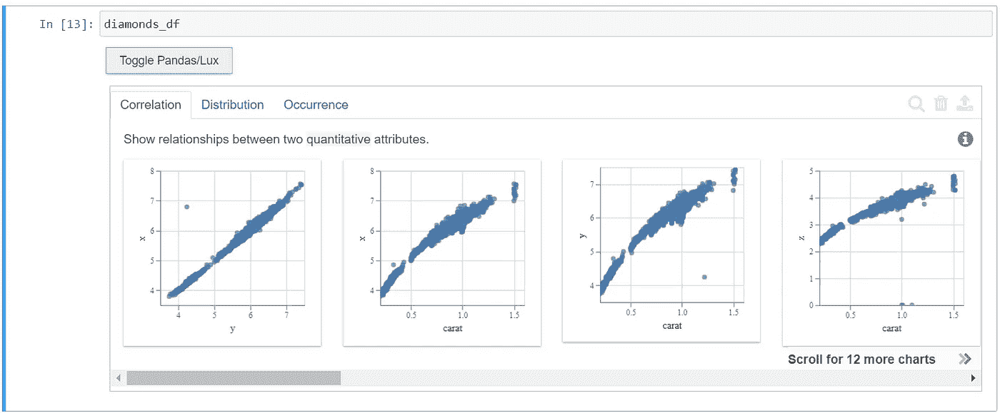
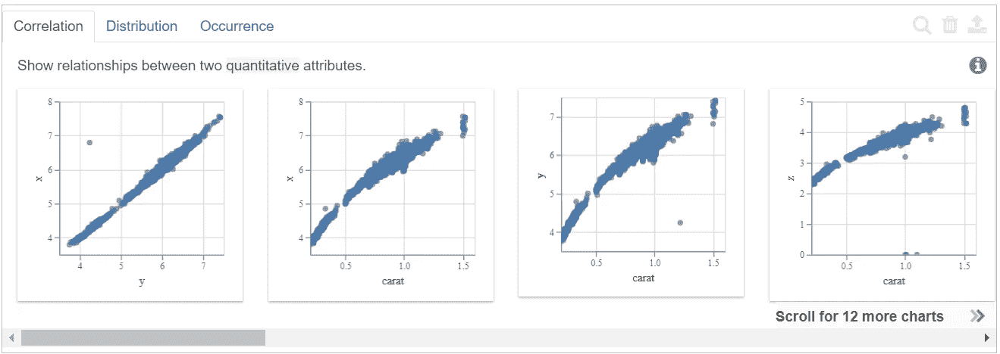
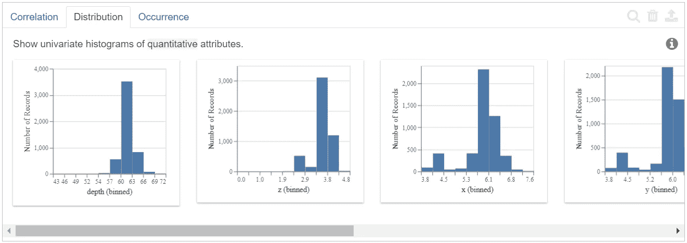
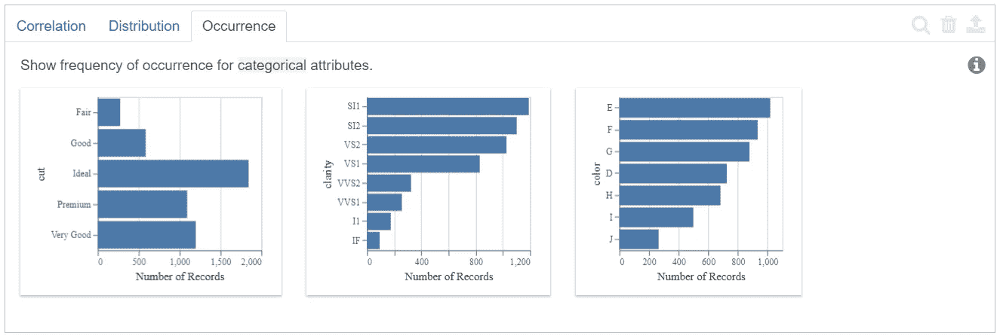
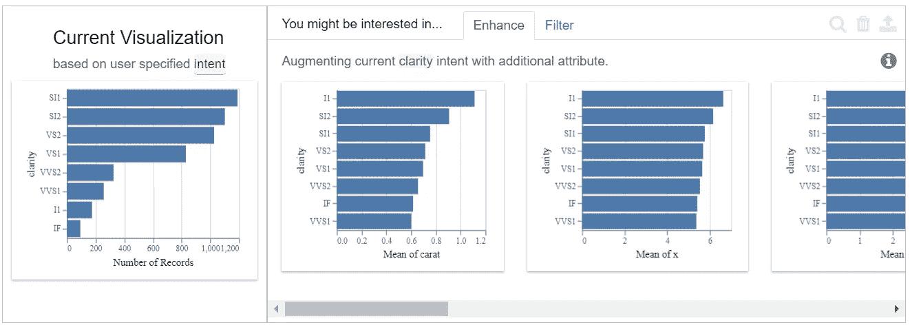
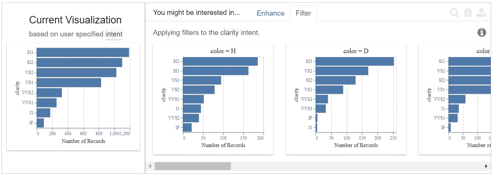
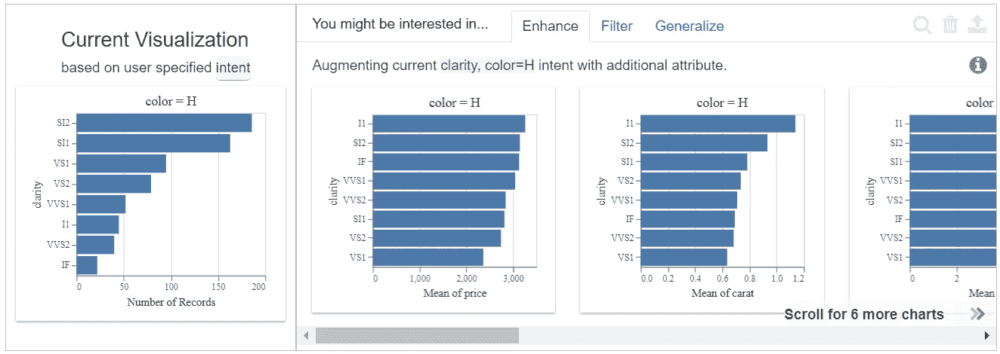
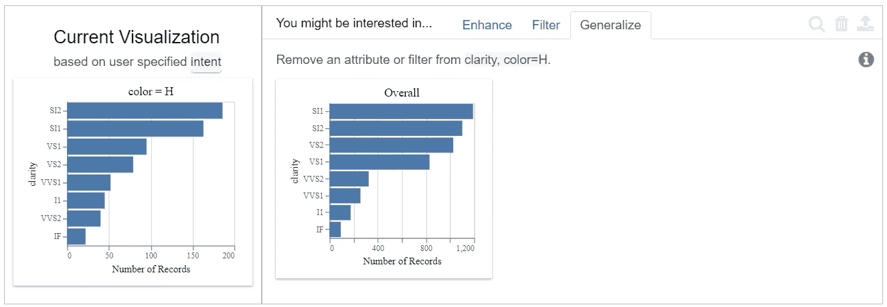

# 让我们使用 LUX 智能地发现数据

> 原文：<https://medium.com/analytics-vidhya/lets-discover-the-data-intelligently-using-lux-a40f1c63995d?source=collection_archive---------13----------------------->

即使您不知道要发现什么，也可以通过自动化方式快速发现见解。


[骨灰堂](https://unsplash.com/@awesome?utm_source=unsplash&utm_medium=referral&utm_content=creditCopyText)在 [Unsplash](https://unsplash.com/s/photos/bulb?utm_source=unsplash&utm_medium=referral&utm_content=creditCopyText) 上拍摄的照片。

这篇文章将涵盖 [LUX 的基础知识:一个用于智能视觉发现的 Python API](https://lux-api.readthedocs.io/en/latest/index.html)，分为以下几个部分。

1.  莱克丝是什么？
2.  LUX 解决什么问题？
3.  安装 LUX
4.  使用 LUX 及其核心概念的基础数据探索。
5.  链接到本帖未涉及的 LUX 功能。
6.  结论。

# 1.莱克丝是什么？

LUX 是一个 Python 库，它通过智能地推荐可视化来自动化部分数据探索过程。LUX 使用了一个交互式的 jupyter 小工具，通过它我们可以探索笔记本本身的数据？为了更好地理解它，我们需要首先关注它为数据科学家解决了什么问题。

# 2.莱克丝解决的是什么问题？

假设您正在处理一个巨大的数据集，最初您不知道从哪里开始研究数据。有很多列，你可能想使用像 seaborn 这样的绘图库，并尝试对数据或它们的组合使用不同的绘图。这意味着您必须编写代码来绘制和查看关系。然后你开始怀疑，你想用一个不同的情节，但这一次用“宁滨”来看更密切的关系。

最终，您会编写大量代码来实现 EDA 阶段的最终目标，即从数据集获得一些见解。

但问题是为什么我们需要在这里花更多的精力写代码呢？有没有什么自动化的方法可以根据我们的意图绘制数据？是的，有，这就是莱克丝的全部。

这是力士解决的问题。

# 3.安装 LUX

它的安装相当简单。你只需要运行下面的命令。*请在单独的虚拟环境中安装 LUX，以避免任何依赖冲突。*

```
# insall LUX using pip
pip install lux-api# install and enable Jupyter nbextension
jupyter nbextension install --py luxwidget
jupyter nbextension enable --py luxwidget
```

现在，让我们开始探索数据集。

# 4.使用 LUX 及其核心概念的基础数据探索。

让我们从 Kaggle 获取一个简单的 Diamond 数据集进行探索，看看执行包含 df 对象的单元会返回什么。

```
diamonds_df = pd.read_csv('./diamonds.csv', index_col=0, nrows=5000)
diamonds_df
```



勒克斯切换按钮，用于切换到勒克斯可视化模式。

现在，安装并启用 lux nbextension 后，我们有了一个切换按钮。此按钮可用于在熊猫 df 显示模式(默认)和包含可视化效果的 LUX 显示模式之间切换。

LUX 自动提供的这种可视化称为“推荐”。

## 4.1 什么是推荐？

推荐是 LUX 返回的内容，以突出我们数据集中一些有趣的模式或观察结果。建议强调了重要的见解。

在上图中可以看到，它有 3 个选项卡。

*   相互关系
*   分配
*   出现

这三个选项卡是按照 LUX 中使用的术语进行的分析操作。

## 4.2 什么是分析行动？

分析操作是可以对数据执行的不同分析，如相关性、分布和发生率。LUX 会根据数据集和变量类型自动推荐这些操作。还会根据用户指定的“意图”(稍后介绍)推荐操作。

1.  相互关系



数量属性之间的相关性。

相关性显示了上图中提到的两个定量属性之间的关系。默认情况下，高度相关的属性显示在左边，最不相关的属性显示在最右边。这种显示关系的方式非常有用，因为用户可能希望首先看到高度相关的属性。

2.分配



数量属性的分布。

“分布”选项卡通过自动宁滨来绘制定量属性的分布。在这里，LUX 也首先绘制了具有偏斜分布的属性。最右边的图很可能包含正态分布的属性。

3.出现



分类属性的出现图。

Occurrence 使用条形图绘制分类属性的频率，如上图所示。同样，这里 LUX 将首先绘制不均匀的事件，然后绘制更均匀的事件。

这就是当我们执行包含数据框对象的单元格时，LUX 如何自动绘制最有趣的关系。现在，在看到最初的建议后，我们可能希望了解更多关于数据集属性的信息，就像我们希望基于单个属性(如本例中的“钻石净度”)探索更多信息一样。

这可以通过使用 LUX 遵循的基于*意图的*语言来实现。

## 4.3 勒克斯的意图是什么？

前面我们看到了执行 df 对象如何生成基本建议。这个建议可以用所谓的“意图”来控制。使用初始建议，我们已经看到了数据中存在的基本关系，现在您希望根据钻石的“净度”属性进行放大。这在 LUX 中非常容易，可以使用下面的单行代码来完成。

```
diamonds_df.intent = ['clarity']
diamonds_df
```



您可以看到建议现在由指定的意图控制。最左边的图将显示指定意图的出现是分类的，如果意图是数字的，则显示分布。

在右侧，我们可以看到有两个选项卡“增强”和“过滤”，这些也是类似于“相关性”、“分布”和“发生率”的分析操作。

“增强”操作将帮助您确定其他属性与指定意图之间的关系。请注意上图中的“钻石净度”与其他属性一起绘制，如“克拉平均值”、“X 平均值”等。这有助于根据意图清楚地看到具有其他属性的有趣模式。

而“过滤”操作将让您探索数据子集的意图。



基于“清晰”意图过滤操作

在上图中，可以看到 LUX 自动突出了钻石净度和不同颜色之间的关系，我们可以很容易地看到“SI2”净度钻石的颜色=H，而“SI1”净度钻石的颜色=D。

现在，如果我们想进一步深入呢？比如我们想知道更多关于特定颜色对钻石净度的影响。使用下面的单行代码，这也很容易实现。

```
diamonds_df.intent = ['clarity', 'color=H']
diamonds_df
```



请注意，钻石的净度以及 color=H 与其他属性一起绘制，如“价格平均值”和“克拉平均值”,即增强。同样,“过滤器”操作/选项卡将使用指定属性的子集绘制意图。

“概括”是一个新的分析动作，顾名思义，它将概括意图，即从意图中删除过滤器的附加属性。如下图所示。



针对指定意图的一般化操作/选项卡。

简而言之，将分析行动的目的视为:

*   增强-查看图与其他属性的关系。
*   过滤器—查看与数据子集的关系，如放大。
*   概化-移除附加属性后查看意图关系，如缩小。

我知道你已经在这篇文章上花了不少时间。但这并不是 LUX 能力的终结。因此，我将以勒克斯语中“从句”的最后一个概念作为结束。

## 4.4 什么是条款？

从句只不过是提供你意图的一种更有力的方式。到目前为止，我们已经看到了如何使用基于字符串的方法来提供意图。然而，并不是所有的意图都可以使用这种方法来指定，在这种情况下，我们可以使用 LUX 'Clause' object。

这只是对 LUX 中‘子句’的介绍。你可以在他们的官方文档[这里](https://lux-api.readthedocs.io/en/latest/source/guide/intent.html#advanced-intent-specification-through-lux-clause)读到更多。

# 5.链接到本文未涉及的 LUX 功能。

*   [如何使用‘Vis’和‘VisList’指定特定的可视化。](https://lux-api.readthedocs.io/en/latest/source/guide/vis.html)
*   [从小部件本身导出可视化效果。](https://lux-api.readthedocs.io/en/latest/source/guide/export.html)
*   [样式自定义绘图设置。](https://lux-api.readthedocs.io/en/latest/source/guide/style.html)

我希望我已经给出了关于 LUX 的通俗易懂的介绍，但我会建议浏览一遍官方文档，以便更深入地了解它。文档很简洁，可以很快覆盖。

我将感谢评论区的反馈。

# 6.结论

LUX 是一个相当简单的库，易于使用，最重要的是，它将帮助您从数据中快速获得洞察力。请记住，我们的最终目标是发现隐藏的见解，而不是花时间决定哪些图用于哪些类型的属性，然后反复编写多行代码来实现这一点。