# 让我们编一个咖喱饭来娱乐一下。

> 原文：<https://medium.com/analytics-vidhya/lets-program-a-curry-for-fun-b0d0c155cd8d?source=collection_archive---------6----------------------->

我们完全不打算学习如何制作一些 curry，但是我们的目标是实现一个 curry 函数，它使一个函数只接受两个输入，我们将按照 Ramda 的风格来做。

在考虑实现之前，让我们首先考虑一个具有以下特征的假想机器，以了解我所说的 currying 是什么意思。

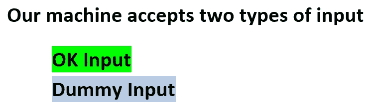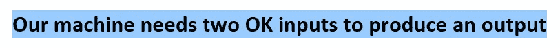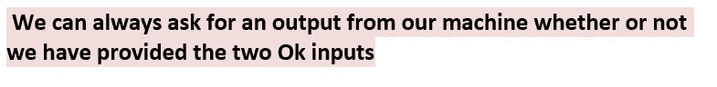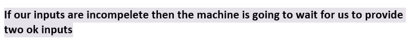

让我们感受一下这台机器:让我们称这台机器为“它”

首先，我们向它提供一个*虚拟输入*，然后请求输出，它什么也不做，所以我们向它提供一个 *OK 输入*，然后请求输出，但它什么也不做，所以我们向它提供一个*虚拟输入*，然后再次请求输出，它仍然什么也不说，所以我们最后放另一个 *OK 输入*，它说“啊哈！感谢您提供两个输入，给您，这是您的答案。”

在函数式编程中，我们可以说这台机器是 curried。

*现在让我们迅速定义一下阿谀奉承:*

按照[的说法，这个](https://stackoverflow.com/questions/36314/what-is-currying)堆栈溢出答案“Currying”是当你把一个接受多个参数的函数分解成一系列每个只接受一个参数的函数时。这篇博文的唯一不同之处，正如你最后会看到的，是我们不会强迫我们的 curry 函数一次只接受一个参数。

首先，让我们实现虚拟输入。

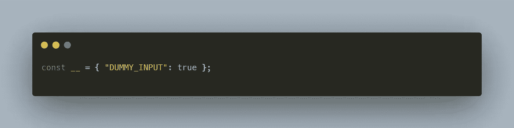

耐心点，过一会儿你就会明白这个家伙能做什么。

现在让我们写一个函数来检查一个对象是否是 DUMMY_INPUT。

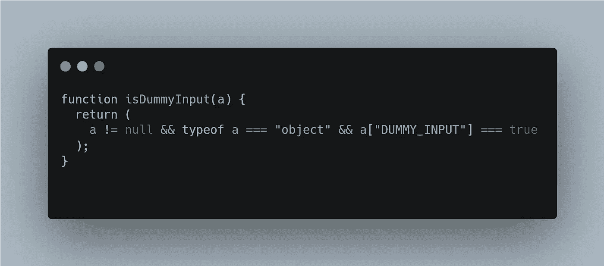

“isDummyInput”检查“a”是否是一个对象，以及它的 DUMMY_INPUT 属性是否设置为 true。

一会儿，我们将使用这个函数来检查另一个函数的给定参数是否为伪参数。

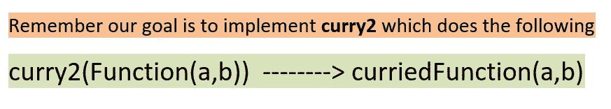

但是等等，让我们借助“isDummyInput”函数实现一个 **curry1** 函数，看看它的表现如何。

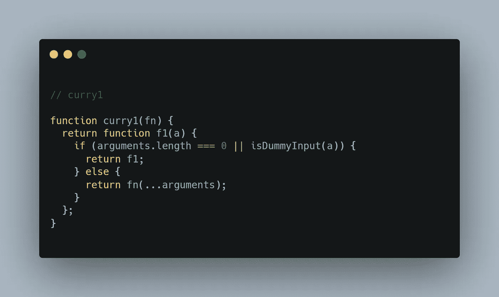

发生了什么事？

这里的“fn”是一个有一个输入(或读取一个参数)的函数。注意 curry1 接受一个函数并返回函数 f1，函数 f1 接受一个输入“a”。如果我们提供零输入或一个虚拟输入，f1 将返回自身，否则 f1 将在将接收到的输入“a”传递给 fn 之后返回 fn 的输出，所有这些都具有闭包的功能。

在这里，arguments 是一个在使用普通语法声明的函数中可用的对象，它在 arrow 函数中不可用。arguments 对象是一个类似数组的对象，它保存函数的所有输入。

现在让我们用我们想象中的机器的行话和我们的货币对话；

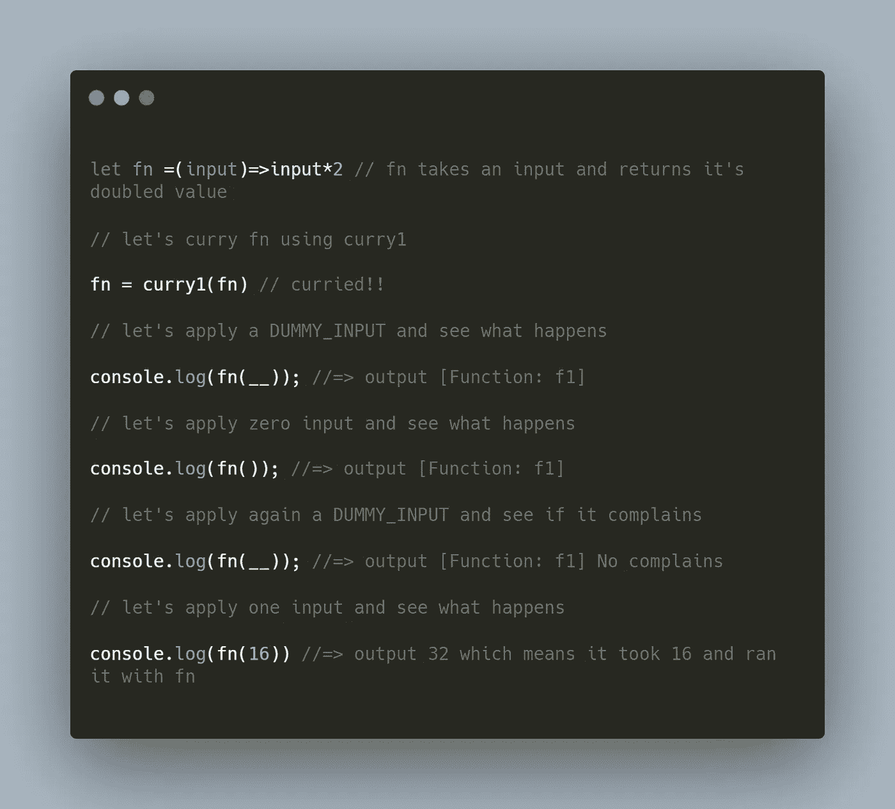

我希望现在你已经对 currying 有了一个直观的理解，并且你能理解我到目前为止所做的。

我们现在准备实施 curry2 并完成当天的目标；

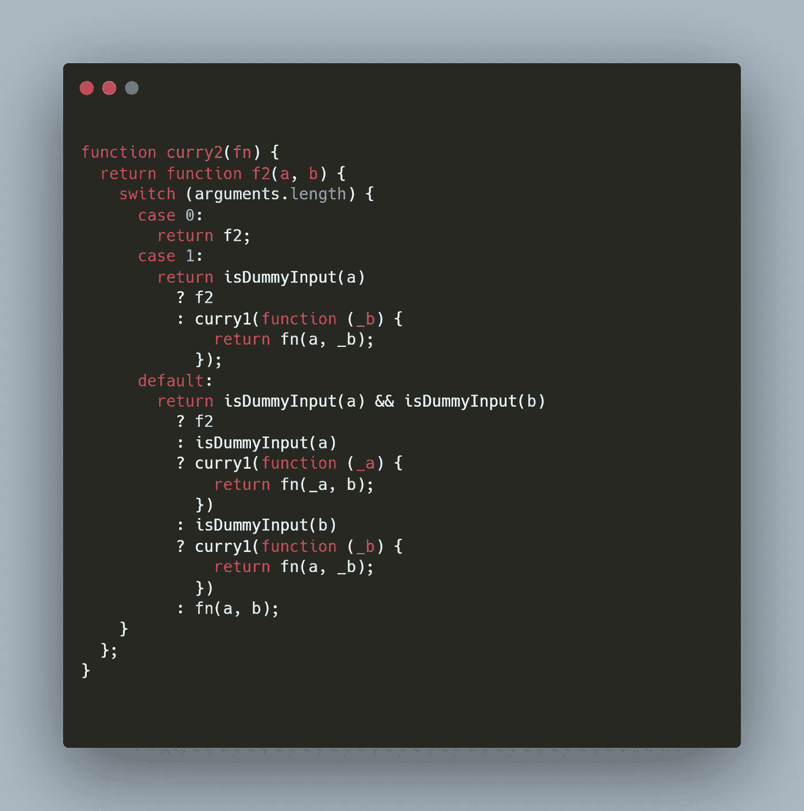

让我们用我们想象中的机器的行话和我们的货币对话；

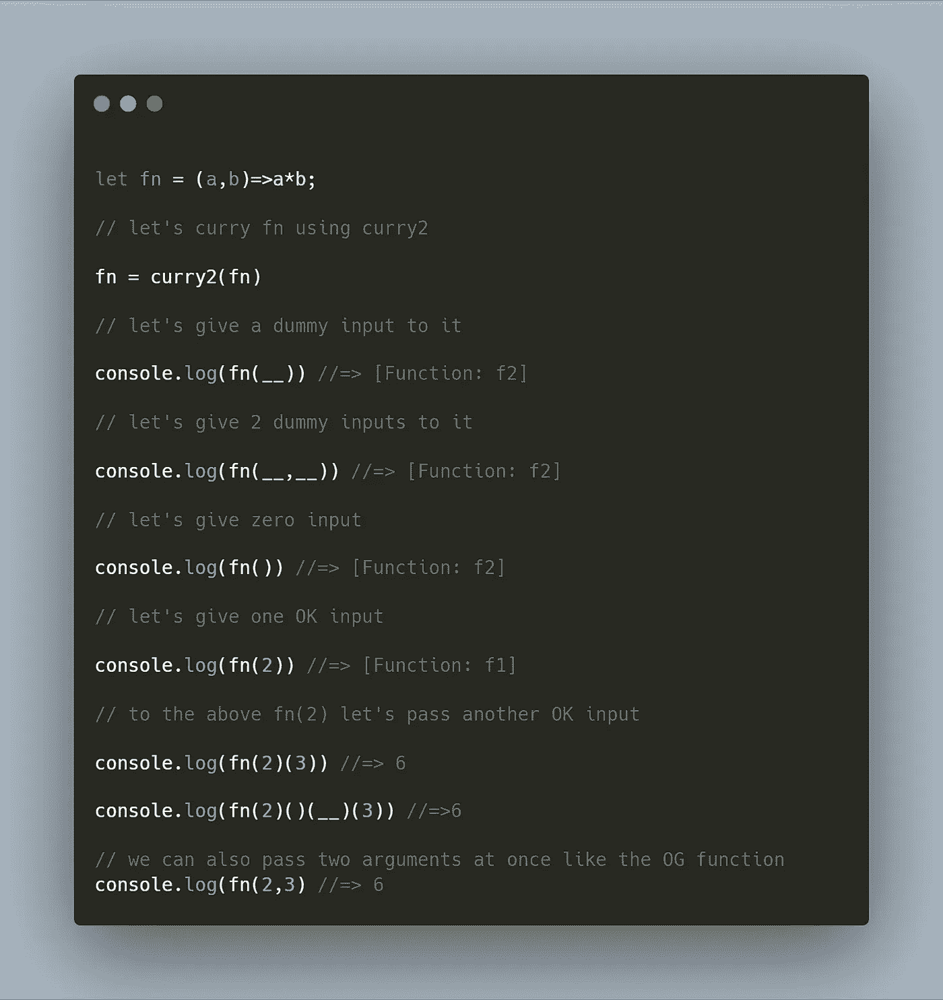

从上面的代码中我们可以看到，在这个实现中，我们并没有严格限制 curried 函数和它每次必须接受的参数数量。

就这样，伙计们。感谢您的阅读。

以下是完整的代码:

参考

1.  r [amdajs](https://github.com/ramda/ramda) :一个实用的函数式 JavaScript 库。