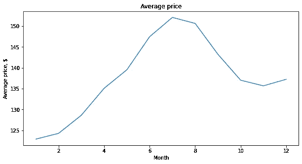
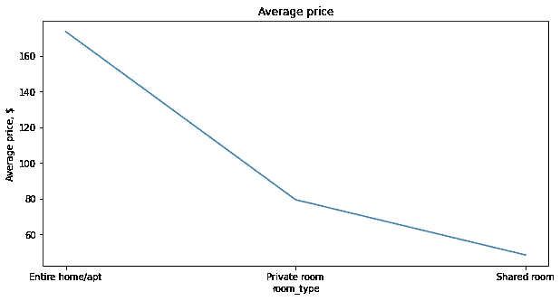
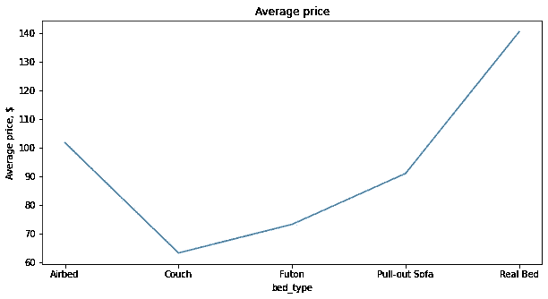
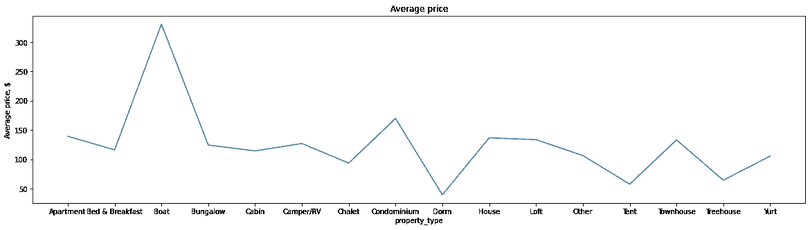
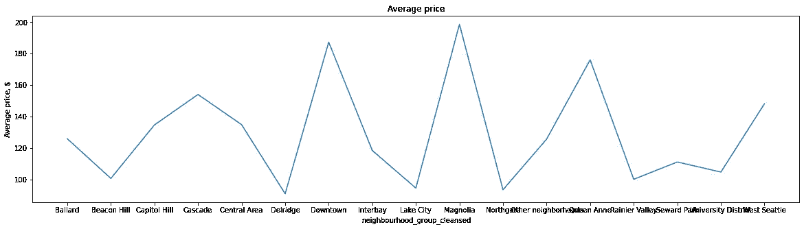
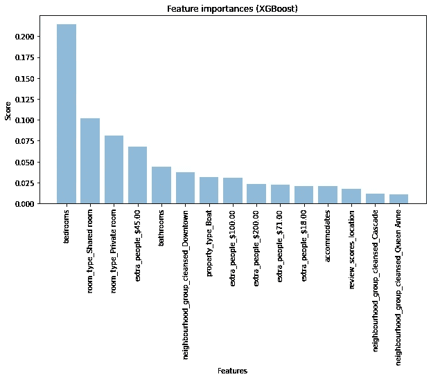

# 让我们看看如何使用机器学习来预测住宿预订价格

> 原文：<https://medium.com/analytics-vidhya/lets-see-how-machine-learning-can-be-used-to-predict-accommodation-reservation-prices-c7865b40fbc7?source=collection_archive---------11----------------------->

来自谷歌

在一个不同的城市或国家停留的问题经常是由于寻找住处造成的。而这样做最重要的因素之一就是保留价格。影响预订价格的主要因素是什么？

通过分析 AirBnB 内部和 Kaggle 上公开的 Airbnb 数据，我们可以尝试回答这些问题。

**关于 Airbnb 定价**

Airbnb 价格基于:

*   每晚的价格:每晚的价格由主人决定；
*   清洁费:清洁费由主持人承担；
*   额外来宾费:一些主机收取的一次性费用，用于支付与使用他们的空间相关的其他费用；
*   最后，Airbnb 使用一种特殊的算法，根据几个因素来确定托管价格。[文章链接](https://www.vrmintel.com/inside-airbnbs-algorithm/)了解更多信息

**我们如何一步一步解决这个问题？**

*   首先，让我们深入了解现有数据集中可用的一般信息。例如缺失值、列表数量、一般事实和时间段。
*   其次，我们从处理缺失值、特征工程等方面准备数据。
*   最后，我们尝试绘制一些趋势以获得更多见解，并使用机器学习模型进行进一步分析。

**数据集的信息**

Airbnb 为我们提供了西雅图的 3 个数据集:

*   Listing.csv —关于主机、位置、清洁费、便利设施等信息。
*   calender.csv —该文件提供关于可用性和受关注的日期价格的数据。
*   Review.csv 列表的摘要评论。

**业务理解**

1.  这种分析的主要思想是根据关键特征预测房价。
2.  寻找与分析无关的列。
3.  为什么我们需要突出工程技术？
4.  我们如何用一些机器学习技术来预测价格？

L **让我们深入其中一个数据集——listing . CSV**

导入必要的库，让我们研究数据。

接下来，我们将研究一些主机及其列表。有 2751 个主机的 3818 个列表。

现在，让我们检查缺失的数据及其百分比。

许多列有超过 40 %的缺失值。

至于现在，我们只是留下缺失的数据，稍后我们再回来看看如何处理它们。要么我们可以估算价值，要么我们可以忽略它们。

好的，我们能够在 listing.csv 文件中找到一些信息，这些信息将对我们的分析有用。

***以上分析的要点:***

1.  大约有来自 2751 个主机的 3818 个列表。
2.  有 47 列没有缺失数据，2 列缺失 75 %以上的数据，6 列缺失 40 %以上的值。
3.  我们的数据集中有 62 个分类变量

现在让我们读取另一个数据集，Calender.csv，它包含一些关于日期和价格的有用信息。

L **让我们深入 calender.csv 数据集**

这个数据集总共有 1393570 行 4 列。

就像前面的分析一样，我们调查缺失的数据。

价格列有 30 %以上的缺失数据，这将是我们在未来分析中的响应变量。

***让我们扣好安全带准备*** 的数据。

**数据准备**

1.  我们将首先尝试删除不相关的列。
2.  根据我们的分析对列进行处理，例如重命名、分桶、从列中删除不需要的关键字等。
3.  我们还将处理丢失的值，要么删除它们，要么用均值和众数对它们进行赋值

首先，我们需要将 listing.csv 和 calender.csv 合并到一个数据框中，以便进一步分析。

当我们查看数据时，有许多不相关的列可能对我们的预测没有用处，并且可能使我们的模型在预测价格时过度拟合。所以我们放弃吧。

现在，我们需要将日期转换成月份和年份列。如果你把它分成一天、一个月和一年，总是很有用的。

让我们来处理 price 列及其缺少的值。

现在，我们将深入数据探索部分。让我们检查一下数据类型。

最后，让我们再次寻找丢失的值

因为我们有更少的缺失值，我们可以尝试用众数或平均数来估算。出于简单的目的，我为 int 类型输入平均值，为 object 类型输入模式。

最后，

数据准备是通过处理缺失值和删除对我们的分析可能没有用的不必要的列来完成的。

分类数据用众数估算，浮动数据用平均值估算。

还有其他可能非常有用的技术。请探索它们！

***让我们来策划一些价格方面的真知灼见*** 。

现在，我们差不多要结束分析了。

**数据分析部分**

1.  在这里，我们尝试绘制一些与价格相关的有用见解。
2.  我们还将尝试理解特征工程的重要性。
3.  为分类列创建虚拟变量

*   **每月平均价格**

全年的定价趋势。

我们可能会在 7 月和 8 月看到价格上涨，这似乎是合理的理解，因为西雅图是夏天，在冬天会逐渐下降。

*   **每房平均价格 _ 类型**

根类型的定价趋势

与低得令人难以置信的合租房相比，住宅/公寓的平均价格非常高。看看合租的房间是不是设施齐全！！！！

*   **按床型分类的平均价格**

床类型的定价趋势

大多数共享房间里都有一个沙发，这表明价格与本专栏预测价格有很大的相关性。

*   **按物业类型划分的平均价格 _ 类型**

property_type 的定价趋势

几乎所有类型的房产类型都是一样的，除了游艇类型，相对于其他类型，游艇确实很贵。

**街区平均房价 _ 组团**

上面的情节正好抛出了很多预测价格的信息。您可以围绕这个数据集进行更多操作，以提取更多信息。

在建立模型之前，我们需要考虑分类变量。在机器学习中，分类变量有多种处理方式。这里几个环节→ [环节 1](https://www.datacamp.com/community/tutorials/categorical-data) & [环节 2](https://www.analyticsvidhya.com/blog/2020/08/types-of-categorical-data-encoding/)

***处理分类变量的几种方法*** :

*   通过创建虚拟变量
*   标签编码
*   一个热编码

现在，让我们创建虚拟变量，但是等等！！

注意:创建虚拟变量时请小心。我们总是需要去掉一个虚拟列，以避免落入虚拟变量陷阱。

有一篇关于虚拟变量陷阱的有趣文章→ [虚拟变量陷阱](https://www.learndatasci.com/glossary/dummy-variable-trap/)

一旦为分类列创建了虚拟变量。我们可以进入分析的最后阶段。耶！我们要训练我们的数据来预测住宿价格。让我们跳进来吧！

**数据建模步骤**

*   创建一个简单的基线线性回归模型来评估我们预测的性能。
*   升级到 XGBoost 等功能强大的模型以增强性能，从而更好地预测价格。
*   用 MSE 和 R 值评估他们的表现

1.  *首先，我们创建一个简单的线性回归作为基线模型。*

该模型的 R 平方得分约为 0.64，这对于一个开始来说还不错。让事情变得更有趣，我们将使用一个强大的算法，称为 XGBoost。这是世界上最流行的算法之一！！。它简单却非常强大。

2.*增强性能的 XGBoost 型号。*

当我们在 XGBoost 模型中训练我们的数据时，我们的 R 值有了巨大的提高。这个模型的一个关键特征是，我们可以检索有助于确定价格的最佳特征。这是我们数据中最重要的特征。

最重要的功能

图表显示了将有助于确定价格的 15 大特征。定价也可能取决于其他各种因素，如来自 review.csv 的评论。在我们的分析中，我们没有考虑这一点。

**结论**

*   我们试图从 Airbnb 数据集中找出西雅图住宿的定价。这个价格可能会因地点和其他因素而有所不同。但是确定价格的方法将与任何数据相同。
*   决定价格的最关键因素是卧室、房间类型、额外的人收费、浴室和社区类型。
*   我们也可以尝试特征工程技术来确定关键特征。最好的特征工程技术之一是 [Boruta](https://towardsdatascience.com/simple-example-using-boruta-feature-selection-in-python-8b96925d5d7a) 。
*   当我们想预订一个地方或房间时，我们经常会看评论。因此，分析用户评论也是决定价格的一个重要特征。您可以尝试 TF-ID 矢量化方法来进一步探索评论数据集，以改进模型。
*   尝试神经网络也可能极大地改善我们的模型预测，玩神经元很有趣

点击[此处](https://github.com/Venky0892/Housing-Price-Prediction)查看完整代码。

通过 [Linkedin](https://www.linkedin.com/in/venkatesh-prasath-manoharan-918091133/) 联系

参考资料:

1.  [https://www . ka ggle . com/aleksandradeis/Airbnb-西雅图-预订-价格-分析/笔记本](https://www.kaggle.com/aleksandradeis/airbnb-seattle-reservation-prices-analysis/notebook)
2.  [https://www . ka ggle . com/yogi 045/how-to-be-top-award in-Airbnb](https://www.kaggle.com/yogi045/how-to-become-top-earner-in-airbnb)