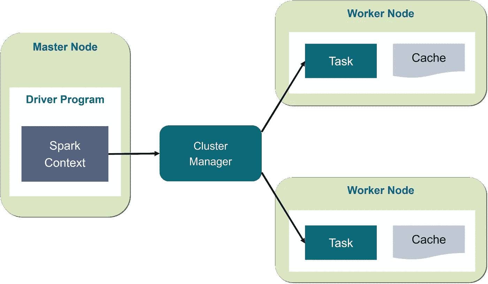

# 让我们来看看 PySpark

> 原文：<https://medium.com/analytics-vidhya/lets-take-a-peek-into-pyspark-29693769d150?source=collection_archive---------2----------------------->

沃伦·王在 [Unsplash](https://unsplash.com?utm_source=medium&utm_medium=referral) 上的照片

欢迎来到我的 Pyspark 博客，在这里我们可以试着了解 pyspark 的要点及其用例。我们还可以尝试使用一个 CSV 文件，使用 Pyspark 作为我们的第一手操作。

# **Spark —建立模型**

> Spark 是一个集群计算平台。Spark 允许你将数据和计算分散到有多个节点的集群上(把每个节点想象成一台独立的计算机)。拆分数据可以更容易地处理非常大的数据集，因为每个节点只处理少量的数据。

# ***平行度***

*一般来说，Spark 使用并行概念，使文件的读取能够同时进行，其中每个节点承担读取某组文件行的角色，这使得该过程更快，因为它是并行进行的。*

# **火花用在哪里？**

现在，这需要一些实践和经验，来决定 spark 是否是所提出问题的最佳商业解决方案。以我个人的经验，我在文件通常比较大的地方用过 Spark。在 pandas 等其他库的帮助下，行和列方面的大文件需要时间来处理，这就是 Spark 派上用场的地方，与 pandas 等库相比，即使是大数据文件也可以处理得更快。但同样，像 Spark 这样的好框架也有更大的复杂性。

# **PySpark**

由于 spark 是一个开源引擎，它提供了不同的编程 API 接口，以便进入它的 Spark 设置和 python 中曾经允许的语言。其他语言包括 scala、java 和 r。

# 内部工作

Spark 通常有以下设置，其中包括一个主节点和多个工作节点。

*   主节点负责在工作节点之间拆分数据，还负责管理计算。
*   Master 发送要处理的数据和要运行的计算，worker 在处理结束后将结果发送回 master。
*   Spark 在集群的概念下工作，其中集群(由主节点和工作节点组成)托管在连接到其他节点的远程机器上。
*   当开始使用 Spark 时，最好在本地运行集群。
*   现在要进入 Spark 集群设置，我们只需创建一个 SparkContext，作为 Spark 的入口点。
*   SparkContext 采用几个可选参数来配置集群设置。
*   要安装 pyspark，请使用以下命令:pip install pyspark

让我们进入一些编码

在上面的代码中，我们创建了一个 spark 上下文，其中 master 将在本地进行配置，并且给定了 spark 上下文的应用程序名称。这里 sc 是 spark 上下文。

sc 中提供的一些其他定制包括:

spark 的核心数据结构是 **RDD(弹性分布式数据集)。**这是让 spark 在多个节点上分裂的对象。但是这有点难操作，所以正如我们所讨论的，我们可以使用数据帧在 pyspark 中读取 CSV 文件。

**Dataframe 类似于 SQL 表**，由行和列组成。与 RDD 相比，这也是一个更好的数据处理选择。

要处理数据框，我们必须从 SparkContext 中创建一个 **Spark session 对象。**看看下面的代码。

现在让我们使用这个创建的 my_spark 会话来读取 CSV 文件。

在上图中，我们正在读取一个名为 5_a.csv 的文件。在配置中，我们提到读取格式为 csv，并推断 schema 为 True，这有助于正确识别列的数据类型，但是，我们必须记住，spark 中的数据类型识别并不准确。

**df。show()将显示列和数据**。您可能已经注意到，虽然 y 和 proba 是列的名称，但是它被标识为另一行，列名被标识为 _c0 和 _c1。为了避免这种情况，我们需要给出一个额外的配置如下。

***将额外配置作为标题设为真，将第一行标识为 CSV 文件中的列名。***

是的，我们已经到了这个博客的结尾。欢迎在评论区添加你的想法，我很乐意回答。

编码快乐！！！