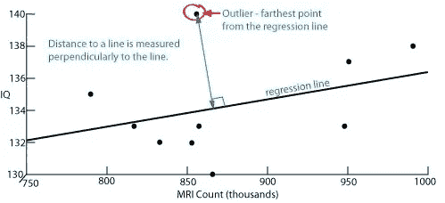
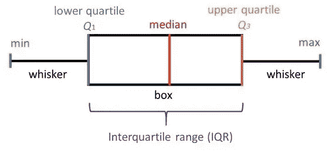

# 让我们来谈谈离群值

> 原文：<https://medium.com/analytics-vidhya/lets-talk-about-outliers-d82b846000c0?source=collection_archive---------9----------------------->

# 你如何描述离群值？

它们是来自总体的随机样本中与其他值相距异常距离的观察值。更简单地说，比其他接近的一组数字的范围高得多或低得多的一个或多个数字被称为**异常值**。

# 离群值是如何产生的？

离群值的出现有很多原因。其中一些包括:

*   记录错误
*   不寻常的数据抽样
*   由于数据样本造成的自然误差
*   数据处理错误

# 如何识别异常值？

通过下面的图形技术，可以很容易地注意到它们。

*   散点图
*   箱线图

**散点图**

使用散点图，离回归线最远的点是异常值。到直线的距离是垂直于直线测量的。

如果散点图的一个点比其他点离回归线更远，那么散点图至少有一个异常值。

如果许多点离回归线的距离相同，那么所有这些点都是异常值。如果散点图中的所有点与回归线的距离相同，则没有异常值。

**箱线图**

在描述性统计中，箱线图用于解释性数据分析，以显示数据集中的异常值。

箱线图是通过在上四分位数和下四分位数之间画一个方框，用一条穿过方框的实线来定位中间值。

任何高于上限或低于下限的数字都称为异常值。上围栏(四分位数)和下围栏(四分位数)通过以下公式获得:

注意:使用 QUARTILEINC 函数可以获得任何给定字段/列的 Q1 和 Q3 的值。

IQR = Q3 - Q1

上部围栏= Q3 + 1.5 * IQR

下围栏= Q1 - 1.5 * IQR

# 如何处理异常值

*   比较是否从数据输入中获得异常值，并纠正它们。
*   根据异常值导致的数据偏斜程度，使用上围栏和下围栏更改异常值。
*   如果异常值同时影响结果和假设，那么就没有必要去除异常值。
*   如果百分比不是很大，则删除包含异常值的条目。

所有这些都取决于存在的数据量。