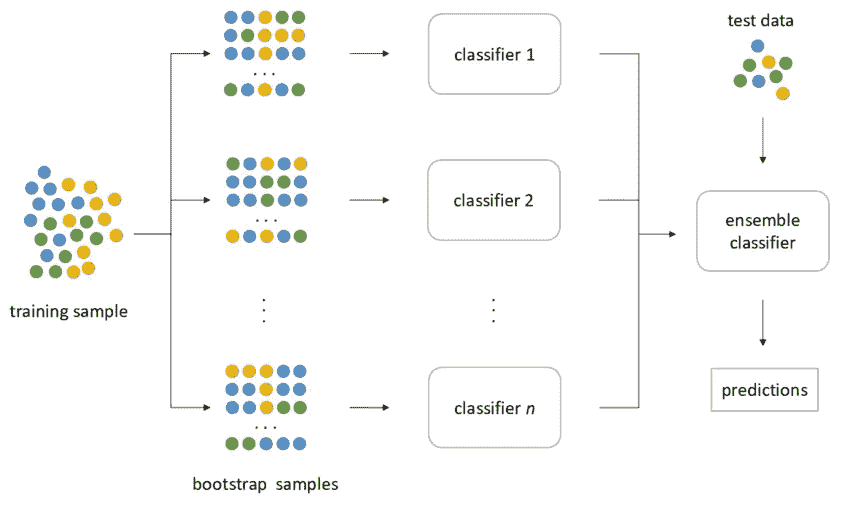

# 再说随机森林！

> 原文：<https://medium.com/analytics-vidhya/lets-talk-about-random-forests-524ae1138d8b?source=collection_archive---------14----------------------->

在我之前的文章中，我们讨论了[决策树](/analytics-vidhya/decision-tree-101-e94a5d131fa0)算法。尽管决策树是一个非常酷的直观算法，但它也带来了过度拟合的诅咒。在本文中，我们将基于决策树的思想，学习在机器学习领域广泛使用的随机森林算法。

**随机森林算法**

*   根据维基百科

> **随机森林**或**随机决策森林**是一种用于分类、回归和其他任务的集成学习方法，它通过在训练时构建大量**决策**树并输出作为类(分类)或单个树的均值/平均预测(回归)的模式的类来操作

# 步伐

1.  在这种情况下，我们获取训练数据，然后从中创建引导数据集。看看下面的图片，更好地了解它。

拔靴带

*   所以我们所做的是，我们获取完整的数据集，然后将数据集分成多个部分。请记住，这些示例可以在不同的引导示例中重复。
*   然后，我们获取这些自举样本，并使用它们来制作多个决策树。所创建的决策树将具有不同的行为，因为它们是使用不同的样本创建的。
*   我们通过创建多个决策树获得的多样性使其比单个决策树更有效。

**我们现在如何使用它们？**

*   现在我们已经创建了决策树，我们如何评估它或使用它来进行预测。
*   为了评估，我们执行以下技巧。定型集中的大部分数据都没有进入引导数据集。它被称为'**出袋数据集**，我们可以用它来评估随机森林。
*   我们举一个例子，然后把它传递给不同的决策树。如果是回归任务，我们取输出的平均值。在分类任务的情况下，我们给出的输出是由大多数树预测的输出。
*   被错误分类的袋外样本比例为“**袋外误差”。**

**装袋技术**

*   装袋是 random forest 正在使用的一种技术。
*   装袋可以总结为引导，然后是聚集步骤。
*   在随机森林中，我们应用这种打包技术，首先引导数据集创建多个决策树，然后聚合它们的结果以给出最终输出。

**随机森林的优点**

*   随机森林对于离群值是健壮的，因为它们通过多个树输出的聚合得到平均。
*   它非常适合非线性数据。
*   过度拟合的风险很低，因为结果是基于多个决策树的输出来计算的。

希望这篇文章能让你更好地理解随机森林是如何工作的。

在那之前，祝你学习愉快！！！