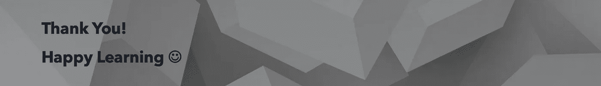

# 让我们深入讨论一下表/视图/数据帧中的 Spark (Un)Cache/(Un)Persist

> 原文：<https://medium.com/analytics-vidhya/lets-talk-about-spark-un-cache-un-persist-in-table-view-dataframe-in-depth-3b943a45fb3e?source=collection_archive---------0----------------------->

Jason Dent 在 [Unsplash](https://unsplash.com?utm_source=medium&utm_medium=referral) 上拍摄的照片

我们有 100 多个博客和页面讨论 spark 中的缓存和持久化。

在这篇博客中，我们的目的不仅仅是谈论**缓存或持久化**，而是向前迈出一步，向您介绍它是如何在**表、视图和数据帧**之上工作的。

对于 DataFrame，我们知道 cache 或 persist 命令不会立即在内存中缓存数据，因为它是一个**转换**。

在调用任何像 **count** 这样的动作时，它会将数据具体化。

但是万一**spark . sqlcontext . cachetable(dbname . table)**会实现吗？

**没有**，所以还是那句话。cacheTable 也是转换，而不是动作。

我们应该显式地调用一个**动作**来实现它。

让我们创建一个简单的表。

检查 PersistentRDDs，它是空的。

让我们缓存该表并查看持久 rdd

我们可以看到 persistentRDDs 的列表仍然是空的，所以还没有缓存任何东西。

让我们在表上运行一个**动作**并检查 persistentRDDs 列表。

现在，由于我们已经在表上运行了一个**动作**，rdd 已经被持久化。

# 让我们把它放到临时视图中，看看它是如何工作的

让我们确认 persistentRDDs 是空的。

创建数据帧并检查 persistentRDDs 以确保没有差异。

现在让我们创建临时视图并检查持久 rdd

持久 rdd 仍然是空的，所以创建 TempView **不会在内存中缓存数据。**

现在，让我们运行一个操作并查看 persistentRDDs。

因此，在这里您可以看到，temp 视图下的数据已经被缓存。

让我们确认数据已经从内存中读取。

# 不同存储级别的 SQL 查询缓存

我们甚至可以在缓存表时提供存储级别，类似于 DataFrame persist。

有效的存储级别包括:

*   `DISK_ONLY`
*   `DISK_ONLY_2`
*   `MEMORY_ONLY`
*   `MEMORY_ONLY_2`
*   `MEMORY_ONLY_SER`
*   `MEMORY_ONLY_SER_2`
*   `MEMORY_AND_DISK`
*   `MEMORY_AND_DISK_2`
*   `MEMORY_AND_DISK_SER`
*   `MEMORY_AND_DISK_SER_2`
*   `OFF_HEAP`

类似于 Dataframe persist，如果没有明确提供，默认存储级别也是 MEMORY_AND_DISK。

# 现在让我们来谈谈如何清除缓存

我们有两种清除缓存的方法。

1.  清除缓存
2.  未缓存表

**清除缓存**

用于清除整个缓存。

**打开缓存表**

对于给定的表或视图，从内存和/或磁盘高速缓存中删除相关数据，认为它在使用`CACHE TABLE`操作之前已经被高速缓存。注意，如果没有指定`IF EXISTS`，不存在的表上的`UNCACHE TABLE`会抛出异常。

类似地，我们可以持久存储或缓存数据帧。

在这里，您可以看到我们已经从一个表中创建了一个数据帧，并保持不变。

默认存储级别是内存和磁盘。

在计算之后，我们可以不持久。

在非持久化过程中，我们有两种方法。

**unpersist()**

**不持久(真)**

这里是相同的源代码。

默认情况下，**不持久化器**采用布尔值 FALSE。

这意味着，直到所有的块都被删除，它才阻塞，并且异步运行。

但是如果你需要它阻塞直到所有的块都被删除，使用 unpersist(true)。

你可以在我的 github repo 中找到上面的代码样本。

 [## ajithshetty/SparkInMemoryValidation

### 通过在 GitHub 上创建一个帐户，为 ajithshetty/SparkInMemoryValidation 开发做贡献。

github.comYou 你可以联系我的链接在:https://www.linkedin.com/in/ajshetty28](https://github.com/ajithshetty/SparkInMemoryValidation) 

你可以在评论中发表你的反馈。

阿吉特·库玛尔·谢蒂

大数据工程师—热爱大数据、分析、云和基础设施。

[订阅](https://ajithshetty28.medium.com/subscribe) ✉️ || [更多博客](https://ajithshetty28.medium.com/)📝|| [挂在](https://www.linkedin.com/in/ajshetty28)📊|| [个人资料页面](https://ajithshetty.github.io/)📚|| [Git 回购](https://github.com/ajithshetty/)👓

**订阅我的:** [**每周简讯刚好够数据**](https://justenoughdata.substack.com/)