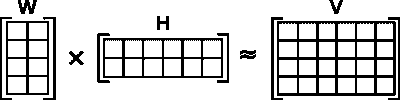
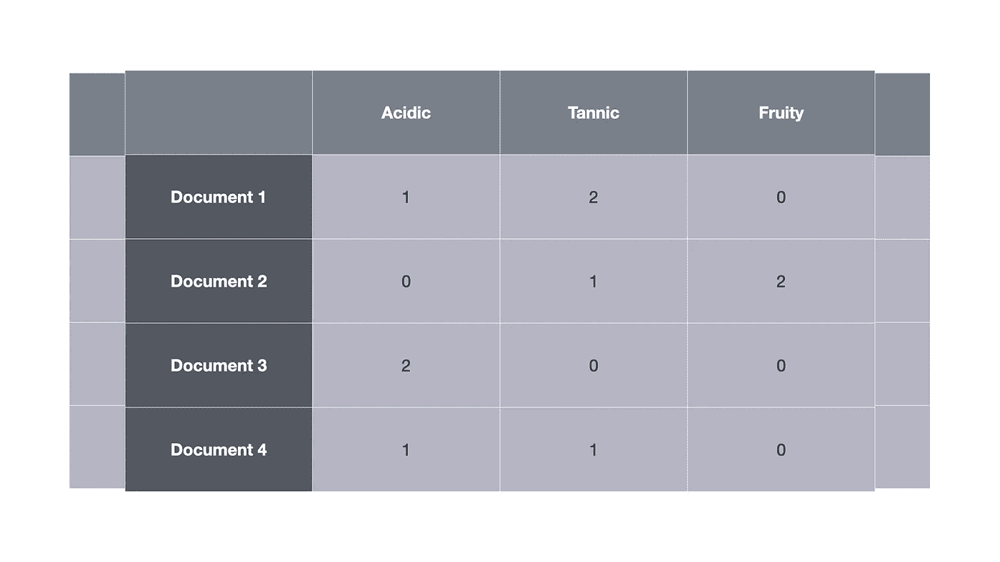
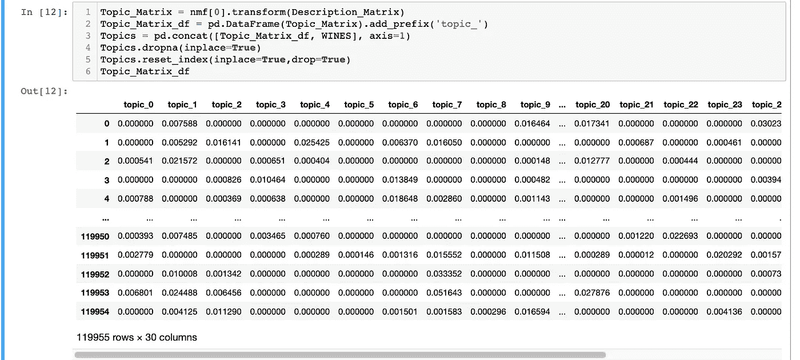
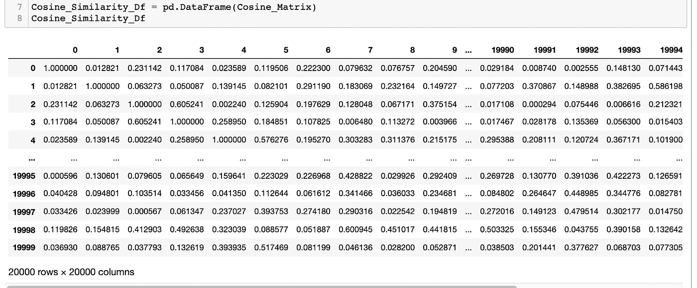
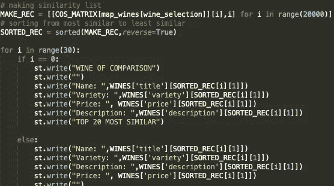
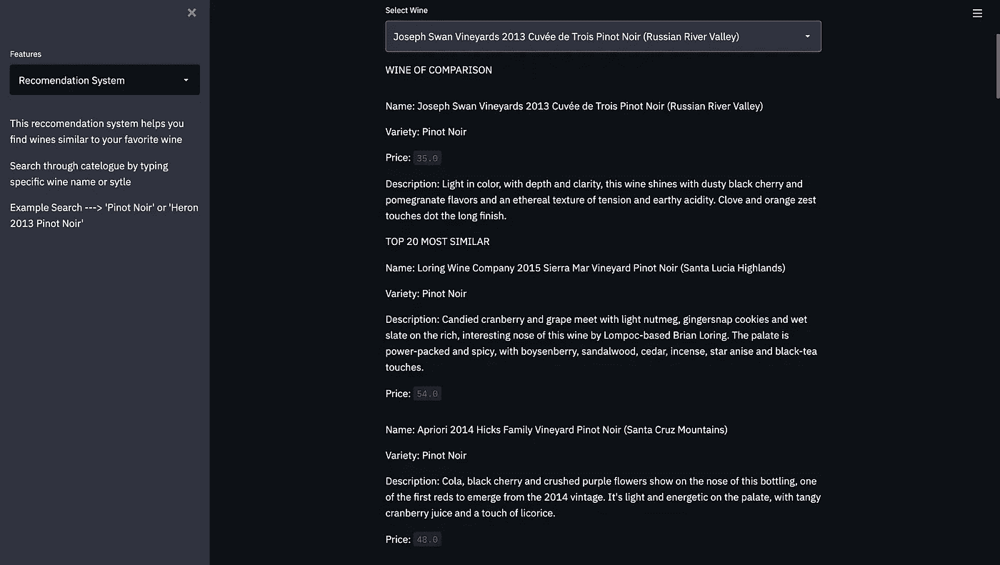
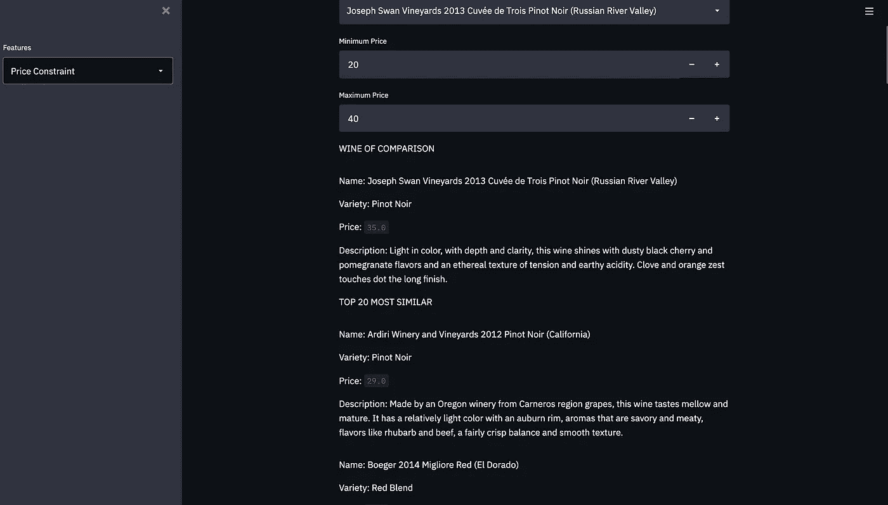

# 利用 NMF 主题建模构建推荐系统

> 原文：<https://medium.com/analytics-vidhya/leveraging-nmf-topic-modeling-in-building-recommendation-systems-2e5d2a190106?source=collection_archive---------20----------------------->

侍酒师，原创的葡萄酒推荐系统

传统上，葡萄酒推荐建立在机构知识的基础上。非常有才华的人，品味高雅，通过品尝、阅读、闻和谈论葡萄酒来建立自己的心理数据库。通过多年的实践，他们能够为渴望喝酒的人提供细致入微的建议。但是如果有一种方法可以使用无监督的机器学习来增加他们的知识呢？这就是主题建模的用武之地！利用非负矩阵分解(一种无监督的机器学习技术)和余弦相似性(一种非欧几里德相似性技术)可以帮助葡萄酒鉴赏家纯粹基于对各种葡萄酒的描述来理解葡萄酒结构。

# 无监督学习

无监督 ML，简单来说就是机器学习的一个分支，利用无标签的输入来检测底层数据中的模式和结构。对于这个项目，输入是葡萄酒描述的集合，通常称为*文档。*示例描述如下:

*充满了阿拉伯树胶、成熟苹果、榛子和不寻常的黑醋味。口感已经进化，失去了大部分水果的丰富和新鲜，取而代之的是蜂蜜矿物质、烤坚果和一丝干柑橘的味道。*

数据集中的每种酒都有一个描述，它们合在一起就是一个描述的集合，称为*语料库。从这里我们可以使用一种叫做 NMF 的技术来构建我们的模型。*

# 非负矩阵分解

NMF 的数学支柱是线性代数，特别是矩阵分解。复杂的数学细节太繁琐，本文无法一一介绍。但我会试着简单描述一下

重建术语文档矩阵(五)

矩阵 V 是术语文档矩阵。在这个特定的例子中，我们通过使用 TF-IDF 矢量器构建了矩阵 V。这意味着 V 的每一行都是一个(1 X N)向量，其中 N 列表示在 TF-IDF 中找到的单词。V 中的几行示例如下所示

现在，这个术语文档矩阵包含来自几乎整个语料库的字数(我说几乎是因为 TF-IDF 允许通过函数传递约束，以限制没有添加语义值的无用单词)。当语料库中的文档数量很大时，这可能意味着高维度的术语文档矩阵。所以 NMF 的目标是降低维度，我们可以通过实施 NMF 来实现。这就是 W 和 H 矩阵的用武之地。下面是 W 和 H 代表什么的简要说明

> NMF 将产生两个矩阵 W 和 h。W 的列可以被解释为基础文档(单词袋)。在这种情况下，我们能对这样一份基础文件作出什么解释？他们代表话题！在不同文档中同时发现的多组单词。h 告诉我们如何将不同主题的贡献相加，以重构给定原始文档的单词组合。[链接](https://blog.acolyer.org/2019/02/18/the-why-and-how-of-nonnegative-matrix-factorization/)

# 构建基于内容的推荐系统

好了，说够了。更多关于 NMF 的阅读，你可以点击上面的[链接](https://blog.acolyer.org/2019/02/18/the-why-and-how-of-nonnegative-matrix-factorization/)。我们将使用主题矩阵 W 的行作为向量来构建我们的余弦相似性推荐器。

主题矩阵(n=30)

思考上述主题矩阵的最佳方式是将每一列视为一个特定的主题(水果味、红色、混合红色、白色、酸性等)..)并将每一行作为我们语料库中的一个特定文档。因此，每个条目都表示 topic_y 在多大程度上代表了文档 X。因此，在第 2 行(索引 1)中，您可以看到 topic_4 和 topic_2 被高度代表。现在是有趣的部分！

# 短暂的插曲变成余弦相似

给定两个 n 维向量 A 和 B，我们可以用以下等式求出它们之间的角度

余弦相似性

这在视觉上表现为，

余弦相似性的可视化表示

因此，根据两个物体之间角度的大小，它们是相似的。较小的角度表示两个文档之间的相似度较高，而较大的角度表示两个文档之间的相似度较低。幸运的是，Scikit-Learn 有一个内置的库来计算余弦相似性，所以它不必在 Numpy 中单独完成。

余弦相似矩阵

每行和每列代表语料库中的一个特定文档。但是让我们从文档/语料库转向葡萄酒和葡萄酒描述。因此，对于**葡萄酒 0** (第 0 行)，如果您遍历从 0 到 19，994 的列，您可以读取每种葡萄酒与**葡萄酒 0 相比的相似性得分。**

当你将葡萄酒 0 与它本身进行比较时，你得到的相似性分数是 1。这是有意义的，因为如果你从余弦相似度计算中读取原始角度，你会得到一个 0°的角度。两个葡萄酒向量都指向 n 维空间中的同一个位置。您在上面的代码片段中看到的相似性读数是当您通过余弦函数传递原始角度读数时，余弦(0) = 1。

现在我们有了相似性得分，我们可以将上面的葡萄酒描述的索引与[原始数据集](https://www.kaggle.com/zynicide/wine-reviews)中的葡萄酒标题进行匹配。之后，我们可以按降序排列分数。这是片段，

组织葡萄酒相似性得分

# 简化应用程序

最后，Streamlit 允许我们集成一些交互性。Streamlit 使互动烘焙变得非常容易。下面是这个应用程序的一个片段，

用户可以从数据库中选择一种葡萄酒，并查看哪些葡萄酒与其最相似

用户也可以通过价格范围过滤相似的酒，

# 见解和要点

这个项目真的很有趣。这是我第一次尝试无监督学习，这本身就是机器学习的一个非常有趣的子学科。

从这个项目中有两个主要收获，第一个是从 NMF 生成的主题矩阵到一个全功能的推荐系统是多么容易。想出一种在余弦相似性中使用的矢量化内容的方法并不是一项简单的任务，如果不是为了主题建模的话，这项工作会更加费力。

第二点是主题建模作为一种降维技术是多么强大。很多时候，当建模很难为你的模型提出一个简洁的特性集，并且你经常会留下太多或太少的特性时，主题建模很容易为我们做到这一点。更有用的是，这些主题可以用作各种监督学习项目的特征，如回归或分类。

感谢您的阅读！如果你有任何问题或者只是想谈论机器学习、主题建模或者任何与数据科学相关的想法，你可以通过 [LinkedIn](http://www.linkedin.com/in/jcongard) 联系我。

你也可以在我的 [GitHub](https://github.com/Jgardner91/NLP) 上看看我的项目。特别感谢 [**梅蒂斯**](https://www.thisismetis.com/) 为我提供了探索数据科学世界的工具:)