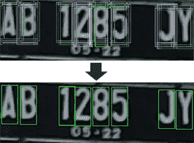

# 车牌字符识别:kNN & CNN

> 原文：<https://medium.com/analytics-vidhya/license-plate-character-recognition-knn-cnn-c6b4a3342515?source=collection_archive---------6----------------------->

本文基于两篇论文，重点关注人工智能的快速发展领域及其在实时世界中的实现。它讲述了使用机器学习(ML)和深度学习(DL)识别车牌字符的过程。使用的技术分别是 k-最近邻(kNN)和卷积神经网络(CNN)。因此，性能，结果和方法进行了讨论。这 36 个角色中的每一个都是在不同的环境中使用这些算法来训练的。准确性是从训练和测试数据中提取的。该自主系统用于交通监控中的车辆牌照识别。副产品还包括在犯罪调查、监视系统、收费和停车场管理中的应用。因此，该系统可以帮助跟踪车主的身份，并根据违规情况对他们进行相应的收费。

(图片提供:参考文献)

区域聚类

> C ***哈兰格斯***

近年来，这种车牌识别技术得到了快速发展。所有这些用例都隐含在用计算机视觉代替人眼的实时环境中。这引发了一些问题，例如

a)由于快速行驶的车辆
导致的运动模糊效果 B)由于外部前灯/反射
导致的过多光线 C)由于夜间或破碎的街灯导致的照明不足
d)由于街道/建筑灯故障导致的车牌污染
e)由于灰尘/雨水/硬件导致的低分辨率
f)由于摄像机角度导致的图像倾斜
g)字符轮廓，如各种字体样式/大小
h)由于车牌背景/纹理/自然光导致的分割级别
i)类似字符，如 D-0-Q-1

捕捉车牌图像后的一些挑战

由于没有办法控制这些环境因素，我们必须确保算法预测足够准确和稳健。正如 read 所说，这两种技术产生了几乎相同的准确率，约为 87%。但它有望尽可能地提高准确性，因为它可能会导致公民对他们没有犯下的行为的错误获取。因此，两篇论文都试图通过分别使用轮廓和线段提取方法来提高精确度。

> ***算法***

kNN 流程图

轮廓提取在[1]中使用 ML 的 kNN 技术用于分类。获得车牌图像后，计算出车牌的轮廓。如果根据它们的尺寸被发现有效，则这些板被分割成检测到的轮廓。使用 kNN 对这些轮廓进行分类。kNN 是最简单和广泛使用的分类算法。在 kNN 中，训练数据集存储在数组/向量中。这些存储的属性由独立变量组成。每当需要分类时，就会产生这些属性的变化组合，形成因变量。这些因变量存储在不同的类别中。如果一个变量不属于任何类，那么使用 kNN。因此，分类是通过提取 k 个已知类别的样本来完成的。通过在相似的参数上取距离，将这些样本与它们的邻居进行比较。这些距离可以是欧几里得距离、曼哈顿距离或闵可夫斯基距离，称为权重。在本文中，k = 1，其中仅识别一个邻居。“k”是分类时考虑的邻居数量。分类可以基于属于一类的样本的距离或数量来完成。但是当 k = 1 时，这种方法导致过拟合，因此易受噪声影响。而在 k = T 的情况下，观察到过度平滑或欠拟合，其中 T 是最大样本。

CNN 流程图

在[2]中使用分割方法来执行 DL 的 CNN 中的字符识别。这是使用 CNN 和滑动窗口(SW)进行细化来检测的。SW 将区域传送给 CNN 进行检测。而 CNN 区分字符和非字符区域。这创建了改进的固定大小的边界框，以提高分割的准确性。字符分割是一个关键特征，因为实时环境包含有缺陷的墨水、噪声、倾斜方向和照明。在 CNN 中，权重和偏差被分配给图像的各个方面。这有助于通过图层网络将图像与其他图像区分开来。采集图像后，获取该图像的灰度并将其提供给软件。这个固定的盒子从图像中检测出各个区域，转发给 CNN 进行预测。包围盒区域的分类由聚类算法完成。聚类包括对具有相似属性的数据进行分组。CNN 是从多层感知器(MLP)中的二维数据发展而来的。CNN 的学习过程有两个步骤，前馈和反向传播。有隐藏层使用校正线性单位(ReLU)卷积来过滤图像。

> ***方法论***

类别的二维 kNN 聚类

基于轮廓的字符分离

在[1]中，轮廓提取过程被用于车牌识别。在获得板图像之后，计算轮廓以验证来自图像的大小字符。然后将板分割成各自的轮廓。使用 kNN 算法，完成字符的分类。这是通过给由 26 个字母和 10 个数字组成的 36 个不同的字母数字字符分配一个类别来实现的。所有这些不同轮廓的字符被用作标准字体的训练集。每个轮廓被指定一个类别。分配多个训练数据以提高准确性，但限制训练量以减少计算时间。这是通过增加实例来实现的。利用定位板图像，进行测试和验证。通过检测轮廓，在调整车牌图像的大小后，字符被彼此分离。如果检测到的轮廓属于任何一个类别，那么就用 kNN 对其进行分类。通过使用欧几里德距离，对尺寸调整后的图像的尺寸进行逐像素的属性比较。角色分配的决定是由 kNN 的多数投票决定的。因此，流程的输出是一个字符串。

预测区域的分割

从每个聚类中获得单个有界盒

CNN 算法在[2]中使用，通过 SW 预测分割区域，以检测字符的存在。然后通过聚类技术对它们进行分类。SW 是一种从图像矩阵中提取区域技术。本文采用 25*60 的窗口大小来提取 94*300 以上的图像。这 3174 个提取的区域被馈送到 CNN 用于字符或非字符区域的分类。这里设置了三个卷积层滤波器和具有 128 个神经元的 ReLU 激活函数。其中 2 个神经元具有 Softmax 功能。其中 softmax 函数是将多维数据归纳为概率总和为 1 的逻辑函数。由于多个质心，这导致许多区域被检测为字符。应用层次凝聚聚类(HAC)来分离这些质心。HAC 是一种自下而上的方法，用于确定这些消除质心之间的距离。这种消除是基于为每个子聚类设置的最小距离来完成的。在字符的边界框固定后，通过设置框的平均限制进行细化。这样做是为了避免不良精度导致不良分割。并且为了细化，收缩和扩展概念被用在盒子的坐标上。

> I ***发布会***

在[1]中，该技术在对包含 183 个字符的 30 个车牌进行实验后，达到了 87.43%的准确率。观察到 k 值的增加降低了字符识别的准确性。结果在 k = 1 (1NN)时最大。与人工神经网络相比，其准确率为 86.34%。为了适合实时系统，要求最低 30 fps 的处理速度。因此，该系统以每帧 0.034 秒的速度运行，接近所需的速率。然而，少数帧超出了最大限制，但被其他帧的快速处理所补偿。因此，这里使用 kNN 作为分类器来计算提取的轮廓的分类。这是通过找到训练和验证数据集的属性之间的欧几里德距离来完成的。这个数据集只不过是通过相机输入算法的输入图像的像素矩阵。该过程从将车牌图像分割成单个字符开始。这些字符由边框分隔。在模板训练数据集的帮助下，在 kNN 算法中对这些盒子进行分类。此外，两个系统的精度实际上保持相同。所以，kNN 相当于精确的现有技术。

我们在[2]技术中读出了 87.06%的准确度。他们使用 CNN 和 SW 结合边界框细化来分割字符以检测车牌。该模型对包含 982 个字符的 138 个车牌进行了测试，其中 855 个字符被成功分割。因此，我们可以比 kNN 更依赖这种技术，因为它只对 30 幅图像进行了测试。CNN 用于区分字符区域和非字符区域。具有 2 像素步幅的 SW 用于提取区域。这些提取的区域被馈送到 CNN 模型，其概率输出基于两个类别。字符值类的阈值设置为 0.95。为了执行 HAC，对潜在的基本事实进行了聚类。从包围盒的 x 和 y 坐标的平均值中取出单个盒子，并进行细化。如果并集上的交集(IoU)值超过 0.75，则边界框被确定为真分割。IoU 是交集面积与并集面积之比。对三个组合进行了 SW 和 CNN 测试，得到了 44.29%的准确率。但通过添加边界框重定位(BBRep)，准确率提高到 65.68%。最后，在添加细化(BBRef)后，准确率为 87.06%，成功分割 855 个。因此，在增加重新定位和调整后，IoU 值会变得更高。

> ***参考文献***

[1]
A. R. F. Quiros 等人，“一种基于 kNN 的车牌号码字符识别机器视觉方法”，TENCON 2017–2017 IEEE 第 10 区会议，槟城，2017，第 1081–1086 页，doi:10.1109/TENCON . 2017 . 2012828386

[2]
A. T. Musaddid，A. Bejo 和 R. Hidayat，“使用 CNN 改进印度尼西亚车牌识别算法的字符分割”，2019 年信息技术和智能系统研究国际研讨会(ISRITI)，印度尼西亚日惹，2019，第 279–283 页，doi:10.11109/ISRITI . 486863676