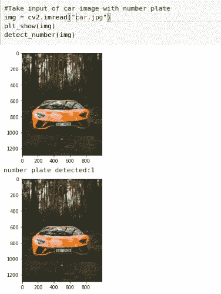
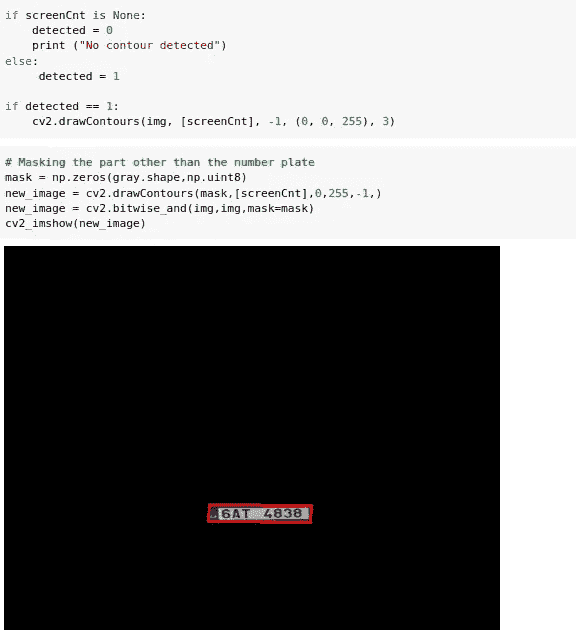

# 基于 Harr 级联和开放 CV 的汽车图像车牌检测

> 原文：<https://medium.com/analytics-vidhya/license-plate-detection-from-car-images-by-using-harr-cascade-and-open-cv-255f296557cc?source=collection_archive---------4----------------------->

> 使用 pytesseract 和 open CV 进行图像检测和文本转换

计算机视觉是一个神奇的领域，可以处理许多现实生活中的问题。从图像中检测汽车牌照并从图像中提取文本可能相当具有挑战性。这里使用的数据集是一个。来自分类器级联的 harr 级联的 xml 文件。文件可以从这个[链接](https://github.com/opencv/opencv/blob/master/data/haarcascades/haarcascade_russian_plate_number.xml)下载。

让我们按照以下步骤进行车牌检测:-

1.  阅读文件

正在读取 harr 级联 xml 文件

2.将图像转换为灰度，并通过定义宽度和高度进行轮廓绘制以检测图像中的车牌

定义函数将图像转换为灰度并进行轮廓绘制以检测车牌

3.读取图像文件并标记车牌

检测到车牌

4.使用检测到的车牌再次将图像转换为灰度

灰度图像

5.对图像执行形态学变换

形态变换图像

6.执行边缘检测

图像边缘检测

7.裁剪图像，以便仅聚焦在车牌上

图像已被裁剪，仅用于车牌

8.使用 pytesseract 将图像转换为文本。

号码现在是来自号码牌的文本格式

结论:-我们现在已经通过使用 OpenCV 和通过使用 pytesseract 将图像转换为文本从图像中检测到了车牌。一些字母和数字可能会被错误地检测出来，因为它不是 100%准确。

参考资料:-

1.  关于哈尔喀斯喀特:-[https://www . geeks forgeeks . org/python-Haar-cascades-for-object-detection/](https://www.geeksforgeeks.org/python-haar-cascades-for-object-detection/)
2.  关于 OpenCV:-[https://www . tutorialspoint . com/OpenCV/OpenCV _ reading _ images . htm](https://www.tutorialspoint.com/opencv/opencv_reading_images.htm)
3.  关于 pytesseract(图像到文本):-[https://www . simplified python . net/how-to-extract-Text-from-Image-in-python/](https://www.simplifiedpython.net/how-to-extract-text-from-image-in-python/)
4.  完整代码:-[https://github . com/saish 15/Machine-Learning/blob/master/License _ Plate _ detection . ipynb](https://github.com/saish15/Machine-Learning/blob/master/License_Plate_Detection.ipynb)