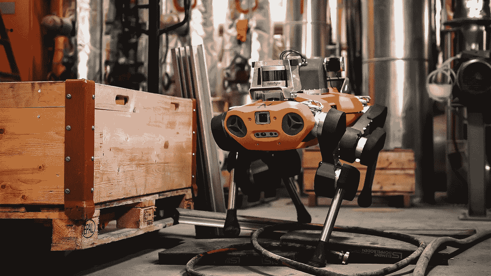
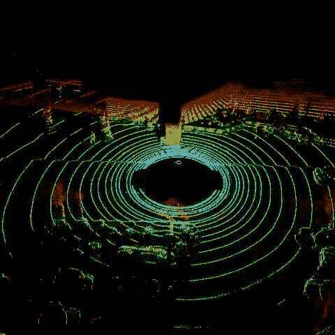
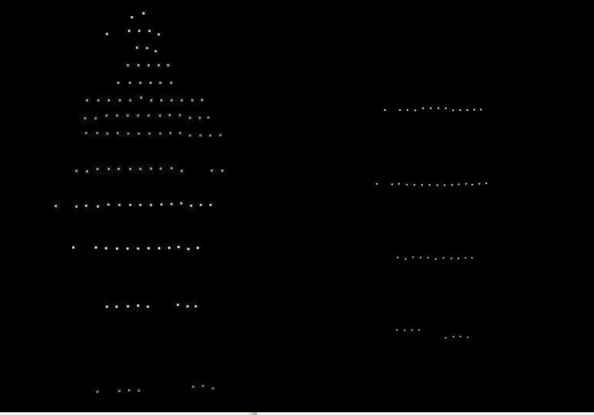

# 激光雷达:光探测和测距传感器—第 1 章

> 原文：<https://medium.com/analytics-vidhya/lidar-light-detection-and-ranging-sensor-chapter-1-68cad17c8847?source=collection_archive---------18----------------------->

一起深入了解 3D 激光雷达、历史及其应用。

威力登三维激光雷达

我第一次接触激光雷达是在我开始从事自主导航项目的时候。作为一名电子工程师，我一直对传感器及其应用着迷。

一年前，我开始研究激光雷达。这将是一系列关于激光雷达的博客，分享我在一段时间内获得的知识。

*无人系统，我们可以称之为自主系统，如机器人和自动驾驶汽车，在没有人机界面的情况下运行。自治系统需要做以下事情:感知环境、系统变量的当前状态、位置:确定下一步采取什么行动并制定计划、考虑安全标准、避免对人类安全或自治系统本身造成风险的情况。为了感测环境，使用多个传感器，并且在选择传感器时，它们的特征起主要作用。*

# *什么是“激光雷达”？*

激光雷达代表“光成像探测和测距”。正如声纳使用声波，雷达使用无线电波来创建环境地图一样，激光雷达使用光。

# “激光雷达”是什么时候发明的？

激光雷达[于 20 世纪 60 年代](https://www.britannica.com/technology/lidar)首次使用，当时激光扫描仪被安装在飞机上。在 20 世纪 80 年代引入 GPS 来计算精确的地理空间测量值之后，这种方法变得更加流行。现在激光雷达应用扩展到许多领域。

# 它是如何工作的？

激光雷达的工作原理与雷达相同。激光雷达技术测量自身和目标之间的距离。光(激光)从激光雷达发射并传播到目标。它会从它的表面反射回来，回到它的源头。由于光速是一个恒定值，激光雷达能够计算到目标的距离。

知道了传感器的位置和方向，**就可以计算出反射面的 XYZ 坐标**，用**点**表示。通过多次重复相同的过程，创建激光雷达接收到的所有点的地图。这张地图被称为 ***点云*** 。

# **激光雷达有类别吗？**

是的，激光雷达的种类是有区别的，比如雷达、1D、2D 和 3D。**“D”对应尺寸。**

1.  **1D 激光雷达**由静止的激光束组成，它在一个轴上计算障碍物和扫描仪之间的一维距离。
2.  **2D 激光雷达**由**一束激光束**组成，激光束有一个自旋(旋转)机制，它收集到目标的水平距离以获得 X 和 Y 轴上的数据。
3.  对于一个 **3D 激光雷达**来说，思路是一样的，但是**几束激光束**垂直叠加，射出得到 X、Y、Z 轴上的数据。每个激光束将与其他光束成角度δ。

***1D 和 2D 的激光雷达主要用于机器人技术，但 3D 激光雷达用于高级机器人系统来模仿人类。***

# 激光雷达的特点:

使用激光雷达 3D 绘制环境的 3D 地图

激光雷达的主要功能如下:

**视场**:激光雷达有 360°视场。大视场对于自主系统在环境中安全导航至关重要。

**范围:**范围是定义物体可以探测到多远的特性。传感器的范围越大，自主系统将检测到物体并在安全时间内采取所需的行动。在高速公路上，至少 100 米的距离让车辆有时间对不断变化的路况和环境做出反应。

**分辨率:**分辨率对识别对象起主要作用；分辨率越高，我们能获得的信息就越多，比如物体的大小、形状和位置。高分辨率激光雷达对于各种速度下的物体探测和防撞至关重要。

**垂直视野**:这是激光雷达的另一个最佳功能，有助于现实生活中的驾驶需求。我们需要有关于高物体、路标和驾驶不同坡度道路的信息，而不是只考虑物体的一个平面。

**通道大小:**通道的数量越多，创建的对象越好。下图显示了使用圆盘 32 和圆盘 16 模型的威力登激光雷达从 10 米距离进行的人检测，(32 和 16 是各自的激光雷达的通道)。

**左侧:使用威力登 puck32 进行人物检测，右侧:使用威力登 puck16 在 10m 处进行人物检测** [**参考**](https://www.mapix.com/news/velodyne-ultra-puck-review/)

**激光雷达**与其他传感器相比有许多优点如下:

*   激光雷达数据可以高精度(通常以 10/20 HZ 的速率)实时采集
*   激光雷达数据可以很容易地与许多传感器融合，如相机，全球定位系统。传感器融合有助于克服激光雷达的缺点。
*   激光雷达技术即使在黑暗的地方也能很好地探测物体。

> 我是电子工程师。我发现传感器融合和数据科学领域令人着迷。我目前是一名人工智能工程师。希望能为这个不断成长的数据科学社会做点贡献。可以在 [**LinkedIn**](http://www.linkedin.com/in/tejalgole) 上联系我。