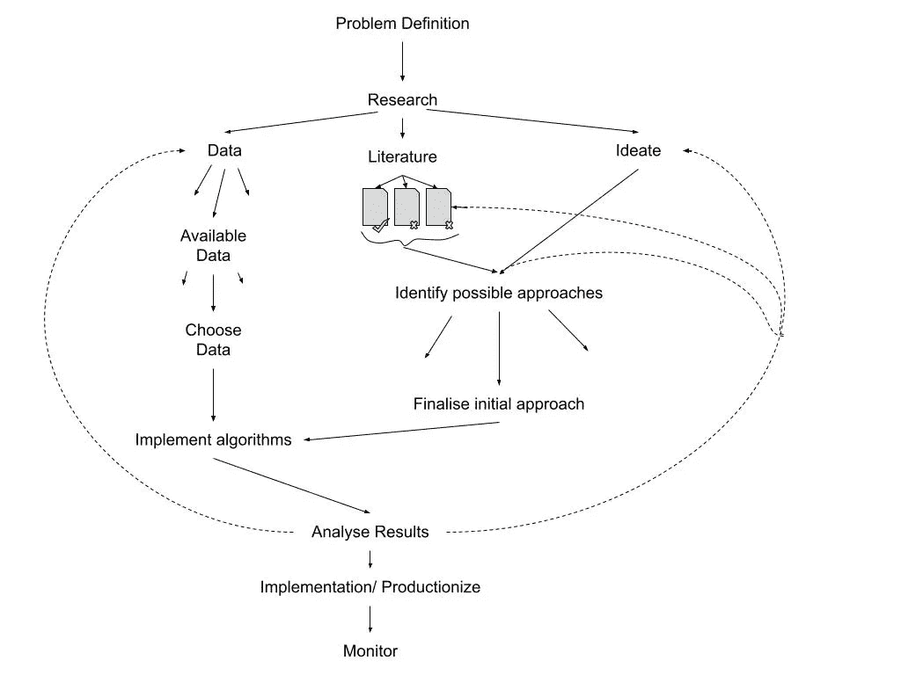

# 数据科学项目的生命周期

> 原文：<https://medium.com/analytics-vidhya/life-cycle-of-a-data-science-project-25681ef0655d?source=collection_archive---------17----------------------->

马拉·吉利亚季诺夫在 [Unsplash](https://unsplash.com/s/photos/jellyfish?utm_source=unsplash&utm_medium=referral&utm_content=creditCopyText) 上拍摄的照片

本文深入探讨了典型的数据科学项目流程。它面向数据科学家和涉及数据科学/机器学习的项目的利益相关者。重要的是，参与的每个人都要了解这类项目的性质，并对其各种活动感到满意。对每个人来说，接受实验的想法也很重要。这篇文章描述了我思考和着手一个数据科学项目的方式。

由作者创建

数据科学项目有一个循环的生命周期。每个周期可以被认为是一个实验。如上图所示。

每个数据科学项目都是从定义问题陈述开始的。清楚地了解我们要解决的问题。这也包括定义成功的标准。

# 问题定义

在一些项目中，定义问题陈述本身是项目的一个阶段。这通常是当客户进来说，我们已经收集了(例如)销售数据。用它可以做什么有用的洞察或预测。定义问题陈述也意味着找出不确定性。例如，如果我们试图预测需求，那么必须明确细节，如“我们希望预测未来的需求是多少？“下周还是下个月，”

# 研究

下一阶段涉及研究。这通常包括阅读领域知识，理解要解决的问题陈述，估计我们需要的数据类型。如果问题陈述是模糊的，那么研究和问题定义可能会重叠&帮助回答在问题定义阶段可能出现的一些问题。

发布这篇文章有 3 个平行的路线或活动:

1.  数据
2.  文学
3.  思维能力

# 数据

这涉及到理解系统中的当前数据。它包括了解对解决问题有用的数据类型，并进行差距分析。在项目全面启动之前，哪些数据缺口是必须填补的，哪些缺口是可以弥补的。

# 文学

研究阶段涉及研究领域，而文学阶段则更为具体。调查现有的文献是非常重要和有用的。在非常特殊的情况下，人们会遇到一个以前从未见过的问题陈述。虽然数据科学中的每个项目都是独一无二的，因为即使在类似的项目中，数据也具有独特的性质，但是可以研究实现这些项目的方法。这项研究通常分为两个阶段——首先是广度，然后是深度。这个想法是肤浅地理解问题陈述已经被处理的不同方式和方法。然后从中找出与当前问题相关的几个，并对其进行深入研究。

# 想象

这涉及大量的头脑风暴、讨论、假设和白板。它将涉及从数据轨道和文献轨道获得的信息。而且讨论处理和解决问题的新方法。即使解决方案看起来显而易见，至少作为一个试探板和某人一起走一遍也是一个好主意。这是我们在这条赛道上想要的最大的想法流。一旦我们有了许多想法，人们可以组合、抛弃、保留和发展其中的一些。这条路线更侧重于获得许多想法&从许多不同的角度看待手头的问题。如果需要，构思阶段可能会涉及概念验证。

结合上述 3 条轨迹，**识别出可能的进近**。然后对这些进行优先排序&初步方法**最终确定**。例如，我们有一个分类问题，人们可以根据经验&时间和精力的权衡，概述要探索的模型种类并对它们进行优先级排序。或者如果有不同的特性要探索，一个好的方法是把它们都列出来。与涉众讨论这些，以确定哪些特性是重要的，值得努力创建(并非所有特性都可以在数据库中轻松获得)。把这几个前几名作为第一周期。你也可以把每个周期看作一个里程碑。

这些方法和算法然后被**实现**&**结果分析。**这不仅仅是查看模型的准确性，更多的是了解输入特征及其对模型的影响(特征重要性)。它还包括与先前实验结果的比较。

基于结果、对模型的理解、所涉及的特征和成功标准，人们通常会回到数据和构思阶段。有时文学阶段也是如此。我们现在对数据以及我们最初的想法/假设是如何工作的有了更好的理解。因此，我们处于一个更好的位置来调整我们的方式和方法，整个周期重新开始。

一旦我们对模型有了好的结果和足够的信心，它就可以**集成**到工具/产品/软件中

然而，这还不是结束。在模型投入生产之前，**监控**指标需要落实到位。随着时间的推移，数据的性质可能会发生变化。这种模式将不再像过去那样运行良好。这也被称为模型漂移(但那是另一个时间)。因此，该模式需要不时进行修订。监控指标可以帮助跟踪模型的性能，并且将有助于决定何时&应该多频繁地修改模型。

感谢阅读。如果有些事情不清楚或者你同意/不同意某些观点？请在你的评论中让我知道。我喜欢听到不同的观点:)