# 数据科学项目的生命周期:实践指南

> 原文：<https://medium.com/analytics-vidhya/life-cycle-of-data-science-project-hands-on-guide-ee1b2dd5d45e?source=collection_archive---------0----------------------->


图片来源:[https://unsplash.com/photos/eveI7MOcSmw](https://unsplash.com/photos/eveI7MOcSmw)

# 介绍

随着对数据科学家需求的增加，更多的人愿意进入这个领域。展示正确的技能以脱颖而出进入顶级公司变得非常重要。这就是项目发挥作用的地方。此外，端到端项目让您接触到实时工作环境。**在本指南中，我将通过实际操作演示来解释数据科学项目的完整生命周期。**我们将采用机器学习问题陈述，并使用 Flask 构建一个 web 应用程序作为其解决方案，并将其部署在 Heroku 云应用程序平台上。我们开始吧！

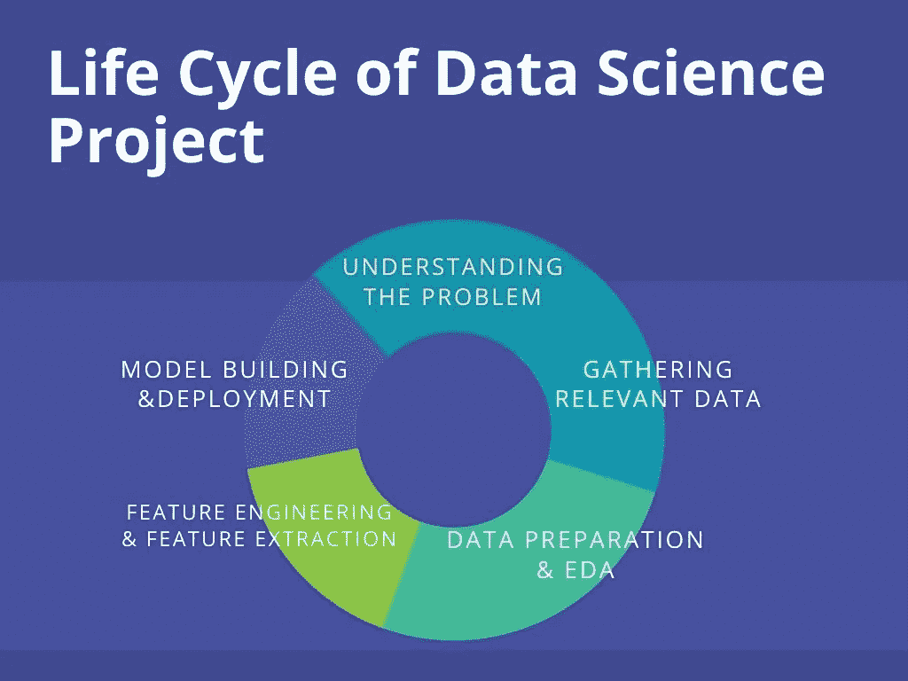

图片来源:【https://bit.ly/3zodc6H 

# 1.理解问题

项目的生命周期从理解问题陈述开始。该项目的问题陈述([来源](https://www.hackerearth.com/challenges/competitive/hackerearth-machine-learning-challenge-predict-burnout-rate/))是:构建一个基于 web 的应用程序，在后端使用机器学习模型，该模型根据各种工作-生活因素(如工作时间、在家工作的可能性、精神疲劳评分等)预测公司员工的倦怠率。

**案例分析:**快乐健康的员工无疑工作效率更高。他们帮助公司蓬勃发展。然而，随着疫情的实施，大多数公司的情况都发生了变化。自从在家工作以来，超过 69%的员工已经表现出倦怠症状(调查来源: [Monster](https://learnmore.monster.com/poll-results-from-work-in-the-time-of-coronavirus) )。燃尽率确实惊人。许多公司正在采取措施确保员工保持心理健康。作为解决方案，我们将构建一个 web 应用程序，公司可以用它来监控员工的工作倦怠。此外，员工自己可以用它来检查他们的倦怠率(没有时间评估快速工作生活中的心理健康)😔).

# 2.收集相关数据

python 中有很多库——漂亮的 Soap，用于抓取数据的 Selenium。此外，还有像 ParseHub，Scrappy，Octoparse 这样的 web 抓取 API，可以减少耗时。Web 报废是数据科学项目的关键部分，因为其生命周期取决于**数据**的质量和相关性。

在这个项目中，数据集取自 [Kaggle](https://www.kaggle.com/blurredmachine/are-your-employees-burning-out) 。在进一步阅读之前，先看一下数据。

**数据集**

以下是数据属性及其描述-

*   **员工 ID** :公司分配给每个员工的唯一 ID。
*   **入职日期**:员工入职的日期。
*   **性别**:员工的性别。
*   **公司类型**:员工所在公司的类型(服务/产品)。
*   **WFH 设置可用**:员工是否可以在家办公(是/否)。
*   **职务**:员工在其组织中的职务。在范围— [0.0，5.0]中，0.0 是最低值，5.0 是最高值。
*   **资源分配**:分配给员工工作的资源数量，解释为工作小时数。在范围内— [1.0，10.0](更高意味着更多资源)。
*   **精神疲劳评分**:员工在工作时间内的精神疲劳程度，范围为[0.0，10.0]，其中 0.0 表示不疲劳，10.0 表示完全疲劳。
*   **消耗率**:每个员工在工作时间内的消耗率的数据中的目标值，在范围— [0.0，1.0]内，值越高，消耗越多。

**关于数据的几点重要说明:**

1.压力和倦怠的区别在于，倦怠是一种不同的精神状态。在压力下，你仍能设法应对压力。但是一旦精疲力尽，你就没油了，你已经放弃了克服障碍的所有希望。

2.当你精疲力竭时，你感觉的不仅仅是精神上的疲劳。

# 3.数据准备和 EDA

收集完数据后，数据准备开始发挥作用。它涉及到清理和组织数据，众所周知，这占据了数据科学家 80%以上的工作。真实世界的数据是原始的，可能充满了重复项、缺失值和错误信息。因此，需要清理数据。

一旦数据被组织起来，我们就通过探索性的数据分析提取数据中包含的信息并总结其主要特征。EDA 是定义良好的数据科学项目的重要阶段。它在统计或机器学习建模阶段之前执行。

理论讲够了，让我们开始动手部分吧！

```
df.info()
```

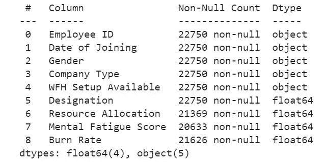

**输出**(图片作者提供)

*   有 5 个分类特征和 4 个数字特征。在这 5 个特征中，除了*员工 id* 之外，所有特征都是有用的，因为它与目标(即*燃烧率*无关。让我们首先执行探索性数据分析，同时我们将把分类特征转换成模型可以理解的形式。

```
#Date and month might not be a useful feature. But the year of joining is. It has some significant information that the model can use.df['Year of Joining'] = df['Date of Joining'].apply(lambda x : x.split('-')[0])df['Year of Joining'].describe()
```

**输出:**该特征只有一个唯一值，即 2008。这可能不是一个有用的功能。所以我们放弃了。

```
df.drop('Year of Joining',axis=1,inplace=True)
```

让我们对其他分类特征做一些 EDA。此外，我们还会做数据准备部分-

## 电子设计自动化(Electronic Design Automation)

```
sns.boxplot(x = 'Gender', y = 'Burn Rate',data = df);
```

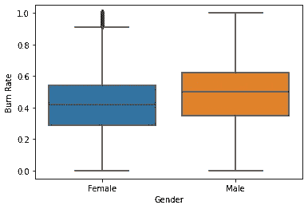

**输出**(图片作者提供)

*   男性员工的平均(中位数)*烧伤率*高于女性员工。让我们通过比较其他因素来找出可能的原因，如:指定、工作时间等。在公司的两种性别中。

**注:**箱线图显示女性员工的*燃烧率*记录中存在异常值。我们会处理好的。

```
sns.countplot(x = 'Gender',palette=sns.color_palette("hls"),data = df);
```

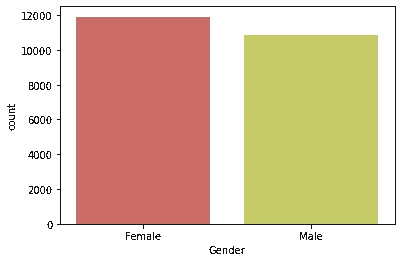

**输出**(图片作者提供)

*   数据中有更多女性员工的记录。

```
sns.countplot(x = 'Designation',hue ='Gender',palette='Blues_d',data = df);
```

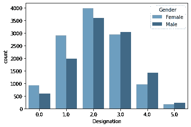

**输出**(图片作者提供)

*   在较高职位(> 2.0)工作的男性较多。

```
sns.boxplot(x = 'Gender', y = 'Resource Allocation',palette=sns.color_palette("Paired"),data = df);
```

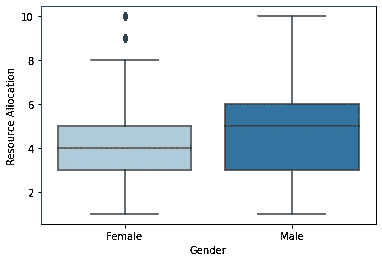

**输出**(图片作者提供)

*   大多数女性雇员工作时间长达 8 小时，而男性雇员工作时间长达 10 小时。两性之间的平均工作时间(中位数)相差 1 小时。

**注意**——我们再次观察到特征中的异常值——女性记录中的*资源分配*。

```
sns.boxplot(x = 'Company Type', y = 'Mental Fatigue Score',palette=sns.color_palette("hls"),data = df);
```

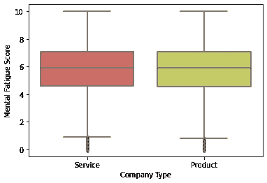

**输出**(图片作者提供)

*   这两种类型的公司的疲劳得分保持相等。**注意-** 离群值

```
sns.scatterplot(x = 'Mental Fatigue Score', y = 'Burn Rate',hue = 'Designation',palette=sns.color_palette("rocket"),data = df);
```

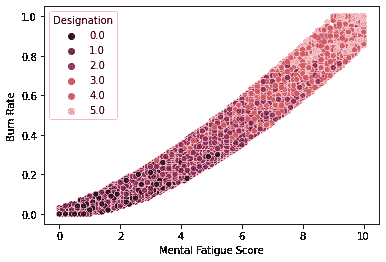

**输出**(图片作者提供)

*   这表明*疲劳分数*和*燃烧速率*之间存在非常强的线性关系。

```
sns.heatmap(df.corr(),annot = True)
```

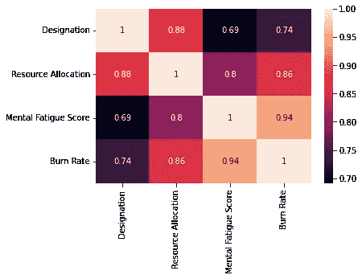

**输出**(图片作者提供)

*   除了*精神疲劳评分*之外，*燃烧率*与*资源分配*呈强正线性关系。

## **分类编码**

这是将文本数据(分类变量下的数据)转换为数字的过程，以便模型能够理解并从中提取有价值的信息。这些是一些强大的分类编码技术-

*   **顺序编码—** 包括将每个唯一标签的映射到整数值。只有当类别之间存在已知的顺序/关系时，这种类型的编码才是可取的。例如，举一个变量*产品质量*的例子，它的值为“优秀”、“非常好”、“好”、“一般”和“差”。由于该数据有一个顺序，即'优秀'>'非常好'>'好'>'一般'>'差'，我们可以使用序数编码来映射-'差':0，'一般':1，'好':2，'非常好':3，'优秀':4。
*   **一种热编码—** 这是基于类别的出现将数据转换成二进制值。这仅在类别之间没有顺序/关系时使用。例如，在我们的数据中，我们有一个名为*性别*的变量，它由男性和女性的值组成。由于没有顺序，我们使用一个热编码。

让我们继续动手部分-

```
df.drop('Employee ID',axis=1,inplace=True)
```

*   我们将在特征工程部分使用“加入日期”。

```
dat = pd.Series(df['Date of Joining'])
df.drop('Date of Joining',axis=1,inplace=True)#Applying One hot encoding -cat = []
num = []for feat in df.columns:
 if(df[feat].dtype=='object'):
  cat.append(feat)
 else:
  num.append(feat)encoder = OneHotEncoder(handle_unknown='ignore', sparse=False)
dummy_df = pd.DataFrame(encoder.fit_transform((df[cat])))
dummy_df.index = df.index
dummy_df.columns = encoder.get_feature_names(cat)
df.drop(cat,axis=1,inplace = True)df = pd.concat([df,dummy_df],axis=1)df.drop(['WFH Setup Available_No','Gender_Male','Company Type_Product'],axis=1,inplace=True)
```

## **处理缺失值**

用于处理数据中的空值的一些方法是-

*   **随机样本插补:**它涉及从数据集中提取随机观察值，并用其替换空值。适用于数据完全随机缺失的情况( [MCAR](https://stefvanbuuren.name/fimd/sec-MCAR.html) )。
*   **输入平均值/中值:**这是用各自属性的平均值/中值填充缺失数据的方法。适用于数据随机缺失的情况( [MAR](https://stefvanbuuren.name/fimd/sec-MCAR.html) )。
*   **预测空值:**当有空值的属性和没有空值的属性之间存在高度共线性时，适合使用线性回归来预测和填充缺失值。

```
df.isnull().sum()
```

*   所有列中的空值随机丢失。可能是员工不想分享/不愿分享压力分数、烧伤率和工作时间等信息。
*   *燃烧率*和*精神疲劳评分*有缺失值。让我们想象一下它们的分布。

```
sns.heatmap(df.isnull())
```

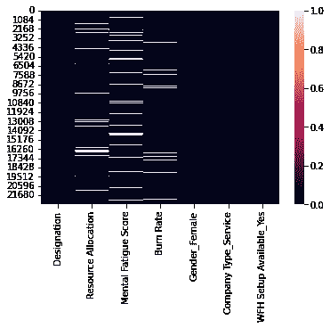

**输出**(图片作者提供)

```
df[df[‘Burn Rate’].isnull()][‘Mental Fatigue Score’].isnull().sum()
```

*   我们观察到，对于给定的样本，两个特征中的空值不会同时出现(只有 172 个值同时出现)。因此，我们通过*精神疲劳评分*来估算目标的缺失值，反之亦然，使用**线性回归**，因为它们具有很强的共线性。我们将对其余缺失值(空值同时出现的情况)使用中值/平均值插补。

```
x1 = pd.DataFrame(df[df['Burn Rate'].isnull()]['Mental Fatigue Score'])x1['Mental Fatigue Score'].fillna(x1['Mental Fatigue Score'].median(),inplace=True) 
#Filling the simultaneously occuring null values for Mental Fatigue Score with median imputation.#Imputation using Linear Regressiondf_new = df[['Mental Fatigue Score','Burn Rate']] #the training data with no null valuesdf_new.dropna(inplace=True)
```

*   在线性回归模型中，将*精神疲劳评分*作为独立特征，将*燃烧率*作为非独立特征。

```
X = df_new[['Mental Fatigue Score']] # X.shape should be (N, M) where M >= 1
y = df_new['Burn Rate']model = LinearRegression()
model.fit(X,y)pred = model.predict(x1) 
#the values to be filled in nan values of burn rateind = df[df['Burn Rate'].isnull()].indexfor j,i in enumerate(ind):
 df['Burn Rate'].iloc[i] = pred[j] 
#Filling the missing values with   the predicted values
```

*   应用相同的步骤来填充*精神疲劳评分中缺失的值。*这次我们使用*燃烧率*作为独立特征，使用*精神疲劳评分*作为线性回归模型的非独立特征。

```
X = df_new[['Burn Rate']] # X.shape should be (N, M) where M >= 1
y = df_new['Mental Fatigue Score']model = LinearRegression()
model.fit(X,y)x2 = pd.DataFrame(df[df['Mental Fatigue Score'].isnull()]['Burn Rate'])
pred = model.predict(x2)
ind = df[df['Mental Fatigue Score'].isnull()].indexfor j,i in enumerate(ind):
 df['Mental Fatigue Score'].iloc[i] = pred[j]
```

*   我们只剩下*资源分配*中缺失的值。我们将使用相同的技术，即线性回归来估算*资源分配*的空值，因为它与*指定高度相关。*独立特征将是*指定*，目标特征将是*资源分配。*

```
df_new = df[['Designation','Resource Allocation']]
df_new.dropna(inplace=True)X = df_new[['Designation']]
y = df_new['Resource Allocation']model = LinearRegression()
model.fit(X,y)des = pd.DataFrame(df[df['Resource Allocation'].isnull(['Designation'])pred2 = model.predict(des)ind = df[df['Resource Allocation'].isnull()].indexfor j,i in enumerate(ind):
 df['Resource Allocation'].iloc[i] = pred2[j]
```

## **离群值**

是时候移除我们在 EDA 过程中使用箱线图可视化在少数特征中检测到的异常值了。

异常值是数据中远离其他观察值的点。异常值的存在会破坏和误导模型的训练过程。因此，处理它们是很重要的。

这里，我们将对数据使用对数变换来去除离群值。我们将对其[偏斜度](https://www.investopedia.com/terms/s/skewness.asp) >的模数为 0.5 的要素使用此方法，因为偏斜度小于 0.5 的数据遵循相当对称的分布。

```
for feat in num:
 if((np.abs(df[feat].skew())>0.5)):
  print(feat)df[feat] =np.log1p(df[feat])[0]
```

**输出:**没有偏斜度大于 0.5 的特征。我们已经完成了数据准备和 EDA！

# **3。特征工程**

特征工程的过程包括基于其洞察力从原始数据中提取特征。此外，特征工程还涉及特征选择、特征转换和特征构造，以准备最适合机器学习算法的输入数据。特征工程直接影响模型的结果，因此它是数据科学的重要组成部分。

让我们使用*加入日期到*创建一个新的特性- *花费天数*，它将包含员工到目前为止在公司工作了多少天的信息。工作多年的员工的烧伤率可能会比新员工高得多。

```
present = date.today()date_df = pd.DataFrame(dat)date_df['Date of Joining'] = date_df['Date of Joining'].apply(lambda x : datetime.strptime(x,"%Y-%m-%d").date())df['Days Spent'] = present - date_df['Date of Joining'] 
#Get the total number of days spent in the companydf['Days Spent'] = df['Days Spent'].apply(lambda x : int(str(x).split(" ")[0]))
```

让我们检查一下新特性对目标有没有影响-

```
sns.scatterplot(x = df[‘Days Spent’],y = df[‘Burn Rate’]);
```

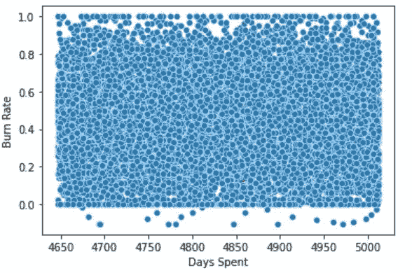

**输出**(图片作者提供)

*   散点图显示*燃烧速率*与*消耗天数*的数据没有趋势。所以我们去掉了花费在上的*天，因为它在数据中并不重要。*

```
df.drop(‘Days Spent’,axis=1,inplace=True)
```

# **4。模型建立和评估**

让我们在 data - 1 上找到不同集成技术的性能。XGBoost 2。AdaBoost 3.RandomForest。

请阅读这个[博客](https://www.analyticsvidhya.com/blog/2021/08/ensemble-stacking-for-machine-learning-and-deep-learning/)来了解合奏技巧及其不同类型。我们将使用“ [R 平方](https://www.geeksforgeeks.org/ml-r-squared-in-regression-analysis/#:~:text=R%2Dsquared%20is%20a%20statistical,for%20r%2Dsquare%20is%201.&text=The%20more%20the%20value%20of,than%20the%20average%20fitted%20model.)作为度量，因为我们正在训练一个回归模型。

```
model1 = XGBRegressor()X = df.drop('Burn Rate',axis=1)
y = df['Burn Rate']score = cross_val_score(model1,X,y,cv = 5,scoring = 'r2') 
#K fold cross validationscore.mean()
```

**输出:** 0.9323

```
model2 = AdaBoostRegressor()
score = cross_val_score(model2,X,y,cv = 5,scoring = ‘r2’)
score.mean()
```

**输出:** 0.9134

```
model3 = RandomForestRegressor()
score = cross_val_score(model3,X,y,cv = 5,scoring = ‘r2’)
score.mean()
```

**输出:** 0.9216

这三种算法都给出了很好的结果。我们可以通过改进生命周期的前几个阶段来进一步改善结果，如**缩放**数据、改变**空值插补**和**分类编码**的技术、执行**特征选择**以去除不重要的特征、**超参数优化**等。

## **超参数优化** -

为 ML 算法选择最佳超参数集的技术给出了所选度量的最佳结果。随机搜索、网格搜索、Optuna 等。是调整学习算法的超参数的一些方法。

让我们优化 XGBoost -的超参数

```
regressor = XGBRegressor()
param_grid = {
"colsample_bytree" : np.arange(0.1,1,0.1),
"gamma" : np.arange(0.01,0.1,0.01),
"learning_rate" : np.arange(0.01,0.1,0.01),
"max_depth" : np.arange(2,10),
"n_estimators" : np.arange(1500,2500,100),
"reg_alpha" : np.arange(0,1,0.1),
"reg_lambda" : np.arange(0,1,0.1),
"subsample" : np.arange(0.1,1,0.1),
"silent"  : [1],
"nthread" : [-1],
}model  = RandomizedSearchCV(
estimator= regressor,
param_distributions= param_grid,
n_iter=20,
scoring = 'r2',
verbose= 3,
n_jobs=1,
cv = 5)model.fit(X,y)
model.best_score_
```

**输出:** 0.9327

*   超参数调整使模型得分略有增加。所以我们用这个调整过的模型。

保存模型-

```
filename = ‘bunrout_model_xgb.pkl’
pickle.dump(model, open(filename, ‘wb’))
```

是时候进行模型部署了！完成项目前几个阶段的[代码](https://github.com/YashK07/Burnout-Rate-Prediction-Heroku/blob/main/Burn_out_rate_Model_Building.ipynb)。

# **5。部署**


图片来源:[https://bit.ly/3EDtb4k](https://bit.ly/3EDtb4k)

## 介绍

现在，我们的目标是建立一个 web 应用程序，从用户那里获取输入信息，并为用户提供燃烧率的预测。为了构建它，我们将使用 Flask，这是 Python 的一个 API，允许我们构建应用程序。构建应用程序后，我们将在 Heroku 上部署它。

**注:**我们可以部署 ML 模型的其他平台有——亚马逊 AWS、微软 Azure、谷歌云等。

我们将从用户那里收集的输入信息将是我们的燃烧率预测模型所依据的特征

*   用户在公司中工作的指定范围-[0–5]:5 是最高指定，0 是最低指定。
*   工作小时数。
*   精神疲劳评分在-[0–10]范围内:用户通常在工作时间感觉有多疲劳。
*   性别:男/女
*   公司类型:服务/产品
*   你在家工作吗:是/否

## 在烧瓶上构建应用程序

为应用程序创建一个. py 文件。导入所有重要的库-

从烧瓶导入烧瓶，渲染模板

```
import os
from flask import request
import pickle
import pandas as pd
import numpy as np
from xgboost import XGBRegressor
```

*   启动 Flask 应用程序并加载保存模型-

```
app = Flask(__name__) #Initialize the flask app
model = pickle.load(open(“model\\bunrout_model_xgb.pkl”, ‘rb’))
```

*   为将呈现 HTML 页面的 home 函数执行应用程序路由-

```
@app.route(‘/’)
def home():
 return render_template(‘index.html’)
```

*   创建一个“预测”功能，这将是最重要的后端工作，即根据用户输入返回预测-

```
def predict(): if(request.method=="POST"):
  int_feat = ['Designation', 'Resource Allocation', 'Mental Fatigue Score', 'Gender', 'Company Type', 'WFH Setup Available'] l = [] for i in int_feat:
   val = int(request.form[i])
   l.append(val) #convert into array of shape -> (1,6) feat_arr = np.array(l).reshape(-1,1).reshape(1,6) input = pd.DataFrame(feat_arr,columns = ['Designation', 'Resource Allocation', 'Mental Fatigue Score', 'Gender_Female', 'Company Type_Service', 'WFH Setup Available_Yes']) prediction = float(model.predict(input)[0])
 prediction = round(prediction, 2) #top 25 percentile
 if(prediction<=0.3):
  feedback1 = "Fantastic! You have a low burnout of {} .".format(prediction)

  return render_template("index_1.html",color = "color:#33CC00;",feedback = feedback1)#top 25 percentile to 75 percentile
 elif((prediction>0.3) & (prediction<=0.59)):
  feedback2 = "Not bad...You have a moderate burnout of {} .".format(prediction)

  return render_template("index_1.html",color = "color:#339900;",feedback = feedback2)#top 75 percentile to 90 percentile
 elif((prediction>0.59) & (prediction<=0.80)):
  feedback3 = "Oops!! You have a high burnout of {} .".format(prediction)

  return render_template("index_1.html",color = "color:#FF0000;",feedback = feedback3)#top 90 percentile to 99 percentile
 elif((prediction>0.8) & (prediction<=0.9)):
  feedback4 = "Ouch!!! You have a very high burnout of {} .".format(prediction)

  return render_template("index_1.html",color ="color:#CC0000;",feedback = feedback4)#top 99 percentile
 else:
  feedback5 = "Sorry! You have an extremly high burnout of {} .".format(prediction)

  return render_template("index_1.html",color ="color:#990000;",feedback = feedback5)
```

*   您可以显示一些消息和上面代码中的预测，来描述它们的耗尽率。
*   定义主要功能-

```
if __name__ == "__main__":
 app.run('debug'==True)
```

您的 Flask 应用程序已准备就绪！通过[index.html](https://github.com/YashK07/Burnout-Rate-Prediction-Heroku/blob/main/templates/index_1.html)获取 webapp 的前端部分。

**注意:**创建 index.html 并保存在一个名为— templates 的目录中。

## **在 Heroku 上部署 app**

Heroku 上的部署需要一个 reuirement.txt 文件。这个项目的要求-

```
Flask==1.1.1
pandas==1.0.1
numpy==1.18.1
xgboost==0.90
gunicorn==20.1.0
scikit-learn>=0.18
```

现在创建一个 Procfile，它是一个不带. txt 扩展名的文本文件。它定义了应用程序在启动时执行的命令。此项目的过程文件-

```
web: gunicorn app:app
```

现在将项目推入 Github，并将 repo 连接到 Heroku 进行部署-

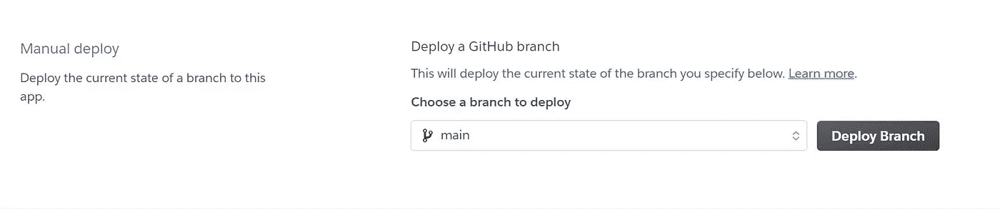

在 Heroku 上部署项目的 Github repo(图片由作者提供)

恭喜你！我们已经成功地创建并部署了我们的 web 应用程序✌️

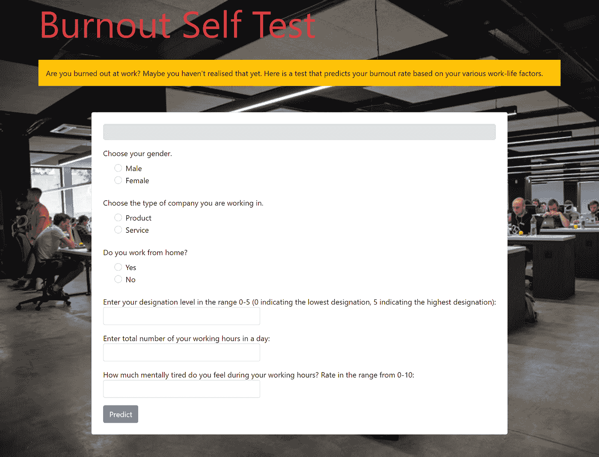

燃尽率预测 web 应用程序(图片由作者提供)

网页应用的链接:[https://burnout-rate-prediction-api.herokuapp.com](https://burnout-rate-prediction-api.herokuapp.com/)

它可以从任何地方访问，并用于检查员工的精神健康状况。

## **即兴创作**

部署之后，临时准备项目的生命周期阶段以交付最佳解决方案是另一个重要的阶段。

# 结论

所以我们已经到了指南的结尾。从理解问题陈述到交付端到端的解决方案，我们都在一篇博客中讨论过！

务必检查从[https://github.com/YashK07/Burnout-Rate-Prediction-Heroku](https://github.com/YashK07/Burnout-Rate-Prediction-Heroku)开始的整个项目代码。请开始吧🌟如果你觉得这个应用值得的话。快乐学习！！