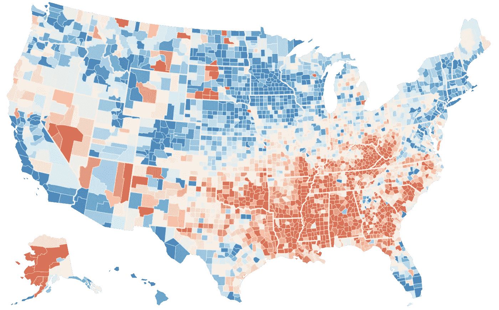

# 预期寿命和不平等

> 原文：<https://medium.com/analytics-vidhya/life-expectancy-and-inequality-7eb4d58617b8?source=collection_archive---------7----------------------->

在过去的 40 年里，美国正经历着各地区间最大的预期寿命差距

[**跟着这里看更多这样的故事**](https://americaninequality.substack.com/)

在过去的 40 年里，美国各地区的预期寿命差距最大。虽然大多数人会活到 78 岁，但如果一些美国人碰巧出生在美国其他几个县，他们可能会早死 10 年。在此期间，随着医学、社会因素和生活质量的进步，人们的平均寿命普遍增加，然而，许多美国人并没有看到这种好处。因此，一些美国人实际上比过去年轻得多。虽然生命可能是不平等的，但死亡不应该是不平等的。

20 世纪 80 年代的纽约——来源:[每日邮报](https://www.pinterest.co.uk/pin/529735974891099604/)

1980 年，美国人的平均寿命是 74 岁。尤其是婴儿死亡率大幅下降，在过去的 40 年里下降了一半多。美国最富裕、最健康和最安全的地区，其寿命与今天的普通人一样长。从这个意义上来说，美国在帮助人们延长寿命方面取得了很大的进步。然而，当我们查看来自全球健康数据交换的数据时，美国某些县的增长速度与其他县不同，主要是因为政策制定者很清楚的原因。

药物过量和心脏病是死亡人数增加的主要原因。在过去的 20 年里，中年人因药物过量死亡增加了近 400%，而自杀增加了 71%，从每年 28，000 例增加到每年 48，000 例。新冠肺炎疫情只是加快了吸毒过量和自杀的比率，其影响美国仍在观望。此外，心脏病现在是美国的主要死因，每年导致 655，000 人死亡。更健康的生活方式和锻炼可以极大地降低一个人的风险，但对数百万美国人来说，更健康的食物选择越来越遥不可及。

预期寿命普遍提高了，但不是所有人都提高了

# **更多的钱意味着更多的生存时间**

金钱已经成为决定谁能活得更长的越来越重要的因素。富裕国家的人比贫穷国家的人多活 20 年，这是美国 40 年来最大的差距。例如，在南达科他州的奥格拉拉拉科塔县，平均预期寿命为 66.8 岁，是美国最差的县。奥格拉拉拉科塔的收入中值为 30，347 美元，与科罗拉多州的萨米特县形成鲜明对比，后者的预期寿命为 86.9 岁，是全国最高的。萨米特的收入中位数比奥格拉拉拉科塔高出 2.5 倍以上。

当我们深入到县一级之外，我们看到金钱和预期寿命之间的关系变得更加清晰。哈佛大学的哈吉·柴提分析了 1999 年至 2014 年间的 14 亿份个人纳税记录，并将这些记录与死亡记录进行了对比。他的发现令人震惊:

> 首先……最富有的 1%和最贫穷的 1%之间的预期寿命差距，男性为 14.6 岁，女性为 10.1 岁。其次，预期寿命的不平等随着时间的推移而加剧。2001 年至 2014 年间，收入分配前 5%的男性预期寿命增加了 2.34 岁，女性增加了 2.91 岁，但收入分配后 5%的男性预期寿命仅增加了 0.32 岁，女性仅增加了 0.04 岁。

深入调查预期寿命最差的五个国家，会得出一些有趣的结果。这五个县中的四个都有超过 80%的美国土著人口。剩下的一个县——佛罗里达州的尤宁县——并不是印第安人占多数，而是该州监狱人口最多的地方。平均而言，这五个县的 31，000 人中没有人能活过 70 岁。

虽然自 1980 年以来，人们的寿命普遍延长了，但美国一些地区的预期寿命却在下降(T2)。美国有 13 个县的预期寿命下降，其中 8 个在肯塔基州，全部在南部。这些县绝大多数是白人，并且有心脏病、癌症和药物过量的高发病率。

在很短的一段时间内，美国人的预期寿命实际上有所下降，这主要是由这些低收入社区面临的严峻挑战造成的。从 2014 年到 2017 年，预期寿命自 1915 年至 1918 年第一次世界大战结束以来首次下降。

不断上涨的医疗费用给低收入美国人带来了更大的负担。在过去的 20 年里，人均医疗费用已经翻了一倍多。尽管自 2010 年通过以来，患者保护与平价医疗法案已经降低了 T2 税率，但许多美国人仍难以负担这 10624 美元的费用。与其他经合组织国家相比，美国的人均成本是英国、日本、加拿大和以色列的两倍以上，大大超过了其他国家。如果美国人负担不起医疗保健的费用，没有医疗保健，他们会死得更早。这是一个美国不想成为第一的领域。

# 前进的道路

更长的寿命并不总是意味着更健康的生活，但健康倡导者知道如何提高被忽视的县的预期寿命。首先，需要采取干预措施来降低可能导致过早死亡的健康风险，其次，鉴于预期寿命和收入之间的密切关系，医疗成本需要继续下降。

**降低健康风险**——美国需要降低心脏病和药物过量的风险。对于心脏病，早期干预，如改善饮食、增加锻炼、降低胆固醇和降低血压，可以确保更多的美国人远离医院，避免过早死亡。作为美国的主要死亡原因，我们可以做更多的工作来确保每年有 655，000 人不会死于这种疾病。对于药物过量，我们需要减少阿片类药物的过度处方，也要帮助那些已经上瘾的人。州和地方政府可以改善精神卫生设施，提供装有纳洛酮小瓶的药物过量预防包，并为有需要的美国人建立保护区。密西西比州、阿拉巴马州和肯塔基州是预期寿命最低的州，也是心脏病和药物过量发生率最高的州，因此干预措施应该首先从这里开始。

**降低医疗保健费用**—[3800 万](https://www.census.gov/library/publications/2019/demo/p60-266.html#:~:text=In%202018%2C%20there%20were%2038.1,17.4%20percent%20to%2016.2%20percent.)生活在贫困中的美国人，医疗保健费用通常几乎是家庭收入的一半。根据[卫生与公众服务部](https://www.cms.gov/research-statistics-data-and-systems/research/actuarialstudies/downloads/ppaca_2010-04-22.pdf)的数据，从 2010 年到 2017 年，患者保护与平价医疗法案人均医疗支出减少了[2000 美元](https://www.statnews.com/2019/03/22/affordable-care-act-controls-costs/)。然而，一些抵消因素，如处方药费用的上涨和医院费用的上涨，抵消了部分降价。远程医疗服务大大降低了医疗保健的成本和障碍。农村地区的家庭现在可以获得医疗服务，即使他们离医院很远。

如果美国计划缩小国家间预期寿命的差距，那么政策制定者将需要迅速实施变革。我们不能允许一些人仅仅因为出生在一个国家而不是另一个国家就失去 20 年的生命。降低健康风险和医疗成本意味着奥拉拉拉科塔县的一些人可以活到 67 岁以上，年收入 4 万美元的父母不会比全国平均水平早死 5 年，世界各地的美国人可以活得更长，看着他们的子女和孙辈长大。

[**跟着这里看更多类似的故事**](https://americaninequality.substack.com/)