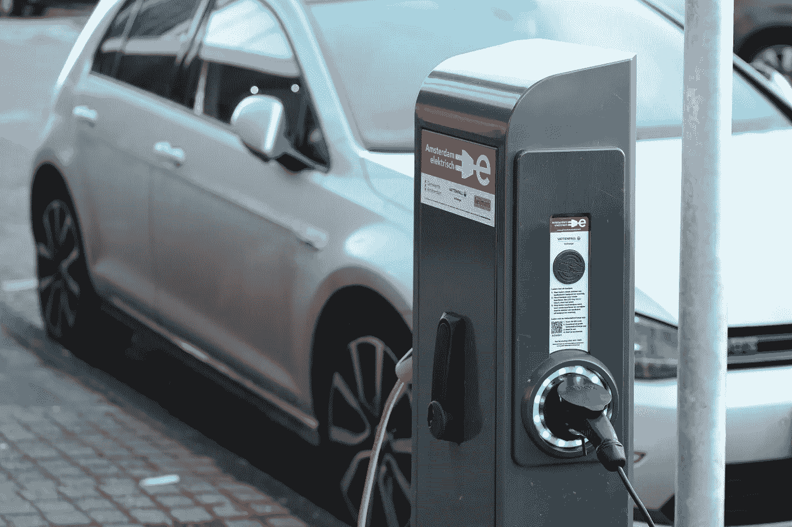

# 电动车辆的寿命期排放

> 原文：<https://medium.com/analytics-vidhya/life-time-emissions-of-electrified-vehicles-b12ee07ef74f?source=collection_archive---------30----------------------->

几天前结束的 CES 2021 展示了令人兴奋的电动汽车原型和生产级个人和商业产品。

插电式电动汽车通过消除道路使用过程中产生的温室气体排放，创造了更加清洁的环境。值得知道的是，车辆有两种排放类别；直接和生命周期。直接排放与排气管输出有关，如燃油系统蒸发和加油过程中。形成烟雾的污染物，包括氮氧化物和挥发性有机化合物。在温室气体中，二氧化碳仍然是对人类健康危害最大的。

电动汽车的直接排放为零，而结合了电动和发动机系统的插电式混合动力汽车(PHEVs)会产生蒸发排放。尽管混合动力电动汽车的尾气排放明显低于传统或内燃机汽车(ice)，但仍然存在净零排放的需求。

生命周期排放与从车辆制造管道到配送、回收或处理输出的污染物有关。在层间控制阀中，当石油从地下开采、提炼为汽油、分配到加油站并最终在车辆中使用/燃烧时，就会产生排放。

## 汽车购买前的碳排放知识

通过澳大利亚设计规则(ADRs ),澳大利亚政府的绿色车辆指南(GVG)排放数据用于对车辆进行评级，这些数据基于特定车型的尾气排放测量，不考虑车辆生产或车辆所用燃料生产中可能出现的其他环境影响。在允许在澳大利亚销售之前，每种车型都必须经过认证测试，以证明其符合(ADRs ),排气尾管的测量值符合认证测试的要求。

汽车标签是欧盟的一项要求，旨在帮助驾驶者选择低油耗的新车。这包括标明汽车燃料效率和二氧化碳排放量的标签。

# **目前关于排放和电动汽车的研究**

各种机器学习事业已经成功地实现了对车辆排放的预测和最终优化。[克莱曼斯](https://www.sciencedirect.com/science/article/abs/pii/S0048969720331454#!)等人(2020)在一个拥有 70 辆柴油车的真实世界数据集中应用了机器学习技术。在这项研究中，将具有相似排放输出的车辆分组并模拟瞬时排放起到了关键作用。

(Tu 等人，2019 年)研究了使用机器学习提高排放清单的准确性。这项特殊的研究还研究了城市间排放可转移性的影响。其成果是一种新的方法，将微观排放建模策略的输出与受限交通分配模型相结合，以获得大都市地区交通运输的精确温室气体(GHG，以 CO2 当量计)排放估计。基于聚类的有效排放重新计算(CLEVER)方法利用瞬时速度数据和基于路段的交通特征来改进道路 GHG 清单。

对葡萄牙发电的边际温室气体(GHG)排放的评估为理解影响近期电力需求的活动的影响提供了基础(Garcia & Freire，2016)。通过考虑不同的排量和充电情况，对电动汽车(尤其是轻型卡车)的引入进行了研究。煤炭和天然气被确定为边际能源，但它们对边际的贡献取决于一天中的小时、一年中的时间和系统负荷，导致电力的边际排放量差异很大。这项研究的结果表明，对于不可调度的可再生能源比例很高的电力系统，如葡萄牙系统，边际排放量大大高于平均排放量。

# 结论

虽然电动汽车的好处，尤其是在商业应用中，是对高尾气排放的一个重要威慑，但这并不是彻底解决排放问题的灵丹妙药。需要进一步了解电动汽车的电力来源及其寿命期间的排放是当前研究的一个共同主题。“2021 年及以后”将展示来自海蓝、Lucid、通用汽车和移动行业其他主要参与者的激动人心的电动汽车。这为更清洁的多式联运追求带来了进一步的希望。

# **参考文献**

1.  r .加西亚和 f .弗莱雷(2016 年)。葡萄牙发电的边际生命周期温室气体排放及其对电动汽车的影响。*资源*， *5* (4)。[https://doi.org/10.3390/resources5040041](https://doi.org/10.3390/resources5040041)
2.  涂，r，王，a .，& Hatzopoulou，M. (2019)。使用机器学习方法提高排放清单的准确性，并调查跨城市的可转移性。*空气与废物管理协会杂志*， *69* (11)，1377–1390。[https://doi.org/10.1080/10962247.2019.1668872](https://doi.org/10.1080/10962247.2019.1668872)