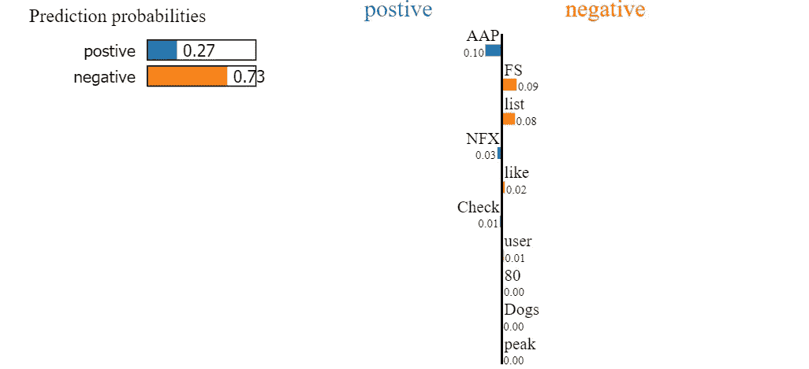

# 石灰:可解释人工智能的热情

> 原文：<https://medium.com/analytics-vidhya/lime-the-zest-of-explainable-ai-19ccb70b2488?source=collection_archive---------10----------------------->

嗨，读者们，

《神探夏洛克·福尔摩斯》中臭名昭著的反派角色莫里亚蒂有许多邪恶的阴谋。但是我们抽烟斗，戴猎鹿帽，超级侦探(是的，我是康伯巴奇的粉丝！)夏洛克·福尔摩斯能够看穿犯罪策划者的谎言，并确定这种疯狂行为的因果关系。

如果要我做比较，莫里亚蒂将是人工智能模型，而夏洛克将是试图找出模型行为中“为什么”的莱姆。


# 问题的案例文件

神经网络和机器学习算法通常是黑盒。术语“黑盒”是指使用未知的内部机制获得已知输出的过程。通常情况下，我们不知道决策是如何或为什么做出的，我们只知道结果。这么多未知，怎么能相信一个模型呢？

正如只有钻石才能切割钻石一样，在经历了多次失败之后，这个数学之谜被交给了我们自己的数学侦探 supreme。

# 莱姆:我们侦探的性格素描

LIME 代表本地可解释的模型竞争解释。这是可解释人工智能(XAI)概念的琼浆玉液。当从自下而上的方法阅读时，这个缩写词是非常自明的。

**模型竞争**意味着某些东西绕过了模型的建筑构成。术语**可解释的**意味着石灰将产生易于人类理解的结果。 **Local** 补充道，该模型将通过近似的本地解释来解释。这是通过改变特征来修改单个数据点，然后测量这种改变带来的影响来实现的。

局部解释可以是诸如决策树、线性回归或任何其他的模型，其在局部模型的小扰动(诸如添加噪声、删除单词、像素化图像的一部分的变化)之后被训练，然后测量这种变化的影响。

# 滚动摄像机动作:将石灰应用于股票情绪数据

股票情绪的数据集可以从这个[链接](https://www.kaggle.com/yash612/stockmarket-sentiment-dataset)下载。数据集包含字符串格式的情感，以及与之相关联的情感(1 表示积极，-1 表示消极)。

数据集的快照:

*   正面情绪(1):“用户:AAP 电影。FEA/GEED 指标的回报率为 55%,全年仅交易 15 笔。厉害了。”
*   负面情绪(-1):“AAP——用户如果是这样，那么当前的下降趋势将被打破。否则，这只是中期下跌趋势中的一次短期修正。”

## 步骤 1:导入库

## 第二步:预处理

在这一步中，我们将导入数据集，然后将其分成训练和测试数据帧，之后我们将使用 tf-idf 对它们进行矢量化。

Tf-idf 返回大小为(字数*输入句子数)的向量。

因此，每个输入都是一个大小向量(数据集中的字数*1)。由于存在多个要素，因此分析这些要素中的哪一个对输出的贡献最大非常重要。让我们使用这些特性构建一个简单的分类器——逻辑回归分类器。

## 步骤 3:构建模型

我们使用 tf-idf 向量作为模型的输入特征。

该模型的 f1 分数为:

```
0.8517110266159695
```

## 第四步:添加石灰

现在我们加入石灰来理解模型。我们将使用 LimeTextExplainer 为可解释性生成局部预测。该函数将需要解释的问题、从黑盒模型(逻辑回归)生成的问题的预测标签以及用于解释的特征数量作为输入参数。

该代码会产生以下结果

```
Text: 
Check out list of top performers since AAP peak, from user - Dogs like FS DE? +80% in NFX? Please.  
Probability (Positve) = 0.7287929697067268
Probability (Negative) = 0.2712070302932732
True Class is: negative
```

结果可以用不同类型的可视化显示出来。



该图像显示了主要特征对积极和消极结果的贡献。因此，特征“AAP”量化积极的结果，而像“FS”这样的特征量化消极的结果。

# 摘要

这篇文章的主旨是石灰可以用来解释任何使用局部近似的模型。可解释的部分是要更加注意，这是人的组成部分。通过改变数据点测试多个案例，然后得出结论。

最后，这句话非常适合这种情况:

> 乱不是坑，乱是梯。

编码快乐！！！