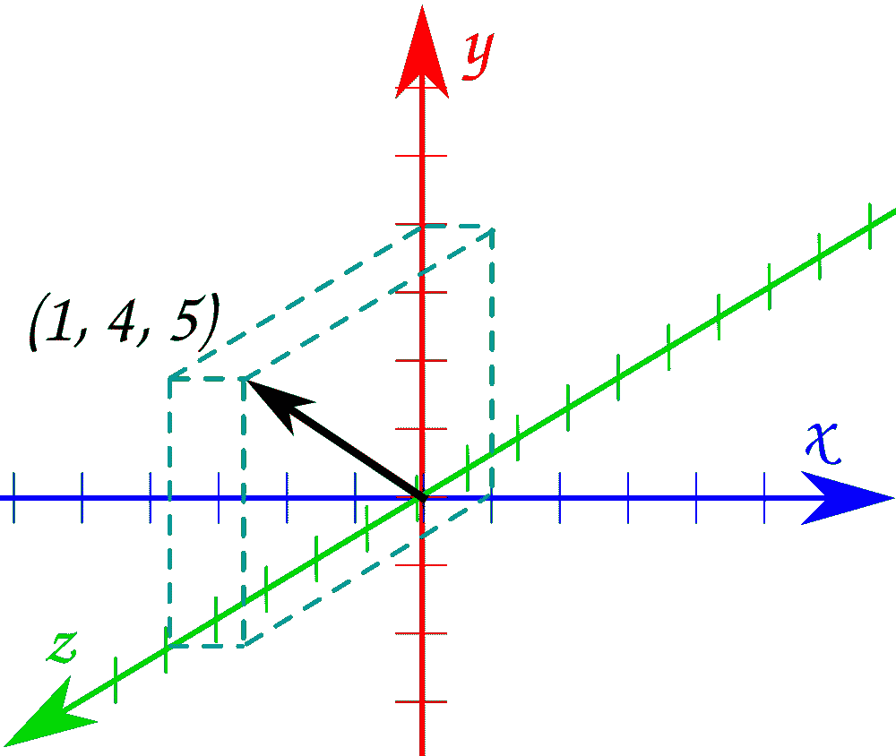
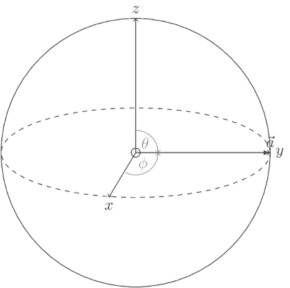
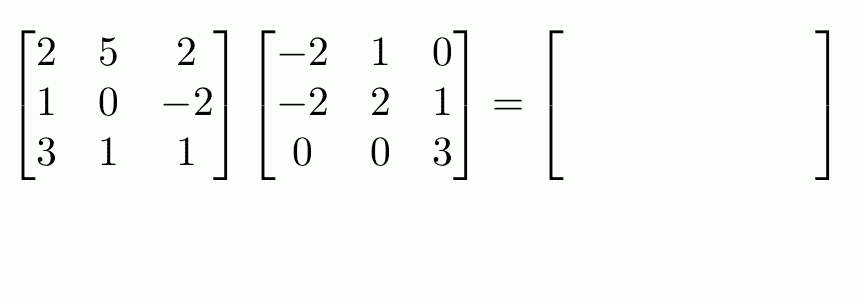
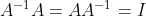
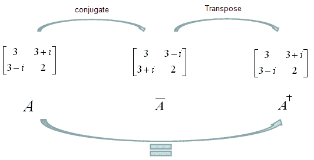
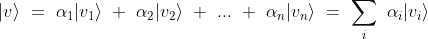
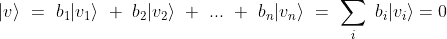
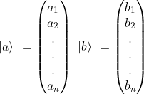
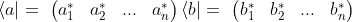
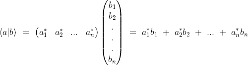

# 量子计算的线性代数第一部分

> 原文：<https://medium.com/analytics-vidhya/linear-algebra-for-quantum-computing-part-1-8ac7c8e63483?source=collection_archive---------6----------------------->

J. Kelly Brito 在 [Unsplash](https://unsplash.com?utm_source=medium&utm_medium=referral) 上的照片

T 这篇文章的主要目的是让你熟悉线性代数的基础知识，从而更好地理解量子位的行为。涵盖线性代数的所有概念超出了本文的范围，因此我们将讨论限制在量子计算入门所必需的关键概念上。

## **向量和向量空间**

让我们从探索向量开始。正如你们大多数人在高中可能已经学过的，向量可以被定义为一个既有大小又有方向的物理量。从图形上看，从原点开始的三维向量(1，4，5)可以表示为下图所示。

图片提供:Mathisfun

几个向量构成一个向量空间。向量空间“V”可以正式定义为满足两个条件的向量集:

1.  对于任何两个矢量|a⟩，|b⟩ ∈ V，它们的矢量相加应该产生同一个矢量空间中的另一个矢量，即|a⟩+ |b⟩ = |c⟩，其中|c⟩∈ V
2.  对于某些向量|a⟩ ∈ V 和某些标量 n ∈ F，它们标为的标量乘法也属于同一个向量空间 v，即 n|a⟩∈ V

就量子计算而言，我们对**状态向量感兴趣。顾名思义，状态向量基本上是指向空间中特定点的向量，该点决定系统的状态，在这种情况下是量子状态。状态向量的每个方向对应于一个状态，几个状态向量构成所谓的状态空间。这种状态空间，具有状态向量的所有可能方向，可以表示为如下所示的块球。**

请注意，布洛赫球的半径为 1 个单位。我们很快就会探讨，当我们谈到希尔伯特空间时，为什么会出现这种情况。

## 矩阵和矩阵运算

矩阵可以定义为排列成行和列的数字的矩形阵列。对于具有‘m’行和‘n’列的矩阵，矩阵的维数由*m×n*给出。它们通常用作将一个向量转换为另一个向量的运算符。为了理解它们如何应用于向量，让我们定义一些矩阵上的运算。

1.  矩阵加法:这个操作很简单，执行两个矩阵的元素相加。对于这个操作，两个矩阵的维数应该相同。
2.  矩阵乘法:为了执行有效的矩阵乘法，第一个矩阵中的列数必须等于第二个矩阵中的行数。得到的矩阵将具有维度*r1×c2，*，其中 R1 是第一矩阵中的行数，C2 是第二矩阵中的列数。该操作如下图所示。

图片提供:马修·斯克罗格斯

3.矩阵的逆矩阵:矩阵“A”的逆矩阵是另一个满足以下条件的矩阵

量子计算中很少计算矩阵的逆矩阵，但是你可以在这里了解更多[。](https://www.khanacademy.org/math/precalculus/x9e81a4f98389efdf:matrices/x9e81a4f98389efdf:intro-to-matrix-inverses/v/inverse-matrix-part-1)

4.矩阵的转置:它是通过翻转矩阵的对角线，将所有的行变成列，反之亦然而形成的矩阵。

图片提供:[宾夕法尼亚州立科学](https://in.pinterest.com/psuscience/)

既然我们已经探索了矩阵的一些基本运算，现在让我们看看**厄米矩阵**和**酉矩阵**。在进行量子计算时，我们通常会遇到这两个矩阵。

埃尔米特矩阵是等于其**共轭转置**的矩阵。所以明显的问题是什么是矩阵的共轭转置？m 乘 n 矩阵的共轭转置是通过将它转置成 n 乘 m 矩阵，然后取每个元素的复共轭来获得的。(注意:复共轭翻转一个数的虚部的符号)。

埃尔米特矩阵。图片提供: [ShareTechnote](https://www.google.com/url?sa=i&url=http%3A%2F%2Fwww.sharetechnote.com%2Fhtml%2FHandbook_EngMath_Matrix_HermitianMatrix.html&psig=AOvVaw3vnOzoqm1_HXU2SCFXAFIk&ust=1616520456641000&source=images&cd=vfe&ved=0CAMQjB1qFwoTCMjukJO2xO8CFQAAAAAdAAAAABAD)

厄米矩阵在量子力学中有更多的应用。但是还有另一种称为酉矩阵的矩阵，它在量子力学和量子计算中同样重要。

酉矩阵类似于埃尔米特矩阵。在酉矩阵的情况下，矩阵的**逆**等于其共轭转置。

> 基本思想是，通过应用酉矩阵，量子态的演化“保持”了量子态的规范(量级)。

由于上述原因，我们使用酉矩阵来表示量子门。

## 向量空间和相关术语

一个**字段**是一个集合(通常表示为 F)，其上定义了两个二元运算:+(加法)和(乘法)。所以对任意 a，b∈F，a+b，a b 都是 F 的元素。

域 F 上的向量空间或 F-空间是一个集合(通常表示为 V ),其上定义了一个二元运算+(向量加法),以及一个从 F × V 到 V 定义的运算(标量乘法)。因此对于任何 V，w ∈ V，v+w 在 V 中，对于任何α ∈ F 和 v ∈ V，α v ∈ V。在这种情况下，F 的元素α称为标量。

考虑向量|v1⟩，|v2⟩ …，|vn⟩.这些向量的线性组合，定义为向量的标量倍数之和，给出另一个向量，比如说|v⟩，可以写成:

现在让我们假设我们在域 f 上有一个向量空间 v。让 s 是属于一个子空间 Vₛ的向量集合，使得 Vₛ⊂ V。我们说 s 的向量跨越子空间 Vₛ，如果 Vₛ中的每一个其他向量可以写成 s 中向量的线性组合。这样的集合 s 被称为**跨越集合**。

如果一组向量中至少有一个向量可以写成其他向量的线性组合，则称该组向量|v1⟩，…，|vn⟩是**线性相关的**。换句话说，对于每个向量 bi ∈ F，应该存在相应的系数，使得:

其中至少一个 bᵢ系数是非零的。如果没有向量可以用这种方式书写，那么它们就被称为**线性无关**。

在量子计算中，我们可能经常会遇到|0⟩和|1⟩量子比特态。事实上，所有其他量子位状态都可以用这些向量的线性组合来表示。这些向量因此形成了一个**碱基** *。*形式上*，一个* ***基*** *是一个线性独立的生成集。*它们的线性组合的系数被称为向量相对于基的分量或坐标。

> 一个向量空间可以有几个基；然而所有的碱基都有相同数量的元素，称为向量空间的[维](https://en.wikipedia.org/wiki/Dimension_(vector_space))。

## **希尔伯特空间**

根据维基百科的正式定义，

> 希尔伯特空间是一个配有[内积](https://en.wikipedia.org/wiki/Inner_product)的[向量空间](https://en.wikipedia.org/wiki/Vector_space)，内积是一种允许定义长度和角度的运算。

在量子力学和量子计算的上下文中，两个状态向量之间的内积是点积的扩展，它返回一个标量，表示第一个向量与第二个向量之间的距离。

在我们讨论内积的表示之前，让我们简要地理解一下表示希尔伯特空间向量的狄拉克符号。这些一般在量子力学中用来表示量子态。考虑到在狄拉克符号中我们有两个向量 *a* 和 *b.* ，我们使用“ **ket** ”来表示列向量如下:

除了“ket”之外，我们还有“ **bra** ”，它是通过形成一个行向量并对条目进行复共轭而获得的(这相当于取共轭转置)。

现在，两个向量 a 和 b 的内积可以用⟨a|b⟩.符号直观地表示出来

希尔伯特空间表示量子系统的一个最重要的条件是，对于任何向量，它的内积必须是 1。如果ψ代表一个量子态，那么我们可以从数学上把上面的陈述框定为⟨ψ|ψ⟩ = 1。这个条件通常被称为规范化条件。换句话说，所有的量子态都是归一化的。

在上一节中，我们已经看到了表示状态空间的布洛赫球。在那里我们提到过，布洛赫球的半径是 1。这是因为一个布洛赫球，连同量子位状态向量之间的内积，代表一个希尔伯特空间。这里所有可能的归一化纯态都画在球面上。因为它们是归一化的，所以这种球体的半径必须是 1。

现在我们已经看到了希尔伯特空间，是时候看看它们与酉矩阵的关系了。我们之前讨论过的酉矩阵的一个有趣的性质是它们的**内积** **保持**，这意味着无论你如何在酉矩阵序列下变换向量，归一化条件仍然成立。

> 这意味着幺正演化将量子态发送到其他有效的量子态。对于由布洛赫球表示的单量子位希尔伯特空间，幺正变换对应于状态向量到球上不同点的旋转，而不会以任何方式改变状态向量的长度。

我认为我们已经达到了饱和点。这些信息足以在一篇文章中涵盖。我们将在本文的第二部分继续讨论线性代数。在那之前保持饥饿保持愚蠢！

## 参考

1.  Qiskit 教材—[https://qiskit.org/textbook/ch-appendix/linear_algebra.html](https://qiskit.org/textbook/ch-appendix/linear_algebra.html)
2.  维基百科— [希尔伯特空间](https://en.wikipedia.org/wiki/Hilbert_space#:~:text=A%20Hilbert%20space%20is%20a,of%20calculus%20to%20be%20used.)，[基础](https://en.wikipedia.org/wiki/Basis_(linear_algebra)#:~:text=In%20mathematics%2C%20a%20set%20B,vector%20with%20respect%20to%20B.)