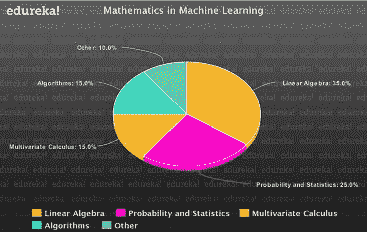
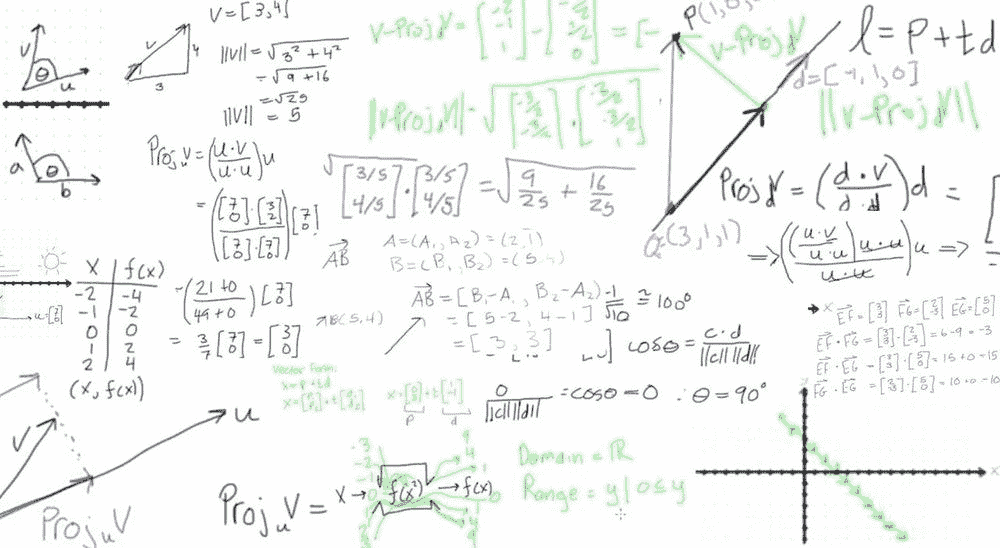
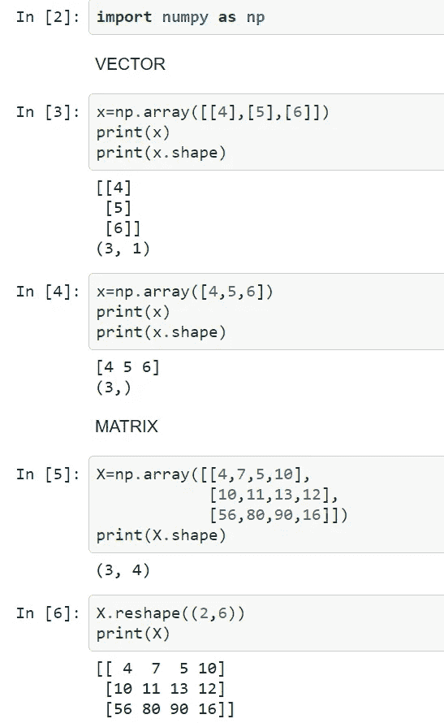
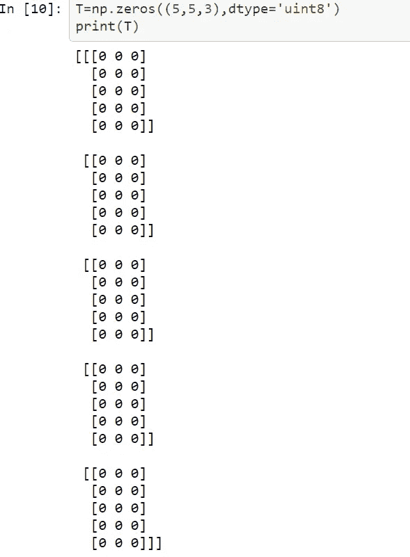
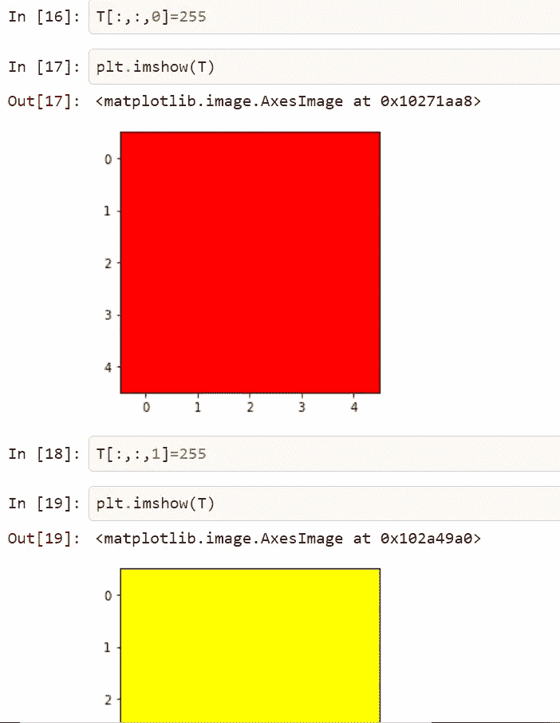
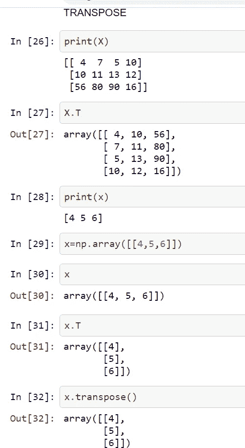
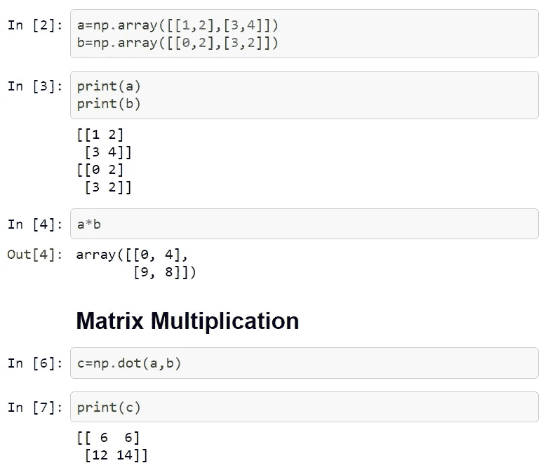
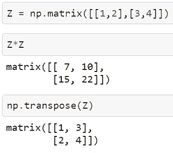
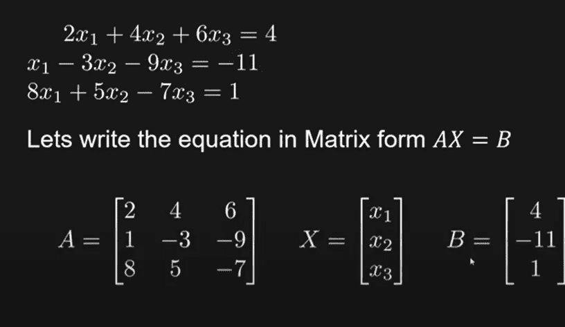
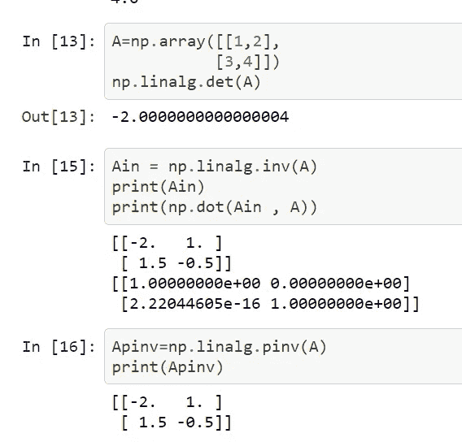

# 机器学习中的线性代数

> 原文：<https://medium.com/analytics-vidhya/linear-algebra-in-machine-learning-dc60ad71a696?source=collection_archive---------18----------------------->

> 我们将使用 numpy 线性代数模块


线性代数是数学的一个分支，广泛应用于科学和工程领域。我们需要对线性代数有很好的理解，以理解许多机器学习算法的工作。



线性代数是机器学习的核心支柱。但是为什么呢？

> 机器学习算法描述在书籍，论文和网站上使用向量和矩阵符号。



线性代数是数据的数学，它的符号允许你用特定的运算符精确地描述对数据的运算。

numpy 参考—[https://aditrisriv.medium.com/numpy-cheatsheet-7f67b2eee5ab](https://aditrisriv.medium.com/numpy-cheatsheet-7f67b2eee5ab)

要安装 scipy，请运行以下语句——

```
pip install scipy
```

让我们导入两个库-

```
import scipy.linalg as la
import numpy as np
```

创建向量、矩阵并对其进行整形

V 向量——向量是一组数字。这些数字是按顺序排列的。我们可以根据每个数字在这个顺序中的索引来识别它。



M**A 矩阵**——矩阵是一个二维数组，所以每个元素都由两个索引来标识，而不仅仅是一个。

T 传感器——在某些情况下，我们需要一个具有两个以上轴的阵列。在一般情况下，排列在具有可变轴数的规则网格上的数字阵列被称为张量。



我们这里有 3 个轴，所以让我们尝试通过一些修改来绘制。



改变第零个颜色通道给我们红色，而第一个给黄色。

## 矩阵的转置

使用 python 库和 numpy。



# 元素乘法



但是如果我们从 numpy 创建矩阵，那么' * '运算符只执行矩阵乘法，而不执行元素乘法。



# 至获取身份矩阵

```
np.eye(3)**OUTPUT**array([[1., 0., 0.],
       [0., 1., 0.],
       [0., 0., 1.]])
```

# 让我们解一个方程组



第一种方法:

```
A = np.array([[2,4,6],[1,-3,-9],[8,5,-7]])
B = np.array([4,-11,1]) 
print(la.solve(A,B))Output

[-8.52173913  9.69565217 -2.95652174]
```

第二种方法:

```
Ainve = la.inv(A)
np.dot(Ainve,B)Output
array([-8.52173913,  9.69565217, -2.95652174])
```

# 寻找特征值和特征向量

```
A = np.array([[1,2,3],[0,4,5],[1,0,6]])
eignvals , eignvector = np.linalg.eig(A)
print(eignvals)
print(eignvector)Output :

[7.04096459 1.08849669 2.87053872] 
[[ 0.47577536  0.92699459 -0.56767265]  
[ 0.75149246  0.3241272  -0.80302126]  
[ 0.45705239 -0.18873948  0.18139628]
```

# 凯里-汉密尔顿定理

[](https://en.wikipedia.org/wiki/Cayley%E2%80%93Hamilton_theorem#2%C3%972_matrices) [## 凯莱-汉密尔顿定理

### 在线性代数中，凯莱-汉密尔顿定理(以数学家亚瑟·凯莱和威廉·罗文的名字命名…

en.wikipedia.org](https://en.wikipedia.org/wiki/Cayley%E2%80%93Hamilton_theorem#2%C3%972_matrices) 

```
A = np.array([[1,2],[3,4]])
trace_A = np.trace(A)
detA = la.det(A)
I = np.eye(2)A@A -trace_A*A+detA*IOutput :array([[0., 0.],
       [0., 0.]])
```

# 矩阵的逆



> 给出了矩阵的伪逆。当矩阵的行列式为零时，这很有帮助，因为它仍然会给我们一些值，而不会像 np.linalg.inv()那样抛出错误。

谢谢你的阅读！！