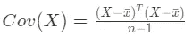

# 线性降维—主成分分析

> 原文：<https://medium.com/analytics-vidhya/linear-dimensionality-reduction-pca-7128e6e437ca?source=collection_archive---------13----------------------->


Haneul Kim 摄

# 目录

> 1.介绍
> 
> 2.数学推导
> 
> 3.结论

前面简要介绍了各种 DRT，本章我们将详细介绍一种线性降维技术的数学工作细节，这种技术可能是最流行的一种，叫做**主成分分析**。

通常，我倾向于以自下而上的方式工作，机器学习项目的简单性，因此无论是模型本身还是预处理步骤，我都从线性函数开始，除非我事先有关于底层数据结构的信息。

# 介绍

PCA 的目标是找到保持原始数据最大方差的**正交基(又称主成分/特征向量)**。这是一种特征提取技术，它不是选择特征子集来降低维数，而是将数据投射到不同的基中。

**正交性**简单来说就是指任何互相成 90 度的向量。

**基**:向量空间的基是跨越整个空间的线性独立向量的集合。换句话说，当你去掉一个向量，它减少了维数，那么这个向量就是基向量。在欧几里得空间中，指向上方和右侧的单位向量是基向量，因为通过进行线性变换，我们可以到达 2-d 欧几里得空间中的任何点，并且移除一个基向量将维度降低到 1-d。

出于演示目的，我们将创建非常简单的二维数据集。请记住，降维技术并不关心 y 值(目标)


以上测向标绘

为了找到最大方差保持正交基，我们将遵循以下步骤:

1.  将质心移到原点。
2.  计算协方差矩阵
3.  计算特征向量和特征值。
4.  绘制特征向量(主成分)

# 数学推导

**步骤 1 —将质心移动到原点**


以原点为中心

请注意，我们的绘图中心已经转移到原点。这样做的原因是因为这将使我们在计算协方差矩阵时更容易。



协方差矩阵公式

通过将中心居中到原点，请注意 x_bar 将变为零，从而将等式简化为:


以原点为中心的协方差矩阵公式

**步骤 2 —计算协方差矩阵**

*   协方差矩阵应该是 *dxd* 矩阵，其中 d 是维数。
*   每个元素代表两个特征之间的协方差(无论它们是正相关还是负相关，请注意，因为它是**而不是相关**数字较大并不意味着相关性较大)。
*   对角线元素表示每个特征的方差。

通常真实世界的数据应该如下所示，包含 m 个维度，但是在我们的例子中，请记住 m = 2。


将我们的 x1、x2 表示为矩阵:


包含向量 x1，x2 的矩阵 X

将转置 X 乘以 X，我们得到:


可以简化成这样


封面(X)

我们可以看到对角线上是方差公式(当 x_bar = 0 时)。而所有其他元素对应于 x1，x2 的协方差(当它们的均值=0 时)。

因此，我们计算了协方差矩阵，并证明对角线元素表示特征的方差，其他元素表示特征之间的协方差。

在 python 中计算 Cov(X)

**步骤 3——计算特征向量和特征值**

特征向量决定了新投影空间的方向，特征值决定了它们的大小，这意味着它们解释了数据沿投影空间的变化。

计算完成后，将特征向量按其特征值降序排列。当数据被投影到相应的特征向量时，较高的特征值承受原始数据的最大方差，而最低的特征值承受最小方差(我们应该丢弃的那些)。

```
[(array([-0.31091055, -0.95043918]), 79.42349759589935),
 (array([-0.95043918,  0.31091055]), 0.30812852991522277)]
```

如果你想知道投影到第一个特征向量(PC1)保留了多少方差(也称为解释方差):


所以在我们的例子中，PC1 将保持 79.42/(79.42+0.31) = 0.996，99.6%的方差。

没有规定你必须选择多少台电脑，因此通常的做法是绘制弯头图，并选择与图中弯头相对应的 k。另一种选择是选择 k，直到它保留你希望保留的方差。这在 sklearn 中很容易实现。PCA，不是给出整数值，而是给出 0~1 之间的值 ex: PCA(n=0.95)的意思是保留保留 95%方差的特征。

**步骤 4——绘制特征向量(主成分)**

投影矩阵只是 k 个选定的特征向量。让我们画出 PC1 和 PC2，看看当我们将数据投射到它上面时，它的保存情况如何。


黑线代表主要成分。较大的一个是 PC1，它似乎穿过直线，如果数据投影到它上面，我们可以看到大部分方差将被保留。因此，我们可以将所有的点都投影到 PC1 上，然后去掉 PC2，这样我们就将维度从二维降低到了一维！

# 结论

本教程的主要目的是获得关于 PCA 的数学直觉，它如何在后台工作，因为理解它如何在后台运行将在调试 ML 模型时给你更多的洞察力。为了简单起见，使用 2-D 数据，但是相同的概念适用于任何数量的维度。下一篇教程将介绍为什么 **PCA 不适用于非线性可分离数据集**，并介绍另一种称为 ISOMAP 的非线性维度技术。

感谢您的阅读，如果有任何不正确的信息，请评论，我很乐意纠正我的误解:)

**参考文献:**

*   [跨度，基本矢量—3 蓝色 1 棕色](https://www.youtube.com/watch?v=k7RM-ot2NWY&ab_channel=3Blue1Brown)
*   [协方差矩阵—本·兰伯特](https://www.youtube.com/watch?v=G16c2ZODcg8&ab_channel=BenLambert)
*   [协方差矩阵——路易斯·塞拉诺](https://www.youtube.com/watch?v=WBlnwvjfMtQ&ab_channel=LuisSerrano)
*   [PCA 背后的数学——走向数据科学](https://towardsdatascience.com/the-mathematics-behind-principal-component-analysis-fff2d7f4b643)
*   [降维 PCA —韩国大学课程(韩语)](https://www.youtube.com/watch?v=bEX6WPMiLvo&list=PLetSlH8YjIfWMdw9AuLR5ybkVvGcoG2EW&index=5&ab_channel=KoreaUnivDSBAKoreaUnivDSBA)
*   [3 个简单步骤中的主成分分析— Sebastian Raschka](https://sebastianraschka.com/Articles/2015_pca_in_3_steps.html#:~:text=The%20eigenvectors%20and%20eigenvalues%20of,the%20eigenvalues%20determine%20their%20magnitude.)
*   [Python 数据科学手册 PCA — Jake VanderPlas](https://jakevdp.github.io/PythonDataScienceHandbook/05.09-principal-component-analysis.html)