# Python 中的线性判别分析:逐步指南

> 原文：<https://medium.com/analytics-vidhya/linear-discriminant-analysis-in-python-step-by-step-guide-56b3e534d41b?source=collection_archive---------14----------------------->

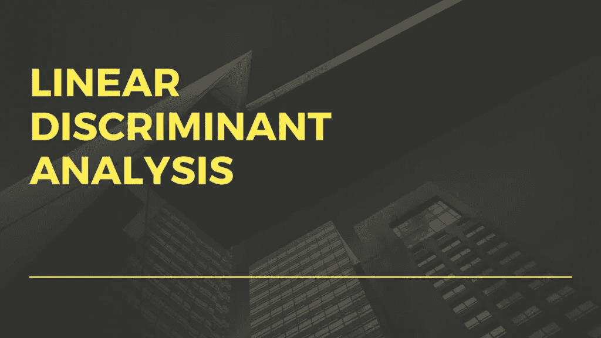

你在寻找关于**线性判别分析 Python 的完整指南吗？**。如果是，那么你来对地方了。这里我将讨论与**线性判别分析相关的所有细节，以及如何在 Python** 中实现线性判别分析。所以，请花几分钟时间阅读这篇文章，以便获得关于**线性判别分析** **Python** 的所有细节。

# 线性判别分析 Python

线性判别分析用于降维。现在你可能在想，“什么是降维？”。所以在进入线性判别分析之前，先了解一下降维。

# 什么是降维？

降维是在模式分类和机器学习应用中使用的预处理步骤。

让我简化一下，

您收集用于处理的数据量很大。因此，处理大量数据是复杂的。它需要更多的处理能力和空间。因此，降维应运而生。它降低了数据的维度。

那么，你所说的降低维度是什么意思呢？

假设，这是我们分散在二维空间的数据集。

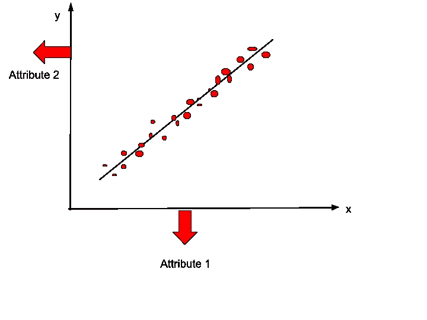

因此，我们可以通过应用降维在 1 维空间中表示这些数据项。应用降维后，数据点看起来会像这样

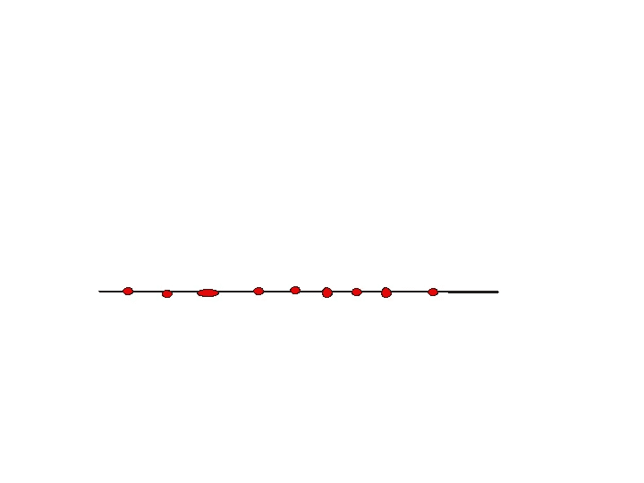

所以，降维是一种减少维数的技术。在这个例子中，我们从二维减少到一维。我希望现在你理解了降维。

主成分分析也是降维方法之一。我已经写了一篇关于 PCA 的文章。可以在这里看这篇文章- [什么是机器学习中的主成分分析？完全指南！](https://www.mltut.com/what-is-principal-component-analysis-in-machine-learning-complete-guide/)

现在，让我们进入线性判别分析-

# 什么是线性判别分析？

线性判别分析是一种降维方法。LDA 的目标是将数据集投影到低维空间。听起来和 PCA 差不多。对吗？

但是 LDA 不同于 PCA。线性判别分析寻找使多个类别之间的分离最大化的区域。这在常设仲裁院是做不到的。

因此，LDA 的定义是- **LDA 将特征空间(N 维数据)投影到更小的子空间 k( k < = n-1)上，同时保持类别区分信息。**

PCA 被称为**无监督**，但是 LDA 是**有监督**的，因为它与因变量有关。

现在，让我们看看 LDA 是如何工作的-

# 线性判别分析是如何工作的？

LDA 的工作步骤如下-

## 第一步

计算数据集中不同类别的 d 维均值向量。

## 第二步

在类别散布矩阵(Sw)内计算**。**

假设我们有一个二维数据集 C1 和 C2。因此，要计算二维数据集的 Sw，Sw 的公式为-

Sw = S1+ S2

S1 是 C1 类别的协方差矩阵，S2 是 C2 类别的协方差矩阵。

现在，**协方差矩阵** S1 的公式是——

S1 =σ(x-u1)。(x-u1)^T

其中 u1 是 C1 类的**均值**。同样，你可以计算 S2 和 C2。

## 第三步-

计算**类间散布矩阵(Sb)**

计算 Sb 的公式是-

Sb= (u1-u2)。(u1-u2)^T

## 第四步-

计算散布矩阵的特征向量(e1，e2，e3，…ed)和相应的特征值(λ1，λ2，… λd)。

## 第 5 步–

按特征值递减对特征向量进行排序，选择 k 个特征值最大的特征向量，形成 d×k 维矩阵 w。

## 第六步-

减少维度

y= W^T. X

其中 W^T 是投影向量，x 是输入数据样本。这里，投影向量对应于最高特征值。

所以，让我们想象一下 LDA 的整个运作-

假设，这条黑线是最高的特征向量，红点和绿点是两个不同的类。


当数据点被投影到这个向量上时，维数被降低，并且类别之间的区别也被可视化。

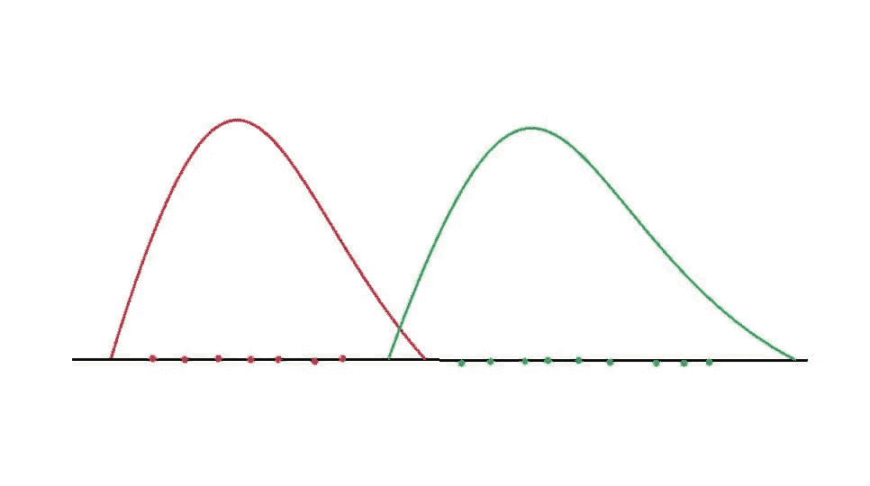

在该图像中，红色代表一个类别，绿色代表第二个类别。因此，通过应用 LDA，维数被降低，并且两个类别之间的分离也被最大化。

我希望，现在你明白了 LDA 的整个运作。现在，我们来看看如何用 Python 实现线性判别分析。

# 线性判别分析在 Python 中的实现

对于这个实现，我将使用 Wine 数据集。你可以从[这里](https://www.kaggle.com/mltuts/wine-dataset)下载数据集。

我们的目标是根据几种葡萄酒的特性来识别不同的客户群。因此，酒店的店主可以根据客户群推荐葡萄酒。

现在，让我们从第一步开始-

## 1-导入重要的库

```
import numpy as np
import matplotlib.pyplot as plt
import pandas as pd
```

## 2-加载数据集

```
dataset = pd.read_csv('Wine.csv')
X = dataset.iloc[:, 0:13].values
y = dataset.iloc[:, 13].values
```

将数据集分成 X 和 Y 后，我们会得到类似这样的结果-

这里，X 是自变量，Y 是因变量。y 是依赖的，因为 y 的预测依赖于 X 值。

X-

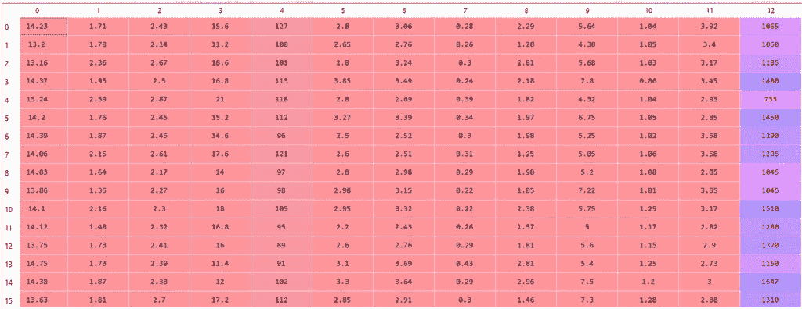

你-

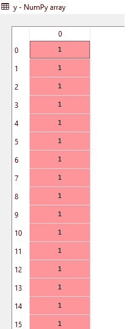

现在，下一步是-

## 3-将数据集分成训练集和测试集

```
from sklearn.model_selection import train_test_split
X_train, X_test, y_train, y_test = train_test_split(X, y, test_size = 0.2, random_state = 0)
```

这里，我们将数据集分为训练集和测试集。也就是说，我们用最大数据来训练模型，分离一些数据来测试。

## 4-应用特征缩放

```
from sklearn.preprocessing import StandardScaler
sc = StandardScaler()
X_train = sc.fit_transform(X_train)
X_test = sc.transform(X_test)
```

特征缩放是执行的重要步骤。应用特征缩放后，我们将获得以下形式的数据-

x 列车-

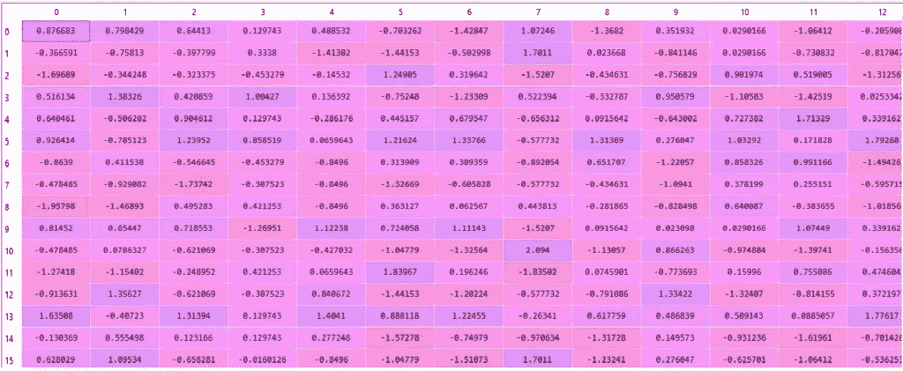

这里的值被缩放。应用特征缩放后，就该应用线性判别分析(LDA)了。

## 5.应用 LDA

```
from sklearn.discriminant_analysis import LinearDiscriminantAnalysis as LDA
lda = LDA(n_components = 2)
X_train = lda.fit_transform(X_train, y_train)
X_test = lda.transform(X_test)
```

这里， **n_components = 2** 表示提取的特征的数量。这意味着我们只使用了所有特性中的 2 个特性。而这两个特性会给出最好的结果。

所以，在应用 LDA 之后，我们会得到 X_train 和 X_test 之类的东西-

x _ 火车-

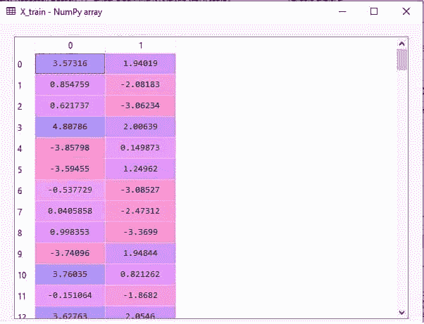

X_ 测试-

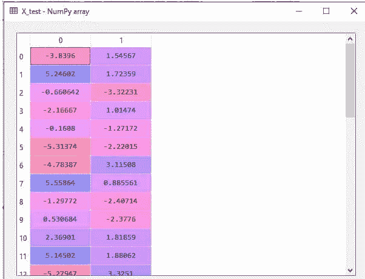

应用 LDA 之后，现在是应用任何分类算法的时候了。这里我用的是逻辑回归。但是您可以使用任何其他分类算法并检查准确性。

## 6.将逻辑回归拟合到定型集

```
from sklearn.linear_model import LogisticRegression
classifier = LogisticRegression(random_state = 0)
classifier.fit(X_train, y_train)
```

注意-在应用分类算法之前，总是首先应用 LDA。

现在，是时候预测结果了。

## 7.预测测试集结果

```
y_pred = classifier.predict(X_test)
```

运行这段代码后，我们会得到 Y_Pred 类似的东西-

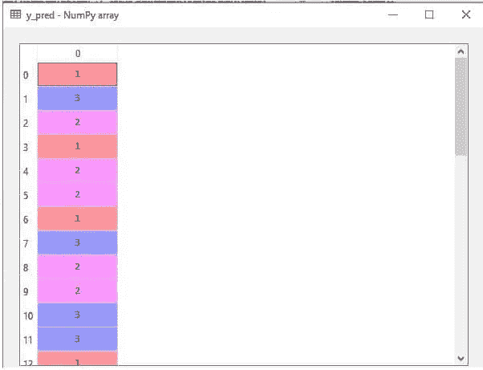

## 8.用混淆矩阵检查准确性

```
from sklearn.metrics import confusion_matrix, accuracy_score
cm = confusion_matrix(y_test, y_pred)
print(cm)
accuracy_score(y_test,y_pred)
```

我们得到了这个混淆矩阵和准确度分数，太棒了！我们得到了 **100%** 的准确率。

[14 0 0]
【0 16 0】
【0 0 6】
Out:1.0

现在，让我们来看一下测试集的结果

## 9.可视化测试集结果

```
from matplotlib.colors import ListedColormap
X_set, y_set = X_test, y_testX1, X2 = np.meshgrid(np.arange(start = X_set[:, 0].min() - 1, stop = X_set[:, 0].max() + 1, step = 0.01), np.arange(start = X_set[:, 1].min() - 1, stop = X_set[:, 1].max() + 1, step = 0.01))plt.contourf(X1,X2,classifier.predict(np.array([X1.ravel(),X2.ravel()]).T).reshape(X1.shape), alpha = 0.75, cmap = ListedColormap(('red', 'green', 'blue')))plt.xlim(X1.min(), X1.max())
plt.ylim(X2.min(), X2.max())for i, j in enumerate(np.unique(y_set)):
    plt.scatter(X_set[y_set == j, 0], X_set[y_set == j, 1],
                c = ListedColormap(('red', 'green', 'blue'))(i), label = j)plt.title('Logistic Regression (Test set)')
plt.xlabel('LD1')
plt.ylabel('LD2')
plt.legend()
plt.show()
```

因此，运行这段代码后，我们将得到

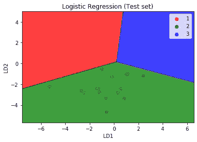

在这里，您可以看到所有三个类别都属于正确的区域。没有不正确的结果。

我希望你了解 LDA 的整个工作程序。现在是总结的时候了。

# 结论

在本文中，您学习了与**线性判别分析 Python** 相关的一切。

具体来说，你学到了-

1.  什么是降维，线性判别分析？
2.  线性判别分析是如何工作的？
3.  以及如何用 Python 实现线性判别分析。

我试图让这篇文章对你来说简单易懂。但是，如果你有任何疑问，欢迎在评论区问我。我将尽力消除你的疑虑。

万事如意！

快乐学习！