# 线性模型特征选择

> 原文：<https://medium.com/analytics-vidhya/linear-model-features-selection-5c6a62f0f4ad?source=collection_archive---------4----------------------->

## 选择重要的功能

鸣谢:图片来自[皮克斯拜](https://pixabay.com/?utm_source=link-attribution&utm_medium=referral&utm_campaign=image&utm_content=2584713)的格尔德·奥特曼

有时，即使是最简单的算法，线性回归也可能会被认为用大量的特征 X 来预测响应变量 y 有点过于拥挤。

有了高维特征，模型**可能会失去其*可解释性*** ，并且可能会发现很难解释导致响应变量 y 变化的特征

对于高维特征，模型**可能会因以下任一因素而失去其对测试数据的*预测能力***—*特征间的多重共线性*、响应变量的*不相关特征*。

这就引出了我们使用特征选择的原因。

# 特征选择

*特征选择是从特征池中选择特征子集的过程。*

这是删除不相关和冗余数据的有效方法，从而可以减少计算时间，提高统计效率，提高准确性，并为推理目的提供更好的理解。

现在让我们讨论一下实现这一点的几种方法。

## 1.最佳子集选择:

这是最基本和计算量最大的特征选择方法。它的工作原理是用 X 特征的每一种可能的组合来拟合每个模型。

考虑到有 p 个特征，这将生成符合每个可能组合的 2ᴾ模型的总数。对于 P = 2 的情况，将有 2 = 4 个模型***(Y = B₀，Y = B₀ + B₁X₁，Y = B₀ + B₂X₂，Y = B₀ + B₁X₁ + B₂X₂).***

让我们将 2ᴾ模型分成具有相同数量特征的模型组，用 **Mᵢ** 表示。根据上面的例子，它是这样的——

**Mₒ : *{Y = B₀}***

**M₁ : *{Y = B₀ + B₁X₁，y =b₀+b₂x₂}*t35】**

**m₂:*{ y =b₀+b₁x₁+b₂x₂}*t39】**

**第一个过滤器:**现在我们已经将所有的 2ᴾ模型分成组(m)，基于 RSE 或 r 指标，从每组 **Mᵢ** 中选择一个模型。这给了我们总共 P 个模型。

**第二个过滤器:**在这一步中，从第一个过滤器中获得 P 个模型后，我们将使用以下指标之一选择一个最佳模型——AIC、BIC、adjusted-R、交叉验证。

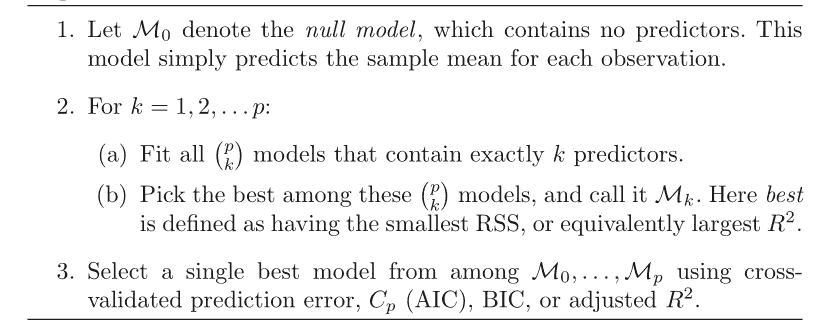

**最佳子集算法**(鸣谢:James，g .，Witten，d .，Hastie，t .，& Tibshirani，R. (2013)。*学习入门*(第 1 版。)[PDF]。斯普林格。)

此外，从统计学的角度来看，由于随着模型搜索空间的增加，它也增加了找到尽管在训练数据上表现良好但在测试数据上没有足够预测能力的模型的可能性。

## 附加内容(关于指标)

交叉验证是估计测试误差的直接方法。而 Cp、AIC、BIC 和调整后的 R 是估计检验误差的间接方法。他们将惩罚加到训练误差上，以调整训练误差低估测试误差的事实。

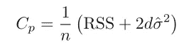

RSS:残差平方和，d:特征数量，σ:与模型相关的误差方差(E)

RSS 是模型解释的差异量。

**Akiake 信息标准(AIC)** 使用最大似然估计(对数似然)作为拟合度的衡量标准。在具有高斯误差(E)的线性模型的情况下。最大似然法和线性最小二乘法是相同的，AIC 评估是使用上述方程完成的。

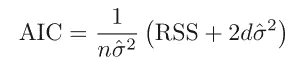

n:数据点数

**贝叶斯信息准则(BIC)** 来源于贝叶斯观点。它通常对有许多变量的模型处以更重的惩罚。

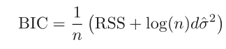

不像 AIC、BIC 和 C，我们更喜欢低价值的模型。在调整 R 的情况下，我们更喜欢具有较高值的模型，对原始 R 的调整是为了考虑增加不必要的变量，这不会增加 RSS 的实质性减少。

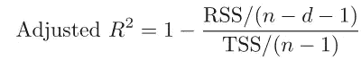

**TSS:总平方误差(Y 方差)**(鸣谢:James，g .，Witten，d .，Hastie，t .，& Tibshirani，R. (2013)。统计学习导论(第 1 版。)[PDF]。斯普林格。)

## 2.逐步选择

逐步选择探索了一组限制性很强的模型，因此它可能无法找到最佳解决方案，而只能满足于接近最佳的解决方案。作为交换，它享有计算和统计效率。以下是类型-

**a)正向逐步选择:**

它始于一个不含预测因子的模型。此外，我们将有一个所有功能的池。

在每一步中，我们将寻找库中剩余的每一个特性，并(从库中)挑选出在 RSS 或 R 指标上表现最好的特性添加到模型中。添加的特征不能从模型中删除。

这种情况会持续下去，直到没有任何特征需要挑选，并且所有特征都已经添加到模型中。

在检查和添加特征的同时，我们在每个步骤存储模型。(所有步骤的总 P 模型)

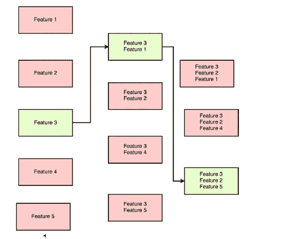

**功能-3 被选择，接着是下一步的功能-1**

与最佳子集选择方法相比，我们有 2ᴾ模型来选择最佳模型。在这种方法中，我们只有 P 个模型，每个模型都有不同数量的特征。

另一个好处是，我们可以将它用于 n < p (n : number of datapoints, p : number of features), by considering only top (n-1) features in the model. This could not have attained a unique solution otherwise with n ≤ p using the least square method alone.

**b)向后逐步选择:**的情况

它的工作方向与正向选择相反。在向前选择中，我们一次添加一个特征，而在向后选择中，我们一次消除一个特征。

已删除的功能无法重新添加。

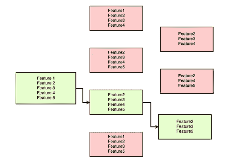

**从所有特征开始，我们在每一步消除一个特征**

在计算方面，它几乎与向前消去法相同，并且都比子集选择快得多。

**c)混合逐步方法:**

在这种方法中，我们使用向前和向后两种方法。

在使用前向选择时，如果我们添加了一个后来证明没有意义的特性，我们可以使用后向选择将其删除。或者，如果我们删除了一个后来被证明是有用的特征，可以再添加回来。

因此，该方法在选择最佳特征方面挑战了子集选择方法，同时保留了向前和向后方法的计算优势。

## 3.收缩方法

上述方法集中于选择特征子集以提高准确性。该方法考虑了所有的特征，并应用了*约束*或*正则化*，将特征系数向零收缩，因为收缩系数减少了方差。

收缩法可能比上述子集选择和逐步选择更快。对于(λ)的固定值，它只需要适合单个模型，而在逐步的情况下，我们需要 P(特征数量)模型。

然而在实践中，我们需要使用交叉验证来训练和检查(λ)的多个值。

**a)岭回归(L 正则化):**

该方法将范数惩罚加入到早期的代价函数(RSS)中。损失是系数平方的总和乘以拉格朗日系数(λ)。

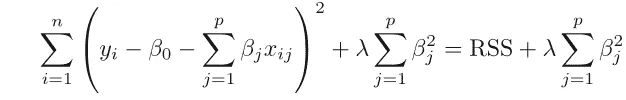

β:特征系数

> 这种方法将特征系数收缩到零，原因在于受到的约束——β₁+β₂≤s

岭回归可以在贝叶斯意义上解释，其中惩罚项可以通过将参数上的*正态分布*视为*先验概率来导出。*

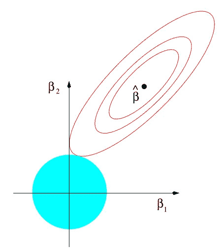

岭回归(图片取自“统计学习的要素”)

> 如图所示，椭圆表示成本函数(RSS)的轮廓，圆形表示范数约束。它们相交的点不在任何轴上。

**b)套索回归(L 正则化):**

该方法还将范数惩罚添加到早期成本函数(RSS)中。损失是系数绝对值的总和，乘以拉格朗日系数(λ)。

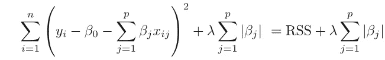

> 套索回归可能将系数缩小到零，原因还是在于受到的约束——|β₁|+|β₂|≤s

套索回归可以在贝叶斯意义上解释，其中惩罚项可以通过将参数上的*拉普拉斯分布*视为*先验概率来导出。*

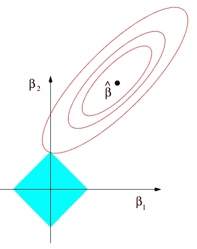

拉索回归(图片取自“统计学习的要素”)

> 如图所示，椭圆表示成本函数(RSS)的轮廓，菱形表示范数约束。它们相交的点可能在轴上。

## 山脊 vs 套索:

岭享有闭合形式的表达成本函数最小化。而套索约束使解在响应变量 Y 方面呈非线性，优化起来有些棘手。

Lasso 与 ridge 不同，它通过将要素缩小到零来减少要素的数量，从而提供更好的可解释性。

在所有特性同等重要的情况下，Ridge 可以表现得更好。Lasso 在某些特征比其他特征更好地解释响应变量 Y 的情况下表现更好。

## 4.降维方法:

上述方法通过选取变量子集或缩小变量系数来控制方差，在这些方法中，我们使用了最初的预测因子 X₁、X₂、X₃ …Xp。我们现在将看到首先转换原始预测值，然后用这些转换后的预测值拟合模型的方法。

**a)主成分回归(PCR):**

这是一种无监督的技术，通过将原始高维(P)投影到低维(K)来降低数据的维度，其中 K < P.

We start with selecting an arbitrary axis along which data has maximum variance and call it the *是第一主成分。*然后我们寻找垂直于它的第二轴，打包最大方差，从而选择*第二主成分。*该过程持续进行，直到达到某些停止标准。

> 例如:停止标准很可能是继续寻找主成分，直到我们解释了数据中 99%的差异。

现在，我们简单地对新获得的低维数据应用线性回归。

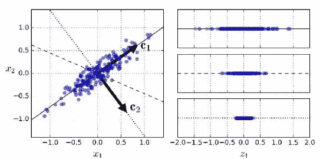

图片摘自《用 Scikit-learn 和 Tensorflow 进行机器学习的实践》一书

> 在这个图中，X₂的 X₁是原始轴，C₂的 C₁是主要组成部分。在右图中，我们可以看到每个轴上的变化。C₁包含最大的方差，并且按照选择 C₂，我们选择垂直于它的具有最大方差的轴。

注意:右图中的第二行包含第二个最大方差，但不被视为 C₂，因为它不垂直于 C₁.

**b)偏最小二乘法**

PCR 有一个缺点——它不能保证最好地解释预测因子的方向也能最好地预测反应

PLS 是一种受监督的方法。该过程与 PCR 相同，寻找转换的特征并对其应用线性回归。除了在变换特征时使用响应变量 y。

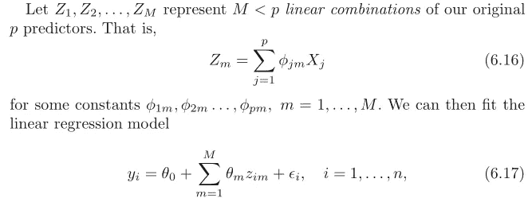

**PCR/PLA 的通用算法**(鸣谢:James，g .，Witten，d .，Hastie，t .，& Tibshirani，R. (2013)。*统计学习导论*(第 1 版。)[PDF]。斯普林格。)

在计算新方向时，PLS 将权重(ϕ)放在与响应变量的相关性成比例的预测变量上。

文章到此结束。希望对某人有益！！