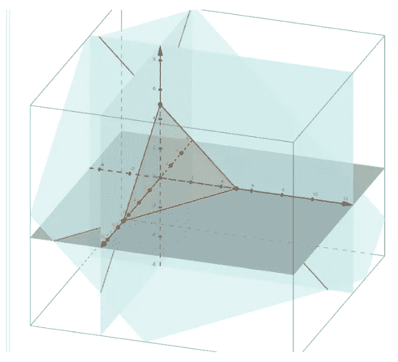
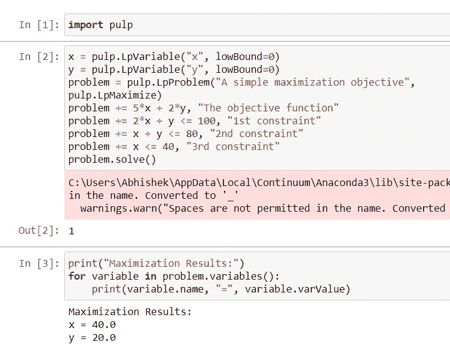
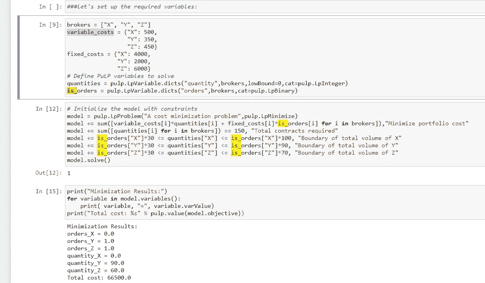

# 使用 Python 进行金融领域的线性规划/优化

> 原文：<https://medium.com/analytics-vidhya/linear-programming-optimization-in-finance-using-python-8d1e04b5815?source=collection_archive---------11----------------------->



不是博客，只是给自己写笔记:-)

在大多数财务模型中，我们有一个线性或二次优化器，需要在特定的约束条件下相应地最大化或最小化。

在 CAPM 模型中，我们假设模型是线性的，并使用 Python 中的回归求解预期股票价格。

例如，在最后的这个[博客](/analytics-vidhya/portfolio-construction-using-efficient-frontier-optimization-b00f294e6c81)中，二次优化器的目标是在某些约束条件下最小化波动性

随着我们投资组合中股票数量的增加，也引入了某些限制。

线性优化通过关注回报最大化和波动性最小化来帮助我们克服投资组合分配的问题。

这些目标通常受特定法规的约束，例如禁止卖空规则、投资股票数量的限制等等

大多数优化问题都是通过使用线性规划来解决的

线性规划是一套数学和计算工具，让你找到一个特定的解决方案，这个系统对应的最大值或最小值的一些其他线性函数。

还记得以前在数学课上，我们曾经通过求解多个线性方程来找到 X 的值吗？类似地，我们将通过使用 Python 编写的线性编程库来解决这些相同的问题

有许多可用的 Python 库，例如

*   [SciPy 优化和寻根](https://docs.scipy.org/doc/scipy/reference/optimize.html)
*   [纸浆](https://www.coin-or.org/PuLP/solvers.html)
*   [Pyomo](https://pyomo.readthedocs.io/en/stable/solving_pyomo_models.html#supported-solvers)
*   [CVXOPT](https://cvxopt.org/userguide/coneprog.html#optional-solvers)

我们将使用纸浆包装来解决我们的问题

让我们从一个小例子开始

> 假设我们对投资两只股票 X 和 Y 感兴趣。我们希望找出每 5 个单位的股票 X 和 2 个单位的股票 Y 的实际投资单位数，以便使投资单位总数最大化

然而，我们的投资策略存在某些限制:

每投资 2 单位股票 X 和 1 单位股票 Y，总数量不得超过 100

对于投资的每单位股票 X 和 Y，总数量不得超过 80

允许投资于证券 X 的总量不得超过 40

两种证券都不允许卖空

最大化问题可以用数学方法表示如下:

```
Maximize: f(x,y) = 5x+2y<=100
Subject to :2x + y <=100x + y <=80x <=40x >=0, y >= 0
```

使用纸浆包装可以解决上述问题



在上面的问题中，我们已经被允许是连续的或分数的。使用分数值或结果不现实怎么办？这个问题被称为线性整数规划问题，其中所有的变量都被限制为整数。整数变量的一个特例是二进制变量，它可以是 0 也可以是 1。

在给定一组选择的情况下，二元变量对于建立决策模型特别有用。

> 假设我们必须从三个经纪人那里购买 150 份特殊的场外股票合约。经纪人 X 每份合约报价 500 卢比，外加手续费 4000 卢比，不考虑卖出多少份合约。经纪人 Y 收取每份合同 350 卢比，外加 2000 卢比的交易费。经纪人 Z 每份合同收取 450 卢比，外加 6000 卢比的手续费。经纪人 X 最多卖出 100 份合约，经纪人 Y 最多卖出 90 份合约，经纪人 Z 最多卖出 70 份合约。任何经纪人的最小交易量是 30 份合约，如果有任何合约与该经纪人交易的话。应该如何最小化购买 150 份合同的成本？

我们来淡化一下上面的问题

```
How many brokers we have? brokers = [“X”, “Y”, “Z”]What are the variable cost and fixed cost of these Brokers variable_costs = {“X”: 500,
                  “Y”: 350,
                  “Z”: 450}
fixed_costs = {“X”: 4000,
               “Y”: 2000,
               “Z”: 6000}
```

所以，我们有一个需要最小化的目标

```
Minimize ∑ (variable cost_i *quantity_i + fixed cost_i * IsOrder_i)
```

其中 IsOrder {如果从经纪人 I 处购买则为 1，如果不从经纪人 I 处购买则为 0 }

我们的其他约束如下

```
IsOrder_i × 30 ≤ quantityX ≤ IsOrder_i * 100IsOrder_i × 30 ≤ quantityY ≤ IsOrder_i * 90IsOrder_i × 30 ≤ quantityZ ≤ IsOrder_i * 70∑quantity_i =150
```

使用纸浆包装，我们可以定义我们的目标以及约束，并解决问题

