# 线性回归

> 原文：<https://medium.com/analytics-vidhya/linear-regression-15f2aecf689e?source=collection_archive---------11----------------------->

在这个博客中，我将写关于线性回归，也就是说，什么是线性回归，寻找最佳拟合回归线，检查拟合优度等。

在博客的最后，我会提供我的 jupyter 笔记本的链接，在那里我从头开始实现了一个线性回归模型，并有逐行的解释，所以也请检查一下。

因此，没有任何进一步的到期让我们开始。

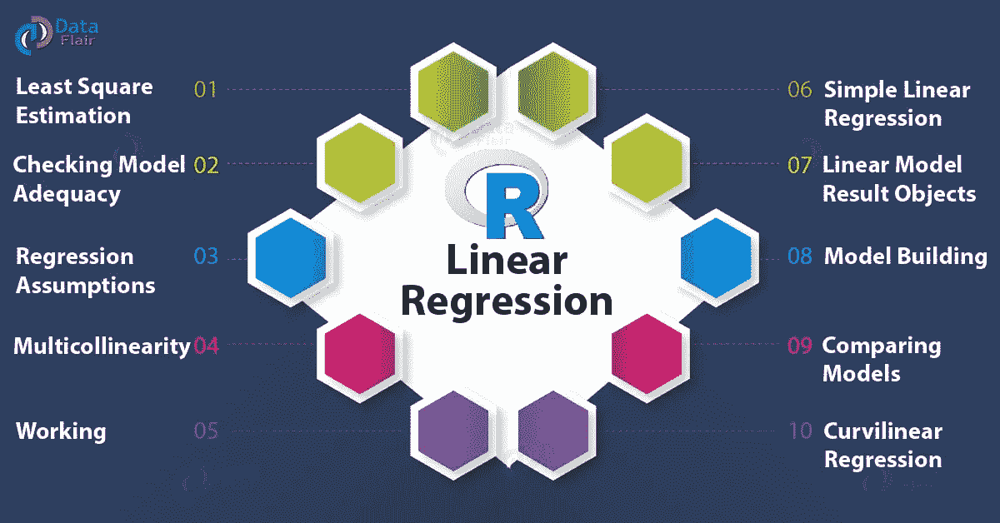

在我们深入线性回归之前，让我们了解什么是回归以及它的用例是什么。

# **什么是回归？**

回归是一种用于金融、投资和其他学科的统计方法，试图确定一个因变量(通常用 Y 表示)和一系列其他变量(称为自变量)之间关系的强度和特征。

# **回归的用途**

回归有很多用例，但我将提到 3 个主要应用。

**回归分析的三个主要用途是:**

1.  确定预测值的强度
2.  预测效果
3.  趋势预测

# **线性与逻辑回归**

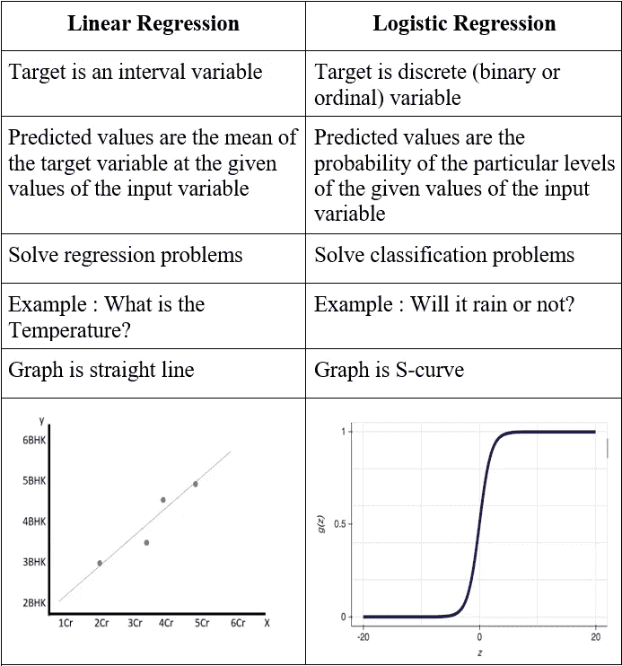

> **让我们从线性回归开始**

# **什么是线性回归？**

线性回归分析是所有统计技术中使用最广泛的:它研究变量之间的线性关系。设 Y 表示您希望预测其值的“因变量”, X1，…，Xk 表示您希望预测其值的“自变量”,变量 Xi 在周期 t(或数据集的第 t 行)中的值由 Xit 表示。那么计算 Yt 预测值的公式为:

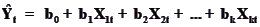

# **哪里使用线性回归？**

1.  估计趋势和销售估计
2.  分析价格变化的影响
3.  金融服务和保险领域的风险评估

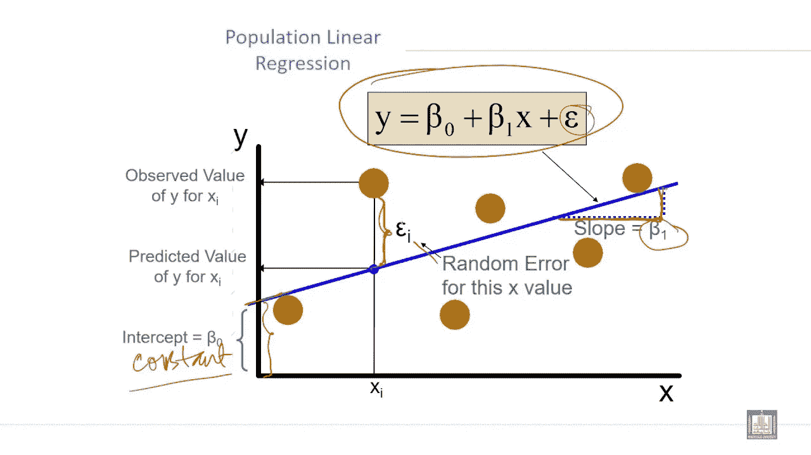

# **线性回归模型选择**

在这篇博客中，我将只关注线性回归的变量选择，解释可以使用的三种方法:

*   最佳子集选择
*   正向逐步选择
*   向后逐步选择

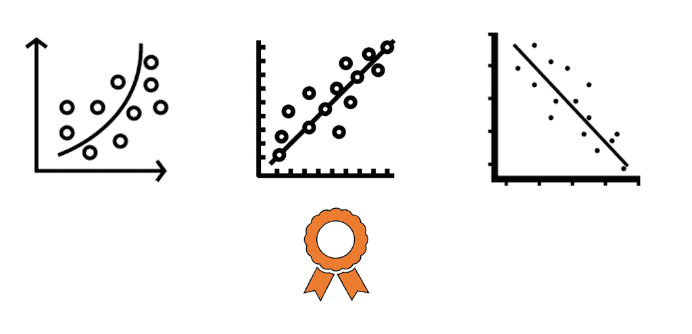

## 1.最佳子集选择

这种方法尝试所有可能的 2^p 输入组合，其思路如下。它从零模型开始，只包含截距:

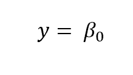

然后，它训练 4 个模型，每个模型只有一个预测器:

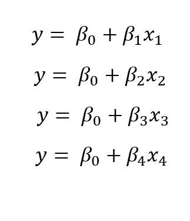

最后，它挑选 RSS 最低或 R 最高的一个并保存它。

接下来，它用变量对的所有可能组合训练其他 6 个模型，然后再次挑选 RSS 最低或 R 最高的模型:

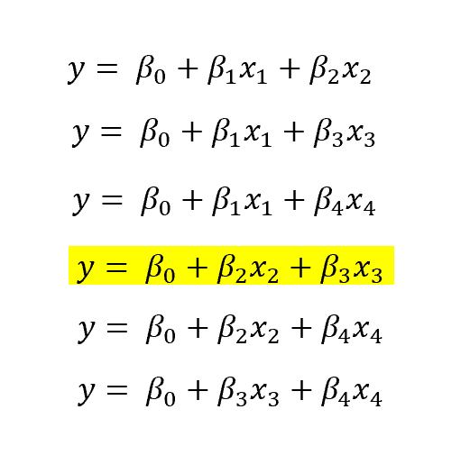

以同样的方式，对于 k=1，…，4，它每次都训练(p k)’(二项式系数)模型，并挑选最好的一个(使用与之前相同的标准)。

然后，我们剩下 4 个选择的模型，分别具有 1、2、3 和 4 个变量。最后一步是使用指标作为[交叉验证](/dataseries/cross-validation-for-model-selection-5e843c71553d)或调整后的误差指标(调整后的 R、AIC、bias)选择最佳指标，以便考虑[偏差-方差权衡](/analytics-vidhya/the-bias-variance-trade-off-ee613811ba72)。

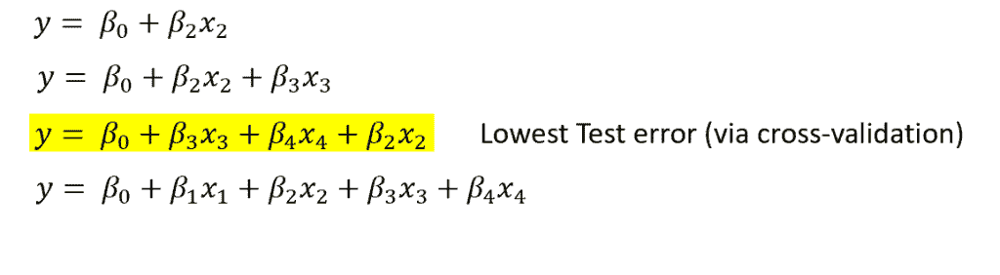

如上所述，这个过程意味着对 2^p 不同模型的估计。在我们的例子中，只有 4 个变量，它归结为 16 个模型的估计，然而，有数百个变量，它很容易变得几乎不可行。

## 2.正向逐步选择

对于前向选择，我们遵循与前面类似的过程，但有一个重要的区别:我们在每一步都跟踪所选择的模型，并且每次只向所选择的模型添加一个变量，而不是每次都估计一个新的模型。

因此，我们再次从零模型开始，重复上面的第一步，即训练 4 个模型，每个模型有 1 个变量，然后选择最佳模型:

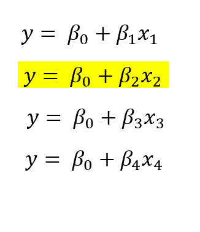

现在，我们不是训练 6 个模型，而是保留选择的模型，再训练 3 个模型，寻找导致最低 RSS 或最高 R 的一个额外变量。

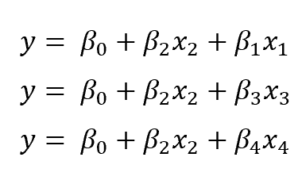

同样，在流程结束时，我们将有 4 个模型可供选择，但不同的是，这一次，我们只培训了 10 个模型！一般来说，当我们有 p 个预测器时，通过前向选择，我们需要训练 p！模特而不是 2^p.

## 3.向后逐步选择

这种方法的思想类似于正向选择，但顺序相反。事实上，我们不是从零模型开始，而是从完整的模型开始，同时删除一个变量，保留先前选择的模型的痕迹。

因此，从完整模型开始:

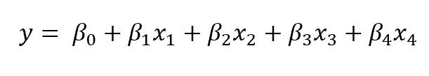

我们训练四个不同的模型，每个模型通过去除 4 个预测器中的一个而获得。然后，我们根据已知标准选择最佳方案:

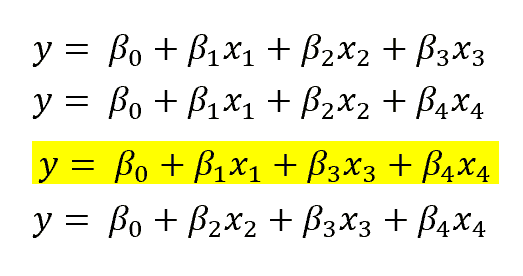

从这里，我们训练 3 个模型，同时再次移除一个预测器，但是保持固定上面选择的模型:

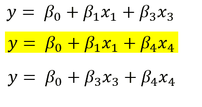

最后，我们将有 4 种不同的型号可供选择。同样在这种情况下，我们需要估计与前向选择中相同数量的模型，而不是 2^p.

前向方法和后向方法的主要区别在于，前者可以处理 p>n 的任务(它只是在 p=n 时增加了一个停止规则)，而后者则不能，因为完整模型意味着 p>n。

> 现在让我们了解一下内部理论来建立我们的线性回归模型

# **最佳拟合线**

**最佳拟合**的**线** **是代表数据点散点图的最佳近似的直线。它用于研究这些点之间关系的性质。**

寻找最佳拟合线的公式为:

> ***Y` = bX + A***

其中，y’表示预测值，b 表示直线的斜率，

x 表示独立变量，A 是 Y 截距

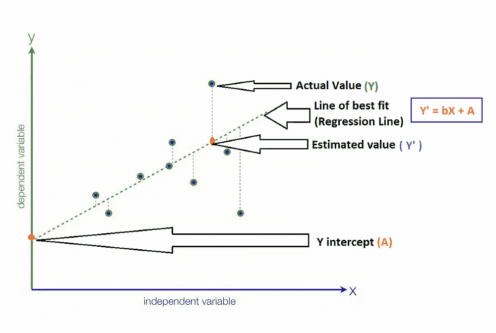

那么，我们如何使用回归分析找到最佳拟合线呢？

通常，最佳拟合的表观预测线可能不是完全正确的，这意味着它将具有“预测误差”或“残留误差”。

预测或残差只不过是任何数据点的实际值和预测值之间的差异。一般来说，当我们使用 Y` = bX +A 来预测实际响应 *Y`* 时，我们会产生大小为的预测误差(或残差):

> **E = Y—Y `**

其中，E 表示预测误差或残差

y’表示预测值

y 表示实际值

最符合数据“**最佳**”的线将是**预测误差(每个数据点**一个**)尽可能小的线。**

下图描述了上述所有值的简单表示:

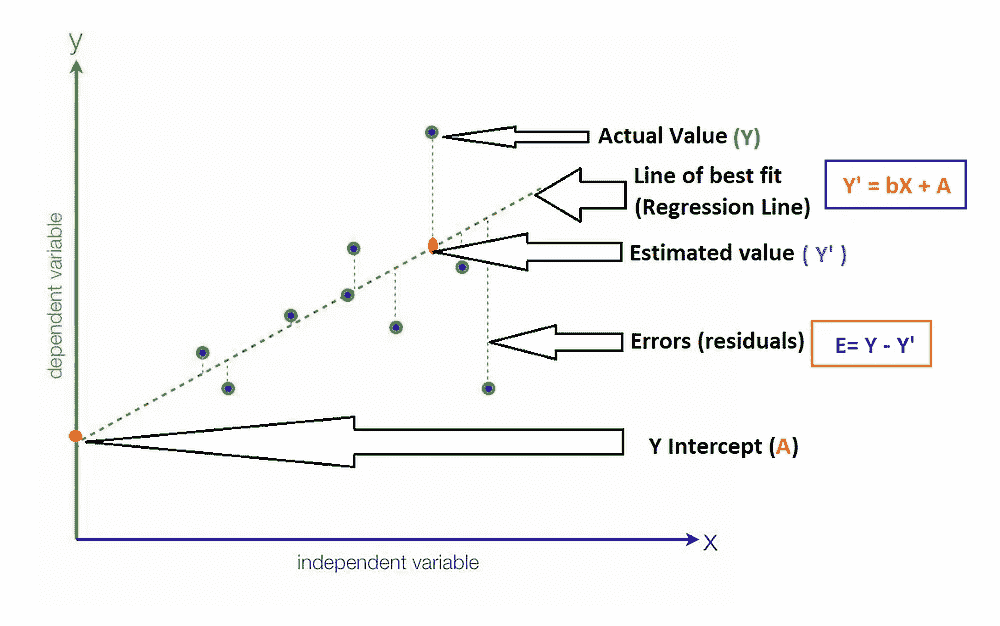

**这里我将使用 R-Square 方法来计算最佳拟合线数据的接近度。**

# **什么是 R 平方？**

1.  r 平方值是数据与拟合回归线接近程度的统计度量
2.  也称为**决定系数**，或**多重决定系数。**

# **公式**

R 平方公式的计算方法是将第一个误差的总和除以第二个误差的总和，然后减去 1 的导数。这是 r 平方方程的样子。

> r 平方= 1 —(第一次误差和/第二次误差和)

首先，使用最佳拟合方程线根据相应的 x 值预测图表上的 y 值。一旦最佳拟合线到位，分析师可以创建一个误差平方方程，将误差保持在相关范围内。一旦你有了一个错误列表，你就可以把它们加起来，然后通过 R 平方公式进行运算。

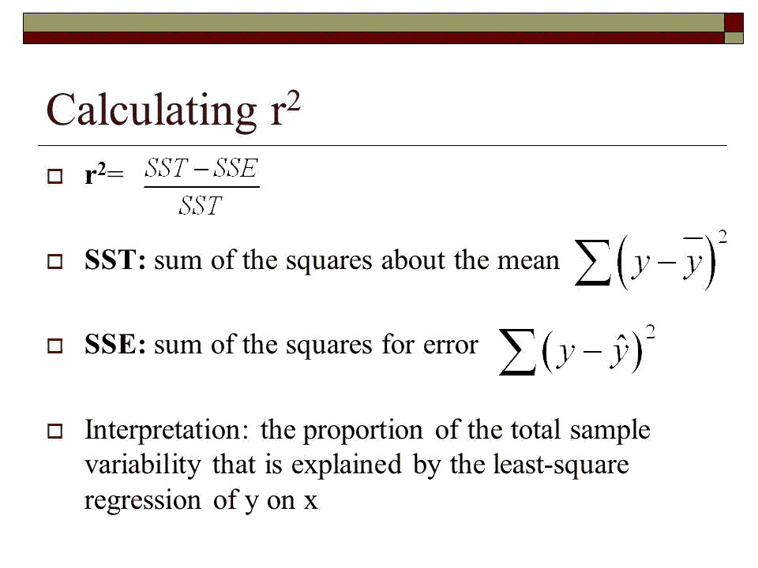

绘画作品

# **示例**

考虑下面两个变量 x 和 y，你需要计算回归中 R 的平方。

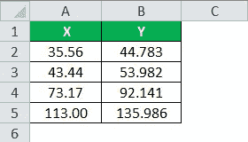

# **解决方案:**

使用上述公式，我们需要先[计算相关系数](https://www.wallstreetmojo.com/correlation-coefficient-formula/)。

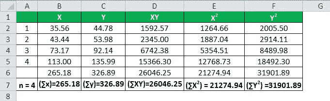

n = 4 时，我们有上表中的所有值。

现在让我们在公式中输入数值来得出这个数字。

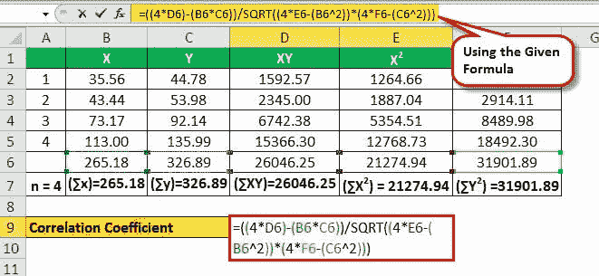

r =(4 * 26046.25)—(265.18 * 326.89)/√[(4 * 21274.94)—(326.89)2]*[(4 * 31901.89)—(326.89)2]

r = 17501.06/17512.88

**相关系数将为-**

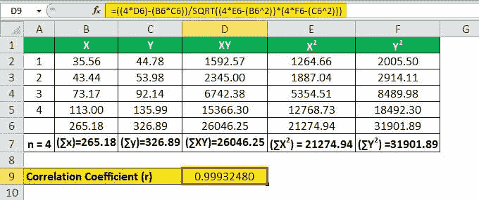

r = 0.99932480

因此，计算如下:

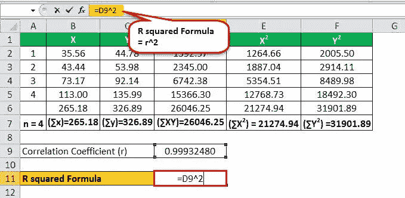

r = (0.99932480)

**回归中的 R 平方公式**

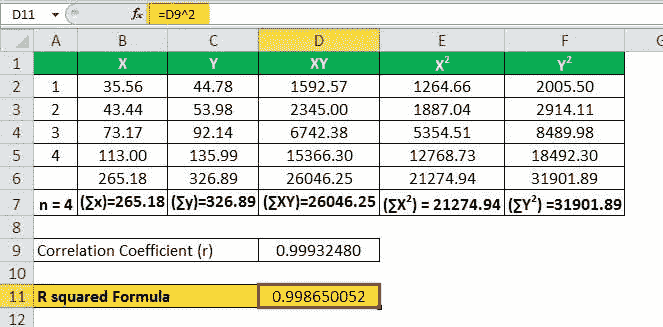

r = 0.998650052

**查看下面的链接，这是我的 Jupyter 笔记本，你可以在上面找到关于线性回归的解释**

1.  **使用内置模型(示例 1)**
2.  **白手起家(例 2)**
3.  **使用渐变体面**

**注意:两者有不同的数据集。**

 [## shag 10/机器学习

### 这个库包含机器学习算法的基础。基于监督学习的算法…

github.com](https://github.com/Shag10/Machine-Learning/tree/master/Internity_Internship/Day-7) 

**我试图提供所有关于开始使用线性回归及其实现的重要信息。** **希望你能在这里找到有用的东西。谢谢你一直读到最后。**

# **参考**

 [## r 平方(R^2) -定义，公式，计算 r 平方

### R-squared (R 2)是一个重要的统计量，它是一个回归模型，代表了一个国家的人口比例

www.wallstreetmojo.com](https://www.wallstreetmojo.com/r-squared-formula/)  [## 线性回归的模型选择

### 每当你想建立一个机器学习模型时，你都有一组 p 维输入作为起点。然而不是…

datasciencechalktalk.com](https://datasciencechalktalk.com/2020/04/05/model-selection-for-linear-regression/)