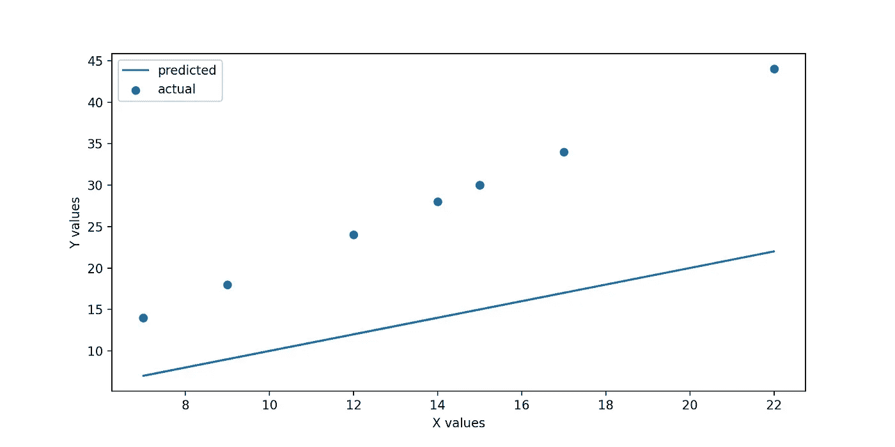
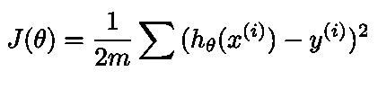
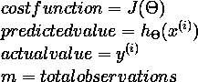
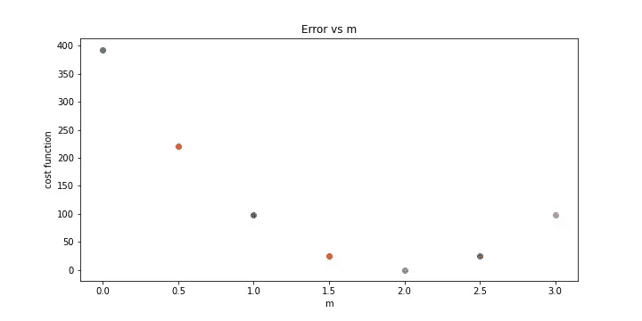
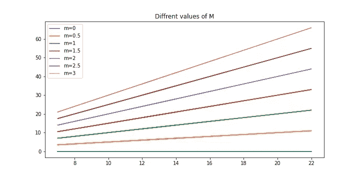

# 线性回归(线性回归背后的数学和直觉)

> 原文：<https://medium.com/analytics-vidhya/linear-regression-38f0cd6856f5?source=collection_archive---------22----------------------->

了解关于**线性回归的一切。**


由[卢克·切瑟](https://unsplash.com/@lukechesser?utm_source=medium&utm_medium=referral)在 [Unsplash](https://unsplash.com?utm_source=medium&utm_medium=referral) 上拍摄的照片

**目录:**

**∘** [**简介:**](#8247) **∘**[**代价函数:**](#019b) **∘**[**梯度下降算法:**](#8d01) **∘**[**实现:**](#063d) **∘**[**总结:**](#51a6)

线性回归是监督学习算法。
用于预测连续值。
它使用直线的方程来预测输出值。

```
y = mx+c 
```

考虑一下，我们有以下 x 和 y 的值，并且想要预测一些 x 值的值(y_pred)。那么我们如何做到这一点呢？？
让我们看看...

```
x = np.round(np.random.uniform(5, 25, 10))
y = x*2
print(y, x)output - 
[34\. 14\. 28\. 24\. 30\. 30\. 44\. 30\. 18\. 14.] [17\.  7\. 14\. 12\. 15\. 15\. 22\. 15\.  9\.  7.]
```

我们为 x 和 y 生成了一些值，我们将预测 x 值的值(y_pred ),然后我们将这些预测值(y_pred)与 y 的实际值进行比较，我们还将找到实际值和预测值之间的误差。

我们有一条直线的方程式。 **y = mx+c.**
所以首先我们会预测当 **m=1** 和 **c =0** 时的值。

```
def predict_y(x, m=1, c=0):
    return m*x+c
y_pred = predict_y(x)
y_predoutput:
array([17.,  7., 14., 12., 15., 15., 22., 15.,  9.,  7.])
```

我们已经找到了 **y_pred**
现在是时候比较**预测的**和**y**的实际值了。

```
plt.figure(figsize=(10, 5), dpi=200)
plt.scatter(x, y, label="actual")
plt.plot(x, y_pred, label="predicted")
plt.xlabel('X values')
plt.ylabel('Y values')
plt.legend()
plt.show()
plt.savefig('lr.jpg')
```



图 1.1 实际与预测

这里我们可以看到，我们预测的线不是最佳拟合线。
我们使用了 **m=1** 和 **c=0** 的值。我们可以使用任何值的组合和无限数量的值的组合，所以我们如何获得那些最优值来找到我们的最佳拟合线。

**梯度下降算法来了。**

首先我们来了解一下**成本函数**。

## **成本函数:**

**成本函数**用于找出实际值和预测值之间的误差。下面是成本函数的公式。



图 2.1 成本函数的公式



图 2.2

以下是成本函数的 python 代码:

```
def cost_function(y_pred, y):
    return (np.sum(np.square(y_pred-y)))/(2*len(y))cost_function(y_pred, y)output:
98.35
```

我们发现，当 m=1 和 c=0 时，我们的误差是 **98.35** ，这是非常大的**。**

现在，为了简单起见，我们将看到' **m** '与 **c** = **0** 的不同值的**成本值**。我们也可以使用' **c** 的任何值，但为此，我们需要绘制一个 **3D 图**，这将很难理解概念。

下面的 python 代码是为了找出不同 m 值的误差值，我们还绘制了不同 m 值的图形。

```
plt.figure(figsize=(10,5))M = [0, 0.5, 1, 1.5, 2, 2.5, 3]
for m in M:
    error = cost_function(predict_y(x, m), y)

    print(f'for m = {m} error is {error}')
    plt.scatter(m, error)

plt.ylabel("cost function")
plt.xlabel("m")
plt.title("Error vs m")
plt.savefig('costfunc.jpg')
plt.show()output:for m = 0 error is 393.4
for m = 0.5 error is 221.2875
for m = 1 error is 98.35
for m = 1.5 error is 24.5875
for m = 2 error is 0.0
for m = 2.5 error is 24.5875
for m = 3 error is 98.35
```



图 2.3 误差与 m 值的关系

这里我们可以看到对于**m = 2**误差为 0，其中是 m 的最优值。

下图中，我们为不同的 **m** 值绘制了不同的预测线

```
plt.figure(figsize=(10,5))def plot_m(m, x):
    plt.plot(x, predict_y(x, m), label=f'm={m}')for m in M:
    plot_m(m, x)

plt.title('Diffrent values of M')
plt.legend()
plt.savefig('diff_M.jpg')
plt.show()
```



图 2.4 不同的 m 值

现在该看**梯度下降算法**了。

## **梯度下降算法:**

它是机器学习中非常重要的算法。
也用于深度学习。
此算法用于寻找最优属性值。


图 3.1 梯度下降算法使用的公式

这是梯度下降算法使用的公式。
第一项是 **θ** 的旧值，第二项是**成本函数**的导数。

如果学习率太小，则需要太多的步骤才能找到值，因此需要太多的时间才能找到值。
如果它太大，那么它将超过这些值，永远不会达到最佳值。
该算法一直运行，直到没有找到 **θ** 的最佳值。

如果学习率很小，我们将观察到，在图形中会有大量彼此非常接近的点，而学习率很大，则会有非常少量的彼此远离的点。
仅供参考，请看图 2.3**。**

到目前为止，我们已经讨论了**线性回归、成本函数、**和**梯度下降算法**。

**现在是实施线性回归的时候了。**

## 实施:

```
from sklearn.linear_model import LinearRegressionlr = LinearRegression()
lr.fit(x.reshape(-1,1), y)
pred = lr.predict(x.reshape(-1,1))print(y, pred, sep='\n')output:[34\. 14\. 28\. 24\. 30\. 30\. 44\. 30\. 18\. 14.]
[34\. 14\. 28\. 24\. 30\. 30\. 44\. 30\. 18\. 14.]
```

**m** 的值:

```
lr.coef_
output:
array([2.])
```

**c** 的值:

```
lr.intercept_
output:
-7.105427357601002e-15
```

c 值很小，几乎等于 0。

[**点击这里**](https://github.com/sbswapnil/Data-Science/blob/main/Linear%20Regression.ipynb) **获取我关于线性回归的完整 Jupyter 笔记本。**

## **概要:**

*   我们讨论**线性回归、**成本函数和**梯度下降算法。**