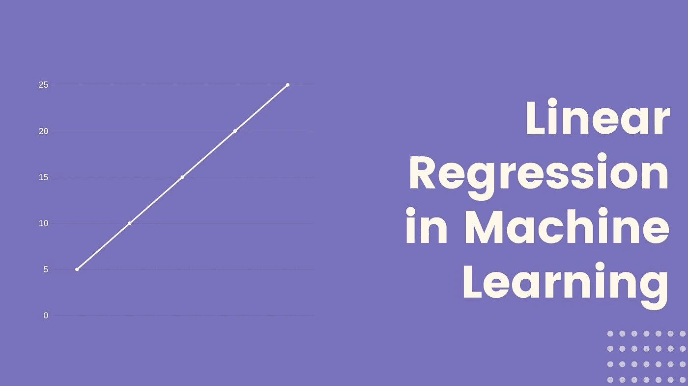
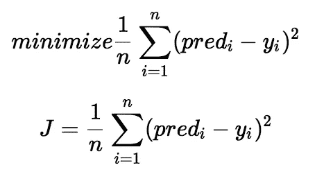
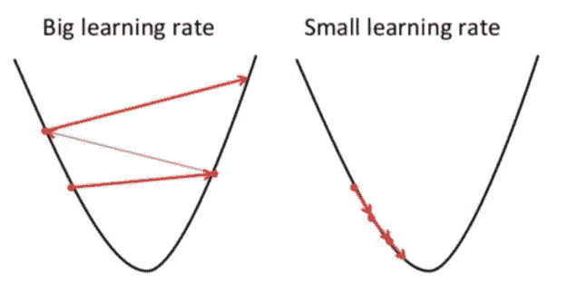
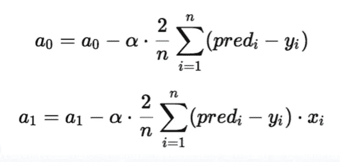
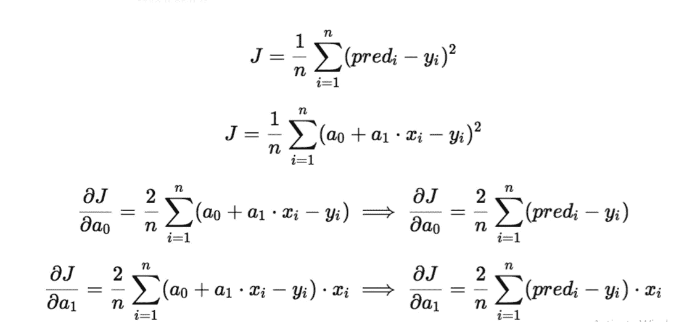
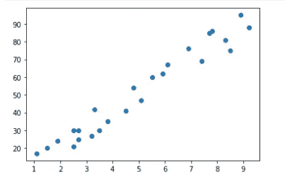
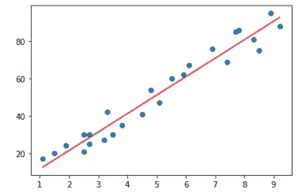

# 线性回归

> 原文：<https://medium.com/analytics-vidhya/linear-regression-6b642119533a?source=collection_archive---------17----------------------->

# 什么是线性回归，它是如何工作的？



**线性回归**是一种有监督的机器学习算法，其中预测的输出是连续的，并且具有恒定的斜率。线性回归模型在因变量和自变量之间具有线性关系。

设 x 为自变量，y 为因变量。我们将定义这两个变量之间的线性关系如下:

```
y = a_0 + a_1*x
```

其中 a_1 是直线的斜率，a_0 是 y 轴截距。该等式将用于预测 y 的值。在继续学习算法之前，让我们先来看两个重要概念，以了解线性回归。

*   **损失函数:**是用来求 a_1 和 a_0 的最佳值的函数。我们将通过以下步骤使用均方误差:

1.  对于给定的 x，求 y 的实际值和预测值之差。
2.  求差额的平方
3.  求 x 的每一个值的平方的平均值。



*   **梯度下降算法:**是一种用于寻找函数最小值的优化算法。在线性回归中，通过更新 a_1 和 a_0 的值来最小化成本函数。



想象一个 U 形山谷。假设我们的目标是到达最底部的位置。我们从最高的位置开始。有一个难题，你只能走不连续的几步才能到达底部。如果你决定一次迈出一步，你最终会到达谷底，但这需要更长的时间。如果你每次都选择走更长的路，你会更快到达，但是，有可能你会越过谷底，而不是正好在谷底。



在梯度下降算法中，你走的步数就是学习率。这决定了算法多快收敛到最小值。为了更新 a_1 和 a_0，我们从损失函数中取梯度。为了找到这些梯度，我们对 a_1 和 a_0 求偏导数。

偏导数是梯度，它们用于更新 a_1 和 a_0 的值。α是学习率，它是一个超参数。较小的学习率可以让你更接近最小值，但需要更多的时间来达到最小值，较大的学习率收敛更快，但有可能超过最小值。



**线性回归选择标准:**

*   分类和回归能力
*   数据质量(异常值会影响)
*   计算的复杂性

**实现:**我已经使用了这个[数据集](http://bit.ly/w-data)，它由学生的分数和学生学习的小时数组成。我们的目的是预测学生的分数。

*   **代码使用上面讨论的损失函数和梯度下降。**

```
#import required libraries
import pandas as pd
import numpy as np
import matplotlib.pyplot as plt  
%matplotlib inline

#reading data from given link
url = "http://bit.ly/w-data"
df = pd.read_csv(url)

X = df.iloc[:, 0]
Y = df.iloc[:, 1]
plt.scatter(X, Y)
plt.show()
```



```
# Building the model
m = 0
c = 0

L = 0.0001  # The learning Rate
epochs = 1000  # The number of iterations to perform gradient descent

n = float(len(X)) # Number of elements in X

# Performing Gradient Descent 
for i in range(epochs): 
    Y_pred = m*X + c  # The current predicted value of Y
    D_m = (-2/n) * sum(X * (Y - Y_pred))  # Derivative wrt m
    D_c = (-2/n) * sum(Y - Y_pred)  # Derivative wrt c
    m = m - L * D_m  # Update m
    c = c - L * D_c  # Update c

print (m, c)
```

9.896964110671043 1.6314708810783134

```
Y_pred = m*X + c

plt.scatter(X, Y)
plt.plot([min(X), max(X)], [min(Y_pred), max(Y_pred)], color='red') # predicted
plt.show()
```



*   **代码使用 sci-kit 学习库可以在这里找到**[](https://github.com/prachi-agrawal1179/TSF-internship/blob/master/TSF%20Task1.ipynb)****。****

**线性回归用于评估和分析趋势和销售估计，评估金融部门和保险领域的风险等。**

****结论:**线性回归是一种非常有用且简单的机器学习算法。**

**希望这篇文章对你有所帮助。继续学习！**