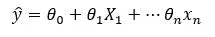
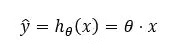
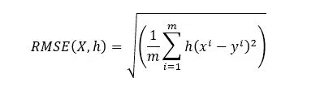
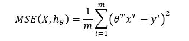
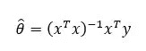

# ML 模型—线性回归

> 原文：<https://medium.com/analytics-vidhya/linear-regression-8c4beb0e610b?source=collection_archive---------2----------------------->


数据科学和所有相关领域的复杂结构是它令人愉快的原因。数据科学和机器学习中的一个主要术语是针对一系列问题训练 ML 模型。在这个博客中，线性回归，一个最流行和最简单的训练模型，将被描述。

线性回归是一种对因变量和自变量之间的关系进行建模的线性方法。两种类型的线性回归是可行的，即:简单和多重。简单线性回归是一种训练模型，其中仅存在一个独立变量，而在多个模型中使用两个或多个独立变量。

## 数学定义:

线性回归在寻找几个关系之间的关系时很有用，同时也用于机器学习中的预测。与其他模型相比，线性回归用于统计关系，而不是确定性的。

线性回归的数学定义如下:



y(hat)是预测值；
n 是特征的数量；
x_i 是第 I 个特征；
theta _ j 是第 j 个 mod 参数。而且，这些系数被称为权重；【thetha _ 0 是偏置项。

以矢量化的形式重写上面的等式，



theta 是参数向量，包括 theta _ 0；
X 是特征向量；
乘法就是点积。

首先，值得一提的是，训练模型意味着设置适当的参数，以使模型非常适合。这就是为什么，好(或差)的模型性能应该进行研究。均方根误差(RMSE)函数是检查回归模型性能的常用函数。



根据 RMSE 的定义，需要找到使 RMSE 值最小的那个值。然而，为了易于实现，均方差(MSE)是一种寻找性能的替代方法。MSE 将导致与 RMSE 相同的解决方案，因为最小化函数的值也将最小化它的根形式。

线性回归的 MSE 定义如下。



## 正态方程

寻找使成本函数最小化的θ值的另一种方法是正规方程，它是封闭形式的解。

该函数的数学定义是:



θ(hat)是使成本函数最小化的θ的值
y 是目标值的向量。

## Python 实现:

在这一部分中，将描述 Python 中线性回归的实现。有几种方法可以找到这些问题的解决方案，但是这里将展示 Scikit 库。

```
#defining linear Regression model and fitting it to train sets. 
lr = linear_model.LinearRegression()
lr.fit(X_train,y_train)
predict = lr.predict(X_test)#checking the coefficient values
print('The intercept : ', lr.intercept_)
print('The coefficient: ', lr.coef_)#checking the MSE value
print('Mean Square Error', metrics.mean_squared_error(y_test, predict))
```

然而，在正规方程的情况下，代码是手动编写的。

```
#finding the value of theta(hat)
def theta_calc(df1, df2):
    n_data = df1.shape[0]
    bias_term = np.ones((n_data, 1))
    df1_bias = np.append(bias_term, df1, axis=1)
    theta_1 = np.linalg.inv(np.dot(df1_bias.T, df1_bias))
    theta_2 = np.dot(theta_1, df1_bias.T)
    theta = np.dot(theta_2, df2)
    return theta
```

在提到的两种方法之间通常观察到微小的差异。

线性回归是最流行的机器学习模型之一，也是统计学和机器学习中最重要的术语之一。本文描述了该模型的两种不同方法。然而，也有不同的方法，这将在后面描述。

全部代码都分享在我的 [Github](https://github.com/zaurrasulov/ML-modelling/blob/main/LinearRegression.ipynb) 个人资料上。