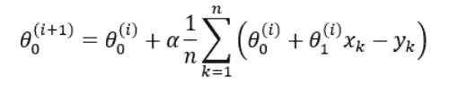

# 线性回归

> 原文：<https://medium.com/analytics-vidhya/linear-regression-9fd219098405?source=collection_archive---------11----------------------->


**目录**

1.  线性回归简介
2.  普通最小二乘法
3.  梯度下降
4.  线性回归的假设
5.  无需 sklearn 的多元线性回归的 Python 实现
6.  使用 R 平方值评估模型

## 什么是线性回归

线性回归是最简单和最流行的机器学习算法之一。这是一种用于预测建模的统计方法。

这是一个**线性模型**，即假设因变量(目标)和自变量之间呈线性关系的模型。当输入只包含一个变量时，称为**简单线性回归**，当使用多个输入变量来预测因变量的值时，称为**多元线性回归**。

**回归线**是一条显示因变量和自变量之间关系的线。线性回归旨在找到**最佳拟合线**，即通过观察值散点图的线，该线最好地表达了这些变量之间的关系。简单回归线方程由下式给出:

y = B₀ + B₁*x

在哪里，

y =因变量

x =独立变量

B₁ =比例因子/输入变量系数

B₀ =截距/偏差系数


最佳线性回归线

# **普通最小二乘法**

不同的系数值给出不同的回归线。为了找到最佳拟合线，最常用的方法是**普通最小二乘法(OLS)** 。OLS 试图最小化残差平方和，以获得最佳系数值集。**残差**定义为实际值和预测值之间的差值。成本函数由下式给出:


这里，

y =实际值

ŷ =预测值

一旦系数的最佳值已知，我们可以将这些值与自变量一起放入线性回归方程中，并找出因变量的值。

**线性回归模型的复杂度**以模型中使用的系数个数的形式计算。当系数变为 0 时，该变量对预测没有影响，并且模型的复杂性降低。例如:

y = C + M₁X₁ + M₂X₂ + M₃X₃

如果 M₂ = 0，y = C + M₁X₁ + M₃X₃

# 梯度下降

梯度下降是最小化成本函数的优化算法。首先，我们将系数和截距初始化为一些随机值，然后梯度下降通过迭代更新它们的值来找到对应于成本函数的全局或局部最小值的系数值集。


价值函数

我们绘制了成本函数(J)对因变量(y)的曲线，并获得了下图:


梯度下降旨在达到成本函数的全局最小值。移动的方向由偏导数的斜率给出，如下式所示。


使用此公式计算系数和截距的新值

求解上述方程，我们得到用于更新系数和截距的最终方程:



对于每次迭代，误差不断减小，所以我们将继续迭代，直到误差不可能再减小。

在这里，alpha 被称为**学习速率**，它控制着我们向最小值前进的幅度。如果迈出的步伐太大，我们可能会跳过最小值。但是，如果步长太小，则需要太长时间才能达到最小值。

# 线性回归的假设

为了得到最好的结果，线性回归做了一些假设。

1.  它假设因变量和自变量之间呈线性关系。
2.  多重共线性(独立要素之间的相关性)很小或没有。由于多重共线性，很难区分哪个要素影响了目标变量，哪个没有。此外，多重共线性会导致过度拟合。
3.  从属和独立特征中没有噪声。
4.  数据点形成高斯分布。
5.  输入变量必须缩放。

为了获得更好的预测，请确保满足上述假设。这可以通过变换数据以使其具有线性关系、移除异常值、使用标准化和规范化来缩放数据、移除相关特征以及使用对数变换或 BoxCox 变换将分布转换为正态分布来完成。


现在，让我们用 Python 实现线性回归

## 无 sklearn 的多元线性回归

要遵循给定的 Python 实现，您需要安装以下库:

1.  numpy
2.  熊猫
3.  matplotlib
4.  海生的

Python 的实现和数据集也可以从[的**这里的**进入](https://github.com/tanvipenumudy/ML-Stream-Interns-Summer-21/tree/main/Khushi%20Jain)。

```
import numpy as npimport pandas as pdimport matplotlib.pyplot as pltimport seaborn as snsdata = pd.read_csv('dataset.txt', names=['size', 'bedroom', 'price'])data.head()
```


两个独立特征的尺度不同，因此尺寸特征将主导卧室特征。为了防止这种情况，我们应用了标准化。

```
for column in data.columns: data[column] = (data[column]-data[column].mean()) / data[column].std()
data.head()
```


```
X = data.iloc[:, :2].values
Y = data.iloc[:, 2:].values
x0_ones = np.ones((data.shape[0], 1))
X = np.concatenate( (X, x0_ones), axis=1 )
theta = np.zeros((1, 3))
alpha = 0.01
iterations = 1000
n = X.shape[0]# Cost function
def compute_cost(X, Y, theta):
residual_sq = (( X @ theta.T ) - Y )**2
sum_residual_sq = np.sum(residual_sq)
return (sum_residual_sq/(2*n))# Gradient Descent
def gradient_descent(X, Y, theta, iterations, alpha):
  cost = np.zeros(iterations)
  for i in range(iterations):
    theta = theta - (alpha/n) * np.sum( (X* ((X @ theta.T) - Y) ), axis = 0)
    cost[i] = compute_cost(X, Y, theta)
  return (theta, cost)coeff, cost = gradient_descent(X, Y, theta, iterations, alpha)print(coeff)
print(cost[999])
```


**预测目标变量值:**

```
y_pred = np.sum(coeff * X, axis=1)
```

# 评估模型

**R 平方方法**

r 平方方法确定拟合优度。它衡量回归线与观察值的吻合程度。它说明因变量中有多少%的变化是由独立特征解释的。


Img src-黑客地球


决定系数/ R 平方


**R 平方值越高，模型越好**，因为这意味着更多的变化已经由独立特征解释。

```
nume = 0
deno = 0
for i in range(n):
  nume += (y_pred[i]-Y.mean())**2
  deno += (Y[i]-Y.mean())**2
r2 = nume/deno
r2
```


这意味着 72.78%的目标变量的变化是由于大小和卧室。

但是**高 R 平方值并不总是好的**。例如:让我们考虑一个以摄氏度为单位预测温度的情况，其中一个输入特征是以华氏度为单位的温度。这肯定会给出高 R 平方值，但这种模型是无用的。

**小的 R 平方值并不总是坏的**。试图预测人类行为的研究将具有较低的 R 平方值，因为人类行为是高度不可预测的。

**R 平方的缺点**

每次向模型中添加独立变量时，r 平方都会增加。它永远不会减少，即使只是变量之间的偶然相关(多重共线性)。因此，我们添加的点越多，回归似乎就越符合我们的数据。我们添加的一些点可能无关紧要(不符合模型)。r 平方不关心这样的点。我们加得越多，决定系数要么保持不变，要么变得更高。而是使用调整后的 R 平方值。

**调整后的 R 平方**

调整后的 R 平方考虑了模型中使用的独立要素的数量。


**n** =观察次数

**k** =独立特征的数量

**R** =由模型确定的 R 平方值。

因此，如果 R 平方在添加新要素时没有显著增加，则调整后的 R 平方的值将会减少。


然而，如果在添加新特征时，R 平方值显著增加，则调整后的 R 平方值也将增加。


这样，我们完成了第一个机器学习算法。希望你觉得有用。

如果你喜欢我的博客，那么看看我以前的一些博客:

1.  [OpenCV](https://khushijain2810.medium.com/introduction-to-opencv-586e38d536fd)
2.  [Seaborn](https://khushijain2810.medium.com/seaborn-data-visualization-library-142ac64d5560)
3.  [熊猫](https://khushijain2810.medium.com/pandas-python-data-analysis-library-1d061c982fc8)
4.  Numpy

快乐学习！